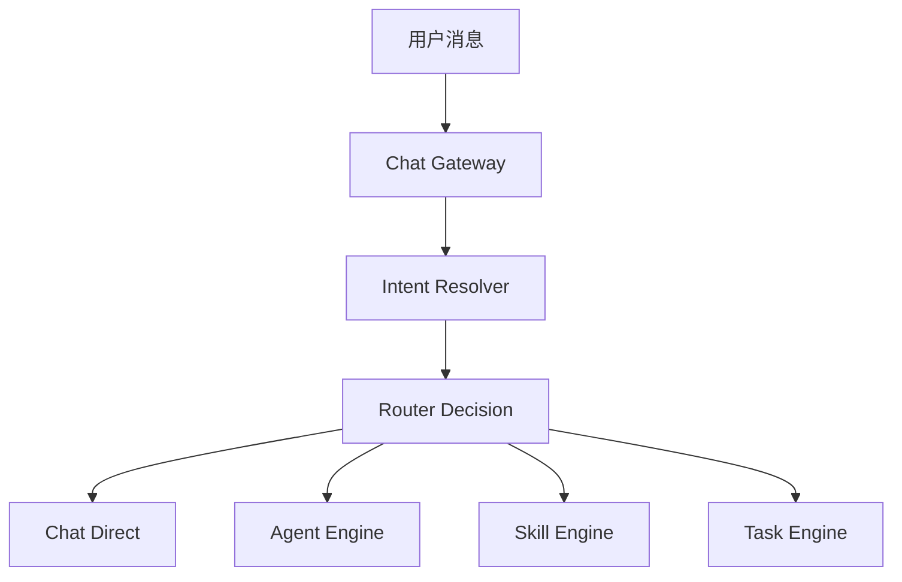
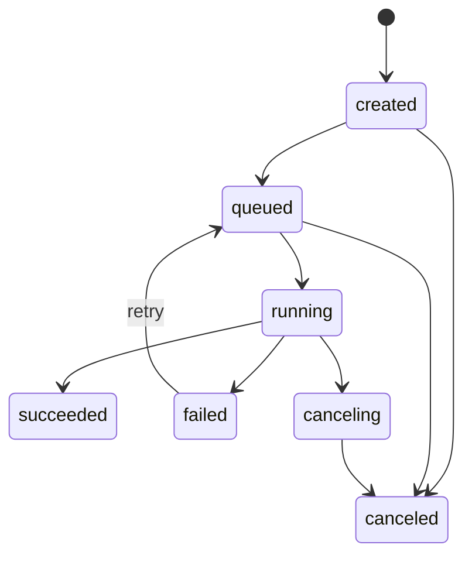

# Chat 工作台重构设计

日期：2026-05-30

## 背景

Coze Studio 现有产品形态以 Agent IDE、Workflow IDE、Plugin、资源库为主要入口。新的产品方向要把自然语言对话变成默认入口，让用户先描述任务，再由系统选择快速问答、智能体、技能或异步任务执行路径。

本设计采用渐进式重构：不重写现有 Agent、Workflow、资源库和项目开发能力，而是在它们之上新增 Chat Orchestrator、Skill Registry 和 Task Engine。第一期目标是跑通从 Chat 输入到 Skill/Workflow/异步任务执行结果的纵向闭环。

## 目标

1. Chat 是空间默认入口，用户通过自然语言创建和执行任务。
2. 输入区支持 `Auto`、`Ask`、`Agent` 三种可切换模式。
3. 新增 Skill 体系，第一期支持脚本 Skill 和 Workflow Skill。
4. Skill 配置支持文件导入和页面编辑保存，并可导出为声明式配置。
5. 新增异步任务基础闭环，支持创建、排队、运行、进度、结果、失败、取消、重试。
6. 保留现有工作流配置能力，并将 Workflow 作为一种 Skill 执行类型接入。
7. 菜单中“项目开发”复用现有 `develop` 页面，“资源库”复用现有 `library` 页面。

## 非目标

1. 第一阶段不统一 Plugin/API Skill，保留现有插件能力，后续再接入 Skill Registry。
2. 第一阶段不做定时触发器、任务依赖编排、批量任务 DAG。
3. 第一阶段不重写 Agent IDE、Workflow IDE 或资源库内部实现。
4. 第一阶段不做完整技能市场、公开发布和复杂权限市场化。

## 产品信息架构

空间默认入口从现有开发视图调整为 Chat 工作台。左侧菜单建议为：

1. Chat 工作台：新增默认入口，承载自然语言任务输入、模板推荐、最近任务和任务进度。
2. 资源库：复用现有资源库能力，对应当前 `library` 页面。
3. 技能配置：新增页面，管理脚本 Skill 和 Workflow Skill。
4. 项目开发：复用现有项目开发能力，对应当前 `develop` 页面。
5. 任务触发器：保留入口，第一期展示入口说明和后续触发器规划，定时/事件触发在下一阶段实现。
6. 全部任务：新增页面，展示异步任务列表、状态、进度、结果、取消和重试。

Chat 输入区保留 `Auto + Ask + Agent`：

1. `Auto`：默认模式，由编排层根据意图、上下文和 Skill 匹配结果自动选择执行路径。
2. `Ask`：快速问答模式，优先走 Chat Direct，不主动进入长任务。
3. `Agent`：智能体模式，优先走已有 Agent Engine，适合多轮规划、工具调用和复杂执行。

## Chat Orchestrator

核心数据流：



### Chat Gateway

Chat Gateway 是统一对话入口，负责：

1. 接收用户消息和当前模式：`auto`、`ask`、`agent`。
2. 创建或复用 conversation，并写入用户消息。
3. 处理流式响应，第一期沿用现有 SSE/streaming 风格。
4. 将请求交给 Intent Resolver 和 Router Decision。
5. 将最终响应、任务引用或错误信息写回消息流。

### Intent Resolver

Intent Resolver 通过规则和 LLM 混合识别意图：

1. 普通对话：解释、问答、总结，不需要执行工具。
2. Agent 执行：需要多步规划、智能体上下文或工具链。
3. Skill 调用：用户输入与某个 Skill 的描述、输入 schema 或触发词匹配。
4. 异步任务：任务耗时较长、需要后台执行、用户明确要求生成报告/分析/整理等长任务。
5. 创建 Agent：用户表达要新建或配置智能体时，路由到现有项目开发能力或创建流程。

第一期规则优先保证稳定，LLM 作为补充判断。Resolver 输出结构包含 `intent`、`confidence`、`matched_skill_ids`、`requires_async`、`reason`。

### Router Decision

Router Decision 根据模式和意图选择执行路径：

1. `ask` 模式：优先 Chat Direct；只有用户明确点选 Skill 时才调用 Skill。
2. `agent` 模式：优先 Agent Engine；可在 Agent 内部触发 Skill 或 Task。
3. `auto` 模式：按意图自动选择 Chat Direct、Agent Engine、Skill Engine 或 Task Engine。
4. 如果 Skill 需要长时间运行，Router 创建 Task，由 Task Engine 异步执行。
5. 如果 Workflow Skill 支持流式前台执行且耗时较短，可直接走 Skill Engine 的同步/流式执行。

## Skill Registry

第一期支持两种 Skill：

1. Script Skill：基于声明式配置和脚本执行，复用现有 `backend/infra/coderunner` 能力。
2. Workflow Skill：包装现有 Workflow，复用现有 Workflow 发布、执行和流式执行能力。

### 配置来源

Skill 支持文件导入和页面编辑保存：

1. 文件导入：支持 `skill.yaml` 或 `skill.json`，导入后落库。
2. 页面编辑：技能配置页面可编辑名称、描述、输入输出 schema、执行器配置、启停状态。
3. 导出：页面中的 Skill 可导出为标准声明文件，方便版本管理。

声明配置建议字段：

```yaml
id: weekly_report
name: 周报生成助手
description: 根据输入资料生成结构化周报
type: script
version: 1.0.0
enabled: true
input_schema:
  type: object
  required:
    - source_text
  properties:
    source_text:
      type: string
      description: 周报素材
output_schema:
  type: object
  properties:
    report:
      type: string
executor:
  language: python
  entry: main.py
permissions:
  network: false
  filesystem_read: []
  filesystem_write: []
```

Workflow Skill 的 `executor` 使用 workflow 引用：

```yaml
type: workflow
executor:
  workflow_id: "123456"
  version: published
```

### 执行约束

1. Script Skill 第一阶段只开放 Python，JavaScript 留作后续。
2. Script Skill 通过现有 direct/sandbox coderunner 执行，生产环境推荐 sandbox。
3. Workflow Skill 必须引用已发布工作流，未发布时返回明确错误。
4. Skill 输入必须通过 schema 校验后再执行。
5. Skill 执行结果统一包装成文本、结构化 JSON 和任务附件引用三类输出。

## Task Engine

Task Engine 用于长时间运行的复杂 AI 任务。第一期支持基础异步闭环。

### 状态机



### 能力范围

1. 创建任务：由 Chat Gateway、Skill 页面测试运行或未来触发器创建。
2. 排队执行：第一期可使用数据库轮询或事件总线；推荐复用现有 eventbus/NSQ 基础设施。
3. 进度更新：支持百分比、阶段名称、简短日志。
4. 结果保存：保存结构化结果、文本摘要和附件引用。
5. 失败原因：记录错误码、错误消息和可展示详情。
6. 取消：支持取消 queued/running 任务，running 任务进入 canceling 后由执行器协作终止。
7. 重试：failed 任务可重试，生成新的 attempt。

### 数据模型建议

新增后端域：`backend/domain/task` 与 `backend/application/task`。

核心表建议：

1. `chat_tasks`：任务主表，包含 `id`、`space_id`、`creator_id`、`conversation_id`、`message_id`、`skill_id`、`status`、`progress`、`title`、`input`、`result`、`error`、`created_at`、`updated_at`。
2. `chat_task_attempts`：任务尝试记录，包含 `task_id`、`attempt_no`、`status`、`started_at`、`ended_at`、`runtime`、`error`。
3. `chat_task_events`：任务事件流，包含 `task_id`、`event_type`、`payload`、`created_at`。

## 后端落地方式

现有后端是 IDL 生成路由 + application/domain 分层。新增能力应遵守这个模式：

1. 新增 IDL：`idl/chat/workbench.thrift`、`idl/skill/skill.thrift`、`idl/task/task.thrift`。
2. 新增 handler：通过生成器生成 handler 框架，业务逻辑放到 application 层。
3. 新增 application：
   - `backend/application/chat`：Chat Gateway、Intent Resolver、Router Decision。
   - `backend/application/skill`：Skill 管理、导入导出、测试运行。
   - `backend/application/task`：任务创建、查询、取消、重试、事件订阅。
4. 新增 domain：
   - `backend/domain/skill`：Skill 实体、仓储、schema 校验、执行策略。
   - `backend/domain/task`：Task 实体、状态机、仓储、attempt/event 管理。
5. 复用现有能力：
   - Conversation/Message：保存 Chat 工作台会话与消息。
   - AgentRun/SingleAgent：Agent 模式执行。
   - Workflow：Workflow Skill 执行。
   - Coderunner：Script Skill 执行。
   - Eventbus：异步任务调度。
   - OSS/MinIO：脚本文件、导入文件和任务附件存储。

第一期不直接修改生成路由文件，避免后续 IDL 重新生成时丢失改动。

## 前端落地方式

新增工作台页面应尽量复用现有路由和布局能力：

1. 空间默认路由从 `develop` 调整到 `workbench`。
2. 新增页面：
   - `frontend/apps/coze-studio/src/pages/workbench`
   - `frontend/apps/coze-studio/src/pages/skill`
   - `frontend/apps/coze-studio/src/pages/tasks`
3. `资源库` 菜单指向现有 `library`。
4. `项目开发` 菜单指向现有 `develop`。
5. Chat 工作台组件包含：
   - 左侧任务列表和菜单。
   - 中央 Chat Composer。
   - `Auto/Ask/Agent` segmented control。
   - 模板卡片和最近任务。
   - 任务进度卡片和结果预览。
6. 技能配置页面包含：
   - Skill 列表。
   - 文件导入。
   - 表单编辑。
   - schema 预览。
   - 测试运行。
   - 启用/停用。
   - 导出声明文件。
7. 全部任务页面包含：
   - 状态筛选。
   - 任务详情。
   - 进度事件。
   - 取消和重试操作。

## 接口建议

第一期接口以内部 Web API 为主：

1. `POST /api/workbench/chat`：发送消息，支持流式响应。
2. `POST /api/skills/import`：导入 Skill 声明文件。
3. `POST /api/skills`：创建 Skill。
4. `PUT /api/skills/:id`：更新 Skill。
5. `GET /api/skills`：Skill 列表。
6. `POST /api/skills/:id/test_run`：测试运行 Skill。
7. `POST /api/tasks`：创建异步任务。
8. `GET /api/tasks`：任务列表。
9. `GET /api/tasks/:id`：任务详情。
10. `POST /api/tasks/:id/cancel`：取消任务。
11. `POST /api/tasks/:id/retry`：重试任务。
12. `GET /api/tasks/:id/events`：任务事件流或轮询事件。

接口响应保持现有项目风格，包含 `code`、`msg`、`data`。

## 错误处理

1. Intent 低置信度：Auto 模式下返回可选执行建议，不直接执行高风险操作。
2. Skill schema 校验失败：返回字段级错误，前端定位到输入表单。
3. Workflow 未发布：提示用户先发布 Workflow。
4. 脚本执行失败：返回 stderr 摘要、错误类型和 attempt 信息。
5. 异步任务失败：任务状态置为 failed，结果区展示失败原因和重试入口。
6. 取消失败：如果任务已完成，返回当前最终状态；如果执行器不支持强取消，返回 canceling 并等待协作结束。

## 测试策略

1. 后端单元测试：
   - Intent Resolver 规则测试。
   - Router Decision 模式选择测试。
   - Skill schema 校验测试。
   - Task 状态机测试。
2. 后端集成测试：
   - Script Skill 测试运行。
   - Workflow Skill 调用已发布 Workflow。
   - Task 创建、运行、失败、取消、重试。
3. 前端测试：
   - Workbench 模式切换。
   - Skill 导入和编辑表单。
   - Task 列表状态筛选和操作按钮。
4. 手工验收：
   - Ask 快速问答可流式返回。
   - Agent 模式可进入现有智能体执行。
   - Auto 可匹配一个脚本 Skill 并生成结果。
   - Auto 可匹配一个 Workflow Skill 并生成结果。
   - 长任务可在 Chat 和全部任务中看到进度，失败后可重试。

## 实施顺序

1. 新增设计对应的前端路由和菜单骨架，复用资源库和项目开发页面。
2. 新增 Skill Registry 后端模型、IDL、仓储和基础页面。
3. 接入 Script Skill 执行，先完成页面测试运行。
4. 接入 Workflow Skill 执行，要求引用已发布工作流。
5. 新增 Task Engine 状态机、表结构、任务 API 和任务列表页面。
6. 新增 Chat Gateway、Intent Resolver 和 Router Decision。
7. 将 Chat 工作台接入 Ask、Agent、Skill、Task 四条路径。
8. 补齐取消、重试、错误展示和验收测试。

## 风险与缓解

1. 现有生成代码较多，手改生成文件容易丢失。缓解方式：新增 IDL 后生成，业务逻辑放 application/domain。
2. Script Skill 有执行安全风险。缓解方式：生产默认 sandbox，限制网络、文件和运行权限。
3. Auto 路由误判会影响用户信任。缓解方式：低置信度时让用户确认，危险操作不自动执行。
4. Task 取消依赖执行器协作。缓解方式：状态机支持 canceling，并在执行器层逐步增强取消能力。
5. Workflow Skill 依赖已发布版本。缓解方式：配置页校验发布状态，并提供跳转发布入口。

## 验收标准

1. 进入空间后默认看到 Chat 工作台。
2. 左侧菜单包含 Chat 工作台、资源库、技能配置、项目开发、任务触发器、全部任务。
3. 资源库和项目开发菜单能进入现有对应功能。
4. Chat 输入区可在 Auto、Ask、Agent 间切换。
5. Ask 模式可完成快速问答。
6. Agent 模式可路由到现有智能体执行。
7. 技能配置页面可导入、编辑、保存、导出脚本 Skill。
8. 技能配置页面可创建 Workflow Skill 并引用已发布工作流。
9. Chat Auto 模式可匹配并执行脚本 Skill。
10. Chat Auto 模式可匹配并执行 Workflow Skill。
11. 长任务可创建异步任务，并在 Chat 和全部任务页面展示状态、进度和结果。
12. failed 任务可重试，queued/running 任务可取消。
