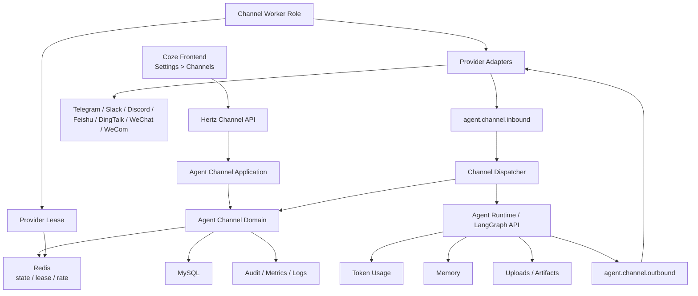
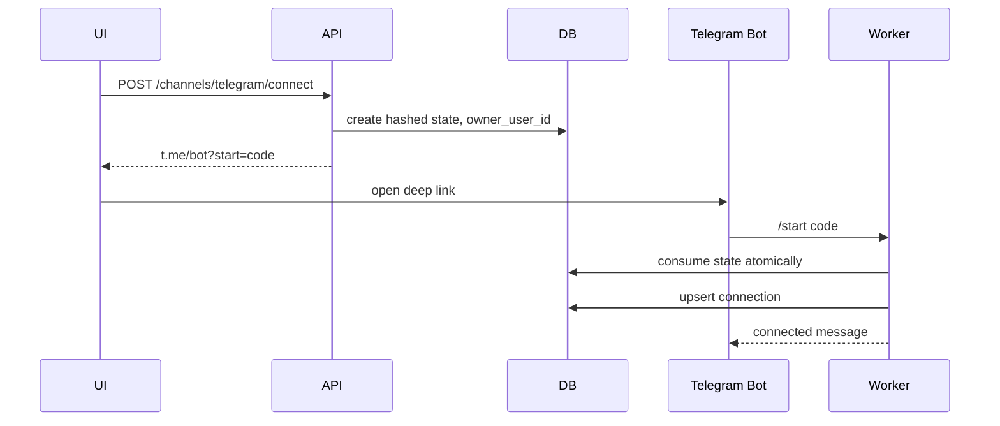
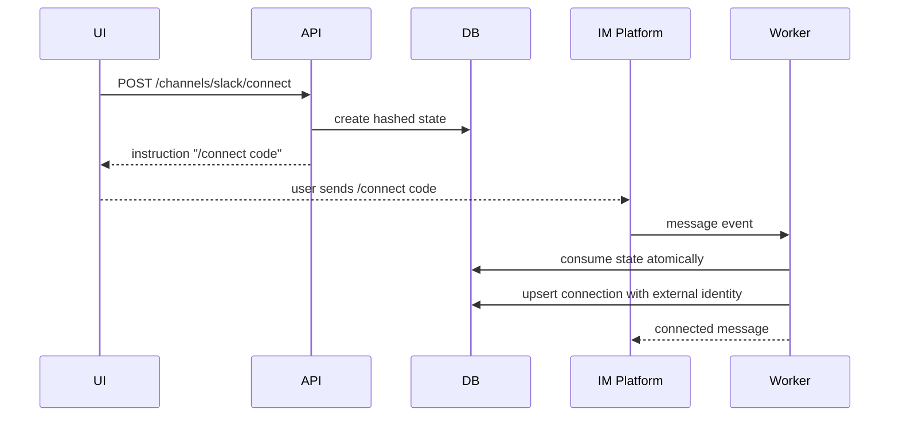

# IM Channels 设计

日期：2026-06-13
状态：历史设计文档，2026-06-18 确认不纳入本项目实施范围

> 本文仅保留为历史分析资料。当前项目不开发 IM Channels，不将本文中的
> API、数据表、Worker、前端页面或上线门禁计入路线图和验收范围。
目标级别：生产级
依赖文档：

1. `docs/superpowers/specs/2026-06-13-runtime-langgraph-api-design.md`
2. `docs/superpowers/specs/2026-06-13-skills-mcp-security-design.md`
3. `docs/superpowers/specs/2026-06-13-memory-token-artifacts-settings-design.md`

## 背景

前几份 spec 已经确定 Go 原生 Agent Harness、LangGraph 兼容 API、Skills/MCP/Tools、安全治理、Memory、Token Usage、Artifacts 和 Settings。IM Channels 是下一层生产入口：用户不只在 Coze Web 页面内和 Agent 对话，也要能从 Telegram、Slack、Discord、飞书/Lark、钉钉、微信、企业微信等 IM 平台进入同一套 Agent runtime。

这个能力不能简单理解为“收到 webhook 后调用一次 run”。生产级 IM Channels 至少包含：

1. 平台机器人运行时凭据管理。
2. 登录用户和外部 IM 身份绑定。
3. 外部会话和 Coze thread/conversation 映射。
4. 长连接、轮询、回调、流式回包和最终消息的统一调度。
5. 附件下载、上传、artifact 回传。
6. 命令系统、slash skill、memory/status/help 等控制指令。
7. 多租户隔离、幂等、限流、审计、重试和死信。
8. 多副本部署下避免重复消费和重复回复。

Deer-flow 的关键设计是将外部平台事件先解析为 `connection_id + owner_user_id`，再以该 Coze/DeerFlow 用户身份进入 LangGraph-compatible runtime。这个原则在 Coze Studio 中也必须保留：平台 user id 只是外部身份，不是 Coze 授权主体。

## 目标

1. 在 Coze Studio 中新增 Agent Channel 域，复刻 Deer-flow IM Channels 的前后台能力。
2. 支持 Telegram、Slack、Discord、飞书/Lark、钉钉、微信、企业微信的 provider 抽象和逐步落地。
3. 支持用户在 Settings > Channels 中绑定、查看、断开自己的 IM 连接。
4. 支持管理员配置 provider runtime credentials，普通用户只看到可连接状态和 masked 信息。
5. 支持 `/connect <code>`、Telegram deep link、`/new`、`/status`、`/models`、`/memory`、`/help` 等 channel command。
6. 支持 IM 会话复用 Coze Agent thread，并保证外部 conversation/topic 到内部 thread 的稳定映射。
7. 支持 streaming-capable provider 的增量更新，不支持 streaming 的 provider 使用最终回复。
8. 支持 inbound attachments 进入 Agent uploads，支持 outbound artifacts 作为附件或下载链接返回。
9. 支持生产级幂等、重试、DLQ、限流、审计、监控和多副本运行。
10. 明确 Go 技术选型、部署计算栈和主要卡点。

## 非目标

1. 不替换 Coze 现有 Chat SDK、API、Coze connector 发布能力。
2. 不调整已有账号设置和 API 授权体系。
3. 不要求第一阶段同时完成所有 provider 的全部高级能力。
4. 不允许外部 IM 平台身份绕过 Coze 登录用户、space、agent、thread 权限。
5. 不把 provider secrets 返回给浏览器。
6. 不把 IM 原始事件完整 payload 默认写入 prompt、memory 或可见消息。

## 本地上下文

Coze Studio 现有能力：

1. `backend/domain/connector` 目前更像发布入口清单，内置 Chat SDK、API、Coze 三类 connector，不包含外部身份绑定和长连接运行态。
2. `backend/domain/app/entity/connector.go` 的 publish whitelist 只包含 WebSDK 和 API，说明 IM Channels 不适合直接塞进现有 publish connector。
3. `backend/application/conversation/openapi_agent_run.go` 已有 OpenAPI conversation/run 入口，可复用 Agent 校验、conversation 创建、stream 拉取等经验。
4. `backend/infra/eventbus` 已抽象 NSQ、Kafka、RMQ、Pulsar、NATS，可作为 channel inbound/outbound durable queue。
5. `backend/infra/cache/impl/redis` 已接入 `redis/go-redis/v9`，可承载短期 code、lease、rate limit、幂等缓存。
6. `backend/go.mod` 已有 Hertz、GORM、go-redis、NSQ、NATS、Pulsar、OAuth2、x/crypto、Eino 等基础依赖。
7. `backend/conf/plugin/pluginproduct/lark_message.yaml` 已有飞书消息插件能力，但这是工具调用方向，不是 IM 入口通道。
8. 上传、artifact、token usage、memory 已在第三份 spec 中设计为 Agent Harness 一等能力，IM Channels 应直接复用这些域。

Deer-flow 参考能力：

1. `app/channels/base.py` 定义 Channel 基类：平台收消息、发消息、文件上传下载。
2. `app/channels/message_bus.py` 定义 InboundMessage、OutboundMessage 和 pub/sub bus。
3. `app/channels/manager.py` 负责消费 inbound、处理 command、创建/复用 thread、调用 runs.wait 或 runs.stream，再发布 outbound。
4. `app/gateway/routers/channel_connections.py` 提供浏览器侧 providers、connections、connect、runtime-config API。
5. `persistence/channel_connections` 提供 connection、credential、state、conversation 四类持久化模型。
6. Telegram 走 deep link `/start <code>`，其它通道通常走 `/connect <code>`。
7. Slack/Discord 倾向 final response，飞书/Telegram/企业微信/钉钉可做 streaming/card/edit 更新。

## 设计原则

1. 新增 Agent Channel 域，不污染现有 connector publish 域。
2. 外部平台身份只用于匹配 connection，不作为 Coze 用户身份。
3. Provider runtime credentials 属于 space/admin 配置；user connection 属于用户授权和绑定。
4. 所有 inbound event 必须幂等，所有 outbound delivery 必须可重试。
5. 长连接 channel worker 和普通 API server 分角色部署。
6. 多副本部署必须通过 lease/leader 避免同一 provider 连接重复启动。
7. Streaming 是 provider capability，不是业务必选项；无法安全 stream 时降级 final reply。
8. 附件和 artifact 只能通过第三份 spec 的 files/artifacts 安全层进出。
9. Channel command 优先级高于 slash skill，避免 `/new` 被误识别为 skill。

## 总体架构



运行角色：

1. `api-server`：Hertz API，提供 settings、connect、runtime config、status、webhook fallback。
2. `channel-worker`：运行长连接、轮询、provider adapter、inbound/outbound queue consumer。
3. `agent-runtime-worker`：执行 Agent run、stream、tool、memory、artifact。
4. `cleanup-worker`：清理 expired state、revoked credential、旧 event、delivery DLQ。

## 模块边界

建议新增模块：

```text
backend/domain/agent/channel/
  entity/
  repository/
  service/
  adapter/
  command/
  dispatcher/
  delivery/
  runtime/
  security/

backend/application/agent_channel/
  channel_app.go
  provider_app.go
  connection_app.go
  runtime_config_app.go
  event_app.go

backend/api/handler/agent_channel/
  providers.go
  connections.go
  runtime_config.go
  webhook.go
  status.go

backend/infra/channel/
  telegram/
  slack/
  discord/
  feishu/
  dingtalk/
  wechat/
  wecom/

idl/agent/channel.thrift
```

与已有域的关系：

1. `domain/connector`：继续表示发布方式，不承载 IM connection。
2. `application/conversation`：保留旧 OpenAPI run 能力；IM Dispatcher 调用新的 Agent Harness Runtime API，并在兼容阶段复用 conversation 创建逻辑。
3. `domain/upload` 和 `domain/agent/files`：承接 inbound attachment 和 outbound artifact。
4. `domain/agent/usage`：记录 channel run 的 token usage，source 标记为 `im_channel`。
5. `domain/agent/memory`：owner user id 进入 memory scope，外部 platform user id 只进入 metadata。

## Provider 支持矩阵

| Provider | Inbound 模式 | Connect 模式 | Streaming 策略 | 第一阶段建议 |
| --- | --- | --- | --- | --- |
| Telegram | long polling 或 webhook fallback | deep link `/start <code>` | edit running reply + final split | 优先落地 |
| Slack | Socket Mode | `/connect <code>` | final reply，后续可 block update | 优先落地 |
| Discord | Gateway WebSocket | `/connect <code>` | final reply | 优先落地 |
| 飞书/Lark | WebSocket 长连接 | `/connect <code>` | 卡片 patch 或消息 update | 第二批 |
| 钉钉 | Stream Mode WebSocket | `/connect <code>` | AI Card 或 markdown fallback | 第二批，高风险 |
| 微信 | provider SDK 或 HTTP/WS | `/connect <code>` | final reply | 第三批 |
| 企业微信 | AI Bot WebSocket | `/connect <code>` | streaming/card/file | 第三批，高风险 |

第一阶段优先 Telegram、Slack、Discord，原因：

1. Go 生态 SDK 相对成熟。
2. 平台事件模型清晰。
3. 可先验证 connection、conversation mapping、run dispatch、delivery retry 的主干。

飞书、钉钉、企业微信应在主干稳定后落地，因为长连接协议、卡片流式、文件下载加密和企业租户限制更复杂。

## Go 技术选型

### 沿用现有栈

| 能力 | 选型 | 说明 |
| --- | --- | --- |
| HTTP API | CloudWeGo Hertz | 项目现有 API 框架，新增 handler 即可 |
| DB | GORM + gorm/gen + MySQL | 与现有 DAL 保持一致 |
| 短期状态 | Redis / go-redis v9 | connect code cache、lease、rate limit、idempotency |
| MQ | `backend/infra/eventbus` | 复用 NSQ/Kafka/RMQ/Pulsar/NATS 抽象 |
| OAuth | `golang.org/x/oauth2` | 未来 provider OAuth callback 和 token refresh |
| 加密 | `crypto/aes` + `x/crypto` + KMS 接口 | 本地 AES-GCM fallback，生产对接 KMS |
| Agent runtime | Go 原生 Agent Harness + Eino boundary | 调用前两份 spec 的 runtime |
| SSE/stream | `hertz-contrib/sse` | runtime 到 Web UI 仍走 SSE；IM 侧转 provider streaming |

### 新增或转为 direct dependency

| Provider | 推荐 Go 依赖 | 风险 |
| --- | --- | --- |
| Telegram | `github.com/go-telegram-bot-api/telegram-bot-api/v5` | 消息长度、群限流和 edit 频率要封装 |
| Slack | `github.com/slack-go/slack` | Socket Mode token、ack、重连和 rate limit 要测 |
| Discord | `github.com/bwmarrin/discordgo` | Gateway intents、断线恢复、消息权限要测 |
| 飞书/Lark | `github.com/larksuite/oapi-sdk-go/v3` | 国内飞书与海外 Lark 配置差异 |
| 钉钉 | 标准 HTTP + WebSocket 协议封装 | Go Stream Mode SDK 成熟度是卡点 |
| 企业微信 | 标准 HTTP + WebSocket 协议封装 | AI Bot Go SDK 成熟度和文件加解密是卡点 |

WebSocket 底层建议：

1. 若 provider SDK 已封装 WebSocket，优先使用 SDK。
2. 若必须自建长连接，使用 `gorilla/websocket` 转为 direct dependency，因为项目 go.sum 已有该包，迁移成本较低。
3. 所有自建 WebSocket adapter 必须实现 heartbeat、reconnect backoff、read limit、write deadline、close handshake。

限流建议：

1. 进程内使用 `golang.org/x/time/rate` 做 provider adapter 局部限流。
2. 跨副本使用 Redis token bucket 或 fixed window。
3. outbound delivery 以 provider、workspace、chat、connection 四级限流。

## 计算栈与部署

### 最小开发环境

1. 单个 Go server 进程同时运行 API、runtime、channel worker。
2. MySQL、Redis、NSQ 使用现有 docker middleware。
3. Provider credentials 使用本地配置或 admin runtime config。
4. 仅允许单副本 channel worker。

### 生产推荐环境

1. `api-server`：2 个以上副本，处理浏览器 API 和 webhook fallback。
2. `channel-worker`：2 个以上副本，但每个 `(space_id, provider, runtime_config_version)` 只有一个 lease holder 启动 inbound 长连接。
3. `agent-runtime-worker`：按 Agent 运行负载水平扩展。
4. `cleanup-worker`：1 到 2 个副本，处理 expired states、DLQ、旧事件清理。
5. MySQL：持久化 connection、conversation、event、delivery、config。
6. Redis：短期 code、lease、rate limit、idempotency 热缓存。
7. MQ：生产建议 NSQ 或 Kafka；本地可用 NSQ。
8. Object storage：用于 inbound file、outbound artifact。

### 粗略资源估算

低量级场景：

1. `channel-worker`：每 50 个 active provider connections 预留 0.5 vCPU、512 MB。
2. `api-server`：沿用现有服务规格。
3. MQ：每分钟 1000 条 channel event 以内，NSQ 单节点可满足开发和中小规模。

中量级场景：

1. `channel-worker` 按 provider 分组扩容，例如 Slack/Discord 独立 deployment。
2. outbound delivery worker 与 inbound adapter 分离，避免平台发送慢拖垮接收。
3. Redis QPS 主要来自 lease、rate、idempotency，需开启连接池和超时。

高量级场景：

1. Kafka/Pulsar 替代 NSQ，按 provider 和 space 分区。
2. `agent.channel.inbound`、`agent.channel.outbound`、`agent.channel.delivery.dlq` 独立 topic。
3. 每个 provider adapter 支持 shard key，避免一个 worker 承接所有 workspace。

## 数据模型

### agent_channel_provider_configs

```sql
CREATE TABLE agent_channel_provider_configs (
  id BIGINT PRIMARY KEY,
  space_id BIGINT NOT NULL,
  provider VARCHAR(32) NOT NULL,
  enabled BOOLEAN NOT NULL DEFAULT FALSE,
  runtime_mode VARCHAR(32) NOT NULL DEFAULT 'long_connection',
  config_version BIGINT NOT NULL DEFAULT 1,
  credential_status VARCHAR(32) NOT NULL DEFAULT 'missing',
  capabilities JSON NOT NULL,
  metadata JSON NOT NULL,
  updated_by BIGINT NOT NULL,
  created_at DATETIME NOT NULL,
  updated_at DATETIME NOT NULL,
  UNIQUE KEY uk_space_provider (space_id, provider)
);
```

Provider runtime credentials 不直接放在该表明文字段中。生产使用 secret store/KMS；开发可使用 encrypted blob fallback。

### agent_channel_runtime_credentials

```sql
CREATE TABLE agent_channel_runtime_credentials (
  id BIGINT PRIMARY KEY,
  provider_config_id BIGINT NOT NULL,
  encrypted_payload TEXT NOT NULL,
  encryption_version VARCHAR(32) NOT NULL DEFAULT 'aesgcm:v1',
  key_ref VARCHAR(255) NOT NULL DEFAULT '',
  masked_fields JSON NOT NULL,
  rotated_at DATETIME DEFAULT NULL,
  created_at DATETIME NOT NULL,
  updated_at DATETIME NOT NULL,
  UNIQUE KEY uk_provider_config (provider_config_id)
);
```

要求：

1. API response 只能返回 `credential_status` 和 `masked_fields`。
2. 密钥解密失败时 provider 标记为 `configured=false`，不得尝试使用损坏 secret。
3. runtime config 更新必须写审计事件。

### agent_channel_connections

```sql
CREATE TABLE agent_channel_connections (
  id BIGINT PRIMARY KEY,
  space_id BIGINT NOT NULL,
  owner_user_id BIGINT NOT NULL,
  default_agent_id BIGINT NOT NULL DEFAULT 0,
  provider VARCHAR(32) NOT NULL,
  status VARCHAR(32) NOT NULL DEFAULT 'connected',
  external_account_id VARCHAR(128) NOT NULL DEFAULT '',
  external_account_name VARCHAR(255) DEFAULT NULL,
  workspace_id VARCHAR(128) NOT NULL DEFAULT '',
  workspace_name VARCHAR(255) DEFAULT NULL,
  bot_user_id VARCHAR(128) DEFAULT NULL,
  scopes JSON NOT NULL,
  capabilities JSON NOT NULL,
  metadata JSON NOT NULL,
  created_at DATETIME NOT NULL,
  updated_at DATETIME NOT NULL,
  last_seen_at DATETIME DEFAULT NULL,
  last_error_at DATETIME DEFAULT NULL,
  UNIQUE KEY uk_owner_provider_identity (
    space_id,
    owner_user_id,
    provider,
    external_account_id,
    workspace_id
  ),
  KEY idx_provider_identity (space_id, provider, external_account_id, workspace_id),
  KEY idx_owner_status (space_id, owner_user_id, status)
);
```

Connection status：

1. `pending`
2. `connected`
3. `revoked`
4. `disabled`
5. `error`

`default_agent_id` 规则：

1. 为 0 时使用用户在 Settings 中选择的默认 Agent。
2. 非 0 时 inbound message 默认进入该 Agent。
3. 外部 chat 可通过 command 或 UI 绑定不同 Agent，但必须校验 owner 对 Agent 的访问权限。

### agent_channel_connection_credentials

```sql
CREATE TABLE agent_channel_connection_credentials (
  connection_id BIGINT PRIMARY KEY,
  encrypted_access_token TEXT,
  encrypted_refresh_token TEXT,
  token_type VARCHAR(32) DEFAULT NULL,
  expires_at DATETIME DEFAULT NULL,
  refresh_expires_at DATETIME DEFAULT NULL,
  encrypted_extra_json TEXT,
  encryption_version VARCHAR(32) NOT NULL DEFAULT 'aesgcm:v1',
  version BIGINT NOT NULL DEFAULT 1,
  updated_at DATETIME NOT NULL
);
```

第一阶段可以不启用 per-connection OAuth token，但表结构预留。启用后必须接入 token refresh、scope 展示和 revoke。

### agent_channel_states

```sql
CREATE TABLE agent_channel_states (
  state_hash VARCHAR(128) PRIMARY KEY,
  space_id BIGINT NOT NULL,
  owner_user_id BIGINT NOT NULL,
  provider VARCHAR(32) NOT NULL,
  code_verifier_encrypted TEXT,
  nonce_hash VARCHAR(128) DEFAULT NULL,
  redirect_after TEXT,
  requested_scopes JSON NOT NULL,
  metadata JSON NOT NULL,
  expires_at DATETIME NOT NULL,
  consumed_at DATETIME DEFAULT NULL,
  created_at DATETIME NOT NULL,
  KEY idx_owner_provider (space_id, owner_user_id, provider),
  KEY idx_expires_at (expires_at)
);
```

State 规则：

1. code 至少 128 bits randomness。
2. DB 只存 hash，不存明文 code。
3. 默认 10 分钟过期。
4. 单次消费，使用条件更新防并发双花。
5. 同一用户同一 provider 同时 pending code 不超过 5 个。

### agent_channel_conversations

```sql
CREATE TABLE agent_channel_conversations (
  id BIGINT PRIMARY KEY,
  space_id BIGINT NOT NULL,
  connection_id BIGINT NOT NULL,
  owner_user_id BIGINT NOT NULL,
  provider VARCHAR(32) NOT NULL,
  external_conversation_id VARCHAR(128) NOT NULL,
  external_topic_id VARCHAR(128) NOT NULL DEFAULT '',
  agent_id BIGINT NOT NULL,
  thread_id BIGINT NOT NULL,
  conversation_id BIGINT NOT NULL DEFAULT 0,
  status VARCHAR(32) NOT NULL DEFAULT 'active',
  metadata JSON NOT NULL,
  created_at DATETIME NOT NULL,
  updated_at DATETIME NOT NULL,
  UNIQUE KEY uk_connection_external (
    connection_id,
    external_conversation_id,
    external_topic_id
  ),
  KEY idx_thread (thread_id),
  KEY idx_owner_provider (space_id, owner_user_id, provider)
);
```

`thread_id` 对应 Agent Harness thread。`conversation_id` 用于兼容 Coze 现有 conversation 域，兼容期允许为 0，但最终应建立稳定映射。

### agent_channel_events

```sql
CREATE TABLE agent_channel_events (
  id BIGINT PRIMARY KEY,
  space_id BIGINT NOT NULL,
  provider VARCHAR(32) NOT NULL,
  direction VARCHAR(16) NOT NULL,
  connection_id BIGINT DEFAULT NULL,
  conversation_id BIGINT DEFAULT NULL,
  thread_id BIGINT DEFAULT NULL,
  external_message_id VARCHAR(128) NOT NULL DEFAULT '',
  external_event_id VARCHAR(128) NOT NULL DEFAULT '',
  dedup_key VARCHAR(255) NOT NULL,
  event_type VARCHAR(64) NOT NULL,
  status VARCHAR(32) NOT NULL,
  error_code VARCHAR(64) NOT NULL DEFAULT '',
  error_message TEXT,
  payload_meta JSON NOT NULL,
  created_at DATETIME NOT NULL,
  updated_at DATETIME NOT NULL,
  UNIQUE KEY uk_dedup (space_id, provider, dedup_key),
  KEY idx_connection_created (connection_id, created_at),
  KEY idx_thread_created (thread_id, created_at)
);
```

要求：

1. `payload_meta` 只保存脱敏摘要，不保存完整 message body 和附件二进制。
2. 原始 payload 如需排障，只能进入受控审计日志或短 TTL debug store。
3. dedup key 优先使用 provider event id，其次使用 message id + timestamp + sender hash。

### agent_channel_deliveries

```sql
CREATE TABLE agent_channel_deliveries (
  id BIGINT PRIMARY KEY,
  event_id BIGINT NOT NULL,
  provider VARCHAR(32) NOT NULL,
  connection_id BIGINT NOT NULL,
  outbound_kind VARCHAR(32) NOT NULL,
  status VARCHAR(32) NOT NULL,
  attempt_count INT NOT NULL DEFAULT 0,
  next_retry_at DATETIME DEFAULT NULL,
  provider_message_id VARCHAR(128) NOT NULL DEFAULT '',
  error_code VARCHAR(64) NOT NULL DEFAULT '',
  error_message TEXT,
  created_at DATETIME NOT NULL,
  updated_at DATETIME NOT NULL,
  KEY idx_status_retry (status, next_retry_at),
  KEY idx_connection_created (connection_id, created_at)
);
```

Delivery status：

1. `queued`
2. `sending`
3. `sent`
4. `retrying`
5. `failed`
6. `dead_letter`
7. `cancelled`

### agent_channel_worker_leases

```sql
CREATE TABLE agent_channel_worker_leases (
  lease_key VARCHAR(255) PRIMARY KEY,
  holder_id VARCHAR(128) NOT NULL,
  provider VARCHAR(32) NOT NULL,
  space_id BIGINT NOT NULL,
  config_version BIGINT NOT NULL,
  expires_at DATETIME NOT NULL,
  heartbeat_at DATETIME NOT NULL,
  created_at DATETIME NOT NULL,
  updated_at DATETIME NOT NULL
);
```

生产优先使用 Redis `SET key value NX PX` 做 lease；该表用于可观测和 DB fallback。

## 核心接口

### Channel Adapter

```go
type ChannelAdapter interface {
	Name() string
	Capabilities() ChannelCapabilities
	Start(ctx context.Context) error
	Stop(ctx context.Context) error
	Send(ctx context.Context, msg *OutboundEnvelope) (*DeliveryResult, error)
	Download(ctx context.Context, file *InboundFileRef) (*DownloadedFile, error)
}
```

### InboundEnvelope

```go
type InboundEnvelope struct {
	Provider               string
	ExternalConversationID string
	ExternalTopicID        string
	ExternalUserID         string
	ExternalUserName       string
	ExternalWorkspaceID    string
	ExternalMessageID      string
	ExternalEventID        string
	Text                   string
	MessageType            string
	Files                  []*InboundFileRef
	Metadata               map[string]any
	ReceivedAt             time.Time
}
```

### OutboundEnvelope

```go
type OutboundEnvelope struct {
	Provider               string
	ConnectionID           int64
	OwnerUserID            int64
	ThreadID               int64
	ExternalConversationID string
	ExternalTopicID        string
	Text                   string
	Artifacts              []*ArtifactRef
	IsFinal                bool
	StreamSeq              int64
	Metadata               map[string]any
}
```

## API 设计

### Provider 与连接

| Method | Path | 说明 |
| --- | --- | --- |
| GET | `/api/agent/channels/providers` | 当前 space 可用 provider、配置态、连接态 |
| GET | `/api/agent/channels/connections` | 当前用户的 IM 连接 |
| POST | `/api/agent/channels/{provider}/connect` | 创建一次性 connect code |
| DELETE | `/api/agent/channels/connections/{connection_id}` | 断开当前用户连接 |
| PATCH | `/api/agent/channels/connections/{connection_id}` | 更新默认 Agent、显示名、启停 |
| GET | `/api/agent/channels/status` | worker、provider、队列状态 |

Provider response：

```json
{
  "enabled": true,
  "providers": [
    {
      "provider": "telegram",
      "display_name": "Telegram",
      "enabled": true,
      "configured": true,
      "connectable": true,
      "auth_mode": "deep_link",
      "connection_status": "connected",
      "capabilities": {
        "streaming": true,
        "files": true,
        "cards": false
      },
      "credential_values": {
        "bot_username": "coze_agent_bot",
        "bot_token": "********"
      }
    }
  ]
}
```

Connect response：

```json
{
  "provider": "telegram",
  "mode": "deep_link",
  "url": "https://t.me/coze_agent_bot?start=AbCdEf",
  "code": "AbCdEf",
  "instruction": "Send /start AbCdEf to the Coze Telegram bot.",
  "expires_in": 600
}
```

### Runtime config

| Method | Path | 权限 | 说明 |
| --- | --- | --- | --- |
| POST | `/api/agent/channels/{provider}/runtime-config` | space admin | 配置 provider runtime credentials |
| DELETE | `/api/agent/channels/{provider}/runtime-config` | space admin | 删除 provider runtime credentials |
| POST | `/api/agent/channels/{provider}/restart` | space admin | 触发 provider worker 重启 |
| GET | `/api/agent/channels/{provider}/runtime-config` | space admin | 获取 masked config |

要求：

1. runtime config 修改写审计。
2. 修改后增加 `config_version`，channel worker 看到版本变化后重建连接。
3. 删除 runtime config 会停止对应 provider worker，并把 provider 标记为不可连接。

### Webhook fallback

| Method | Path | 说明 |
| --- | --- |
| POST | `/api/agent/channels/webhooks/{provider}` | provider webhook fallback |
| GET | `/api/agent/channels/webhooks/{provider}/verify` | provider challenge/verification |

第一阶段长连接优先；webhook fallback 只为 Telegram、Slack Events、企业内部反向代理场景预留。任何 webhook 都必须验证签名、timestamp、nonce 和 replay。

## LangGraph 兼容 API 依赖

IM Dispatcher 不直接调用 Agent 内部 domain service，而是只通过第一份 spec 定义的 LangGraph-compatible API 进入 runtime。这样 channel worker 可以独立部署，也能在未来替换 runtime 实现。

必须依赖的 API 语义：

1. `POST /api/threads`：创建 thread，metadata 写入 `channel_source`。
2. `GET /api/threads/{thread_id}`：读取 thread 状态和是否 busy。
3. `POST /api/threads/{thread_id}/runs`：创建 run，传入 owner user、assistant/agent、message、attachments、channel metadata。
4. `POST /api/threads/{thread_id}/runs/stream`：请求 `messages-tuple` 和 `values` stream mode。
5. `GET /api/threads/{thread_id}/runs/{run_id}`：轮询 final 状态，供 non-stream provider fallback。
6. `POST /api/threads/{thread_id}/runs/{run_id}/cancel`：当 provider 会话被撤销或用户取消时停止 run。
7. `GET /api/threads/{thread_id}/state`：用于 `/status`、debug 和恢复。

必备行为：

1. 同一 thread 同时已有 active run 时返回可识别 conflict，IM 侧回复 busy message。
2. stream event 必须包含 message id、content delta 或 cumulative content、final 标记。
3. runtime metadata 必须保留 `provider`、`connection_id`、`external_conversation_id`、`external_topic_id`。
4. internal auth 只能由 channel worker 以 owner user 身份签发，不能由外部 payload 指定。
5. token usage、memory、artifacts 必须使用 owner user 和 thread scope。
6. provider adapter 不得绕过 runtime API 直接写 assistant message。

## 连接流程

### Telegram deep link



### Binding code



绑定要求：

1. 必须从已登录 Coze 用户创建 code。
2. 消费 code 时写入 `owner_user_id`，不能由外部消息指定。
3. `external_account_id`、`workspace_id` 来自 provider 事件。
4. 同一外部身份不能同时绑定到同一 space 下两个 owner，除非管理员启用共享模式；默认拒绝并提示先解绑。
5. 断开连接后 credential 删除，conversation mapping 保留为 revoked 历史，不再接受 inbound。

## Inbound Dispatch 流程

1. Provider adapter 接收事件。
2. adapter 规范化为 `InboundEnvelope`。
3. 计算 dedup key，写 `agent_channel_events`；重复事件直接 ack/drop。
4. 若是 `/connect` 或 Telegram `/start`，进入绑定流程。
5. 根据 `(space_id, provider, external_account_id, workspace_id)` 查找 connected connection。
6. 未绑定时回复连接提示，不进入 runtime。
7. 根据 connection + external conversation/topic 查找或创建 `agent_channel_conversations`。
8. 解析附件，调用 Agent Files upload 入口写入 thread uploads。
9. 解析 command；已知 command 本地处理或查询 API。
10. 普通 chat 构造 Agent run request，带上 channel metadata、owner user、thread、uploaded files。
11. 根据 provider capability 调用 `runs.stream` 或 `runs.wait`。
12. 将 stream/final 转为 outbound delivery。

错误处理：

1. Agent thread busy：回复“当前会话正在处理，请稍后再试”，不新开 thread。
2. runtime timeout：发送失败提示，并记录 delivery。
3. provider send 失败：指数退避重试，达到上限进入 DLQ。
4. 未授权 Agent：回复权限错误，不泄露 Agent 细节。

## Outbound Delivery 流程

1. Dispatcher 写 outbound event。
2. Delivery worker 根据 provider、connection、chat 取限流 token。
3. adapter 将 Markdown 转 provider 格式。
4. 若 `is_final=false` 且 provider 支持 edit/card update，更新同一条 running reply。
5. 若 provider 不支持 streaming，丢弃中间 chunk，只发送 final。
6. artifacts 通过 Agent Artifacts service 解析，只允许 `/mnt/user-data/outputs` 产物。
7. provider 文件上传失败时，仍发送文本 fallback 和 artifact 下载链接。
8. 成功后写 provider message id；失败后进入 retry/DLQ。

Provider 输出策略：

| Provider | 文本 | 流式 | 文件 |
| --- | --- | --- | --- |
| Telegram | Markdown/HTML 受限格式 | editMessageText + final split | sendDocument/sendPhoto |
| Slack | mrkdwn | 初期 final，后续 chat.update | files.upload 或 external upload |
| Discord | Markdown | 初期 final | attachment upload |
| 飞书/Lark | text/card | card patch | 上传 media/file |
| 钉钉 | markdown/card | AI Card streaming | media upload |
| 企业微信 | text/card | card/streaming | media upload |

## Command 设计

已知 command：

1. `/connect <code>`：绑定 connection。
2. `/disconnect`：断开当前 connection。
3. `/new`：当前外部 conversation 新开 Agent thread。
4. `/status`：当前 thread/run/provider 状态。
5. `/models`：展示当前可用模型或默认模型。
6. `/memory`：展示当前用户 memory 摘要和入口。
7. `/help`：展示命令列表。
8. `/agent <name|id>`：切换当前外部 conversation 的默认 Agent。

解析优先级：

1. `/connect` 和 Telegram `/start` 最高。
2. 已知 channel command。
3. Skill slash activation。
4. 普通 chat。

保留命令名必须同步给 Skills resolver，避免 `/new`、`/memory` 被当作 skill。

## 附件与 Artifact

Inbound attachments：

1. adapter 只下载 provider 声明的可访问文件。
2. 下载必须设置大小上限、content type sniff、超时和重定向限制。
3. 文件名经过第三份 spec 的 normalize 和 no symlink 写入。
4. 成功后注册为 thread upload，prompt 中只注入 virtual path 摘要。
5. 失败文件不阻塞文本消息，但会在 reply 中提示跳过。

Outbound artifacts：

1. 只允许 Agent outputs/artifacts，不允许直接发送 uploads 或 workspace 任意路径。
2. active content 不作为 inline 文件发送；改为下载链接或压缩包，遵守第三份 spec。
3. 大文件超过 provider 限制时发送 artifact link。
4. 文件上传状态写 delivery 明细。

## 前端页面

Settings > Channels：

1. Provider cards：图标、名称、运行态、连接态、能力标签。
2. Admin runtime config：credential fields、masked values、保存、删除、重启。
3. User connection：connect、disconnect、选择默认 Agent。
4. Connect dialog：Telegram deep link 或 `/connect code` 说明、倒计时、复制按钮。
5. Connection list：workspace/team/guild、external account、last seen、status。
6. Worker status：running、lease holder、queue depth、last error。
7. Event log：最近 inbound/outbound、delivery status、可按 connection/thread 过滤。

Thread detail：

1. 展示 channel badge 和 external conversation。
2. 显示该 thread 来自哪个 provider。
3. Artifact drawer 支持复制 channel 可访问链接。
4. Token usage 标记 source=`im_channel`。

设计注意：

1. 普通用户不看到 provider secret 输入框。
2. 管理员保存 secret 时不回显明文。
3. 错误信息告诉用户如何修复，但不泄露底层 token、URL、payload。

## 安全设计

身份与授权：

1. Browser API 必须使用 Coze 登录态和 CSRF 防护。
2. runtime config 只允许 space admin。
3. connect code 绑定登录用户，不信任外部 user id。
4. inbound message 进入 runtime 前必须解析到 connected connection。
5. owner user 必须有目标 Agent 使用权限。
6. external account、workspace、guild、team id 只作为连接查找键。

Secrets：

1. provider runtime credentials 加密存储。
2. per-connection credentials 加密存储。
3. API response 只返回 masked values。
4. 日志、event、payload_meta 不记录 secret。
5. 密钥轮换需要更新 encryption version 和 rotated_at。

幂等与重放：

1. inbound event 必须 dedup。
2. webhook fallback 必须校验 signature、timestamp、nonce。
3. connect code single-use。
4. delivery retry 必须保证同一 final message 不重复发送，除非 provider 不支持幂等，此时记录 duplicate risk。

限流：

1. provider-level outbound rate limit。
2. connection-level inbound rate limit。
3. owner user daily quota。
4. Agent run concurrency limit。
5. attachment download bandwidth limit。

隐私：

1. 原始平台 payload 默认不长期保存。
2. 外部用户名称只保存展示必要字段。
3. Memory update 不保存平台临时文件 URL。
4. Debug event 需要 TTL 和管理员权限。

安全扫描联动：

1. runtime credentials 和 per-connection credentials 进入 secret scanner，防止明文落库、日志输出和前端回显。
2. inbound attachment 进入文件安全扫描队列，至少执行大小、MIME、扩展名、压缩包炸弹和 active content 检查。
3. provider 下载 URL 进入 SSRF guard，禁止内网地址、metadata endpoint、file scheme 和异常重定向。
4. raw payload debug store 写入前执行 redaction scanner，移除 token、cookie、authorization header、手机号和邮箱等敏感字段。
5. outbound artifact 发送前复用 Artifacts active content 策略，HTML/XHTML/SVG 不走 inline 文件发送。
6. DLQ payload 只保存脱敏摘要；需要原文排障时必须使用短 TTL encrypted debug blob，并写审计。
7. channel command 参数进入命令注入扫描，禁止将 `/agent`、`/connect` 等参数直接拼接 shell、SQL 或 prompt system 指令。

审计：

1. runtime config create/update/delete。
2. connection bind/disconnect/revoke。
3. provider worker start/stop/restart。
4. webhook signature failure。
5. delivery DLQ。

## 运维与可观测

Metrics：

1. `channel_inbound_total{provider,status}`
2. `channel_outbound_total{provider,status}`
3. `channel_delivery_latency_ms{provider}`
4. `channel_queue_depth{topic}`
5. `channel_worker_lease_active{provider,space}`
6. `channel_runtime_errors_total{provider,error_code}`
7. `channel_connection_count{provider,status}`
8. `channel_attachment_download_bytes{provider}`

Logs：

1. provider、space_id、connection_id、thread_id、event_id。
2. 不记录 prompt、secret、完整 raw payload。
3. delivery failure 记录 provider error code 和 request id。

Runbook：

1. provider configured 但 not running：检查 secret、lease、worker log。
2. inbound 收到但不回复：查 dedup、conversation mapping、runtime run、delivery。
3. 重复回复：查 lease holder、dedup key、provider retry。
4. stream 卡住：查 provider edit/card update limit 和 final fallback。
5. connect code 失效：检查 TTL、state consumed_at、用户是否发送给正确 bot。

## 配置

```yaml
agent_channels:
  enabled: true
  worker_role_enabled: false
  queue:
    inbound_topic: agent.channel.inbound
    outbound_topic: agent.channel.outbound
    dlq_topic: agent.channel.delivery.dlq
  state:
    ttl_seconds: 600
    max_pending_per_provider: 5
  lease:
    ttl_seconds: 30
    heartbeat_seconds: 10
  delivery:
    max_attempts: 5
    initial_backoff_ms: 500
    max_backoff_seconds: 60
  providers:
    telegram:
      enabled: false
      mode: long_polling
      streaming: true
    slack:
      enabled: false
      mode: socket_mode
      streaming: false
    discord:
      enabled: false
      mode: gateway
      streaming: false
    feishu:
      enabled: false
      mode: websocket
      streaming: true
    dingtalk:
      enabled: false
      mode: stream
      streaming: true
    wechat:
      enabled: false
      mode: adapter
      streaming: false
    wecom:
      enabled: false
      mode: websocket
      streaming: true
```

启动策略：

1. `worker_role_enabled=false` 的 API server 不启动长连接。
2. channel worker 启动后读取 enabled provider config。
3. provider config 缺失 secret 时只展示 unavailable，不启动 adapter。
4. config version 变化触发 adapter restart。

## 错误模型

| code | HTTP | 说明 |
| --- | --- | --- |
| `CHANNEL_PROVIDER_DISABLED` | 400 | provider 未启用 |
| `CHANNEL_PROVIDER_NOT_CONFIGURED` | 400 | provider runtime credentials 缺失 |
| `CHANNEL_PROVIDER_NOT_RUNNING` | 409 | worker 未运行或 lease 不可用 |
| `CHANNEL_CONNECT_STATE_EXPIRED` | 400 | connect code 过期 |
| `CHANNEL_CONNECT_STATE_CONSUMED` | 409 | connect code 已使用 |
| `CHANNEL_CONNECTION_NOT_FOUND` | 404 | connection 不存在 |
| `CHANNEL_CONNECTION_REVOKED` | 403 | connection 已撤销 |
| `CHANNEL_EXTERNAL_ID_CONFLICT` | 409 | 外部身份已绑定到其他用户 |
| `CHANNEL_AGENT_ACCESS_DENIED` | 403 | 用户无权使用目标 Agent |
| `CHANNEL_EVENT_DUPLICATE` | 200 | 重复事件已忽略 |
| `CHANNEL_DELIVERY_FAILED` | 500 | outbound delivery 失败 |
| `CHANNEL_RATE_LIMITED` | 429 | provider 或用户限流 |
| `CHANNEL_SECRET_DECRYPT_FAILED` | 500 | secret 解密失败 |
| `CHANNEL_WEBHOOK_SIGNATURE_INVALID` | 401 | webhook 签名非法 |

## 分阶段交付

### Phase 1：Channel 基础域和 UI

交付：

1. provider config、connection、state、conversation、event、delivery 表。
2. `/providers`、`/connections`、`/connect`、`/runtime-config` API。
3. Settings > Channels 页面。
4. secret 加密、masked response、审计。

验收：

1. 管理员可配置 provider runtime credentials。
2. 用户可创建 connect code、查看 connection、断开 connection。
3. Connect code 过期和单次消费生效。

### Phase 2：Telegram/Slack/Discord 主干

交付：

1. Telegram long polling adapter。
2. Slack Socket Mode adapter。
3. Discord Gateway adapter。
4. Channel worker lease。
5. inbound/outbound queue。
6. Agent runtime dispatch。

验收：

1. 三个 provider 能绑定用户。
2. 外部消息能创建/复用 thread。
3. `/new`、`/status`、`/help` 可用。
4. delivery retry 和 dedup 可用。

### Phase 3：附件与 Artifacts

交付：

1. inbound file download。
2. upload registration。
3. outbound artifact delivery。
4. provider-specific file upload。
5. 大文件 fallback。

验收：

1. 外部上传文件能进入 Agent 上下文。
2. Agent 产物能安全返回到 IM。
3. 非 outputs 路径不能被发出。

### Phase 4：飞书/Lark、钉钉、企业微信

交付：

1. 飞书/Lark WebSocket adapter。
2. 钉钉 Stream Mode adapter。
3. 企业微信 AI Bot adapter。
4. card streaming 或 safe fallback。
5. 加密文件下载和上传。

验收：

1. 长连接可自动重连。
2. card/stream 失败时能 final fallback。
3. 企业租户 workspace 映射正确。

### Phase 5：生产硬化

交付：

1. provider-level rate limit。
2. DLQ dashboard。
3. worker lease 可观测。
4. webhook fallback 签名校验。
5. 灰度开关和 per-space quota。
6. E2E fake provider 测试框架。

验收：

1. 多副本不会重复消费。
2. provider 故障不会拖垮 runtime。
3. 所有高危操作可审计。

## 测试策略

单元测试：

1. connect state hash、TTL、single-use。
2. connection upsert conflict。
3. command resolver 优先级。
4. dedup key 生成。
5. delivery retry/backoff。
6. secret encrypt/decrypt/mask。
7. permission check。

集成测试：

1. fake Telegram adapter bind + chat + `/new`。
2. fake Slack socket event bind + final reply。
3. fake Discord gateway reconnect。
4. inbound attachment 写入 upload。
5. outbound artifact 只允许 outputs。
6. MQ consumer 重启后消息不丢。
7. Redis lease 过期后新 worker 接管。

安全测试：

1. code replay。
2. webhook signature replay。
3. external id 绑定冲突。
4. provider secret 日志扫描。
5. path traversal attachment。
6. oversized attachment。
7. prompt/payload 泄露。
8. unauthorized Agent access。

前端测试：

1. provider card 状态。
2. admin/runtime config 权限。
3. masked credential 保持。
4. connect dialog 倒计时。
5. disconnect 二次确认。
6. event log status 展示。

E2E：

1. 用户 A 和用户 B 绑定同 provider 不串号。
2. 同一外部 conversation 复用同一 thread。
3. `/new` 后切到新 thread。
4. run streaming provider 收到增量，non-stream provider 只收到 final。
5. worker 双副本只一个持有 provider lease。

## 上线门禁

生产上线前必须满足：

1. 外部平台身份不能直接作为 Coze 用户身份。
2. Connect code 至少 128 bits randomness，短 TTL，单次消费。
3. Provider runtime credentials 加密存储，API 不回显明文。
4. Browser API 有登录态和 CSRF 防护。
5. runtime config 只允许管理员修改。
6. inbound event 幂等。
7. outbound delivery 可重试且有 DLQ。
8. 多副本 channel worker 不重复启动同一 provider 连接。
9. 所有 attachment 经过文件安全层。
10. outbound artifact 只允许 outputs/artifacts 安全路径。
11. provider rate limit 生效。
12. worker status、queue depth、delivery failure 可观测。
13. 高危操作有审计事件。
14. 禁用 provider 后 inbound 不再进入 runtime。

## 主要卡点

| 卡点 | 影响 | 处理建议 |
| --- | --- | --- |
| 钉钉和企业微信 Go SDK 成熟度 | 自建长连接和 card/file 逻辑成本高 | 第一阶段不阻塞主干，先 Telegram/Slack/Discord；后续用协议封装和 fake server 测试 |
| 多副本长连接重复消费 | 用户收到重复回复 | Redis lease + config_version + event dedup + provider worker 独立部署 |
| provider rate limit 差异 | streaming 被限流或封禁 | provider adapter 内置节流和 final fallback |
| 外部身份绑定冲突 | 多用户串号风险 | 默认同一 space 外部身份唯一绑定，冲突需要先解绑 |
| 附件下载安全 | SSRF、超大文件、路径逃逸 | allowlist、超时、大小限制、MIME sniff、upload 安全层 |
| Secret 泄露 | 平台机器人被接管 | KMS/AES-GCM、masked response、日志扫描、审计 |
| Runtime thread busy | IM 用户以为消息丢失 | 明确 busy reply、排队策略可配置 |
| Webhook fallback 安全 | replay/伪造事件 | provider signature、timestamp、nonce、dedup |
| Lark/飞书区域差异 | 海外 Lark 与国内飞书配置不同 | provider config 加 region，adapter 分支测试 |

## 参考资料

1. Deer-flow README IM Channels: `https://github.com/bytedance/deer-flow#im-channels`
2. Deer-flow IM Channel Connections: `https://github.com/bytedance/deer-flow/blob/main/backend/docs/IM_CHANNEL_CONNECTIONS.md`
3. Slack Socket Mode: `https://docs.slack.dev/apis/events-api/using-socket-mode`
4. Telegram Bot API: `https://core.telegram.org/bots/api`
5. Discord Gateway: `https://docs.discord.com/developers/events/gateway`
6. Feishu/Lark WebSocket event subscription: `https://open.feishu.cn/document/server-docs/event-subscription-guide/event-subscription-configure-/request-url-configuration-case`
7. DingTalk Stream Mode protocol: `https://open.dingtalk.com/document/direction/stream-mode-protocol-access-description`

## 设计结论

IM Channels 应作为 Agent Harness 的独立生产入口层，而不是现有 connector publish 的一个枚举值。推荐采用 Deer-flow 的三段式思想：Provider Adapter 负责平台协议，Message Bus/Queue 负责解耦，Channel Dispatcher 负责 connection、command、thread 和 runtime 调用。

在 Go 原生实现中，Coze Studio 可以复用 Hertz、GORM、Redis、eventbus、conversation、upload、artifact、memory、usage 等现有基础设施；新增成本主要集中在 provider adapters、worker lease、secret 管理、delivery retry 和前端 Channels 设置页。落地顺序建议先打通 Telegram/Slack/Discord 主干，再扩展飞书/Lark、钉钉、企业微信等企业平台。
