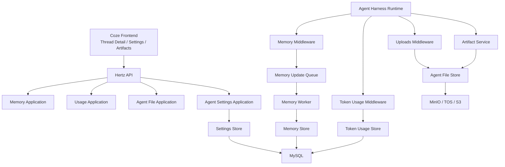
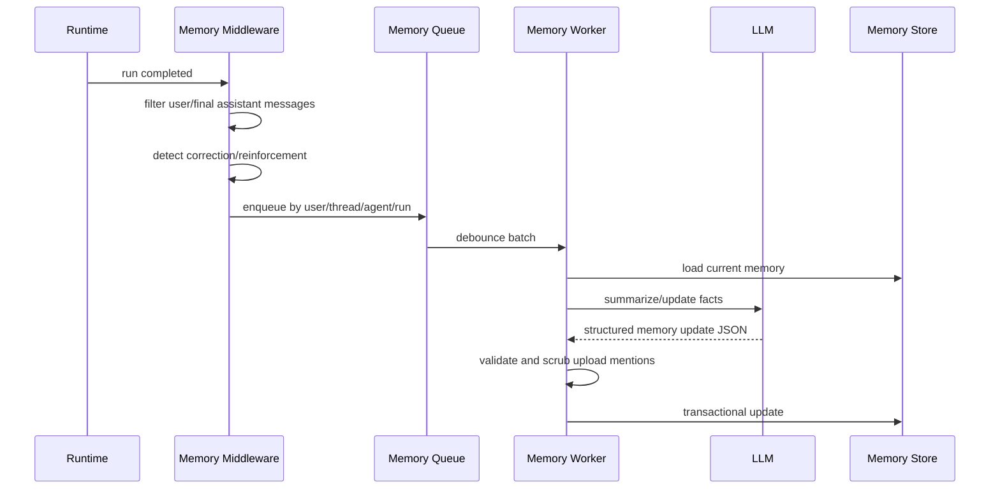

# Memory、Token Usage、Artifacts 与 Agent 设置设计

日期：2026-06-13
状态：已获方向确认，等待用户审阅
目标级别：生产级
依赖文档：

1. `docs/superpowers/specs/2026-06-13-runtime-langgraph-api-design.md`
2. `docs/superpowers/specs/2026-06-13-skills-mcp-security-design.md`

## 背景

前两份 spec 已经确定 Go 原生 Agent Harness 的 runtime/LangGraph API 主干，以及 Skills、MCP、Tools、安全治理方案。本设计覆盖第三条主线：记忆、token 用量、上传、artifact、thread workspace 和 Agent 相关设置页。

这些能力不是展示层附属功能，而是 Agent Harness 的生产基础：

1. Memory 决定 Agent 是否能跨会话保留偏好、事实和纠错。
2. Token usage 决定成本、限额、调试和用户信任。
3. Uploads/artifacts/workspace 决定 Agent 能否可靠处理文件、产出报告和交付物。
4. Settings 决定普通用户和管理员能否安全地开启、关闭、审计和清理这些能力。

## 目标

1. 实现 Deer-flow 风格 Memory：用户上下文、历史摘要、facts、confidence、来源、导入/导出、清空、手工增删改。
2. 在 Go runtime 中实现异步 memory update queue，支持 debounce、批处理、用户隔离和 Agent 隔离。
3. 在 prompt 注入 memory 时执行 token budget 控制，避免记忆挤占主任务上下文。
4. 建立 run/thread/message/tool/subagent 维度的 token usage 归因和展示。
5. 统一 uploads、workspace、outputs、artifacts 的虚拟路径和对象存储模型。
6. 提供安全 artifact 访问 API，防路径穿越、active content inline 执行、symlink 逃逸。
7. 在 Coze 设置中新增 Agent Harness 相关设置页，保留已有账号设置和 API 授权逻辑。
8. 支持生产级清理、配额、审计和多租户隔离。

## 非目标

1. 不替换 Coze 已有项目变量记忆和资源配置能力；本设计新增 Agent Harness 专用 memory 模型，并定义与现有 memory variables 的边界。
2. 不重做 API 授权、账号设置、用户系统。
3. 不把上传文件事件长期写入 memory。
4. 不允许 artifact 访问绕过 thread/run 权限。
5. 不把 token usage 仅保存在前端消息里，后端必须有持久化事实源。

## 本地上下文

Coze Studio 现有能力：

1. `backend/domain/memory/variables` 已有项目变量和用户变量能力，适合保留为 Coze 原有 memory variables，不直接承载 Deer-flow 风格 facts/summaries。
2. `idl/data/variable/kvmemory.thrift` 提供 KV memory get/set/delete，适合做兼容或导入来源。
3. `backend/domain/upload` 已有文件元数据、TOS URI、对象 URL 能力，可以作为 Agent upload/artifact 的底层文件服务。
4. 当前 upload service 不是 thread-scoped workspace 模型，需要新增 Agent 文件域。
5. `idl/conversation/message.thrift` 和 `idl/conversation/run.thrift` 已有 input/output/total token 字段，但粒度不足，不能表达 subagent、middleware、tool、debug attribution。
6. Workflow 已有 TokenUsage 聚合和节点 token 字段，可作为 provider usage 归一化参考。
7. 前端 Coze 当前没有完整 Deer-flow 风格 settings dialog，需要新增 Agent Harness 设置页或接入现有布局。

Deer-flow 参考能力：

1. Memory API 支持 `/api/memory`、facts CRUD、import/export、clear、config、status。
2. Memory schema 包含 `user.workContext`、`user.personalContext`、`user.topOfMind`、`history.recentMonths`、`history.earlierContext`、`history.longTermBackground`、`facts`。
3. Memory update queue 有 debounce，按 thread/user/agent 去重合并。
4. Memory 注入支持 token budget 和 token counting fallback。
5. Uploads 是 thread-scoped，默认限制文件数、单文件大小、总大小。
6. Artifact 访问会强制 active content 下载，避免 HTML/SVG 在应用源下执行。
7. Token usage 既有 header 总量，也有 per-turn 和 debug step attribution。

## 总体架构



核心原则：

1. Memory、token usage、artifacts 都挂在 `space_id/user_id/thread_id/run_id` 上，不能只存在本地文件或前端状态。
2. Uploads 是 thread-scoped 短期上下文，不默认写入长期 memory。
3. Artifacts 是 Agent 交付物，必须可下载、可预览、可审计、可清理。
4. Token usage 的后端聚合是事实源，前端 message usage 只能作为实时显示和 fallback。
5. Settings 默认安全，用户可以关闭 memory injection 和 token 展示，但不能绕过安全策略。

## 模块边界

建议新增模块：

```text
backend/domain/agent/memory/
  entity/
  repository/
  service/
  queue/
  injector/
  updater/

backend/domain/agent/usage/
  entity/
  repository/
  service/
  attribution/

backend/domain/agent/files/
  entity/
  repository/
  service/
  virtualpath/
  artifact/

backend/domain/agent/settings/
  entity/
  repository/
  service/

backend/application/agent_memory/
  memory_app.go
  usage_app.go
  files_app.go
  settings_app.go

backend/api/handler/agent_memory/
  memory.go
  usage.go
  uploads.go
  artifacts.go
  settings.go
```

复用原则：

1. 复用 `domain/upload` 的对象存储和文件 URL 能力，但新增 agent file 元数据表。
2. 复用 workflow/conversation 的 provider usage 解析经验，但新增统一 agent usage 表。
3. 现有 memory variables 保留，用于 Coze 项目变量；Agent memory 通过 adapter 可以读取部分变量，但不反向污染。

## Memory 数据模型

### Memory Scope

Memory 按以下层级隔离：

1. `user_global`：同一用户在同一 space 下的默认长期记忆。
2. `agent_user`：某个 agent 对某个用户的长期记忆。
3. `thread`：当前 thread 的短期摘要和上下文。
4. `system`：平台内置只读上下文，不允许普通用户编辑。

默认注入顺序：

1. system memory
2. agent_user memory
3. user_global memory
4. thread summary
5. current uploaded files summary

### agent_memories

```sql
CREATE TABLE agent_memories (
  id BIGINT PRIMARY KEY,
  space_id BIGINT NOT NULL,
  user_id BIGINT NOT NULL,
  agent_id VARCHAR(128) NOT NULL DEFAULT '',
  thread_id BIGINT NOT NULL DEFAULT 0,
  scope VARCHAR(32) NOT NULL,
  version VARCHAR(32) NOT NULL DEFAULT '1.0',
  user_context JSON NOT NULL,
  history_context JSON NOT NULL,
  enabled BOOLEAN NOT NULL DEFAULT TRUE,
  last_updated_at DATETIME NOT NULL,
  created_at DATETIME NOT NULL,
  updated_at DATETIME NOT NULL,
  UNIQUE KEY uk_memory_scope (space_id, user_id, agent_id, thread_id, scope),
  KEY idx_space_user_updated (space_id, user_id, updated_at)
);
```

Scope key 规则：

1. `user_global`：`agent_id=''`，`thread_id=0`。
2. `agent_user`：`agent_id` 必填，`thread_id=0`。
3. `thread`：`thread_id` 必填，`agent_id` 可为空或当前 agent。
4. `system`：`user_id=0`，`agent_id=''`，`thread_id=0`，只允许平台管理员写入。

`user_context` 结构：

```json
{
  "workContext": {"summary": "", "updatedAt": ""},
  "personalContext": {"summary": "", "updatedAt": ""},
  "topOfMind": {"summary": "", "updatedAt": ""}
}
```

`history_context` 结构：

```json
{
  "recentMonths": {"summary": "", "updatedAt": ""},
  "earlierContext": {"summary": "", "updatedAt": ""},
  "longTermBackground": {"summary": "", "updatedAt": ""}
}
```

### agent_memory_facts

```sql
CREATE TABLE agent_memory_facts (
  id BIGINT PRIMARY KEY,
  memory_id BIGINT NOT NULL,
  space_id BIGINT NOT NULL,
  user_id BIGINT NOT NULL,
  agent_id VARCHAR(128) NOT NULL DEFAULT '',
  fact_key VARCHAR(128) NOT NULL,
  content TEXT NOT NULL,
  category VARCHAR(64) NOT NULL DEFAULT 'context',
  confidence DECIMAL(5,4) NOT NULL DEFAULT 0.5000,
  source_type VARCHAR(32) NOT NULL DEFAULT 'manual',
  source_thread_id BIGINT DEFAULT NULL,
  source_run_id BIGINT DEFAULT NULL,
  source_error TEXT,
  status VARCHAR(32) NOT NULL DEFAULT 'active',
  created_at DATETIME NOT NULL,
  updated_at DATETIME NOT NULL,
  UNIQUE KEY uk_memory_fact_key (memory_id, fact_key),
  KEY idx_memory_status (memory_id, status),
  KEY idx_space_user_category (space_id, user_id, category),
  KEY idx_source_run (source_run_id)
);
```

`fact_key` 由服务端生成，默认使用规范化 content、category 和 scope 的 hash；导入 memory 时不能直接信任外部 fact key，必须重新归一化或做冲突改名。

Fact status：

1. `active`
2. `deleted`
3. `superseded`
4. `blocked`

### agent_memory_update_jobs

```sql
CREATE TABLE agent_memory_update_jobs (
  id BIGINT PRIMARY KEY,
  space_id BIGINT NOT NULL,
  user_id BIGINT NOT NULL,
  agent_id VARCHAR(128) NOT NULL DEFAULT '',
  thread_id BIGINT NOT NULL,
  run_id BIGINT NOT NULL,
  status VARCHAR(32) NOT NULL,
  correction_detected BOOLEAN NOT NULL DEFAULT FALSE,
  reinforcement_detected BOOLEAN NOT NULL DEFAULT FALSE,
  message_snapshot JSON NOT NULL,
  error_message TEXT,
  scheduled_at DATETIME NOT NULL,
  started_at DATETIME DEFAULT NULL,
  ended_at DATETIME DEFAULT NULL,
  created_at DATETIME NOT NULL,
  updated_at DATETIME NOT NULL,
  UNIQUE KEY uk_run_memory_job (run_id),
  KEY idx_status_scheduled (status, scheduled_at),
  KEY idx_space_user (space_id, user_id)
);
```

状态：

1. `queued`
2. `processing`
3. `success`
4. `skipped`
5. `error`
6. `cancelled`

## Memory 更新流程



更新规则：

1. 只处理用户消息和最终 assistant 回复，不把 tool call 原始噪音写入长期记忆。
2. 至少有一个用户消息和一个 assistant 回复才入队。
3. 同一 `(space_id, user_id, agent_id, thread_id)` 在 debounce 窗口内合并为最后一个快照。
4. correction 信号优先于 reinforcement 信号。
5. 模型输出必须是结构化 JSON；解析失败则标记 `error`，不写半成品。
6. 删除 facts 和新增 facts 不能在 malformed update 下部分执行。
7. 上传路径、上传文件名和临时 artifact 链接必须从长期 memory 中 scrub。
8. confidence 必须在 0 到 1 之间，非有限数拒绝。
9. worker 失败不影响原 run 成功状态，但必须可观测。

## Memory 注入

Runtime 在构造 system prompt 时调用：

```go
type MemoryInjector interface {
	BuildContext(ctx context.Context, req MemoryInjectRequest) (*MemoryInjectResult, error)
}

type MemoryInjectRequest struct {
	SpaceID        int64
	UserID         int64
	AgentID        string
	ThreadID       int64
	RunID          int64
	MaxTokens      int
	Counting       string
	IncludeFacts   bool
	IncludeSummary bool
}
```

注入预算：

1. 默认 `max_injection_tokens=2000`。
2. 允许范围 100 到 8000。
3. 首选 provider-aware tokenizer；无法离线使用时回退到 CJK-aware char estimate。
4. 不允许注入阶段因为 tokenizer 网络下载阻塞请求。
5. facts 按 confidence、recency、category priority 排序。
6. thread summary 优先级高于 long-term background。
7. 超预算时先裁剪低 confidence facts，再裁剪 history，再裁剪 user context。

注入事件：

1. `memory.injected`
2. `memory.skipped`
3. `memory.budget_exceeded`
4. `memory.update_queued`
5. `memory.update_failed`

## Memory API

| Method | Path | 说明 |
| --- | --- | --- |
| GET | `/api/agent/memory` | 获取当前用户 memory |
| DELETE | `/api/agent/memory` | 清空当前用户 memory |
| GET | `/api/agent/memory/status` | 获取 memory 配置和数据 |
| GET | `/api/agent/memory/config` | 获取 memory 配置 |
| PATCH | `/api/agent/memory/config` | 更新当前用户 memory 偏好 |
| POST | `/api/agent/memory/facts` | 新建 fact |
| PATCH | `/api/agent/memory/facts/{fact_id}` | 更新 fact |
| DELETE | `/api/agent/memory/facts/{fact_id}` | 删除 fact |
| GET | `/api/agent/memory/export` | 导出 JSON |
| POST | `/api/agent/memory/import` | 导入 JSON |
| GET | `/api/agent/memory/jobs` | 查询异步更新任务 |

Memory response：

```json
{
  "version": "1.0",
  "lastUpdated": "2026-06-13T10:00:00Z",
  "user": {
    "workContext": {"summary": "", "updatedAt": ""},
    "personalContext": {"summary": "", "updatedAt": ""},
    "topOfMind": {"summary": "", "updatedAt": ""}
  },
  "history": {
    "recentMonths": {"summary": "", "updatedAt": ""},
    "earlierContext": {"summary": "", "updatedAt": ""},
    "longTermBackground": {"summary": "", "updatedAt": ""}
  },
  "facts": [
    {
      "id": "739495058900",
      "content": "用户偏好使用 Go 原生 Agent Harness。",
      "category": "preference",
      "confidence": 0.92,
      "createdAt": "2026-06-13T10:00:00Z",
      "source": "thread:739495058641"
    }
  ]
}
```

## Token Usage 模型

第一份 runtime spec 已经定义 `agent_token_usage` 基础表。本设计扩展 attribution 和前端展示。

### agent_token_usage_steps

```sql
CREATE TABLE agent_token_usage_steps (
  id BIGINT PRIMARY KEY,
  run_id BIGINT NOT NULL,
  thread_id BIGINT DEFAULT NULL,
  space_id BIGINT NOT NULL,
  message_id VARCHAR(128) NOT NULL DEFAULT '',
  step_id VARCHAR(128) NOT NULL,
  step_kind VARCHAR(64) NOT NULL,
  label VARCHAR(255) NOT NULL DEFAULT '',
  node_name VARCHAR(128) NOT NULL DEFAULT '',
  tool_call_id VARCHAR(128) NOT NULL DEFAULT '',
  source VARCHAR(64) NOT NULL,
  provider VARCHAR(64) NOT NULL,
  model VARCHAR(128) NOT NULL,
  input_tokens BIGINT NOT NULL DEFAULT 0,
  output_tokens BIGINT NOT NULL DEFAULT 0,
  total_tokens BIGINT NOT NULL DEFAULT 0,
  estimated BOOLEAN NOT NULL DEFAULT FALSE,
  shared_attribution BOOLEAN NOT NULL DEFAULT FALSE,
  raw_usage JSON NOT NULL,
  created_at DATETIME NOT NULL,
  KEY idx_run_step (run_id, step_id),
  KEY idx_thread_created (thread_id, created_at),
  KEY idx_space_created (space_id, created_at)
);
```

Step kind：

1. `thinking`
2. `final_answer`
3. `tool_batch`
4. `tool`
5. `subagent_dispatch`
6. `subagent_result`
7. `todo_update`
8. `search`
9. `clarification`
10. `memory_update`
11. `summary`
12. `title_generation`

Usage source：

1. `lead_agent`
2. `subagent`
3. `middleware`
4. `tool`
5. `memory`
6. `workflow`

### 归因规则

1. 每次 LLM call 记录原始 provider usage。
2. provider 返回 usage 时直接使用。
3. provider 不返回 usage 时使用 tokenizer 估算，`estimated=true`。
4. subagent 内的 usage 必须回写到 dispatch step，同时保留 subagent 明细。
5. 工具内部使用 LLM 时记录为 `tool`，并标记 tool name。
6. memory update 使用模型时记录为 `memory`，不计入用户当前 run 的实时回答 token，但计入后台成本。
7. title generation 和 summarization 记录为 `middleware`。
8. workflow 节点 usage 通过 adapter 转入 agent usage。

### Token API

| Method | Path | 说明 |
| --- | --- | --- |
| GET | `/api/threads/{thread_id}/usage` | thread 聚合 token |
| GET | `/api/threads/{thread_id}/runs/{run_id}/usage` | run token 明细 |
| GET | `/api/usage/summary` | workspace 成本汇总 |
| GET | `/api/usage/debug/{run_id}` | debug step 明细 |

Run usage 响应：

```json
{
  "run_id": "739495058642",
  "input_tokens": 1200,
  "output_tokens": 800,
  "total_tokens": 2000,
  "llm_call_count": 4,
  "lead_agent_tokens": 1200,
  "subagent_tokens": 500,
  "middleware_tokens": 300,
  "steps": [
    {
      "step_id": "step_1",
      "kind": "tool_batch",
      "label": "Search docs",
      "input_tokens": 300,
      "output_tokens": 120,
      "total_tokens": 420
    }
  ]
}
```

## Agent Files、Uploads、Workspace、Artifacts

### 虚拟路径

统一虚拟路径：

```text
/mnt/user-data/uploads
/mnt/user-data/workspace
/mnt/user-data/outputs
/mnt/artifacts
/mnt/skills/public
/mnt/skills/custom
```

路径语义：

1. `uploads`：用户上传文件，thread-scoped，可被当前 thread 的 Agent 读取。
2. `workspace`：Agent 工作目录，可读写，保存中间文件。
3. `outputs`：Agent 认为可展示给用户的产物。
4. `artifacts`：对外下载/预览的稳定引用层。
5. `skills`：只读 skill package。

### agent_files

```sql
CREATE TABLE agent_files (
  id BIGINT PRIMARY KEY,
  space_id BIGINT NOT NULL,
  user_id BIGINT NOT NULL,
  thread_id BIGINT NOT NULL,
  run_id BIGINT DEFAULT NULL,
  file_name VARCHAR(255) NOT NULL,
  original_file_name VARCHAR(255) NOT NULL DEFAULT '',
  file_kind VARCHAR(32) NOT NULL,
  virtual_path VARCHAR(1024) NOT NULL,
  object_uri VARCHAR(1024) NOT NULL,
  content_type VARCHAR(255) NOT NULL DEFAULT '',
  size_bytes BIGINT NOT NULL DEFAULT 0,
  digest VARCHAR(128) NOT NULL DEFAULT '',
  status VARCHAR(32) NOT NULL DEFAULT 'active',
  metadata JSON NOT NULL,
  created_at DATETIME NOT NULL,
  updated_at DATETIME NOT NULL,
  deleted_at DATETIME DEFAULT NULL,
  KEY idx_thread_kind (thread_id, file_kind),
  KEY idx_run_kind (run_id, file_kind),
  KEY idx_space_created (space_id, created_at)
);
```

`file_kind`：

1. `upload`
2. `workspace`
3. `output`
4. `artifact`
5. `converted`

### agent_artifacts

```sql
CREATE TABLE agent_artifacts (
  id BIGINT PRIMARY KEY,
  space_id BIGINT NOT NULL,
  user_id BIGINT NOT NULL,
  thread_id BIGINT NOT NULL,
  run_id BIGINT NOT NULL,
  file_id BIGINT NOT NULL,
  title VARCHAR(255) NOT NULL DEFAULT '',
  artifact_type VARCHAR(64) NOT NULL,
  virtual_path VARCHAR(1024) NOT NULL,
  object_uri VARCHAR(1024) NOT NULL,
  content_type VARCHAR(255) NOT NULL DEFAULT '',
  size_bytes BIGINT NOT NULL DEFAULT 0,
  preview_mode VARCHAR(32) NOT NULL DEFAULT 'download',
  metadata JSON NOT NULL,
  created_at DATETIME NOT NULL,
  updated_at DATETIME NOT NULL,
  KEY idx_thread_created (thread_id, created_at),
  KEY idx_run_created (run_id, created_at)
);
```

`preview_mode`：

1. `text`
2. `image`
3. `pdf`
4. `download`
5. `unsupported`

Active content rule：

1. `text/html` 强制 download。
2. `application/xhtml+xml` 强制 download。
3. `image/svg+xml` 强制 download。
4. 未知二进制默认 download。
5. 文本文件可 inline plain text。
6. 图片可 inline，但必须带正确 content type 和权限校验。
7. preview mode 不能只信任客户端上传的 content type，服务端必须做 MIME sniff 并以更保守结果为准。

## Upload API

| Method | Path | 说明 |
| --- | --- | --- |
| POST | `/api/threads/{thread_id}/uploads` | 上传一个或多个文件 |
| GET | `/api/threads/{thread_id}/uploads` | 列出 thread uploads |
| DELETE | `/api/threads/{thread_id}/uploads/{file_id}` | 删除 upload |
| GET | `/api/threads/{thread_id}/uploads/limits` | 获取上传限制 |

默认限制：

1. 单次最多 10 个文件。
2. 单文件最大 50 MB。
3. 单次总大小最大 100 MB。
4. 文件名 UTF-8 最大 255 bytes。
5. 禁止空文件名、`.`、`..`。
6. 禁止路径分隔符和 Windows backslash。
7. 禁止 macOS `.app` bundle 直接上传。
8. 可转换文档默认不在 host 自动转换；需要管理员开启。

Upload response：

```json
{
  "success": true,
  "files": [
    {
      "id": "739495058920",
      "filename": "analysis.csv",
      "size": 1024,
      "virtual_path": "/mnt/user-data/uploads/analysis.csv",
      "artifact_url": "/api/threads/739495058641/artifacts/mnt/user-data/uploads/analysis.csv",
      "content_type": "text/csv"
    }
  ],
  "skipped_files": []
}
```

## Artifact API

| Method | Path | 说明 |
| --- | --- | --- |
| GET | `/api/threads/{thread_id}/artifacts` | 列出 artifacts |
| GET | `/api/threads/{thread_id}/artifacts/{path}` | 获取 artifact 内容 |
| POST | `/api/threads/{thread_id}/artifacts` | 注册 workspace/output 文件为 artifact |
| DELETE | `/api/threads/{thread_id}/artifacts/{artifact_id}` | 删除 artifact |

访问规则：

1. 必须校验 thread read 权限。
2. 必须解析 virtual path，禁止路径穿越。
3. 不允许直接暴露 object storage presigned URL 给无权限用户。
4. 下载响应使用 RFC 5987 filename 编码。
5. active content 强制 `Content-Disposition: attachment`。
6. `.skill` archive 内部文件预览必须限制单 member 大小，默认 16 MB。
7. Artifact 访问写审计事件。

## Workspace 同步

Runtime 和 sandbox 之间需要同步：

1. run start 时创建 thread workspace。
2. uploads 挂载到 sandbox `/mnt/user-data/uploads`。
3. workspace 挂载到 `/mnt/user-data/workspace`。
4. outputs 挂载到 `/mnt/user-data/outputs`。
5. run completed 时扫描 outputs，注册 artifacts。
6. run cancelled/error 时仍保留已显式 present 的 artifacts。

对象存储策略：

1. 小文件可直接写对象存储。
2. 大文件使用 multipart 或现有 upload flow。
3. workspace 中间文件可按 TTL 清理。
4. artifacts 默认保留更久，跟随 thread 生命周期。

## Settings 设计

在 Coze 设置中新增 Agent Harness 设置，已有账号设置不变，API 授权不变。

建议设置分区：

1. `账号设置`：保留现状。
2. `Agent`：默认模型、运行模式、并发、超时、checkpoint 保留策略。
3. `记忆`：memory enable、injection enable、facts、summaries、import/export、clear。
4. `Token 用量`：显示开关、header/per-turn/debug preset、workspace 用量入口。
5. `文件与产物`：上传限制、artifact 保留、active content 安全策略说明。
6. `技能`：跳转或嵌入 Skills 管理。
7. `工具`：跳转或嵌入 Tools/MCP 管理。
8. `通道`：预留给 IM Channels spec。
9. `关于`：版本和诊断信息。

### agent_settings

```sql
CREATE TABLE agent_settings (
  id BIGINT PRIMARY KEY,
  space_id BIGINT NOT NULL,
  user_id BIGINT NOT NULL,
  agent_id VARCHAR(128) NOT NULL DEFAULT '',
  setting_scope VARCHAR(32) NOT NULL,
  key_name VARCHAR(128) NOT NULL,
  value JSON NOT NULL,
  updated_by BIGINT NOT NULL,
  created_at DATETIME NOT NULL,
  updated_at DATETIME NOT NULL,
  UNIQUE KEY uk_setting (space_id, user_id, agent_id, setting_scope, key_name),
  KEY idx_space_user (space_id, user_id)
);
```

`setting_scope`：

1. `user`
2. `space`
3. `agent`
4. `system`

Settings key 规则：

1. `user`：`user_id` 必填，`agent_id=''`。
2. `space`：`user_id=0`，`agent_id=''`，需要 space admin 权限。
3. `agent`：`agent_id` 必填；`user_id=0` 表示 agent 默认设置，`user_id` 非 0 表示用户个人覆盖。
4. `system`：`space_id=0`，`user_id=0`，`agent_id=''`，只允许平台管理员写入。

默认设置：

```json
{
  "memory.enabled": true,
  "memory.injection_enabled": true,
  "memory.max_injection_tokens": 2000,
  "memory.token_counting": "char",
  "token_usage.enabled": true,
  "token_usage.view": "summary",
  "uploads.max_files": 10,
  "uploads.max_file_size": 52428800,
  "uploads.max_total_size": 104857600,
  "artifacts.retention_days": 90
}
```

## 前端页面

### Memory Settings

功能：

1. memory 总开关。
2. injection 开关。
3. facts 搜索、创建、编辑、删除。
4. summaries 只读展示。
5. confidence 展示。
6. source thread/run 跳转。
7. import/export JSON。
8. clear all 二次确认。
9. memory update jobs 状态。

### Token Usage UI

显示模式：

1. `off`
2. `summary`
3. `per_turn`
4. `debug`

位置：

1. Thread header token indicator。
2. Message footer usage summary。
3. Debug step list。
4. Run detail usage panel。
5. Workspace usage summary。

### Artifacts UI

功能：

1. Thread 右侧 artifact drawer。
2. 文件列表按 run 分组。
3. 文本预览。
4. 图片预览。
5. PDF 预览。
6. active content 下载按钮，不 inline。
7. `.skill` artifact 一键安装入口，接第二份 Skills spec。
8. 下载、复制 virtual path、删除。

### Upload UI

功能：

1. Composer 附件上传。
2. 上传前客户端过滤 `.app` bundle。
3. 展示 max files/max size。
4. 上传成功后展示文件 chip。
5. 支持删除上传文件。
6. 上传文件自动进入当前 thread context。

## 与 Runtime 的集成

Run 创建：

1. 读取 settings。
2. 解析 uploads。
3. 创建 workspace。
4. 构造 memory injection。
5. 初始化 token usage accumulator。

Run 执行中：

1. 记录每次 LLM usage。
2. 工具输出文件写 workspace。
3. `present_files` 或最终输出注册 artifacts。
4. 上传文件通过 virtual path 传给模型。

Run 完成：

1. 聚合 token usage。
2. 写 run usage。
3. 扫描 outputs 并注册 artifacts。
4. 入队 memory update。
5. 更新 thread last activity。

Run 失败或取消：

1. 保留已注册 artifact。
2. 写失败前 usage。
3. memory update 默认不入队，除非已有 final assistant response。
4. workspace 进入 TTL 清理。

## 安全与隐私

Memory：

1. 用户可以清空自己的 memory。
2. 管理员不能默认查看用户 memory 明文，除非有合规开关和审计。
3. 导入 memory 必须 schema 校验。
4. Memory 中不得写入 access token、API key、上传临时路径。
5. Memory 更新模型输出必须结构化校验。

Uploads/artifacts：

1. 路径必须通过 virtual path resolver。
2. 禁止 symlink follow escape。
3. 上传写入不 follow symlink。
4. active content 强制下载。
5. object URI 不直接暴露。
6. artifact 下载需要 thread 权限。
7. 删除操作写审计。

Token usage：

1. raw provider response 不能包含 prompt 全文。
2. debug mode 可展示 step label 和 usage，不展示敏感 prompt。
3. workspace cost summary 按权限展示。

## 错误模型

| code | HTTP | 说明 |
| --- | --- | --- |
| `MEMORY_DISABLED` | 409 | memory 已关闭 |
| `MEMORY_FACT_NOT_FOUND` | 404 | fact 不存在 |
| `MEMORY_IMPORT_INVALID` | 400 | 导入 JSON schema 不合法 |
| `MEMORY_UPDATE_FAILED` | 500 | memory worker 更新失败 |
| `TOKEN_USAGE_UNAVAILABLE` | 404 | usage 不存在 |
| `UPLOAD_TOO_MANY_FILES` | 413 | 文件数量超限 |
| `UPLOAD_FILE_TOO_LARGE` | 413 | 单文件超限 |
| `UPLOAD_TOTAL_TOO_LARGE` | 413 | 总大小超限 |
| `UPLOAD_UNSAFE_FILENAME` | 400 | 文件名不安全 |
| `ARTIFACT_NOT_FOUND` | 404 | artifact 不存在 |
| `ARTIFACT_ACCESS_DENIED` | 403 | 无权限或路径越权 |
| `SETTING_SCOPE_DENIED` | 403 | 无权限修改该 scope |

## 生产配置

```yaml
agent_memory:
  enabled: true
  debounce_seconds: 30
  max_facts: 100
  fact_confidence_threshold: 0.7
  injection_enabled: true
  max_injection_tokens: 2000
  token_counting: char
  worker_concurrency: 4

agent_usage:
  enabled: true
  persist_step_usage: true
  estimate_when_missing: true

agent_files:
  max_files: 10
  max_file_size_bytes: 52428800
  max_total_size_bytes: 104857600
  auto_convert_documents: false
  active_content_download_only: true
  workspace_ttl_days: 7
  artifact_retention_days: 90
```

## 测试策略

### Memory 测试

1. memory schema import/export。
2. facts create/update/delete。
3. confidence 校验。
4. per-user isolation。
5. per-agent isolation。
6. debounce 合并同 thread 更新。
7. correction/reinforcement 检测。
8. malformed model JSON 不写入。
9. upload mention scrub。
10. token budget 裁剪。
11. char fallback 不联网。

### Token Usage 测试

1. provider usage 直写。
2. missing usage 估算。
3. lead agent/subagent/middleware/tool 归因。
4. subagent usage 回写 dispatch step。
5. run 聚合。
6. thread 聚合。
7. debug step 输出。
8. sensitive prompt 不进入 raw usage。

### Upload/Artifact 测试

1. 文件数量限制。
2. 单文件大小限制。
3. 总大小限制。
4. unsafe filename 拒绝。
5. backslash 路径拒绝。
6. symlink destination 拒绝。
7. path traversal 拒绝。
8. active content attachment。
9. `.skill` archive member preview size 限制。
10. artifact 权限校验。
11. outputs 自动注册 artifact。

### Settings 测试

1. user setting 读写。
2. space setting 需要管理员。
3. 默认值 merge。
4. 禁用 memory injection 后 runtime 不注入。
5. token usage view preset 持久化。
6. settings 不影响 API 授权。

### 前端测试

1. Memory settings facts 搜索和编辑。
2. import JSON schema 校验。
3. clear all 二次确认。
4. token usage header/per-turn/debug 切换。
5. upload chip 展示和删除。
6. artifact drawer 预览和下载。
7. active content 只展示下载入口。

## 分阶段交付

### Phase 1：Memory 数据模型和 API

交付：

1. `agent_memories`、`agent_memory_facts`、`agent_memory_update_jobs`。
2. Memory CRUD API。
3. import/export/clear。
4. settings 中 memory 基础开关。

验收：

1. 用户可管理自己的 facts。
2. Memory 数据按 space/user/agent 隔离。

### Phase 2：Memory Runtime 集成

交付：

1. Memory injector。
2. token budget。
3. memory update queue。
4. memory worker。
5. upload mention scrub。

验收：

1. Run 前能注入 memory。
2. Run 后能异步更新 memory。
3. 上传路径不会进入长期 memory。

### Phase 3：Token Usage

交付：

1. step usage 表。
2. usage collector。
3. provider adapter。
4. subagent attribution。
5. usage API。
6. 前端 token indicator。

验收：

1. run/thread usage 可查。
2. per-turn/debug 展示可用。

### Phase 4：Uploads、Workspace、Artifacts

交付：

1. agent file 表。
2. upload API。
3. virtual path resolver。
4. artifact API。
5. outputs auto register。
6. artifact drawer。

验收：

1. 上传文件能被 Agent 使用。
2. Agent 产物能安全预览/下载。
3. active content 不会 inline 执行。

### Phase 5：Settings 和生产硬化

交付：

1. Agent settings 表。
2. settings UI。
3. cleanup jobs。
4. quota enforcement。
5. audit events。

验收：

1. 用户和管理员能管理相关开关。
2. TTL 清理和配额生效。
3. 关键操作可审计。

## 上线门禁

生产上线前必须满足：

1. Memory 按 user/space/agent 隔离。
2. 用户可导出和清空自己的 memory。
3. Memory injection 有 token budget。
4. Memory updater 不保存上传文件临时路径。
5. Token usage 后端持久化，不只依赖前端消息。
6. Subagent token 能归因到 dispatch step。
7. Upload 防路径穿越和 symlink。
8. Active content artifact 强制 attachment。
9. Artifact API 校验 thread 权限。
10. Object URI 不对无权限用户明文暴露。
11. Workspace/output 有 TTL 清理。
12. Settings 不改变 API 授权体系。

## 风险与缓解

| 风险 | 影响 | 缓解 |
| --- | --- | --- |
| Memory 写入错误事实 | Agent 长期偏离用户真实意图 | confidence、来源、手工删除、纠错信号、审计 |
| 上传事件污染长期 memory | 未来会话引用不存在文件 | upload mention scrub，uploads 只做 thread-scoped context |
| Token usage 不完整 | 成本和调试不可信 | provider adapter + estimated 标记 + raw usage |
| Artifact active content 执行 | XSS 或源污染 | HTML/XHTML/SVG 强制 attachment |
| 文件路径逃逸 | 读取或覆盖宿主文件 | virtual path resolver、no symlink follow、path traversal check |
| 设置过多导致用户困惑 | 使用成本高 | 普通用户显示少量开关，高级配置折叠到管理员区 |

## 设计结论

Memory、Token Usage、Artifacts 和 Settings 必须作为 Agent Harness 的一等平台能力设计。Coze 现有 memory variables 和 upload service 可以复用，但不能直接承担 Deer-flow 风格长期记忆、thread workspace 和 artifact 安全访问的全部职责。

本设计建议新增 Agent 专用 memory、usage、files、settings 域，同时通过 adapter 复用已有 Coze 存储、对象存储、workflow usage 和权限体系。这样可以在不破坏现有功能的前提下，实现 Deer-flow 级别的记忆、用量和文件产物体验。
