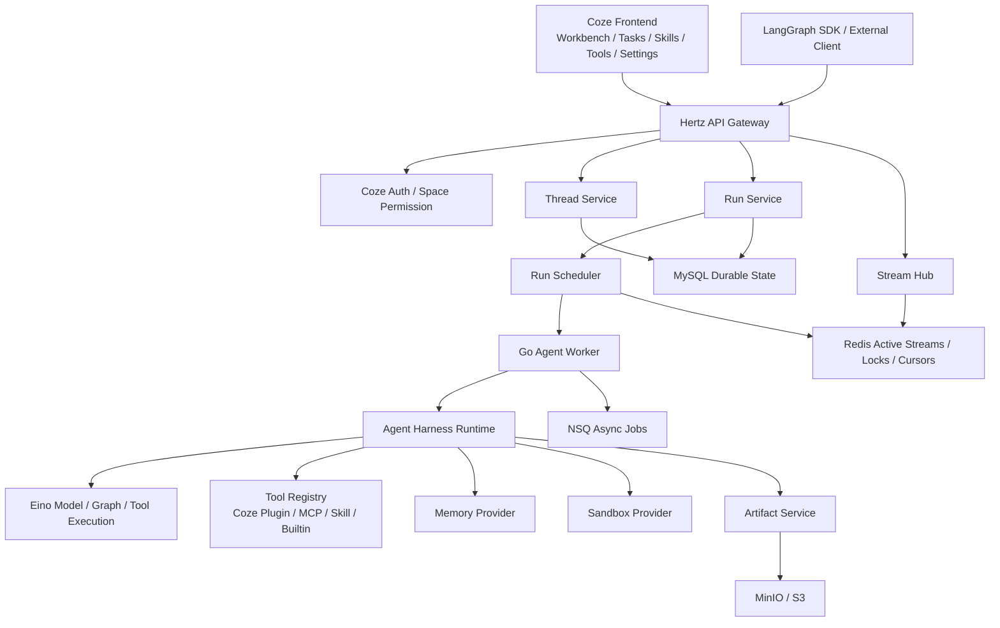
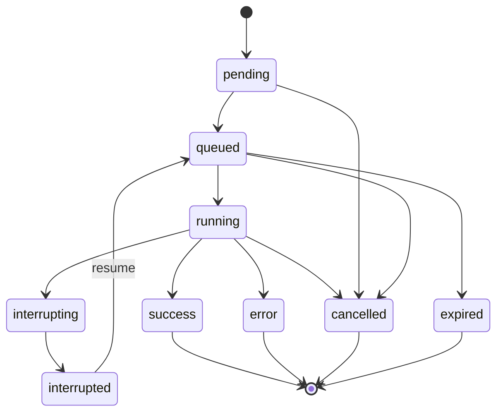

# Go 原生 Agent Harness 与 LangGraph 兼容 API 设计

日期：2026-06-13
状态：已获方向确认，等待用户审阅
目标级别：生产级

## 背景

当前 Coze Studio 已有 Workbench、任务、技能、资源、开发配置、任务触发器等页面和部分 Go 后端能力，但任务执行模型仍偏向 `chat_tasks` 的轻量任务记录。Deer-flow 的核心能力并不是单一页面，而是一套 Agent Harness：线程、运行、流式事件、checkpoint、技能、MCP、记忆、文件、artifact、token usage、sub-agent、sandbox、安全扫描和多入口 API。

本设计只覆盖第一份主干 spec：Go 原生 Agent Harness runtime 与 LangGraph 兼容 API。它是后续 Skills/MCP/Security 和 Memory/Token/Artifacts/Settings 两份实施 spec 的依赖层。IM Channels 已于 2026-06-18 明确排除。

用户已确认采用以下方向：

1. 最终目标是 Go 原生 Agent Harness。
2. 短期不做 Python sidecar 过渡验证。
3. 目标按生产级设计，不按 MVP 缩小关键边界。
4. Deer-flow 作为产品能力和协议行为参考，不直接作为 Python runtime 嵌入。

## 目标

1. 在 Coze Studio 后端新增 Go 原生 Agent Harness 平台层。
2. 用 `thread/run` 作为新事实源，逐步替代 `chat_tasks` 的核心执行语义。
3. 暴露 LangGraph Platform 风格的兼容 API，支持第三方 LangGraph SDK 和前端运行视图接入。
4. 保留 Coze 现有 API 授权方式，不重做 API 授权体系。
5. 保留资源配置、开发配置既有能力，本设计只定义它们如何被 runtime 消费。
6. 支持生产级 run 生命周期：排队、执行、取消、失败、超时、重连、join、checkpoint、resume、事件追踪。
7. 支持生产级分布式部署：多后端实例、多 run worker、Redis 协调、MySQL 持久化、SSE 重连。
8. 支持后续 Skills、MCP、Memory、Files、Artifacts 无缝接入。
9. 为 token usage、observability、审计、安全扫描预留一等模型。

## 非目标

1. 本 spec 不实现 Skills/MCP 的完整配置页面和安全扫描规则细节；它只定义 runtime 接口和集成点。
2. 本 spec 不实现 IM Channels，且 IM Channels 不属于项目交付范围。
3. 本 spec 不重做 Coze API 授权、账号设置、workspace 权限模型。
4. 本 spec 不把 Deer-flow Python 代码直接复制进 Go 服务。
5. 本 spec 不要求一次性迁移所有旧 `chat_tasks` 数据。
6. 本 spec 不改变资源配置、开发配置页面的信息架构。

## 参考实现与本地上下文

Deer-flow 参考能力：

1. FastAPI Gateway 对外提供 thread/run、skills、MCP、memory、artifacts、uploads、feedback 等 API。
2. LangGraph-compatible run/thread API 承担会话和执行协议。
3. Runtime 中存在 middleware、thread state、sandbox、skills、memory、tool calling、token attribution、sub-agent。
4. Skills 采用 `SKILL.md` + frontmatter + 文件包结构，支持 public/custom 安装。
5. MCP 配置支持 stdio、SSE、HTTP、OAuth、secret masking。

Coze Studio 现状：

1. 后端使用 Hertz、GORM、MySQL、Redis、NSQ、MinIO、Eino。
2. Workbench 请求已经有 `enable_skills`、`enable_mcp`、`enable_kbs`、`enable_databases` 等资源选择字段。
3. 当前 `chat_tasks` 能记录任务和事件，但不具备 thread/run/checkpoint/token/subagent/artifact 等完整运行时语义。
4. 当前 task-trigger 页面是占位，适合后续改成工具配置入口。
5. 当前技能配置是 Coze 自有 `Script/Workflow` 声明模型，和 Deer-flow skill 包模型需要统一抽象。

## 总体架构



### 核心原则

1. `agent_threads` 和 `agent_runs` 是新运行时事实源。
2. `chat_tasks` 只作为旧菜单兼容投影，不再承载完整 Agent runtime 语义。
3. 所有 UI、SDK 和内部入口最终都走同一套 thread/run 服务。
4. SSE 事件必须可持久化、可恢复、可重放。
5. run 执行状态不能只存在内存中；多实例部署时必须可恢复。
6. Go runtime 自己实现 LangGraph wire protocol 兼容，不尝试移植 LangGraph Python 内部。

## 技术栈选择

| 层 | 选择 | 理由 |
| --- | --- | --- |
| HTTP Gateway | CloudWeGo Hertz | 仓库既有框架，减少迁移成本 |
| SSE | hertz-contrib/sse + 自研 Stream Hub | 仓库已有依赖，需要补可恢复事件模型 |
| Agent Runtime | Eino ADK + Coze Runtime Adapter | Eino ADK 负责 Agent 执行算法；Coze 负责 thread/run、权限、持久化和 LangGraph 协议 |
| 持久化 | MySQL + GORM/gen | 仓库既有 DAL 模式，适合 thread/run/checkpoint/event |
| 活跃状态 | Redis | run lock、cursor、cancel signal、worker lease |
| 异步任务 | NSQ | artifact 后处理、清理任务、低优先级后台任务 |
| 文件和产物 | MinIO/S3 | 上传、workspace、artifact、导出报告 |
| MCP Runtime | Eino-ext MCP Tool Adapter + Coze Client Layer | Eino 负责 Agent tool 适配；Coze 负责 transport、OAuth、secret、session、sandbox 和治理 |
| Observability | OpenTelemetry + 本地审计表 | tracing、metrics、token usage、事件审计 |

## 模块边界

建议新增后端模块：

```text
backend/domain/agent/harness/
  entity/
  repository/
  service/
  runtime/
  scheduler/
  stream/
  langgraph/
  tokenusage/
  checkpoint/

backend/application/agent_harness/
  api_adapter.go
  thread_app.go
  run_app.go
  stream_app.go

backend/api/handler/agent_harness/
  threads.go
  runs.go
  state.go
  stream.go
```

模块职责：

1. `domain/agent/harness/entity`：Thread、Run、RunEvent、Checkpoint、State、Command、Usage、ArtifactRef。
2. `repository`：MySQL/Redis/MinIO 访问接口，不暴露 GORM 模型给 runtime。
3. `service`：thread/run 状态机、权限校验后的业务方法。
4. `runtime`：Eino ADK Adapter、事件/Checkpoint/取消转换和 Coze-owned middleware；不重复实现 Eino 已有 Agent loop。
5. `scheduler`：run 排队、worker lease、取消、超时、重试。
6. `stream`：SSE event hub、cursor、replay、client disconnect 策略。
7. `langgraph`：LangGraph API JSON schema、stream event mapping、兼容测试辅助。
8. `tokenusage`：provider usage 归一化、归因、持久化。
9. `checkpoint`：state snapshot、resume command、history 查询。

## 数据模型

### agent_threads

```sql
CREATE TABLE agent_threads (
  id BIGINT PRIMARY KEY,
  space_id BIGINT NOT NULL,
  creator_id BIGINT NOT NULL,
  title VARCHAR(255) NOT NULL DEFAULT '',
  status VARCHAR(32) NOT NULL DEFAULT 'active',
  source VARCHAR(32) NOT NULL DEFAULT 'web',
  metadata JSON NOT NULL,
  values_snapshot JSON NOT NULL,
  current_checkpoint_id BIGINT DEFAULT NULL,
  last_run_id BIGINT DEFAULT NULL,
  created_at DATETIME NOT NULL,
  updated_at DATETIME NOT NULL,
  deleted_at DATETIME DEFAULT NULL,
  KEY idx_space_updated (space_id, updated_at),
  KEY idx_creator_updated (creator_id, updated_at),
  KEY idx_status_updated (status, updated_at)
);
```

字段说明：

1. `metadata` 保存 LangGraph thread metadata、workspace/source 信息。
2. `values_snapshot` 保存最新可查询 state，避免每次从 event log 回放。
3. `current_checkpoint_id` 指向最近 checkpoint。
4. `source` 支持 `web`、`api`、`im`、`system`。

### agent_runs

```sql
CREATE TABLE agent_runs (
  id BIGINT PRIMARY KEY,
  thread_id BIGINT DEFAULT NULL,
  space_id BIGINT NOT NULL,
  creator_id BIGINT NOT NULL,
  assistant_id VARCHAR(128) NOT NULL DEFAULT 'default',
  status VARCHAR(32) NOT NULL,
  command JSON NOT NULL,
  input JSON NOT NULL,
  config JSON NOT NULL,
  context JSON NOT NULL,
  metadata JSON NOT NULL,
  stream_mode JSON NOT NULL,
  multitask_strategy VARCHAR(32) NOT NULL DEFAULT 'enqueue',
  on_disconnect VARCHAR(32) NOT NULL DEFAULT 'continue',
  durability VARCHAR(32) NOT NULL DEFAULT 'async',
  idempotency_key VARCHAR(128) DEFAULT NULL,
  worker_id VARCHAR(128) NOT NULL DEFAULT '',
  error_code VARCHAR(128) NOT NULL DEFAULT '',
  error_message TEXT,
  started_at DATETIME DEFAULT NULL,
  ended_at DATETIME DEFAULT NULL,
  created_at DATETIME NOT NULL,
  updated_at DATETIME NOT NULL,
  KEY idx_thread_created (thread_id, created_at),
  KEY idx_space_status (space_id, status),
  UNIQUE KEY uk_space_idempotency (space_id, idempotency_key)
);
```

Run status：

1. `pending`：已创建，等待调度。
2. `queued`：已进入队列，等待 worker。
3. `running`：worker 已获得 lease 并开始执行。
4. `interrupting`：收到 interrupt/cancel，正在停止工具或模型流。
5. `interrupted`：被中断，可通过 command resume。
6. `success`：运行完成。
7. `error`：运行失败。
8. `cancelled`：用户取消。
9. `expired`：排队或运行超时。

`idempotency_key` 为 `NULL` 表示客户端未提供幂等键，不参与去重；客户端提供幂等键时，同一 `space_id` 下重复请求必须返回同一个 run。

### agent_run_events

```sql
CREATE TABLE agent_run_events (
  id BIGINT PRIMARY KEY,
  run_id BIGINT NOT NULL,
  thread_id BIGINT DEFAULT NULL,
  space_id BIGINT NOT NULL,
  seq BIGINT NOT NULL,
  event_type VARCHAR(64) NOT NULL,
  stream_event VARCHAR(64) NOT NULL,
  payload JSON NOT NULL,
  visibility VARCHAR(32) NOT NULL DEFAULT 'user',
  created_at DATETIME NOT NULL,
  UNIQUE KEY uk_run_seq (run_id, seq),
  KEY idx_thread_seq (thread_id, seq),
  KEY idx_run_event_type (run_id, event_type)
);
```

事件要求：

1. `seq` 对单个 run 单调递增。
2. 所有 SSE 对外事件必须先写入或同步写入事件表。
3. `visibility=internal` 的事件只给调试和审计，不直接展示给普通用户。

### agent_checkpoints

```sql
CREATE TABLE agent_checkpoints (
  id BIGINT PRIMARY KEY,
  thread_id BIGINT NOT NULL,
  run_id BIGINT NOT NULL,
  parent_checkpoint_id BIGINT DEFAULT NULL,
  checkpoint_ns VARCHAR(128) NOT NULL DEFAULT '',
  channel_values JSON NOT NULL,
  channel_versions JSON NOT NULL,
  pending_sends JSON NOT NULL,
  metadata JSON NOT NULL,
  created_at DATETIME NOT NULL,
  KEY idx_thread_created (thread_id, created_at),
  KEY idx_run_created (run_id, created_at)
);
```

Checkpoint 用于：

1. `GET /threads/{thread_id}/state`。
2. `GET /threads/{thread_id}/history`。
3. run resume。
4. 调试和回放。

### agent_token_usage

```sql
CREATE TABLE agent_token_usage (
  id BIGINT PRIMARY KEY,
  run_id BIGINT NOT NULL,
  thread_id BIGINT DEFAULT NULL,
  space_id BIGINT NOT NULL,
  source VARCHAR(64) NOT NULL,
  provider VARCHAR(64) NOT NULL,
  model VARCHAR(128) NOT NULL,
  node_name VARCHAR(128) NOT NULL DEFAULT '',
  input_tokens BIGINT NOT NULL DEFAULT 0,
  output_tokens BIGINT NOT NULL DEFAULT 0,
  total_tokens BIGINT NOT NULL DEFAULT 0,
  raw_usage JSON NOT NULL,
  created_at DATETIME NOT NULL,
  KEY idx_run_source (run_id, source),
  KEY idx_space_created (space_id, created_at)
);
```

`source` 取值：

1. `lead_agent`
2. `subagent`
3. `middleware`
4. `tool`
5. `memory`
6. `summary`

### agent_task_projection

为了兼容现有菜单，新增投影表或直接扩展现有 `chat_tasks` 由 application 层同步。建议第一阶段不新建表，先通过 application service 在 run 创建和完成时写 `chat_tasks`：

1. `新建任务` 创建 thread + run + chat_task projection。
2. `全部任务` 查询 projection 或 thread 列表。
3. `我的任务` 查询当前用户 thread 最近更新时间。
4. `任务详情` 使用 thread/run 详情，旧 task detail 仅保留兼容入口。

## LangGraph 兼容 API

API 路由建议放在 `/api/agent` 下，同时保留 LangGraph 风格路径别名。前端和第三方 SDK 默认使用 LangGraph 风格别名。

### Thread API

| Method | Path | 说明 |
| --- | --- | --- |
| POST | `/api/threads` | 创建 thread |
| GET | `/api/threads/{thread_id}` | 获取 thread |
| POST | `/api/threads/search` | 搜索 thread |
| PATCH | `/api/threads/{thread_id}` | 更新 metadata/title |
| DELETE | `/api/threads/{thread_id}` | 软删除 thread |
| GET | `/api/threads/{thread_id}/state` | 获取最新 state |
| GET | `/api/threads/{thread_id}/history` | 获取 checkpoint 历史 |

`POST /api/threads` 请求：

```json
{
  "thread_id": "optional-client-id",
  "metadata": {
    "source": "web",
    "space_id": "123"
  },
  "if_exists": "raise"
}
```

`Thread` 响应：

```json
{
  "thread_id": "739495058641",
  "created_at": "2026-06-13T10:00:00Z",
  "updated_at": "2026-06-13T10:00:00Z",
  "metadata": {
    "source": "web"
  },
  "status": "active",
  "values": {
    "messages": []
  }
}
```

### Thread Run API

| Method | Path | 说明 |
| --- | --- | --- |
| POST | `/api/threads/{thread_id}/runs` | 创建 thread-bound run |
| POST | `/api/threads/{thread_id}/runs/stream` | 创建 run 并流式返回 |
| GET | `/api/threads/{thread_id}/runs` | 获取 thread runs |
| GET | `/api/threads/{thread_id}/runs/{run_id}` | 获取 run |
| POST | `/api/threads/{thread_id}/runs/{run_id}/join` | 等待完成 |
| GET | `/api/threads/{thread_id}/runs/{run_id}/join` | SSE join stream |
| POST | `/api/threads/{thread_id}/runs/{run_id}/cancel` | 取消 run |

`RunCreateRequest`：

```json
{
  "assistant_id": "default",
  "input": {
    "messages": [
      {
        "role": "user",
        "content": "帮我分析这个需求"
      }
    ]
  },
  "command": null,
  "metadata": {
    "source": "web"
  },
  "config": {
    "configurable": {
      "model_type": "builtin",
      "model_name": "gpt-4.1"
    }
  },
  "context": {
    "enable_skills": [],
    "enable_mcp": [],
    "enable_kbs": [],
    "enable_databases": []
  },
  "stream_mode": ["messages", "updates"],
  "on_disconnect": "continue",
  "multitask_strategy": "enqueue",
  "durability": "async"
}
```

`Run` 响应：

```json
{
  "run_id": "739495058642",
  "thread_id": "739495058641",
  "assistant_id": "default",
  "status": "pending",
  "created_at": "2026-06-13T10:00:00Z",
  "updated_at": "2026-06-13T10:00:00Z",
  "metadata": {
    "source": "web"
  },
  "usage": {
    "input_tokens": 0,
    "output_tokens": 0,
    "total_tokens": 0,
    "llm_call_count": 0,
    "lead_agent_tokens": 0,
    "subagent_tokens": 0,
    "middleware_tokens": 0
  }
}
```

### Stateless Run API

| Method | Path | 说明 |
| --- | --- | --- |
| POST | `/api/runs` | 创建不绑定 thread 的 run |
| POST | `/api/runs/stream` | 创建 stateless run 并流式返回 |
| GET | `/api/runs/{run_id}` | 获取 run |
| POST | `/api/runs/{run_id}/join` | 等待 run 完成 |
| POST | `/api/runs/{run_id}/cancel` | 取消 run |

Stateless run 用于外部 API 和一次性执行。生产默认仍建议绑定 thread，便于恢复、审计和记忆。

## SSE 协议

SSE 响应统一使用：

```http
Content-Type: text/event-stream
Cache-Control: no-cache
X-Accel-Buffering: no
```

事件格式：

```text
event: messages
id: 42
data: {"chunk":{"content":"你好"},"metadata":{"run_id":"1","node":"agent"}}

event: updates
id: 43
data: {"agent":{"messages":[{"role":"assistant","content":"你好"}]}}
```

必须支持的 stream event：

| event | 来源 | 用途 |
| --- | --- | --- |
| `metadata` | run created | 返回 run_id、thread_id、attempt、server_time |
| `values` | checkpoint/state | 完整 state 快照 |
| `updates` | node update | 节点增量状态 |
| `messages` | LLM stream | token/chunk 流 |
| `events` | internal event | 工具、middleware、subagent、artifact |
| `debug` | debug mode | 开发调试信息 |
| `error` | runtime failure | 错误 |
| `end` | terminal | 结束标记 |

事件持久化策略：

1. `metadata`、`updates`、`events`、`error`、`end` 必须持久化。
2. `messages` token chunk 可以按批聚合持久化，默认每 500ms 或 1KB 写一次，降低数据库写压力。
3. replay 时必须按 `agent_run_events.seq` 恢复顺序。
4. `Last-Event-ID` 被传入时，从下一个 seq 开始回放。
5. 断线策略为 `on_disconnect=continue` 时 run 不受客户端断开影响。
6. 断线策略为 `on_disconnect=cancel` 时 Stream Hub 发 cancel signal，worker 在安全点停止。

## Run 状态机



状态转移规则：

1. 只有 `pending` 和 `queued` 可以直接取消。
2. `running` 取消先进入 `interrupting`，worker 清理工具和模型流后进入 `cancelled`。
3. 需要用户确认、工具授权、clarification 时进入 `interrupted`。
4. `interrupted` 只能通过 `command.resume` 或 `command.update` 回到 `queued`。
5. `success/error/cancelled/expired` 是终态。
6. worker 心跳超时后，scheduler 将 `running` 标记为 `expired` 或重新排队，取决于 run 是否可重入。

## 多任务策略

同一 thread 同时创建多个 run 时支持：

1. `reject`：有 active run 时拒绝新 run，返回 409。
2. `enqueue`：新 run 进入队列，前一个 run 终态后执行。生产默认使用此策略。
3. `interrupt`：中断当前 run，新 run 排到队首。
4. `rollback`：回滚到当前 run 前 checkpoint，再执行新 run。第一阶段实现为受控策略，只允许内部 API 使用。

生产默认：

```json
{
  "multitask_strategy": "enqueue",
  "on_disconnect": "continue",
  "durability": "async"
}
```

## Checkpoint 与 State

Thread state 采用接近 LangGraph 的通道模型：

```json
{
  "values": {
    "messages": [],
    "artifacts": {},
    "todos": [],
    "memory": {},
    "tool_results": {}
  },
  "next": [],
  "config": {
    "configurable": {
      "thread_id": "739495058641",
      "checkpoint_id": "739495058650"
    }
  },
  "metadata": {
    "run_id": "739495058642",
    "source": "web"
  },
  "created_at": "2026-06-13T10:00:00Z"
}
```

Checkpoint 写入时机：

1. run 开始前写 initial checkpoint。
2. 每个重要 node 完成后写 checkpoint。
3. 工具执行前后写 checkpoint。
4. interrupt 前写 checkpoint。
5. run 成功、失败、取消时写 terminal checkpoint。

State 快照策略：

1. `agent_threads.values_snapshot` 保存最新 state 的轻量副本。
2. 完整 checkpoint 保存在 `agent_checkpoints`。
3. 大型 artifacts 不直接塞进 state，只保存 `artifact_id` 和 metadata。

## Harness Runtime

Runtime 输入：

```go
type RunRequest struct {
	RunID     int64
	ThreadID  *int64
	SpaceID   int64
	UserID    int64
	Input     map[string]any
	Command   *RunCommand
	Config    RunConfig
	Context   RunContext
	Metadata  map[string]any
	Stream    EventSink
}
```

Runtime 输出通过 `EventSink` 持续写事件，不返回大对象：

```go
type EventSink interface {
	Emit(ctx context.Context, event RunEvent) error
	Checkpoint(ctx context.Context, checkpoint Checkpoint) error
	Usage(ctx context.Context, usage TokenUsage) error
	IsCancelled(ctx context.Context) bool
}
```

Runtime pipeline：

1. 加载 thread state。
2. 合并 input 或 command。
3. 加载模型配置。
4. 加载 memory context。
5. 加载工具集合：Coze plugin、MCP、skill、builtin。
6. 执行 lead agent。
7. 按需 dispatch sub-agent。
8. 执行工具调用。
9. 写 token usage。
10. 生成 final answer。
11. 写 final checkpoint。

## Eino 集成边界

Eino 作为执行内核，不承担 LangGraph API 兼容层。边界如下：

1. Eino model adapter 负责实际 LLM 调用。
2. Eino tool/graph 负责节点编排和工具执行。
3. Harness runtime 负责 run 状态机、checkpoint、stream event、token 归因。
4. LangGraph API adapter 负责 JSON 协议和 SSE 事件格式。

这样避免把 LangGraph API 语义硬塞进 Eino，也避免把业务状态散落到 Eino graph 内部。

## Tool Registry 接口

Tool Registry 只定义抽象，具体 Skills/MCP 安全策略在后续 spec 展开。

```go
type ToolRegistry interface {
	ResolveTools(ctx context.Context, req ToolResolveRequest) ([]ResolvedTool, error)
}

type ToolResolveRequest struct {
	SpaceID         int64
	UserID          int64
	ThreadID        *int64
	EnableSkills    []string
	EnableMCP       []string
	EnableKBs       []string
	EnableDatabases []string
	AllowedScopes   []string
}
```

工具来源：

1. `builtin`：文件、artifact、todo、view image、clarification、summary。
2. `coze_plugin`：现有 Coze plugin/openapi。
3. `workflow`：现有 workflow 作为工具。
4. `skill`：Deer-flow 风格 skill 包。
5. `mcp`：MCP server 暴露工具。
6. `knowledge`：KB 检索工具。
7. `database`：数据库查询工具。

## 权限和安全边界

本 spec 的安全边界：

1. 所有 thread/run API 必须校验 `space_id` 和用户权限。
2. 外部 API 不允许绕过 Coze 现有授权。
3. tool resolve 必须基于用户、空间、资源白名单。
4. run context 中传入的 `enable_*` 是候选范围，不是授权本身。
5. stdio MCP、shell、文件写入、网络访问必须经过后续 security scanner 和 sandbox provider。
6. 任何工具调用前必须产生 `tool_call.requested` 内部事件。
7. 高风险工具需要进入 `interrupted`，等待用户确认或策略授权。

## 错误模型

统一错误响应：

```json
{
  "error": {
    "code": "RUN_NOT_FOUND",
    "message": "run not found",
    "details": {
      "run_id": "739495058642"
    }
  }
}
```

错误码分类：

| code | HTTP | 说明 |
| --- | --- | --- |
| `THREAD_NOT_FOUND` | 404 | thread 不存在或无权限 |
| `RUN_NOT_FOUND` | 404 | run 不存在或无权限 |
| `ACTIVE_RUN_EXISTS` | 409 | multitask_strategy=reject |
| `RUN_TERMINAL` | 409 | 对终态 run 执行非法操作 |
| `INVALID_COMMAND` | 400 | resume/update command 非法 |
| `CHECKPOINT_NOT_FOUND` | 404 | checkpoint 不存在 |
| `TOOL_PERMISSION_DENIED` | 403 | 工具权限不足 |
| `SECURITY_POLICY_BLOCKED` | 403 | 安全策略拦截 |
| `MODEL_PROVIDER_ERROR` | 502 | 模型供应商失败 |
| `RUN_TIMEOUT` | 504 | run 超时 |

## Token Usage

Token usage 必须同时支持：

1. run 级总量。
2. lead agent 总量。
3. subagent 总量。
4. middleware 总量。
5. 单次 LLM call 明细。
6. provider raw usage 存档。

归因规则：

1. 主 agent 模型调用记为 `lead_agent`。
2. sub-agent 模型调用记为 `subagent`，并记录 `node_name`。
3. summary、title、memory extraction 记为 `middleware`。
4. 工具内部使用 LLM 时记为 `tool`，并记录工具名。
5. provider 未返回 usage 时，使用 tokenizer 估算并在 `raw_usage.estimated=true` 标记。

Run 响应中聚合：

```json
{
  "usage": {
    "input_tokens": 1200,
    "output_tokens": 800,
    "total_tokens": 2000,
    "llm_call_count": 4,
    "lead_agent_tokens": 1200,
    "subagent_tokens": 500,
    "middleware_tokens": 300
  }
}
```

## Observability

必须提供三层可观测性：

1. 用户层：任务详情页展示执行步骤、工具调用、artifact、最终回答、token usage。
2. 运维层：metrics 和 tracing 展示 run latency、active runs、queue depth、error rate、provider latency。
3. 审计层：内部事件表记录高风险工具、权限拒绝、安全拦截和 API/内部来源。

关键 metrics：

1. `agent_run_created_total`
2. `agent_run_active`
3. `agent_run_duration_seconds`
4. `agent_run_queue_depth`
5. `agent_run_error_total`
6. `agent_sse_connections`
7. `agent_sse_replay_total`
8. `agent_tool_call_total`
9. `agent_token_total`
10. `agent_provider_latency_seconds`

## 前端集成

菜单映射：

1. `新建任务`：创建 thread + run，进入对话/执行页。
2. `全部任务`：thread 列表，展示所有可见对话。
3. `我的任务`：当前用户最近 thread。
4. `任务详情`：thread 详情 + run timeline + messages + artifacts + token usage。
5. `技能配置`：后续接 Skills spec。
6. `任务触发器`：改为工具配置，后续接 MCP/Tools spec。
7. `设置`：新增 Agent Harness 设置，后续接 settings spec。

前端新增能力：

1. thread list：搜索、筛选、最近更新时间、run 状态。
2. thread detail：messages、execution timeline、tool calls、artifacts、usage。
3. stream client：支持 SSE reconnect、Last-Event-ID、join existing run。
4. run controls：stop、resume、retry、copy trace、download artifacts。
5. SDK compatibility dev page：用于内部测试 LangGraph stream modes。

## 兼容现有 Workbench

第一阶段的兼容策略：

1. `sendWorkbenchChat` 后端内部改为创建 thread/run。
2. 返回仍带 `task` 字段，供现有页面不立刻崩掉。
3. 新任务列表逐步改查 thread。
4. 旧 `chat_tasks` 作为 projection，run 完成时更新状态和摘要。
5. 旧 task detail URL 可以 302 或前端 route 到 thread detail。

## 生产部署

推荐进程：

1. `api-server`：Hertz API、SSE、短请求。
2. `agent-worker`：执行 run，可水平扩容。
3. `scheduler`：可以内嵌 worker，也可以单独进程；生产建议独立。
4. `maintenance-worker`：checkpoint 清理、artifact 清理、projection 修复。

单机开发：

1. `make middleware`
2. `make server`
3. 前后端共用一个 Go 进程内嵌 scheduler 和 worker。

生产高可用：

1. API 多实例无状态。
2. worker 通过 Redis lease 抢占 run。
3. SSE 可连接任意 API 实例，通过 MySQL/Redis replay 恢复事件。
4. run 事件和 checkpoint 先持久化，再发送给 stream client。
5. 长 run 不依赖单个 API 连接。

## 性能与容量

默认限制：

1. 单 workspace active runs：20。
2. 单用户 active runs：5。
3. 单 run 最大执行时长：30 分钟，可配置。
4. 单 run 最大事件数：10000。
5. 单 run 最大 token chunk 持久化频率：500ms 或 1KB。
6. 单 SSE 连接最长空闲心跳：15 秒。
7. 单 thread history 默认保留最近 100 个 checkpoint，完整保留策略由配置控制。

背压策略：

1. queue depth 超限返回 429。
2. SSE client 慢消费时断开连接，依赖 replay 恢复。
3. tool output 超限时截断并写 artifact。
4. token 超预算时触发 summarization 或中断。

## 测试策略

### 单元测试

1. run 状态机合法/非法转移。
2. multitask strategy。
3. SSE event encode/decode。
4. checkpoint merge。
5. token usage aggregation。
6. tool resolve 权限收敛。

### 集成测试

1. MySQL + Redis 下创建 thread/run。
2. stream 创建 run 并消费 `metadata/messages/updates/end`。
3. `Last-Event-ID` replay。
4. cancel running run。
5. `join` 等待成功。
6. `interrupted` 后 resume。

### 兼容测试

1. JavaScript `@langchain/langgraph-sdk` 创建 thread/run/stream。
2. Python `langgraph_sdk` 创建 thread/run/stream。
3. `stream_mode=messages`。
4. `stream_mode=updates`。
5. `stream_mode=["messages","updates"]`。
6. stateless `/runs/stream`。
7. reconnect + replay。

### 前端测试

1. 新建任务创建 thread/run。
2. 详情页 join active run。
3. 断线重连继续展示事件。
4. stop run。
5. token usage 展示。
6. 旧 task projection 展示兼容。

### 压测

1. 100 并发 SSE 连接。
2. 50 active runs。
3. 单 run 5000 events。
4. worker 崩溃后 lease 恢复。
5. Redis 短暂不可用时 API 返回可解释错误。

## 分阶段交付

### Phase 1：Runtime 骨架和数据模型

交付：

1. 数据表迁移。
2. Thread/Run repository。
3. Run 状态机。
4. MySQL event log。
5. Redis run lease。

验收：

1. 可以创建 thread。
2. 可以创建 run。
3. run 可从 pending 到 success/error。
4. event seq 单调递增。

### Phase 2：SSE 与 LangGraph API

交付：

1. `/threads` API。
2. `/threads/{id}/runs` API。
3. `/runs/stream` API。
4. Stream Hub。
5. `Last-Event-ID` replay。

验收：

1. JS LangGraph SDK 可创建 thread/run。
2. 前端可消费 stream。
3. 中途断开后可 join/replay。

### Phase 3：Eino Harness Runtime

交付：

1. lead agent 执行。
2. messages/updates 事件转换。
3. 基础 tool call loop。
4. token usage 归因。
5. checkpoint 写入。

验收：

1. 用户消息能得到真实模型回答。
2. stream 中能看到 token chunk。
3. run 结束后 state/history 可查询。

### Phase 4：Workbench/Task Projection

交付：

1. Workbench 接入 thread/run。
2. 任务列表改查 thread 或 projection。
3. 任务详情展示 run timeline。
4. stop/join/retry 控件。

验收：

1. 用户从新建任务到详情页完整可用。
2. 旧任务列表不丢入口。
3. run usage 和事件展示稳定。

### Phase 5：生产硬化

交付：

1. worker 崩溃恢复。
2. queue 限流。
3. metrics/tracing。
4. SDK 兼容测试集。
5. 数据清理任务。

验收：

1. 多 API 实例 + 多 worker 可运行。
2. 压测达到默认容量指标。
3. 关键错误可观测、可审计。

## 后续 Spec 依赖

本 spec 完成后，继续实施两份设计文档：

1. `skills-mcp-security`：Skills 包格式、MCP 配置、工具注册、安全扫描、sandbox、OAuth、secret。
2. `memory-token-artifacts-settings`：记忆模型、token 展示、artifact/upload/workspace、Agent 设置页。
这些 spec 必须依赖本设计中的 thread/run/event/checkpoint/runtime 接口，不再各自发明执行模型。

## 风险与缓解

| 风险 | 影响 | 缓解 |
| --- | --- | --- |
| LangGraph API 行为不完全兼容 | SDK 接入失败 | 建立 JS/Python SDK 黑盒测试，按协议修复 |
| Run 状态只在内存中 | 多实例不可用，崩溃丢失 | MySQL event log + Redis lease + checkpoint |
| SSE 事件量过大 | DB 压力和前端卡顿 | token chunk 聚合持久化，UI 虚拟列表 |
| Eino 与 LangGraph 语义差异 | runtime 边界混乱 | Eino 只做执行内核，Harness 管理 run/checkpoint |
| Token usage 不一致 | 成本统计不可信 | provider adapter + raw_usage + estimated 标记 |
| 旧 task 与新 thread 双写不一致 | 列表和详情错位 | projection 修复任务和回放脚本 |
| MCP/skill 安全风险 | 生产事故 | 后续 security spec 必须作为上线前阻断项 |

## 验收标准

生产级 runtime/LangGraph API 上线前必须满足：

1. thread/run API 全部具备权限校验和审计日志。
2. JS 和 Python LangGraph SDK 基础用例通过。
3. SSE 断线重连和 replay 通过集成测试。
4. run cancel、timeout、worker crash 恢复通过集成测试。
5. token usage 在至少 OpenAI-compatible、Ark、Ollama 三类 provider 上有归一化结果。
6. Workbench 新建任务、全部任务、我的任务、任务详情可基于 thread/run 工作。
7. 多 API 实例和多 worker 部署不依赖 sticky session。
8. 关键指标和错误码可观测。
9. 高风险工具执行前已经具备安全拦截接口，实际规则由后续 security spec 填充并阻断生产发布。

## 设计结论

采用 Go 原生 Agent Harness 是可行的，但必须把 LangGraph API、run 状态机、event log、checkpoint、stream hub 作为平台层先做稳。`chat_tasks` 继续保留为菜单兼容和旧数据投影，不能继续作为新 Agent runtime 的核心模型。

本设计建议先实现 runtime/LangGraph 主干，再接 Skills/MCP/Security 和 Memory/Artifacts。这样每个后续模块都只需要对接统一 thread/run 接口，避免各模块维护不同执行语义。
