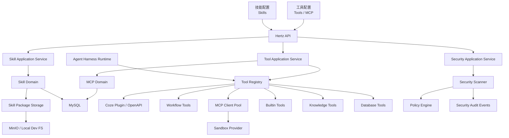
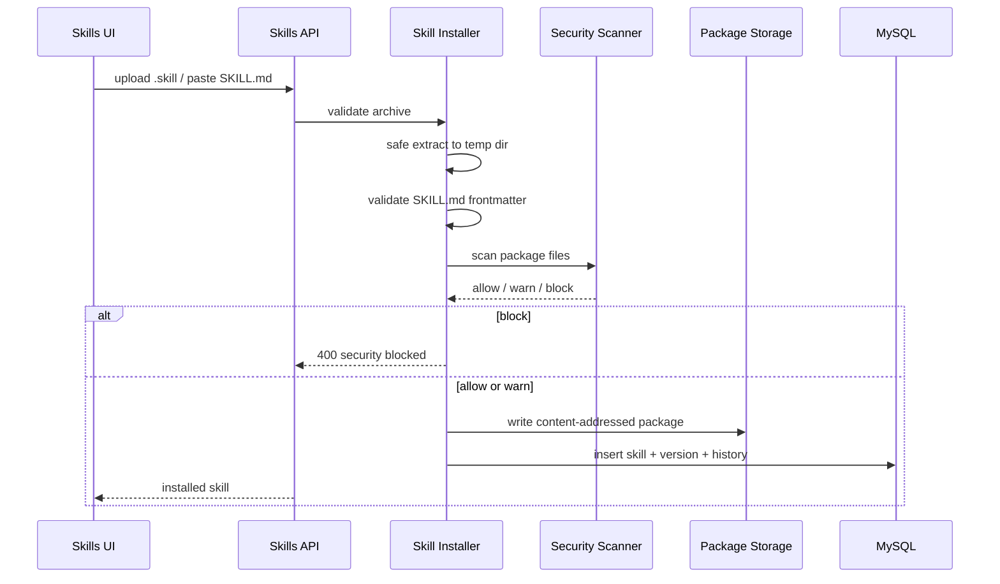
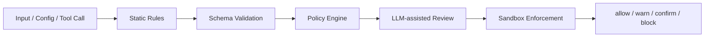

# Skills、MCP、Tools 与安全治理设计

日期：2026-06-13
状态：已获方向确认，等待用户审阅
目标级别：生产级
依赖文档：`docs/superpowers/specs/2026-06-13-runtime-langgraph-api-design.md`

## 背景

第一份 runtime/LangGraph API 设计已经把 Coze Studio 的 Agent 执行核心收敛到 Go 原生 `thread/run/event/checkpoint` 模型。本设计是第二份生产级 spec，覆盖 Deer-flow 风格 Skills、MCP 工具配置、统一 Tool Registry、安全扫描和 sandbox 治理。

用户已确认的产品映射：

1. `技能配置` 对应 Deer-flow `Skills`，需要前后端能力完整复刻并适配 Coze 技术栈。
2. `任务触发器` 修改为 Deer-flow `工具`，需要前后端能力完整复刻 MCP/Tools 配置。
3. `资源配置` 和 `开发配置` 保留，不在本设计中重做。
4. API 授权不调整，仍沿用 Coze 现有账号、空间和 API 授权体系。
5. 目标为生产级，不接受仅能本地演示的导入和执行模型。

## 目标

1. 在 Coze Studio 内实现 Deer-flow 风格 Skills：`SKILL.md`、frontmatter、public/custom 分类、安装、编辑、启停、历史、回滚、导出、运行时注入。
2. 保留并兼容 Coze 现有 `Script/Workflow` 技能，逐步迁移到统一 Skill 模型。
3. 把 `任务触发器` 页面升级为 `工具` 页面，管理 MCP servers、Coze plugins、workflow tools、builtin tools、skill tools。
4. 支持 MCP stdio、SSE、HTTP 三类 transport。
5. 支持 MCP OAuth、secret masking、配置轮转、session pool、健康检查。
6. 建立统一 Tool Registry，供 Agent Harness runtime 根据 `enable_skills`、`enable_mcp`、`enable_kbs`、`enable_databases` 解析可用工具。
7. 建立复杂安全扫描体系，覆盖 skill 包、MCP 配置、工具调用、sandbox 文件、命令、网络和 secret。
8. 所有高风险动作产生审计事件，并能进入 runtime 的 `interrupted` 状态等待确认。
9. 支持生产部署中的多实例、多 worker、多租户隔离和配置热更新。

## 非目标

1. 本设计不重写 Coze 已有 Plugin/OpenAPI 插件开发后台，只把它接入统一工具注册。
2. 本设计不实现 IM Channels；通用 `source` 字段只用于实际存在的 Web、API 和内部任务来源。
3. 本设计不重做知识库、数据库资源配置页面，只定义它们作为工具被 runtime 使用的接口。
4. 本设计不允许直接嵌入 Deer-flow Python runtime。
5. 本设计不把 LLM 安全扫描作为唯一安全边界，规则扫描和 sandbox 仍是强制层。

## 本地上下文

现有 Coze 能力：

1. Workbench skill IDL 位于 `idl/workbench/skill.thrift`，当前 `SkillType` 只有 `Script` 和 `Workflow`。
2. 当前 skill entity 位于 `backend/domain/skill/entity/skill.go`，字段包括 `InputSchema`、`OutputSchema`、`Executor`、`Permissions`。
3. 当前 skill declaration parser 支持 JSON/YAML 声明，但不是 `SKILL.md` 包协议。
4. 当前 `ScriptExecutor` 会从 `executor.entry` 读取宿主文件路径，生产级需要改为包内虚拟路径和 sandbox 读取。
5. 当前 MCP tool invocation 文件存在，但 `mcp call not implemented`，需要完整补齐。
6. Coze 已有成熟 Plugin/OpenAPI/OAuth/Workflow tool 体系，应作为工具来源接入，不推倒重来。
7. `frontend/apps/coze-studio/src/pages/skill/index.tsx` 已有技能页雏形，但 UI 和功能远不足以覆盖 Deer-flow Skills。
8. `frontend/apps/coze-studio/src/pages/task-trigger/index.tsx` 是占位页，适合作为工具配置页重建。

Deer-flow 参考能力：

1. Skills 以 `SKILL.md` 为入口，frontmatter 中包含 `name`、`description`、`license`、`version`、`author`、`allowed-tools`。
2. `.skill` 安装包是 ZIP archive，需要防 zip slip、软链、zip bomb、嵌套 `SKILL.md`。
3. 自定义 skill 支持编辑、历史、回滚，编辑和回滚都会触发安全扫描。
4. MCP 配置支持 stdio、SSE、HTTP、OAuth、secret masking、masked round-trip preserve。
5. stdio MCP command 需要 allowlist，并禁止 shell metacharacters 和路径形式命令。
6. MCP session 需要按 thread/run scope 复用，避免 stateful server 在多次 tool call 间丢失状态。
7. sandbox 需要虚拟路径、host path 映射、文件访问限制、host bash 禁用策略。

## 总体架构



核心原则：

1. Skills、MCP、Coze Plugin、Workflow、Knowledge、Database 都是工具来源，必须通过统一 Tool Registry 暴露给 runtime。
2. `enable_*` 字段只表达用户选择范围，不表达授权结果。
3. Tool Registry 每次解析工具时都要叠加空间权限、资源权限、skill `allowed-tools`、安全策略和 runtime mode。
4. 所有配置保存到 MySQL，开发环境可以从本地目录初始化 public skills，但运行时事实源仍是数据库。
5. Skill 包内容使用 content-addressed storage，不允许运行时读取任意宿主路径。
6. MCP stdio 是高风险能力，生产默认仅允许管理员启用，并且必须经过 command allowlist、sandbox 和审计。

## Go 技术栈选择

| 能力 | 选择 | 说明 |
| --- | --- | --- |
| MCP Agent Adapter | Eino-ext MCP Tool Adapter | 负责把 MCP tools 转为 Eino tools 并接入 ADK Agent 执行 |
| MCP Client Lifecycle | Coze-owned client/session layer | 负责 stdio/SSE/streamable HTTP、OAuth、重连、缓存、健康和会话池；底层 SDK 类型不进入业务层 |
| Archive 处理 | Go 标准库 `archive/zip` | 安装 `.skill` 包时自己实现路径、大小、软链和 UTF-8 校验 |
| Frontmatter | `gopkg.in/yaml.v3` | 仓库已有依赖，严格解析白名单字段 |
| Secret 加密 | 复用 Coze plugin encrypt 能力并抽象 SecretStore | 不把 MCP secret 明文写入业务表或日志 |
| Policy Engine | Go rule engine 优先 | 第一版使用显式 Go 规则，复杂表达式后续由配置驱动，不把 LLM 作为唯一决策层 |
| Sandbox | `SandboxProvider` 接口 | 开发可本地实现，生产必须容器或远端隔离实现 |
| Observability | OpenTelemetry + MySQL audit | 工具调用、scanner、MCP session、sandbox deny 都要可追踪 |

## 模块边界

建议新增和改造模块：

```text
backend/domain/agent/tools/
  entity/
  registry/
  policy/
  repository/

backend/domain/agent/skills/
  parser/
  installer/
  storage/
  service/
  history/

backend/domain/agent/mcp/
  client/
  oauth/
  session/
  service/
  repository/

backend/domain/agent/security/
  scanner/
  rules/
  policy/
  audit/

backend/application/agent_tools/
  skills_app.go
  tools_app.go
  mcp_app.go
  security_app.go

backend/api/handler/agent_tools/
  skills.go
  tools.go
  mcp.go
  security.go
```

改造原则：

1. `backend/domain/skill` 保留作为旧 Workbench Skill 兼容层，新增代码不要继续扩大旧模型。
2. 新 runtime 只依赖 `backend/domain/agent/tools/registry`。
3. 旧 `SkillType.Script/Workflow` 被映射为统一 Skill source，不再作为唯一技能模型。
4. Coze Plugin 仍由 `backend/domain/plugin` 管理生命周期，Registry 只读取可调用工具并包装为 runtime tool。

## Skill 模型

### Skill 类型

统一 Skill 分四类：

1. `public`：平台内置、只读、可启停。
2. `custom`：空间内用户创建或安装，可编辑、历史、回滚。
3. `coze_script`：现有 Script 技能兼容映射。
4. `coze_workflow`：现有 Workflow 技能兼容映射。

### Skill 包结构

标准包结构：

```text
my-skill/
  SKILL.md
  references/
  templates/
  scripts/
  assets/
```

约束：

1. 根目录必须有且只能有一个 `SKILL.md`。
2. 包内不允许嵌套第二个 `SKILL.md`。
3. `scripts/` 是可执行支持文件目录，安全级别高于 `references/` 和 `templates/`。
4. `assets/` 默认只读，不进入 prompt，除非 runtime 明确引用。
5. 包内所有可读文本必须是 UTF-8。
6. 包内路径统一使用 POSIX relative path。
7. 安装后包内容只读；编辑 custom skill 只允许改受控文件。

### SKILL.md frontmatter

允许字段：

```yaml
---
name: data-analysis
description: Analyze datasets and produce reproducible insights.
license: MIT
version: "1.0.0"
author: coze
allowed-tools:
  - read_file
  - write_file
  - python_sandbox
---
```

校验规则：

1. `name` 必填，使用 hyphen-case，只允许小写字母、数字、单横线。
2. `name` 不能以横线开头或结尾，不能包含连续横线。
3. `name` 最大 64 个字符。
4. `description` 必填，最大 1024 个字符，不允许 `<` 和 `>`。
5. `allowed-tools` 可省略；省略表示 legacy allow-all 兼容模式，但生产建议导入时自动提示补充。
6. `allowed-tools` 存在时必须是字符串数组。
7. 任何未声明字段都拒绝导入，避免静默接受危险配置。

`allowed-tools` 名称解析：

1. 允许写 canonical name，例如 `builtin.file.read_file`。
2. 允许写当前 run 内无冲突的短名，例如 `read_file`。
3. 短名解析出多个工具时，该短名视为无效并提示用户改成 canonical name。
4. Registry 持久化和审计始终使用 canonical name。

### Skill 运行时语义

Skill 不是单个工具函数，而是 prompt/capability package。Runtime 加载 skill 时：

1. 读取 enabled skills。
2. 按用户输入的 slash skill、agent 配置和 `enable_skills` 过滤。
3. 将 `SKILL.md` 的主体内容注入 lead agent system prompt 的 skill section。
4. 将 `references/`、`templates/` 作为可按需读取的只读资料。
5. 将 `allowed-tools` 交给 Tool Policy 收敛工具集合。
6. 允许 skill 通过 sandbox virtual path 引用自身包内文件。

### Slash skill

用户输入以 `/skill-name` 开头时：

1. Runtime 优先激活对应 skill。
2. 如果 skill disabled，返回可解释错误。
3. 如果 skill 不存在，返回 skill suggestions。
4. 激活的 skill 会限制工具集合；如果它声明了 `allowed-tools`，只暴露交集工具。
5. slash 指令本身从最终用户消息中剥离或转换为 metadata，避免模型重复处理。

## Skill 存储

### 数据表

```sql
CREATE TABLE agent_skills (
  id BIGINT PRIMARY KEY,
  space_id BIGINT NOT NULL,
  name VARCHAR(128) NOT NULL,
  display_name VARCHAR(255) NOT NULL DEFAULT '',
  description TEXT NOT NULL,
  category VARCHAR(32) NOT NULL,
  source_type VARCHAR(32) NOT NULL,
  version VARCHAR(64) NOT NULL DEFAULT '',
  license VARCHAR(128) NOT NULL DEFAULT '',
  author VARCHAR(128) NOT NULL DEFAULT '',
  enabled BOOLEAN NOT NULL DEFAULT TRUE,
  editable BOOLEAN NOT NULL DEFAULT FALSE,
  package_digest VARCHAR(128) NOT NULL DEFAULT '',
  package_uri VARCHAR(512) NOT NULL DEFAULT '',
  skill_md_uri VARCHAR(512) NOT NULL DEFAULT '',
  allowed_tools JSON NOT NULL,
  metadata JSON NOT NULL,
  scanner_status VARCHAR(32) NOT NULL DEFAULT 'pending',
  scanner_summary TEXT,
  created_by BIGINT NOT NULL,
  updated_by BIGINT NOT NULL,
  created_at DATETIME NOT NULL,
  updated_at DATETIME NOT NULL,
  deleted_at DATETIME DEFAULT NULL,
  UNIQUE KEY uk_space_name (space_id, name),
  KEY idx_space_enabled (space_id, enabled),
  KEY idx_category_updated (category, updated_at)
);
```

`source_type`：

1. `skill_md`
2. `coze_script`
3. `coze_workflow`
4. `generated`

`scanner_status`：

1. `pending`
2. `allow`
3. `warn`
4. `block`
5. `manual_review`

### Skill 版本

```sql
CREATE TABLE agent_skill_versions (
  id BIGINT PRIMARY KEY,
  skill_id BIGINT NOT NULL,
  version VARCHAR(64) NOT NULL,
  package_digest VARCHAR(128) NOT NULL,
  package_uri VARCHAR(512) NOT NULL,
  skill_md_uri VARCHAR(512) NOT NULL,
  frontmatter JSON NOT NULL,
  scanner_result JSON NOT NULL,
  changelog TEXT,
  created_by BIGINT NOT NULL,
  created_at DATETIME NOT NULL,
  UNIQUE KEY uk_skill_version (skill_id, version),
  KEY idx_skill_created (skill_id, created_at)
);
```

### Skill 历史

```sql
CREATE TABLE agent_skill_history (
  id BIGINT PRIMARY KEY,
  skill_id BIGINT NOT NULL,
  action VARCHAR(64) NOT NULL,
  actor_id BIGINT NOT NULL,
  run_id BIGINT DEFAULT NULL,
  thread_id BIGINT DEFAULT NULL,
  file_path VARCHAR(512) NOT NULL DEFAULT '',
  prev_digest VARCHAR(128) NOT NULL DEFAULT '',
  new_digest VARCHAR(128) NOT NULL DEFAULT '',
  prev_content_uri VARCHAR(512) NOT NULL DEFAULT '',
  new_content_uri VARCHAR(512) NOT NULL DEFAULT '',
  scanner_result JSON NOT NULL,
  metadata JSON NOT NULL,
  created_at DATETIME NOT NULL,
  KEY idx_skill_created (skill_id, created_at),
  KEY idx_actor_created (actor_id, created_at)
);
```

动作：

1. `install`
2. `human_edit`
3. `agent_edit`
4. `rollback`
5. `enable`
6. `disable`
7. `delete`
8. `export`

## Skill 安装流程



安装规则：

1. archive 总解压大小默认限制 512 MB。
2. 单文件默认限制 20 MB，`SKILL.md` 默认限制 1 MB。
3. 拒绝绝对路径、`..`、Windows drive path、UNC path。
4. 跳过或拒绝 symlink；生产默认拒绝 symlink。
5. 忽略 `.DS_Store` 和 `__MACOSX`。
6. 拒绝二进制可执行文件，除非管理员在安全策略中显式允许。
7. 同空间同名 skill 默认 409；允许通过新版本安装替代时必须传 `replace=true`。
8. 安装成功后 package 文件只读。

## MCP 模型

### 支持 transport

1. `stdio`：启动本地进程，风险最高。
2. `sse`：连接远端 SSE MCP server。
3. `http`：连接 streamable HTTP MCP server。

### MCP 数据表

```sql
CREATE TABLE agent_mcp_servers (
  id BIGINT PRIMARY KEY,
  space_id BIGINT NOT NULL,
  name VARCHAR(128) NOT NULL,
  display_name VARCHAR(255) NOT NULL DEFAULT '',
  description TEXT,
  transport VARCHAR(32) NOT NULL,
  enabled BOOLEAN NOT NULL DEFAULT TRUE,
  command VARCHAR(128) DEFAULT NULL,
  args JSON NOT NULL,
  url VARCHAR(1024) DEFAULT NULL,
  headers JSON NOT NULL,
  env JSON NOT NULL,
  oauth JSON NOT NULL,
  tool_prefix VARCHAR(128) NOT NULL DEFAULT '',
  risk_level VARCHAR(32) NOT NULL DEFAULT 'medium',
  scanner_status VARCHAR(32) NOT NULL DEFAULT 'pending',
  scanner_result JSON NOT NULL,
  created_by BIGINT NOT NULL,
  updated_by BIGINT NOT NULL,
  created_at DATETIME NOT NULL,
  updated_at DATETIME NOT NULL,
  deleted_at DATETIME DEFAULT NULL,
  UNIQUE KEY uk_space_name (space_id, name),
  KEY idx_space_enabled (space_id, enabled)
);
```

敏感字段存储规则：

1. `headers`、`env`、`oauth.client_secret`、`oauth.refresh_token` 中的 secret 必须加密存储。
2. API GET 返回时用 `***` masking。
3. PUT/PATCH 收到 `***` 时只能保留已有 secret，不能把 `***` 当新 secret 写入。
4. 新 key 不允许使用 `***`。
5. 空字符串表示显式清空 secret。

### MCP 工具发现缓存

```sql
CREATE TABLE agent_mcp_tools (
  id BIGINT PRIMARY KEY,
  server_id BIGINT NOT NULL,
  space_id BIGINT NOT NULL,
  name VARCHAR(255) NOT NULL,
  normalized_name VARCHAR(255) NOT NULL,
  description TEXT,
  input_schema JSON NOT NULL,
  output_schema JSON NOT NULL,
  risk_level VARCHAR(32) NOT NULL DEFAULT 'medium',
  last_seen_at DATETIME NOT NULL,
  created_at DATETIME NOT NULL,
  updated_at DATETIME NOT NULL,
  UNIQUE KEY uk_server_tool (server_id, normalized_name),
  KEY idx_space_tool (space_id, normalized_name)
);
```

发现流程：

1. MCP server 保存或启用后触发 health check。
2. client 连接 server，调用 `list_tools`。
3. 对工具名做 normalize 和冲突检测。
4. 写入 `agent_mcp_tools`。
5. Tool Registry 只使用健康且 enabled 的 server。

### MCP OAuth

支持 grant：

1. `client_credentials`
2. `refresh_token`

OAuth token manager 要求：

1. 每个 server 独立 token cache。
2. token 到期前按 `refresh_skew_seconds` 刷新。
3. token 获取失败时，当前 server 标记 unhealthy，但不影响其他 MCP server。
4. token 请求 timeout 默认 15 秒。
5. token response 字段可配置：`token_field`、`token_type_field`、`expires_in_field`。
6. token 不写入明文日志。

### MCP stdio 安全

stdio 配置限制：

1. `command` 必须是单个可执行名，不允许 `/`、`\`、空白、shell metacharacters。
2. 默认 allowlist：`npx`、`uvx`。
3. allowlist 通过服务端配置扩展，不允许普通用户在 UI 中扩展。
4. 参数必须在 `args` 数组中传递，不允许把整段 shell command 放入 command。
5. 禁止 `;`、`|`、`&`、反引号、`$()`、重定向等 shell 组合。
6. stdio server 只能在 sandbox 或受控 worker 环境启动。
7. stdio server 必须有启动 timeout、空闲 timeout、最大输出限制。

## MCP Session Pool

Session scope：

```text
(space_id, server_id, thread_id)
```

对于 stateless run：

```text
(space_id, server_id, run_id)
```

要求：

1. 同一 thread 内连续调用同一个 MCP server 时复用 session。
2. 不同 thread/session 之间隔离。
3. 每个 worker 有本地 session pool，Redis 保存 session lease 元数据。
4. 最大 session 数默认 256。
5. LRU 淘汰空闲 session。
6. run 取消、thread 删除、server 禁用时关闭对应 session。
7. worker 退出时关闭所有 stdio 子进程。

## 统一 Tool Registry

Runtime 只调用统一接口：

```go
type Registry interface {
	ResolveTools(ctx context.Context, req ResolveToolsRequest) (*ResolvedToolSet, error)
}

type ResolveToolsRequest struct {
	SpaceID          int64
	UserID           int64
	ThreadID         *int64
	RunID            int64
	Source           string
	Mode             string
	EnableSkills     []string
	EnableMCP        []string
	EnableKBs        []string
	EnableDatabases  []string
	ActivatedSkills  []string
	AllowedToolNames []string
}
```

返回：

```go
type ResolvedToolSet struct {
	Tools       []ResolvedTool
	Skills      []ResolvedSkill
	Policy      ToolPolicyResult
	AuditFields map[string]any
}
```

工具来源：

1. `builtin.file`
2. `builtin.artifact`
3. `builtin.todo`
4. `builtin.clarification`
5. `builtin.view_image`
6. `coze.plugin`
7. `coze.workflow`
8. `coze.skill.script`
9. `coze.skill.workflow`
10. `deer.skill`
11. `mcp`
12. `knowledge`
13. `database`

工具命名规则：

```text
{source}.{namespace}.{tool}
```

示例：

1. `mcp.github.create_issue`
2. `coze.plugin.lark_message.send_message`
3. `coze.workflow.customer_lookup.run`
4. `builtin.file.read_file`

冲突策略：

1. 内部 canonical name 必须全局唯一。
2. 给模型的 display name 可以短，但同一个 run 内不得冲突。
3. 冲突时按来源加前缀。
4. 任何冲突都写入内部 audit event。

## Tool Policy

Tool Policy 按顺序收敛：

1. 空间资源权限。
2. 用户角色权限。
3. Agent 配置允许的工具。
4. Workbench `enable_*` 选择。
5. activated skill 的 `allowed-tools`。
6. runtime mode：Ask 不允许有副作用工具，Agent 允许受控工具。
7. source policy：API 和内部自动任务可以采用比交互式 Web 更严格的默认策略。
8. security scanner 实时决策。

决策：

1. `allow`：直接暴露或执行。
2. `warn`：允许但记录风险，UI 可展示。
3. `confirm`：进入 `interrupted`，等待用户确认。
4. `block`：拒绝并写审计事件。

## 安全扫描体系

### 扫描对象

1. Skill archive。
2. `SKILL.md` 内容。
3. Skill support files。
4. Skill scripts。
5. MCP server 配置。
6. MCP discovered tool schema。
7. Tool call arguments。
8. File operations。
9. Bash/code execution。
10. Network requests。
11. Artifact downloads。
12. Secret-bearing configs。

### 扫描层级



强制规则：

1. 静态规则命中 `block` 时，LLM 不得降级为 allow。
2. LLM 扫描不可用时，可执行内容默认 `block`，非可执行内容进入 `manual_review` 或 `block`，由策略配置决定。
3. `confirm` 决策必须通过 runtime interrupt 表达，不允许前端私自绕过。
4. scanner 每次决策都要写审计记录。

### Security scan 数据表

```sql
CREATE TABLE agent_security_scans (
  id BIGINT PRIMARY KEY,
  space_id BIGINT NOT NULL,
  target_type VARCHAR(64) NOT NULL,
  target_id VARCHAR(128) NOT NULL,
  target_digest VARCHAR(128) NOT NULL DEFAULT '',
  scanner_version VARCHAR(64) NOT NULL,
  decision VARCHAR(32) NOT NULL,
  severity VARCHAR(32) NOT NULL,
  reason TEXT NOT NULL,
  rule_hits JSON NOT NULL,
  llm_result JSON NOT NULL,
  created_by BIGINT NOT NULL,
  created_at DATETIME NOT NULL,
  KEY idx_target (target_type, target_id),
  KEY idx_space_created (space_id, created_at),
  KEY idx_decision_created (decision, created_at)
);
```

### 审计事件

```sql
CREATE TABLE agent_security_audit_events (
  id BIGINT PRIMARY KEY,
  space_id BIGINT NOT NULL,
  user_id BIGINT NOT NULL,
  thread_id BIGINT DEFAULT NULL,
  run_id BIGINT DEFAULT NULL,
  event_type VARCHAR(128) NOT NULL,
  decision VARCHAR(32) NOT NULL,
  risk_level VARCHAR(32) NOT NULL,
  target_type VARCHAR(64) NOT NULL,
  target_id VARCHAR(128) NOT NULL,
  payload JSON NOT NULL,
  created_at DATETIME NOT NULL,
  KEY idx_run_created (run_id, created_at),
  KEY idx_space_created (space_id, created_at),
  KEY idx_event_type (event_type, created_at)
);
```

审计事件示例：

1. `skill.install.blocked`
2. `skill.edit.warned`
3. `mcp.config.updated`
4. `mcp.stdio.blocked`
5. `tool.call.confirm_required`
6. `tool.call.blocked`
7. `sandbox.path.denied`
8. `secret.masked_roundtrip.rejected`

## Sandbox Provider

Sandbox 必须提供统一接口：

```go
type SandboxProvider interface {
	Create(ctx context.Context, req SandboxCreateRequest) (SandboxSession, error)
	Get(ctx context.Context, threadID int64, runID int64) (SandboxSession, error)
	Close(ctx context.Context, sessionID string) error
}
```

生产默认策略：

1. 本地主机 sandbox 只允许开发环境。
2. 生产环境必须使用容器、Firecracker、AioSandbox 等隔离边界。
3. host bash 默认禁用。
4. stdio MCP 默认在 sandbox 内启动。
5. 文件工具只能访问虚拟挂载路径。
6. Skill package 挂载只读。
7. user workspace 挂载读写。
8. artifacts 输出目录受控写入。

虚拟路径：

```text
/mnt/skills/public
/mnt/skills/custom
/mnt/user-data/uploads
/mnt/user-data/workspace
/mnt/user-data/outputs
/mnt/artifacts
```

路径规则：

1. 禁止 `..`。
2. 禁止 `file://`。
3. 禁止访问 `/bin`、`/usr/bin`、`/dev`、`/proc` 等系统路径。
4. 禁止 follow symlink escape。
5. 写文件默认限制 80 KB 单次内容，超出需 artifact upload。
6. grep/glob 默认限制返回数量。

## API 设计

### Skills API

| Method | Path | 说明 |
| --- | --- | --- |
| GET | `/api/skills` | 列出 public/custom/coze skills |
| POST | `/api/skills/install` | 安装 `.skill` 包 |
| POST | `/api/skills` | 创建 custom skill |
| GET | `/api/skills/{skill_name}` | 获取 skill 详情 |
| PUT | `/api/skills/{skill_name}` | 更新 enabled、metadata |
| DELETE | `/api/skills/{skill_name}` | 删除 custom skill |
| GET | `/api/skills/custom/{skill_name}/content` | 获取 custom `SKILL.md` |
| PUT | `/api/skills/custom/{skill_name}/content` | 编辑 custom `SKILL.md` |
| GET | `/api/skills/custom/{skill_name}/history` | 获取历史 |
| POST | `/api/skills/custom/{skill_name}/rollback` | 回滚 |
| GET | `/api/skills/{skill_name}/export` | 导出 `.skill` |
| POST | `/api/skills/{skill_name}/test_run` | 通过 runtime 试运行 |

安装请求：

```json
{
  "space_id": "123",
  "upload_id": "up_123",
  "replace": false,
  "enabled": true
}
```

响应：

```json
{
  "skill": {
    "id": "739495058700",
    "name": "data-analysis",
    "description": "Analyze datasets and produce reproducible insights.",
    "category": "custom",
    "enabled": true,
    "scanner_status": "allow",
    "allowed_tools": ["read_file", "write_file", "python_sandbox"]
  }
}
```

### MCP API

| Method | Path | 说明 |
| --- | --- | --- |
| GET | `/api/mcp/config` | 获取 MCP server 配置，secret masked |
| PUT | `/api/mcp/config` | 批量保存 MCP server 配置 |
| POST | `/api/mcp/servers` | 新增 MCP server |
| PATCH | `/api/mcp/servers/{server_id}` | 更新 MCP server |
| DELETE | `/api/mcp/servers/{server_id}` | 删除 MCP server |
| POST | `/api/mcp/servers/{server_id}/health_check` | 健康检查和工具发现 |
| GET | `/api/mcp/servers/{server_id}/tools` | 列出 discovered tools |
| POST | `/api/mcp/servers/{server_id}/rotate_secret` | 轮转 secret |

MCP server 请求：

```json
{
  "name": "github",
  "display_name": "GitHub",
  "transport": "stdio",
  "enabled": true,
  "command": "npx",
  "args": ["-y", "@modelcontextprotocol/server-github"],
  "env": {
    "GITHUB_TOKEN": "$GITHUB_TOKEN"
  },
  "description": "GitHub repository operations"
}
```

### Tools API

| Method | Path | 说明 |
| --- | --- | --- |
| GET | `/api/tools` | 统一工具列表 |
| POST | `/api/tools/resolve` | 按 runtime context 解析工具集合 |
| POST | `/api/tools/{tool_id}/test_call` | 安全试调用 |
| GET | `/api/tools/audit` | 工具调用审计 |
| PATCH | `/api/tools/{tool_id}/policy` | 更新工具策略 |

Resolve 请求：

```json
{
  "space_id": "123",
  "thread_id": "739495058641",
  "run_id": "739495058642",
  "mode": "agent",
  "enable_skills": ["data-analysis"],
  "enable_mcp": ["github"],
  "enable_kbs": [],
  "enable_databases": []
}
```

## 前端设计

### 技能配置页

功能区：

1. 顶部搜索、分类、启停筛选。
2. Public Skills。
3. Custom Skills。
4. Coze Script/Workflow 兼容技能。
5. Skill detail drawer。
6. `SKILL.md` 编辑器。
7. 安装 `.skill` 上传入口。
8. 历史和回滚。
9. 安全扫描结果展示。
10. 试运行入口。

关键交互：

1. 安装包后展示扫描结果；`warn` 可继续启用，`block` 不可启用。
2. 编辑 `SKILL.md` 前保存草稿，提交时扫描。
3. 回滚也必须扫描目标版本。
4. `allowed-tools` 用工具选择器可视化编辑，但保存仍写入 `SKILL.md` frontmatter。
5. skill detail 展示被哪些 Agent/Workspace 默认启用。

### 工具配置页

原 `任务触发器` 改为 `工具`：

功能区：

1. MCP servers。
2. Coze Plugins。
3. Workflow Tools。
4. Builtin Tools。
5. Knowledge Tools。
6. Database Tools。
7. Tool Policies。
8. Security Audit。

MCP server card 展示：

1. transport。
2. enabled。
3. health。
4. discovered tool count。
5. risk level。
6. last checked time。
7. secret masked state。

MCP 编辑器：

1. transport segmented control。
2. stdio command + args array。
3. HTTP/SSE URL。
4. headers/env secret editor。
5. OAuth block。
6. health check 按钮。
7. scanner result。

## 与 Runtime 的集成

Runtime 创建 run 时：

1. 调用 Tool Registry `ResolveTools`。
2. Registry 读取 enabled skills。
3. Registry 根据 slash skill 激活 skill。
4. Registry 加载 MCP tools、Coze plugin tools、workflow tools、builtin tools。
5. Tool Policy 收敛工具。
6. Security Policy 标记高风险工具。
7. Runtime 将工具集合绑定到 Eino model/tool node。

工具调用时：

1. Runtime 先写 `tool_call.requested` event。
2. Security scanner 扫描参数和目标。
3. `confirm` 时 run 进入 `interrupted`。
4. `block` 时写 `tool_call.blocked` 并把错误返回模型。
5. `allow/warn` 时执行工具。
6. 执行结果写 `tool_call.completed` 或 `tool_call.failed`。

## 错误模型

| code | HTTP | 说明 |
| --- | --- | --- |
| `SKILL_INVALID_FRONTMATTER` | 400 | `SKILL.md` frontmatter 不合法 |
| `SKILL_ARCHIVE_UNSAFE` | 400 | archive 存在路径穿越、软链、超限 |
| `SKILL_ALREADY_EXISTS` | 409 | 同空间同名 skill 已存在 |
| `SKILL_SECURITY_BLOCKED` | 400 | 安全扫描阻断 |
| `MCP_COMMAND_NOT_ALLOWED` | 400 | stdio command 不在 allowlist |
| `MCP_SECRET_MASK_INVALID` | 400 | 新 secret 使用 masked value |
| `MCP_HEALTH_CHECK_FAILED` | 502 | MCP 连接或 list_tools 失败 |
| `TOOL_POLICY_BLOCKED` | 403 | 工具策略阻断 |
| `TOOL_CONFIRM_REQUIRED` | 409 | 需要 runtime interrupt 确认 |
| `SANDBOX_PATH_DENIED` | 403 | 路径访问被 sandbox 拒绝 |

## 生产配置

关键配置：

```yaml
agent_tools:
  mcp:
    stdio_command_allowlist:
      - npx
      - uvx
    session_pool_max: 256
    connect_timeout_seconds: 15
    tool_call_timeout_seconds: 120
  skills:
    max_archive_size_bytes: 536870912
    max_skill_md_size_bytes: 1048576
    max_file_size_bytes: 20971520
    public_skills_bootstrap_path: skills/public
  security:
    scanner_version: "2026-06-13"
    llm_scan_enabled: true
    executable_scan_unavailable_decision: block
    content_scan_unavailable_decision: manual_review
  sandbox:
    provider: container
    allow_host_bash: false
```

## 测试策略

### Skill 测试

1. 有效 `SKILL.md` 解析。
2. 缺少 name/description 拒绝。
3. 非 hyphen-case name 拒绝。
4. unexpected frontmatter key 拒绝。
5. `allowed-tools` 非数组拒绝。
6. `.skill` zip slip 拒绝。
7. symlink 拒绝。
8. zip bomb 超限拒绝。
9. 嵌套 `SKILL.md` 拒绝。
10. 编辑、历史、回滚写入审计。
11. blocked scan 阻止启用。
12. warn scan 允许启用并展示风险。

### MCP 测试

1. stdio command allowlist。
2. command 包含空白、路径、shell metacharacters 拒绝。
3. masked secret round-trip 保留旧值。
4. 新 key 使用 `***` 拒绝。
5. OAuth client_credentials 刷新。
6. OAuth refresh_token 刷新。
7. MCP list_tools 写缓存。
8. server 禁用后工具不被 resolve。
9. session pool 同 thread 复用。
10. session pool 跨 thread 隔离。
11. worker shutdown 关闭 stdio 子进程。

### Tool Registry 测试

1. Ask mode 不返回副作用工具。
2. Agent mode 返回受控工具集合。
3. skill `allowed-tools` 收敛工具。
4. `enable_mcp` 只返回选中 server 工具。
5. 用户无资源权限时不返回工具。
6. 工具名冲突时 canonical name 唯一。

### Security 测试

1. 静态 block 不被 LLM allow 覆盖。
2. executable scanner 不可用时 block。
3. prompt injection pattern block。
4. secret exfiltration pattern block。
5. tool args path traversal block。
6. high-risk tool 触发 confirm。
7. 每个 block/confirm 写 audit event。

### 前端测试

1. 技能列表分类和搜索。
2. `.skill` 安装失败展示扫描原因。
3. custom `SKILL.md` 编辑和回滚。
4. MCP secret masked 展示。
5. MCP health check 状态。
6. Tools 页按来源筛选。
7. Security Audit 列表展示。

## 分阶段交付

### Phase 1：数据模型与只读工具注册

交付：

1. `agent_skills`、`agent_skill_versions`、`agent_mcp_servers`、`agent_mcp_tools`、security audit 表。
2. Tool Registry 接口。
3. Coze Plugin、Workflow、Builtin 工具只读接入。
4. 旧 Workbench Skill 映射为 `coze_script/coze_workflow`。

验收：

1. Runtime 能 resolve builtin/plugin/workflow/coze skill。
2. Ask/Agent mode 工具收敛规则可测试。

### Phase 2：Deer-flow Skill 包

交付：

1. `SKILL.md` parser。
2. `.skill` archive installer。
3. public/custom skill 存储。
4. enabled、history、rollback、export。
5. skill prompt 注入和 slash activation。

验收：

1. 安装、启停、编辑、回滚可用。
2. runtime 能根据 slash skill 激活对应 skill。

### Phase 3：MCP 配置与调用

交付：

1. MCP server CRUD。
2. stdio/SSE/HTTP client。
3. OAuth token manager。
4. secret masking。
5. session pool。
6. health check 和 list_tools。

验收：

1. stdio MCP server 可在 sandbox 中启动并调用。
2. HTTP/SSE MCP server 可带 OAuth 调用。
3. session 在同 thread 内复用。

### Phase 4：复杂安全扫描

交付：

1. skill archive scanner。
2. skill content scanner。
3. MCP config scanner。
4. tool call scanner。
5. security audit UI。
6. runtime confirm/block 集成。

验收：

1. 高风险配置和调用被阻断或确认。
2. 审计事件完整可查。
3. scanner 不可用时执行内容默认阻断。

### Phase 5：前端完整页面

交付：

1. 技能配置页重构。
2. 工具配置页替换任务触发器。
3. MCP 编辑器。
4. Tool Policy UI。
5. Security Audit UI。

验收：

1. 用户可完成 Deer-flow 风格 skill 管理。
2. 管理员可完成 MCP server 配置、健康检查和工具发现。
3. Agent run 中可使用启用的 skill 和 MCP tool。

## 上线门禁

生产上线前必须满足：

1. stdio MCP 在生产环境不能直接运行在宿主机。
2. host bash 默认禁用。
3. skill archive 防 zip slip、symlink、zip bomb、嵌套 skill。
4. secret API 永不返回明文。
5. `***` round-trip 不会覆盖真实 secret。
6. Tool Registry 所有工具都能追溯来源和权限决策。
7. 高风险工具调用有 audit event。
8. `block` 决策无法被前端绕过。
9. scanner 不可用时不放行 executable content。
10. MCP server 禁用后不再出现在 runtime 工具集合。
11. worker 停止时清理 stdio 子进程。
12. 多租户空间间 skill/MCP/tool 配置隔离。

## 风险与缓解

| 风险 | 影响 | 缓解 |
| --- | --- | --- |
| MCP stdio 执行宿主命令 | 生产安全事故 | allowlist、sandbox、host bash 禁用、审计 |
| Skill 包路径穿越 | 覆盖宿主文件 | safe extract、content-addressed storage、只读挂载 |
| LLM 安全扫描误判 | 漏报或误报 | 静态规则优先、manual review、审计和回滚 |
| Secret 泄露 | 凭据暴露 | 加密存储、masking、日志脱敏、round-trip preserve |
| 工具名冲突 | 模型误调用 | canonical name、display name 去重、冲突审计 |
| Session pool 泄漏 | 子进程残留、资源耗尽 | LRU、idle timeout、worker shutdown cleanup |
| 旧 Skill 模型双轨 | 页面和 runtime 不一致 | 旧模型只做兼容映射，新 runtime 依赖统一 Registry |

## 设计结论

Skills、MCP 和 Tools 不能作为三个孤立功能实现。生产级方案必须先建立统一 Tool Registry 和安全治理层，然后把 Deer-flow 风格 Skills、Coze 既有 Plugin/Workflow、MCP server、Knowledge、Database 全部接入同一套 resolve、policy、audit 和 sandbox 流程。

本设计建议保留 Coze 现有插件和 workflow 投资，同时补齐 Deer-flow 的 skill 包、MCP 配置、secret masking、session pool 和安全扫描。这样可以在不重做 Coze 生态的前提下，达到 Deer-flow Agent Harness 的工具扩展能力。
