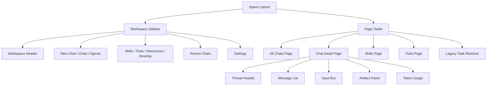
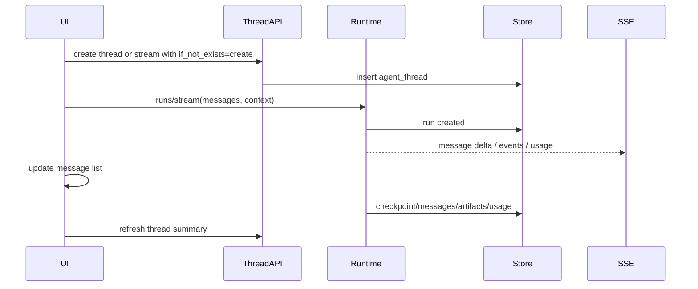
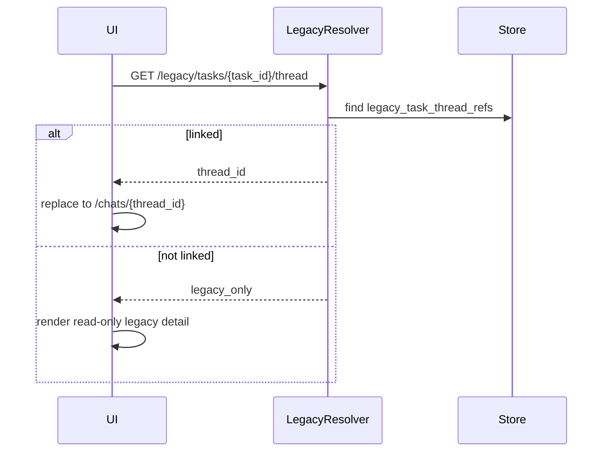

# 工作台菜单、对话列表与对话详情设计

日期：2026-06-13
状态：已获方向确认，等待用户审阅
目标级别：生产级
依赖文档：

1. `docs/superpowers/specs/2026-06-13-runtime-langgraph-api-design.md`
2. `docs/superpowers/specs/2026-06-13-skills-mcp-security-design.md`
3. `docs/superpowers/specs/2026-06-13-memory-token-artifacts-settings-design.md`
4. `docs/superpowers/specs/2026-06-13-im-channels-design.md`

## 背景

当前 Coze Studio 已有工作台原型：

1. 左侧菜单包含 `新建任务`、`资源配置`、`技能配置`、`开发配置`、`任务触发器`、`全部任务`。
2. `workbench` 页面提供模板和 composer，提交后创建 `ChatTask`。
3. `tasks` 页面列出所有任务。
4. `tasks/:task_id` 详情页已经模拟了“用户输入 + 执行流程 + 结果 + 追问”的对话体验。
5. 侧边栏底部 `我的任务` 拉取最近任务。
6. 后端 `workbench/chat` 会创建 task，异步执行，并把流程写入 `task_events`。

目标是完全复刻 Deer-flow 对话工作台能力：新建对话、全部对话、最近对话、对话详情、运行流、artifact、token usage、memory、IM channel 来源、settings 入口。这里的核心变化是从 `Task-first` 转为 `Thread-first`。

## 目标

1. 将 `新建任务` 改造为 Deer-flow 风格 `新建对话`。
2. 将 `全部任务` 改造为 Deer-flow 风格 `全部对话`。
3. 将 `我的任务` 改造为 Deer-flow 风格 `最近对话`。
4. 将 `任务详情` 改造为 Deer-flow 风格 `对话详情页`。
5. 保留 `资源配置` 和 `开发配置` 功能不变，只定义未来风格统一边界。
6. `技能配置` 接第二份 Skills spec；本设计只定义菜单、路由和页面挂载。
7. `任务触发器` 改为 `工具`，接第二份 Tools/MCP spec；本设计定义兼容跳转。
8. 后端事实源切到 `agent_threads`、`agent_runs`、`agent_messages`、`agent_events`，旧 `task` 作为兼容视图。
9. 前端复刻 Deer-flow 的 sidebar、recent chats、chat detail、message list、input box、artifact drawer、token indicator、settings entry。
10. 支持生产级路由兼容、数据迁移、权限、分页、搜索、空态、错误态和测试。

## 非目标

1. 不在本设计中实现 Skills、Tools/MCP、Memory、Artifacts、IM Channels 的内部逻辑；只接入它们的页面入口和对话详情展示位。
2. 不删除旧 task 表和旧 API，避免历史链接和已有数据中断。
3. 不改变资源配置和开发配置的业务逻辑。
4. 不把新的 Agent Harness 继续建立在 `ChatTask` 表上。
5. 不做营销页或落地页；第一屏必须是可用工作台。

## 本地上下文

### Coze 现状

前端：

1. 路由位于 `frontend/apps/coze-studio/src/routes/index.tsx`。
2. `space/:space_id/workbench` 当前是新建任务。
3. `space/:space_id/tasks` 当前是全部任务。
4. `space/:space_id/tasks/:task_id` 当前是任务详情。
5. `workspace-sub-menu/menu.ts` 定义菜单标签和 path。
6. `workspace-sub-menu/workspace-task-list.tsx` 是当前“我的任务”。
7. `pages/workbench/index.tsx` 提交 composer 后跳到 task detail。
8. `pages/tasks/detail.tsx` 使用轮询加载 task 和 events。

后端：

1. `idl/workbench/workbench.thrift` 提供 `/api/workbench/chat`。
2. `idl/workbench/task.thrift` 提供 `/api/workbench/tasks`、详情、取消、重试和 events。
3. `backend/application/workbench/chat_gateway.go` 当前创建 running task 并异步执行。
4. `backend/domain/task` 有 task/status/event 模型。
5. `backend/application/conversation` 和 `domain/conversation` 已有旧 OpenAPI conversation 能力，可作为兼容参考。

### Deer-flow 参考

1. `/workspace/chats`：对话入口。
2. `/workspace/chats/new`：新对话。
3. `/workspace/chats/[thread_id]`：对话详情。
4. `WorkspaceSidebar`：顶部 header，中间 chats/agents/channels/recent chats，底部 settings。
5. `RecentChatList`：最近对话、重命名、分享、导出、删除、channel 来源。
6. `ChatPage`：thread title、token usage、export、artifact trigger、message list、input box、todo list。
7. `ChatBox`：聊天区和 artifact panel 可伸缩布局。
8. `MessageList`：消息分组、token usage、artifact files、subtask card、reasoning。
9. 后端使用 `/api/threads`、`/api/threads/{thread_id}/runs/stream`、`/state`、`/history` 等 LangGraph-compatible API。

## 菜单映射

| 当前 Coze 菜单 | 目标 Deer-flow 能力 | 目标显示名 | 目标路由 | 处理策略 |
| --- | --- | --- | --- | --- |
| 新建任务 | 新建对话 | 新建对话 | `/space/:space_id/chats/new` | 旧 `/workbench` 兼容跳转 |
| 全部任务 | 对话列表 | 全部对话 | `/space/:space_id/chats` | 旧 `/tasks` 兼容跳转或复用列表 |
| 我的任务 | 最近对话 | 最近对话 | sidebar section | 由 `threads/search` 驱动 |
| 任务详情 | 对话详情 | 对话详情 | `/space/:space_id/chats/:thread_id` | 旧 `/tasks/:task_id` 解析 legacy task 后跳转 |
| 资源配置 | 资源配置 | 资源配置 | `/space/:space_id/library` | 保留 |
| 技能配置 | Skills | 技能 | `/space/:space_id/skills` | 旧 `/skill` 兼容跳转 |
| 开发配置 | 开发配置 | 开发配置 | `/space/:space_id/develop` | 保留 |
| 任务触发器 | Tools/MCP | 工具 | `/space/:space_id/tools` | 旧 `/task-trigger` 兼容跳转 |

菜单分组建议：

1. 主操作：`新建对话`。
2. 工作：`全部对话`、`最近对话`。
3. 配置：`技能`、`工具`、`资源配置`、`开发配置`。
4. 设置：放到底部 settings menu，接 Memory、Token、Channels、About。

## 路由设计

Canonical routes：

```text
/space/:space_id/chats
/space/:space_id/chats/new
/space/:space_id/chats/:thread_id
/space/:space_id/skills
/space/:space_id/tools
/space/:space_id/library
/space/:space_id/develop
/space/:space_id/settings
```

Legacy routes：

```text
/space/:space_id/workbench
/space/:space_id/tasks
/space/:space_id/tasks/:task_id
/space/:space_id/skill
/space/:space_id/task-trigger
```

Legacy 行为：

1. `/workbench` 默认 redirect 到 `/chats/new`。
2. `/tasks` 默认 redirect 到 `/chats`。
3. `/tasks/:task_id` 调用 legacy resolver。
4. resolver 找到 `task.thread_id` 时 redirect 到 `/chats/:thread_id`。
5. resolver 找不到 thread 时进入 legacy task detail read-only 页面，并显示迁移提示。
6. `/skill` redirect 到 `/skills`。
7. `/task-trigger` redirect 到 `/tools`。

URL 兼容要求：

1. 使用 `replace` 跳转，避免用户后退时在 legacy route 和 canonical route 之间循环。
2. 保留 query 参数，例如 `?legacy_task_id=...`、`?source=task_link`，用于埋点和迁移排查。
3. 浏览器刷新 canonical route 必须可恢复 thread 状态。
4. 未登录和无权限时沿用 Coze 全局 auth/error 机制。

## 前端信息架构



建议前端模块：

```text
frontend/apps/coze-studio/src/pages/chats/
  index.tsx
  detail.tsx
  new.tsx
  legacy-task-redirect.tsx
  service.ts
  hooks/
  components/
    chat-shell.tsx
    chat-header.tsx
    chat-list.tsx
    message-list.tsx
    input-box.tsx
    artifact-panel.tsx
    token-usage.tsx
    thread-actions.tsx

frontend/apps/coze-studio/src/components/workspace-sub-menu/
  workspace-recent-chat-list.tsx
  workspace-channel-list.tsx
  workspace-settings-menu.tsx
```

复用原则：

1. 继续使用 Semi Design 和现有 `@coze-arch/coze-design`。
2. 不引入 shadcn UI；deer-flow 的交互结构可以复刻，但视觉组件使用 Coze 现有系统。
3. 旧 `WorkbenchComposer` 可升级为 `InputBox`，保留模式、模型、skills/tools/resources 开关。
4. 旧 `TaskEventsSection` 的 UI 可迁移为 `RunEventsPanel` 或 `ExecutionFlow`。
5. 不把卡片套卡片，详情页使用全宽布局和可伸缩 artifact 面板。

## 页面设计

### 新建对话

第一屏：

1. 顶部 workspace header。
2. 中心欢迎区。
3. Composer/InputBox。
4. 模型选择、模式选择、skills/tools/resources 开关。
5. 上传入口。
6. 模板区可保留，但降级为 quick prompts，不作为主要信息架构。

提交流程：

1. 前端生成临时 `client_thread_id`。
2. 调用 `POST /api/agent/threads` 创建 thread，或在 stream run 时使用 `if_not_exists=create`。
3. 立即切换到详情布局。
4. 调用 `/runs/stream`。
5. 收到正式 `thread_id` 后 `history.replaceState` 到 `/chats/:thread_id`。
6. sidebar recent chats optimistic 插入。

### 全部对话

功能：

1. 对话搜索。
2. 状态过滤：全部、运行中、已中断、失败、已归档。
3. 来源过滤：Web、IM channel、API。
4. Agent 过滤。
5. 收藏/置顶。
6. 最近更新时间排序。
7. 批量归档/删除。
8. 分页或无限滚动。

列表项字段：

1. title。
2. last user message 摘要。
3. last assistant message 摘要。
4. status。
5. channel source。
6. model/agent。
7. token total。
8. artifact count。
9. updated_at。

### 最近对话

sidebar 最近对话：

1. 默认展示 8 到 20 条。
2. 无限滚动加载更多。
3. 支持 active 高亮。
4. 支持重命名、分享、导出、删除。
5. 支持 channel badge。
6. 支持 running 状态点。
7. 没有最近对话时隐藏或显示轻量空态。

### 对话详情

布局：

1. 左侧 sidebar。
2. 中间 chat area。
3. 右侧 artifact panel，可展开/收起/resize。
4. 顶部 thread header。
5. 底部 input box。

Thread header：

1. thread title，可编辑。
2. status。
3. active run indicator。
4. token usage indicator。
5. export。
6. artifact trigger。
7. share。
8. more actions。

Message list：

1. human/assistant 分组。
2. streaming indicator。
3. reasoning 折叠。
4. tool/subagent/run event 卡片。
5. clarification interrupt。
6. present_files artifact list。
7. token usage per turn/debug。
8. copy/feedback。
9. load more history。

Input box：

1. 发送。
2. 停止 run。
3. 上传。
4. mode segmented control。
5. model selector。
6. skills/tools/resources switches。
7. slash skill 提示。
8. IM channel 来源 thread 中仍可继续 Web 追问。

## 后端事实模型

最终事实源来自前四份 spec：

```text
agent_threads
agent_runs
agent_messages
agent_run_events
agent_token_usage
agent_files
agent_artifacts
agent_memory_*
agent_channel_*
```

本设计新增 UI 辅助模型：

### agent_thread_preferences

```sql
CREATE TABLE agent_thread_preferences (
  id BIGINT PRIMARY KEY,
  space_id BIGINT NOT NULL,
  user_id BIGINT NOT NULL,
  thread_id BIGINT NOT NULL,
  pinned BOOLEAN NOT NULL DEFAULT FALSE,
  archived BOOLEAN NOT NULL DEFAULT FALSE,
  muted BOOLEAN NOT NULL DEFAULT FALSE,
  last_opened_at DATETIME DEFAULT NULL,
  created_at DATETIME NOT NULL,
  updated_at DATETIME NOT NULL,
  UNIQUE KEY uk_user_thread (space_id, user_id, thread_id),
  KEY idx_user_pinned_updated (space_id, user_id, pinned, updated_at),
  KEY idx_user_archived_updated (space_id, user_id, archived, updated_at)
);
```

用途：

1. 最近对话按用户维度排序。
2. 收藏/置顶不污染 thread 全局 metadata。
3. 用户归档只影响自己的列表。

### legacy_task_thread_refs

```sql
CREATE TABLE legacy_task_thread_refs (
  task_id BIGINT PRIMARY KEY,
  space_id BIGINT NOT NULL,
  user_id BIGINT NOT NULL,
  thread_id BIGINT NOT NULL,
  run_id BIGINT DEFAULT NULL,
  migration_status VARCHAR(32) NOT NULL DEFAULT 'linked',
  created_at DATETIME NOT NULL,
  updated_at DATETIME NOT NULL,
  KEY idx_thread_id (thread_id),
  KEY idx_space_user (space_id, user_id)
);
```

用途：

1. 旧 task URL 映射到新 thread。
2. 允许增量迁移，不强制一次性重写所有旧数据。
3. 支持回滚。

## API 设计

### 新 API

| Method | Path | 说明 |
| --- | --- | --- |
| POST | `/api/agent/threads` | 创建 thread |
| GET | `/api/agent/threads` | 列出 thread，支持 search/filter/page |
| GET | `/api/agent/threads/recent` | 当前用户最近对话 |
| GET | `/api/agent/threads/{thread_id}` | thread 详情 |
| PATCH | `/api/agent/threads/{thread_id}` | 重命名、metadata patch |
| DELETE | `/api/agent/threads/{thread_id}` | 删除或归档 thread |
| POST | `/api/agent/threads/{thread_id}/open` | 记录 last_opened_at |
| PATCH | `/api/agent/threads/{thread_id}/preferences` | pinned、archived、muted |
| GET | `/api/agent/threads/{thread_id}/messages` | 消息历史分页 |
| GET | `/api/agent/threads/{thread_id}/events` | run/event 流程历史 |
| GET | `/api/agent/threads/{thread_id}/artifacts` | artifact 列表 |
| GET | `/api/agent/threads/{thread_id}/token-usage` | token usage |
| GET | `/api/agent/legacy/tasks/{task_id}/thread` | legacy task 到 thread resolver |

与 LangGraph-compatible API 关系：

1. 对外前端可以使用 `/api/agent/threads` 包装层。
2. 包装层内部调用或复用 `/api/threads`、`/runs/stream`、`/state`、`/history`。
3. 保留 `/api/threads` 作为 LangGraph 兼容 API，不把 UI 专属字段塞进兼容协议。
4. UI 需要的 pinned、archived、preview、channel badge 由 `/api/agent/threads` 聚合。

Thread list response：

```json
{
  "items": [
    {
      "thread_id": "739495058641",
      "title": "分析订单异常",
      "status": "idle",
      "agent_id": "lead_agent",
      "agent_name": "Lead Agent",
      "last_user_message": "帮我分析订单异常",
      "last_assistant_message": "已完成分析并生成报告",
      "channel_source": {
        "type": "web",
        "provider": ""
      },
      "pinned": false,
      "archived": false,
      "artifact_count": 2,
      "total_tokens": 45231,
      "created_at": "2026-06-13T10:00:00Z",
      "updated_at": "2026-06-13T10:12:00Z"
    }
  ],
  "has_more": true,
  "next_cursor": "..."
}
```

### 旧 API 兼容

| 旧 API | 新行为 |
| --- | --- |
| `POST /api/workbench/chat` | 兼容包装：创建/复用 thread 并启动 run，返回 legacy task 字段和 thread_id |
| `GET /api/workbench/tasks` | 兼容包装：读取 threads 并转换为 ChatTask list |
| `GET /api/workbench/tasks/:task_id` | 读取 legacy ref；若有 thread，返回由 thread 聚合的 ChatTask |
| `GET /api/workbench/tasks/:task_id/events` | 读取 run events 并转换为 TaskEvent |
| `POST /api/workbench/tasks/:task_id/cancel` | 转到 active run cancel |
| `POST /api/workbench/tasks/:task_id/retry` | 在同 thread 新建 run |

兼容响应必须新增 optional 字段：

```thrift
struct ChatTask {
  ...
  20: optional i64 thread_id
  21: optional i64 run_id
  22: optional string legacy_source
}
```

## 数据流

### 新建对话发送



### 旧 task 链接打开



## 运行状态映射

Thread status：

1. `idle`
2. `running`
3. `queued`
4. `interrupted`
5. `failed`
6. `archived`
7. `deleted`

Legacy TaskStatus 映射：

| TaskStatus | Thread/Run status |
| --- | --- |
| Created | queued |
| Queued | queued |
| Running | running |
| Succeeded | idle |
| Failed | failed |
| Canceling | running + canceling flag |
| Canceled | idle + last_run=canceled |

页面状态：

1. thread loading。
2. history loading。
3. run streaming。
4. run stopping。
5. run failed。
6. interrupted，需要用户输入。
7. offline/gateway unavailable。

## 迁移策略

### 双写阶段

1. 新 workbench chat 创建 thread/run。
2. 同时创建 legacy task 和 `legacy_task_thread_refs`。
3. 旧 task 列表仍可展示，但数据来自 thread 聚合。
4. 旧详情跳转到新详情。

### 读切阶段

1. `/tasks` 页面读 `/agent/threads`。
2. `/tasks/:task_id` 只做 resolver。
3. task events 由 run events 聚合生成。
4. task 表只保留历史和回滚能力。

### 清理阶段

1. 新入口不再创建 task。
2. legacy API 仍提供只读兼容。
3. 历史 task 可后台迁移生成 thread。
4. 未迁移 task 保留 read-only detail。

迁移约束：

1. 不做 destructive migration。
2. 每条 legacy task 迁移可重复执行，必须幂等。
3. 迁移过程中用户打开旧链接必须有明确结果。
4. 迁移失败写 error 状态和审计事件。

## 权限与多租户

1. thread 必须绑定 `space_id` 和 owner `user_id`。
2. list/recent 只返回当前用户可见 thread。
3. space admin 可按管理入口查看 space 级聚合，但默认不读用户私密消息明文。
4. legacy task resolver 必须验证 task 所属 space 和用户权限。
5. share link 需要单独权限策略，默认只复制内部链接。
6. IM channel thread 打开时仍按 owner user 权限展示。
7. 删除 thread 采用软删除或归档，物理清理由 cleanup job 执行。

## 前端状态管理

推荐使用 React Query 或现有项目数据请求模式：

1. `useThreads(params)`：全部对话。
2. `useRecentThreads(spaceId)`：最近对话。
3. `useThread(threadId)`：详情。
4. `useThreadMessages(threadId)`：历史分页。
5. `useThreadStream(threadId)`：运行流。
6. `useThreadActions(threadId)`：rename、delete、archive、pin、share、export。
7. `useThreadTokenUsage(threadId)`。
8. `useThreadArtifacts(threadId)`。

缓存策略：

1. 发送消息后 optimistic 更新 thread summary。
2. stream 中只更新当前 thread，不全量刷新列表。
3. run 完成后 invalidate recent/list/token/artifacts。
4. 删除/归档后 recent/list 立即移除。
5. 切换 thread 时保留输入草稿，草稿按 thread_id 存 local state。

## 设计系统和交互要求

1. 使用 Coze Design/Semi 组件。
2. 左侧菜单保持 300px 默认宽度，但支持折叠。
3. 最近对话标题必须 ellipsis + tooltip。
4. 图标按钮使用现有 icon 库，不用文字按钮替代常见图标。
5. 对话详情不使用卡片套卡片。
6. Artifact panel 使用可伸缩布局，不在浮层卡片里塞完整详情。
7. 移动端至少支持 list/detail 单列切换。
8. 空态直接引导新建对话，不展示营销内容。
9. loading、error、empty、permission denied、offline 都要有稳定状态。
10. 文本不能溢出按钮、菜单项和列表行。

## 设置入口

Settings 菜单接入：

1. 账号设置：保留。
2. Agent：接 runtime 设置。
3. 记忆：接 Memory spec。
4. Token 用量：接 Usage spec。
5. 文件与产物：接 Artifacts spec。
6. 技能：接 Skills spec。
7. 工具：接 Tools/MCP spec。
8. 通道：接 IM Channels spec。
9. 关于：版本和诊断。

这里不新增 API 授权变更。

## 错误模型

| code | HTTP | 说明 |
| --- | --- | --- |
| `THREAD_NOT_FOUND` | 404 | thread 不存在 |
| `THREAD_ACCESS_DENIED` | 403 | 无权限 |
| `THREAD_BUSY` | 409 | 当前 thread 有 active run |
| `THREAD_ARCHIVED` | 409 | thread 已归档，不允许发送 |
| `RUN_STREAM_FAILED` | 500 | stream 建立失败 |
| `LEGACY_TASK_NOT_FOUND` | 404 | legacy task 不存在 |
| `LEGACY_TASK_UNLINKED` | 409 | task 未迁移到 thread |
| `THREAD_TITLE_INVALID` | 400 | 标题非法 |
| `THREAD_DELETE_DENIED` | 403 | 无权删除 |
| `THREAD_EXPORT_FAILED` | 500 | 导出失败 |

## 测试策略

### 前端单元测试

1. menu label 和 route 映射。
2. legacy route redirect。
3. recent chat list 渲染、加载更多、active 状态。
4. all chats filter/search。
5. thread title rename。
6. message grouping。
7. stream loading/finish/error 状态。
8. artifact panel open/close/resize。
9. token usage indicator。
10. permission denied 和 empty state。

### 后端单元测试

1. thread list filter。
2. recent ordering。
3. preferences upsert。
4. legacy task resolver。
5. task status 到 run status 映射。
6. legacy API response 兼容。
7. permission check。
8. soft delete/archive。

### 集成测试

1. 新建对话 -> stream -> 完成 -> 最近对话出现。
2. 全部对话打开详情。
3. 旧 `/workbench` 跳到 `/chats/new`。
4. 旧 `/tasks/:task_id` linked 跳到 `/chats/:thread_id`。
5. 未迁移旧 task 展示 read-only legacy detail。
6. artifact 和 token usage 在详情展示。
7. IM channel thread 带 channel badge。
8. 删除当前 thread 后跳到下一条或 new。

### E2E

1. 首次进入 space 默认到 `/chats/new`。
2. 发送消息期间刷新页面可恢复。
3. 多 tab 打开同一 thread 不重复创建 run。
4. thread busy 时第二次发送显示冲突。
5. 移动端详情页不遮挡 input。

## 分阶段交付

### Phase 1：路由和菜单壳

交付：

1. 新 canonical routes。
2. legacy redirects。
3. sidebar menu label 更新。
4. 最近对话组件骨架。
5. settings 入口骨架。

验收：

1. 新旧 URL 都可访问。
2. 菜单结构符合目标映射。

### Phase 2：Thread API 聚合层

交付：

1. `/api/agent/threads` list/detail/recent/preferences。
2. legacy task resolver。
3. task API 兼容包装。
4. `agent_thread_preferences`。
5. `legacy_task_thread_refs`。

验收：

1. 新对话列表由 thread 驱动。
2. 旧 task 链接能稳定处理。

### Phase 3：对话详情

交付：

1. Chat detail shell。
2. message list。
3. input box。
4. run stream。
5. stop/cancel。
6. run events/execution flow。

验收：

1. 新建对话能实时流式展示。
2. 运行失败、停止、忙碌状态正确。

### Phase 4：Artifacts、Token、Memory、Channel 展示接入

交付：

1. artifact panel。
2. token usage indicator。
3. memory/settings links。
4. channel badge。
5. export/share。

验收：

1. Deer-flow 关键体验完整。
2. IM 和 Web thread 共用详情页。

### Phase 5：迁移和硬化

交付：

1. legacy task 增量迁移 job。
2. read-only fallback。
3. E2E coverage。
4. 性能优化。
5. 可观测指标。

验收：

1. 历史数据不丢。
2. 大量 thread 列表分页性能可接受。
3. 线上回滚路径明确。

## 上线门禁

生产上线前必须满足：

1. 新入口不再以 `ChatTask` 作为事实源。
2. `/workbench`、`/tasks`、`/tasks/:task_id` 有兼容策略。
3. thread list/recent 支持分页。
4. thread detail 刷新可恢复。
5. active run 状态准确。
6. stop/cancel 可用。
7. artifact、token usage、channel badge 不阻塞主消息渲染。
8. legacy task resolver 有权限校验。
9. 未迁移 task 有 read-only fallback。
10. 删除/归档是软操作。
11. 前端移动端无严重遮挡。
12. 关键路径有单测和 E2E。

## 风险与缓解

| 风险 | 影响 | 缓解 |
| --- | --- | --- |
| Task-first 到 Thread-first 迁移过大 | 页面和 API 同时变化，容易回归 | 双写、兼容包装、legacy resolver、分阶段切读 |
| 历史 task 无法映射 thread | 旧链接断掉 | read-only fallback 和后台迁移 |
| SSE stream 与 React Router 生命周期冲突 | 切换页面丢消息或重复 run | 使用稳定 thread_id、onStart 后 replace、run id 幂等 |
| 最近对话列表频繁刷新 | UI 抖动和接口压力 | optimistic update + 精准 invalidate |
| Artifact panel 影响主聊天布局 | 小屏拥挤 | 可收起、resize、移动端抽屉 |
| 新旧 API 并存导致权限漏洞 | 越权读取旧 task/thread | resolver 和兼容 API 统一走 thread 权限校验 |
| 菜单命名变化影响用户习惯 | 找不到旧功能 | 旧路由保留，菜单过渡期可显示 tooltip 或搜索别名 |

## 设计结论

工作台应从 `Task-first` 调整为 `Thread-first`。`新建任务`、`全部任务`、`我的任务`、`任务详情` 分别映射为 `新建对话`、`全部对话`、`最近对话`、`对话详情`，并通过 legacy route 和 task compatibility layer 保留旧链接。

这样改造后，前四份 spec 中的 runtime、skills/tools、memory、token usage、artifacts、IM channels 都能自然挂在同一个 thread detail 体验上，避免未来继续围绕旧 task 模型补丁式扩展。
