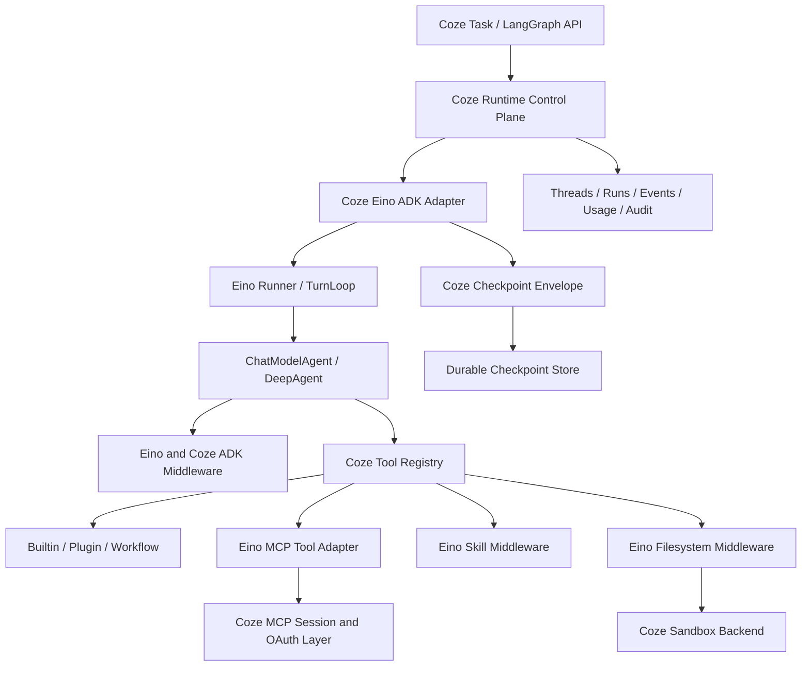

# Eino-First Go Agent Runtime Integration Design

Date: 2026-06-19
Status: Confirmed
Target level: Production
Depends on:

- `docs/superpowers/specs/2026-06-13-runtime-langgraph-api-design.md`
- `docs/superpowers/specs/2026-06-13-skills-mcp-security-design.md`
- `docs/superpowers/plans/2026-06-18-deerflow-2x-parity-master-roadmap.md`

## Decision

Coze Studio will use Eino `v0.9.9` and Eino ADK as the execution kernel for all
new Agent Harness behavior. Coze Studio remains the control plane and system of
record.

This is an Eino-first integration, not an Eino-owned platform:

1. Reuse Eino algorithms and execution primitives whenever their semantics
   satisfy the requirement.
2. Adapt Eino events, checkpoints, tools, Skills, usage, and callbacks through
   Coze-owned contracts.
3. Implement only the product, persistence, policy, security, tenancy, and
   compatibility capabilities that Eino does not provide.
4. Do not introduce a Python sidecar or fork Eino for platform-specific
   behavior.

## Why This Boundary

The current `backend/application/agentthread` Harness implements a small
planner-and-step loop. Extending that loop to reproduce DeerFlow 2.x would
duplicate stable functionality already present in Eino ADK:

- streaming Agent events and nested run paths;
- tool calling and return-direct behavior;
- address-based interrupt and targeted resume;
- immediate and safe-point cancellation, including recursive subagents;
- model retry and failover;
- ChatModelAgent middleware and tool wrappers;
- context summarization and tool-result reduction;
- dangling tool-call repair;
- dynamic tool search and deferred tools;
- Todo, plan-task, and plan-execute primitives;
- AgentTool and DeepAgent delegation;
- filesystem and streaming shell interfaces;
- progressive Skill discovery and forked Skill execution.

Coze must not maintain competing implementations of these algorithms.

## Architecture



## Ownership Matrix

### Eino-Owned Execution Primitives

Use Eino directly for:

1. `ChatModelAgent`, `Runner`, `AgentEvent`, streaming, and ReAct execution.
2. `AgentTool` and `DeepAgent` delegation.
3. `TurnLoop` push, preemption, safe-point stop, and resumable turn execution.
4. `Interrupt`, `StatefulInterrupt`, `CompositeInterrupt`,
   `ResumeWithParams`, and recursive cancellation.
5. model retry and model failover.
6. ChatModelAgent middleware ordering and model/tool wrappers.
7. `summarization`, `reduction`, and `patchtoolcalls` middleware.
8. `dynamictool/toolsearch`, including provider-native deferred tool search.
9. `plantask`, `planexecute`, and DeepAgent Todo primitives.
10. filesystem tools, multimodal read contracts, and shell interfaces.
11. Skill middleware with inline, fork, and fork-with-context execution.
12. Eino schema token usage, reasoning output, media parts, and callbacks.

### Coze-Owned Adapters

Build thin adapters for:

1. Eino `AgentEvent` to durable Coze run events and LangGraph SSE events.
2. Eino checkpoint bytes to a versioned Coze checkpoint envelope.
3. Coze interrupt IDs to Eino interrupt addresses and resume targets.
4. Coze cancellation commands to Eino cancel modes.
5. Coze model configuration to Eino model options, retry, and failover.
6. Coze Tool Registry results to Eino `tool.BaseTool`.
7. Coze Skill/version storage to Eino Skill `Backend`.
8. Coze Agent/model catalogs to Eino Skill `AgentHub` and `ModelHub`.
9. Coze sandbox workspace to Eino filesystem `Backend`, `Shell`, and
   `StreamingShell`.
10. Coze MCP server sessions to Eino MCP tools.
11. Eino callbacks and response metadata to Coze traces and token usage.

Adapters must not expose Eino-specific serialized structs through public APIs.

### Coze-Owned Product and Control Plane

Coze remains responsible for:

1. tasks, threads, messages, runs, events, ownership, and tenant isolation;
2. worker leases, heartbeats, retries, dead-letter handling, and recovery;
3. LangGraph-compatible HTTP, JSON, error, and SSE contracts;
4. Agent, Skill, MCP, model, memory, tool, sandbox, and settings CRUD;
5. Skill versions, publication, allowed-tools, scanning, quarantine, and
   audit;
6. MCP OAuth, encrypted secrets, transport configuration, health checks,
   session pools, and stdio sandboxing;
7. durable long-term memory extraction, correction, retrieval, and editing;
8. security policy, confirmation, scanning, sandboxing, and audit;
9. artifact registration, preview, download, retention, and access control;
10. token attribution, price snapshots, cost accounting, and reporting.

## Mandatory Runtime Composition

The default production Agent should be composed in this order:

1. Coze identity and immutable run context.
2. Coze policy and model capability resolution.
3. Eino summarization middleware.
4. Eino tool reduction middleware.
5. Eino `AGENTS.md` middleware when repository or workspace instructions apply.
6. Coze memory-context middleware.
7. Eino Skill middleware.
8. Eino dynamic tool-search middleware.
9. Eino dangling ToolCall repair middleware.
10. Coze guardrail and tool-policy wrapper.
11. Coze audit, trace, and usage wrappers.
12. Eino filesystem middleware backed by the Coze sandbox.

The actual handler order must have contract tests because Eino wrappers are
order-sensitive.

## Message Type Decision

Use `*schema.Message` as the production baseline.

Eino `v0.9.9` supports `*schema.AgenticMessage`, but its own API documents that
stream cancellation monitoring and retry are not fully wired for that message
type. `AgenticMessage` may be evaluated behind an experimental feature flag,
but it must not become the default until cancellation, retry, checkpoint,
streaming, and provider parity tests pass.

## Todo and Planning Decision

Do not enable both DeepAgent `write_todos` and `plantask` as independent
production facts.

1. Coze uses a durable task-plan store as the system of record.
2. The Agent sees Eino-compatible Todo/Plan tools.
3. A Coze-backed `plantask.Backend` persists plan state and emits task-detail
   events.
4. DeepAgent's in-session Todo helper may be used only for transient agent
   reasoning or disabled with `WithoutWriteTodos`.
5. `planexecute` is optional for explicit plan-execute modes; it is not the
   universal lead Agent.

## Skill Decision

Replace eager prompt concatenation with Eino Skill middleware after the ADK
path is enabled.

Coze must provide:

1. a database-backed Eino Skill `Backend`;
2. an `AgentHub` and `ModelHub`;
3. allowed-tool filtering before forked Skill execution;
4. resource paths mapped through the sandbox filesystem backend;
5. audit and confirmation for Skill management or risky execution.

The current prompt injection path remains only for legacy Harness compatibility.

## MCP Decision

Use the Eino MCP adapter for MCP tool conversion and runtime invocation.

Coze still owns:

1. durable server and tool records;
2. stdio, SSE, and streamable HTTP client construction;
3. OAuth and encrypted secret lifecycle;
4. session pooling, eviction, reconnect, and health state;
5. stdio command allowlists and sandbox execution;
6. policy, tenant authorization, audit, timeout, and output budgets.

The first production MCP slice covers MCP tools. MCP resources, prompts,
sampling, and elicitation are extension points, not required parity gates.

## Checkpoint Decision

Eino checkpoint bytes are opaque internal runtime data.

The Coze envelope must include:

```json
{
  "envelope_version": 1,
  "runtime": "eino_adk",
  "runtime_version": "0.9.9",
  "message_type": "schema.Message",
  "checkpoint_bytes": "<encrypted-or-base64-bytes>",
  "interrupts": {},
  "run_revision": 1,
  "created_at": 0,
  "migration": {}
}
```

Rules:

1. Public state APIs return Coze state, not gob data.
2. Checkpoint payloads must be size-limited and encrypted where required.
3. Interrupt state may contain only registered, serializable DTOs.
4. Runtime upgrades require replay fixtures and checkpoint migration tests.
5. A resume operation must produce one terminal outcome.

## Token and Observability Decision

Use Eino response metadata and callbacks as the raw source:

- prompt, completion, total, cached, and reasoning tokens;
- model and provider metadata;
- model, tool, Agent, and subagent callback boundaries;
- retry and failover events.

Coze adds:

- run, turn, step, middleware, Agent, and subagent attribution;
- pricing-version snapshots and estimated cost;
- idempotent persistence;
- OpenTelemetry spans, security decisions, and audit links.

## Capabilities Still Requiring New Middleware

The following are not delivered as complete Eino capabilities and require
Coze middleware or services:

1. repeated-action and semantic loop detection;
2. provider safety-finish classification and policy handling;
3. long-term memory extraction and asynchronous updates;
4. deterministic context budgets across memory, Skills, tools, files, and
   history;
5. authorization and allowed-tool intersection;
6. security scanning and human-confirmation policy;
7. artifact registration for offloaded outputs;
8. run feedback, follow-up suggestions, and title generation;
9. configuration doctor and provider connectivity diagnostics.

## Tool Permission Formula

The executable tool set is:

```text
registered and enabled tools
INTERSECT authenticated user and space permissions
INTERSECT Agent configuration
INTERSECT Skill allowed-tools
INTERSECT runtime mode policy
INTERSECT security decision
INTERSECT sandbox capability
```

The same resolved set must drive both Eino model-visible ToolInfo and actual
tool execution. Hiding a tool only from the model is not authorization.

## Estimated Work Reduction

Compared with implementing DeerFlow-equivalent runtime behavior directly:

| Area | Reduction |
| --- | ---: |
| Agent loop, streaming, interrupt, cancellation | 50-65% |
| Middleware and context management | 50-65% |
| Subagent execution | 35-50% |
| Filesystem and tool-result management | 20-30% |
| Skill runtime | 45-60% |
| Complete MCP product | 25-40% |
| Token extraction and tracing hooks | 20-30% |
| Security and production operations | 10-20% |

The revised remaining estimate is approximately 55-75 independently testable
tasks and 13.5-18.5 person-months. Sandbox infrastructure, Worker HA, MCP stdio
isolation, and LangGraph SDK compatibility remain the largest uncertainties.

## Acceptance Gates

1. No new production capability is added to the legacy ReAct Harness.
2. Legacy and ADK paths pass the same event and terminal-state contract suite.
3. Stream reconnect, cancellation, interrupt, and resume pass restart tests.
4. Nested subagents preserve checkpoint and recursive cancellation behavior.
5. Model-visible and executable tools are derived from the same policy result.
6. Skill inline/fork/fork-with-context behavior passes permission and replay
   tests.
7. MCP tools cannot bypass session, sandbox, secret, or authorization layers.
8. Token usage remains idempotent across retry, failover, reconnect, and
   resume.
9. Eino upgrades pass stored checkpoint replay fixtures before rollout.
