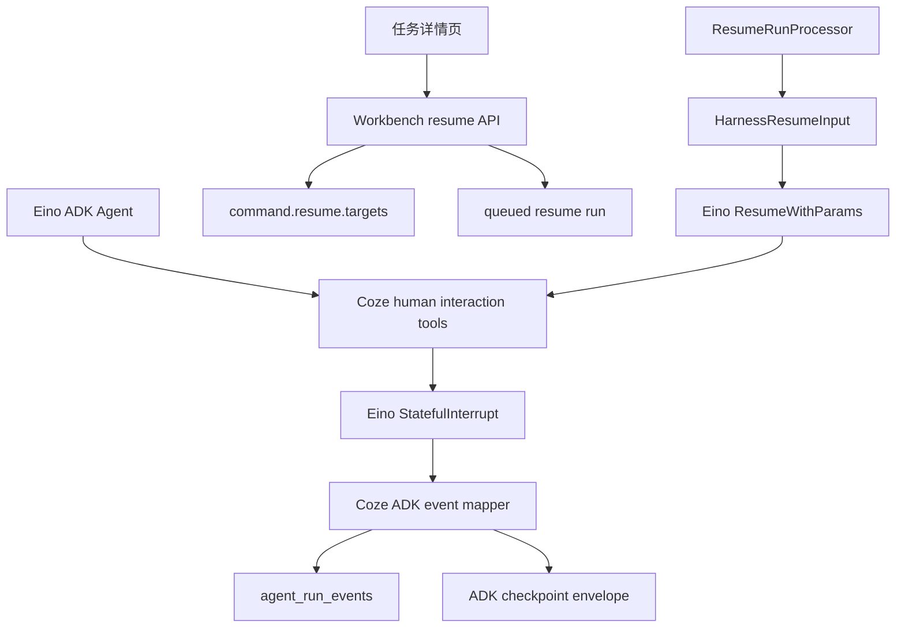

# Human Interrupt And Resume Design

Date: 2026-06-21
Status: Design confirmed, awaiting written spec review
Target level: Production
Depends on:

- `docs/superpowers/specs/2026-06-13-runtime-langgraph-api-design.md`
- `docs/superpowers/specs/2026-06-13-skills-mcp-security-design.md`
- `docs/superpowers/specs/2026-06-19-eino-first-agent-runtime-design.md`
- `docs/superpowers/plans/2026-06-18-deerflow-2x-parity-master-roadmap.md`

## Decision

Coze Studio will implement DeerFlow-style human clarification and human
confirmation as a Coze-owned interaction layer on top of Eino ADK
interrupt/resume.

The runtime must reuse Eino `StatefulInterrupt`, checkpointing, and
`ResumeWithParams`. Coze Studio owns the product contract, DTOs, workbench API,
task-detail UI, tenant checks, idempotency, event mapping, audit-ready metadata,
and LangGraph-compatible command shape.

When a human confirmation is rejected, the tool call returns a structured,
successful rejection result to the Agent. The Agent should revise its plan or
choose a safer alternative. Rejection does not cancel the task. Only an explicit
task cancellation command moves the run to `canceled`.

## Scope

This design covers M2.11 in the DeerFlow 2.x parity roadmap:

1. Built-in ADK tools for asking the user a clarification and requesting human
   confirmation.
2. Stable Coze DTOs for interaction prompts and resume responses.
3. Workbench task resume API for submitting clarification answers and
   confirmation decisions.
4. LangGraph-compatible `command.resume.targets` support for resume data.
5. Task-detail UI for rendering pending human interactions and submitting
   responses.
6. Contract tests for ADK interrupt/resume, event payloads, resume command
   parsing, API behavior, and frontend projection.

## Non-Goals

1. IM Channels are not implemented.
2. Complex security scanning, tool sandbox policy, MCP stdio governance, and
   full audit-table design remain in the Skills/MCP/security phase.
3. This design does not add a Python sidecar.
4. This design does not change the product navigation name. The business object
   remains `任务`.
5. This design does not add a new database table. M2.11 uses existing runs,
   messages, events, checkpoint envelopes, command JSON, and metadata JSON.

## Current Context

The current ADK path already has the main execution primitives:

1. `ADKExecutor.Resume` calls Eino `Runner.ResumeWithParams`.
2. `RunInterruptedError` carries checkpoint keys and interrupt items.
3. `adk_event_mapper.go` maps ADK interrupted actions to `run.interrupted`.
4. `ADKCheckpointEnvelope` stores Eino checkpoint bytes and interrupt mappings.
5. `ResumeRunProcessor` claims queued resume runs and loads checkpoints.
6. `loadADKResumeInput` currently fills `ADKResumeTargets` with `nil` target
   data.
7. LangGraph run creation can already create queued checkpoint-resume runs.
8. Workbench task run creation currently creates ordinary pending runs and does
   not expose a product-friendly resume endpoint.
9. Task detail has run event projection and streaming, but no pending human
   interaction card.

M2.11 therefore extends the existing resume chain instead of building a second
waiting system.

## User Experience

### Clarification

When the Agent lacks required information, it calls the clarification tool. The
task detail page shows an inline prompt above the composer:

1. question text;
2. optional choices;
3. optional free-text input;
4. submit button with loading and error states.

Submitting the answer creates a queued resume run. The original interrupted run
remains historical. The resume run continues from the checkpoint and returns the
answer to the interrupted tool call.

### Confirmation

When the Agent is about to perform a sensitive or high-impact action, it calls
the confirmation tool. The task detail page shows:

1. action title;
2. concise action summary;
3. risk level;
4. consequences or affected resources;
5. approve and reject buttons;
6. optional comment input.

If approved, the tool returns `approved=true`. If rejected, the tool returns
`approved=false` and a rejection reason. The Agent continues running and should
choose a different path.

### Composer Behavior

When there is a pending human interaction, the normal follow-up composer remains
visible but should not be the primary action. The human interaction card is the
primary action. The composer may be disabled with a short state label while a
required clarification or confirmation is pending.

## Architecture



## Stable DTOs

The public product contract must use Coze DTOs. Eino interrupt addresses and
checkpoint bytes are internal runtime details.

### Human Interaction Prompt

```json
{
  "schema": "coze.human_interaction.v1",
  "interaction_id": "hi_123",
  "kind": "clarification",
  "title": "需要补充信息",
  "question": "请选择要分析的时间范围",
  "description": "用于继续生成报告",
  "required": true,
  "allow_free_text": true,
  "choices": [
    {
      "id": "last_7_days",
      "label": "最近 7 天",
      "value": "last_7_days"
    }
  ],
  "risk_level": "none",
  "tool_name": "ask_user_clarification",
  "tool_call_id": "call_123",
  "policy_ref": "",
  "created_at": 1782000000
}
```

`kind` values:

1. `clarification`
2. `confirmation`

`risk_level` values:

1. `none`
2. `low`
3. `medium`
4. `high`
5. `critical`

The DTO must be checkpoint-serializable. It must not contain `error`, function,
channel, stream, open file, HTTP client, database handle, or unregistered
interface values.

### Confirmation-Specific Fields

Confirmation prompts add these fields:

```json
{
  "action": "delete_remote_file",
  "summary": "删除远端工作区中的临时文件",
  "consequences": ["文件删除后无法从任务结果中恢复"],
  "affected_resources": ["workspace:/tmp/report.csv"],
  "default_decision": "reject",
  "rejection_guidance": "如果用户拒绝，请保留文件并提供替代方案。"
}
```

Tool arguments and resource names must be redacted or summarized before being
placed in prompt DTOs. Raw secrets, OAuth tokens, MCP environment values,
private file contents, and large tool arguments must not appear in the event
payload.

### Resume Response

Workbench and LangGraph resume both submit target data using this shape:

```json
{
  "schema": "coze.human_interaction_response.v1",
  "interaction_id": "hi_123",
  "kind": "confirmation",
  "decision": "rejected",
  "answer": "",
  "choice_id": "",
  "comment": "不要删除，先给我备份方案。",
  "submitted_by": "user",
  "submitted_at": 1782000100,
  "source": "workbench"
}
```

`decision` values:

1. `answered` for clarification;
2. `approved` for confirmation approval;
3. `rejected` for confirmation rejection.

The backend validates the response kind against the prompt kind when the prompt
is available in the checkpoint envelope. Unknown fields are ignored for forward
compatibility, but invalid required fields are rejected.

## Built-In ADK Tools

### `ask_user_clarification`

Purpose: ask the user for missing information needed to continue the task.

Input schema:

```json
{
  "question": "string, required",
  "description": "string, optional",
  "choices": "array of {id,label,value}, optional",
  "allow_free_text": "boolean, optional, default true",
  "required": "boolean, optional, default true"
}
```

Runtime behavior:

1. Build a `clarification` prompt DTO.
2. Call Eino `tool.StatefulInterrupt` with prompt DTO as interrupt info and a
   small serializable state object.
3. On resume, read `tool.GetResumeContext[HumanInteractionResponse]`.
4. Validate `decision=answered`.
5. Return a JSON string result containing the selected choice and free-text
   answer.

Tool return:

```json
{
  "schema": "coze.human_interaction_tool_result.v1",
  "kind": "clarification",
  "answered": true,
  "answer": "最近 7 天",
  "choice_id": "last_7_days"
}
```

### `request_human_confirmation`

Purpose: pause before a high-impact or policy-sensitive action and obtain human
approval.

Input schema:

```json
{
  "title": "string, required",
  "summary": "string, required",
  "action": "string, optional",
  "risk_level": "none|low|medium|high|critical, optional",
  "consequences": "array of string, optional",
  "affected_resources": "array of string, optional",
  "rejection_guidance": "string, optional"
}
```

Runtime behavior:

1. Build a `confirmation` prompt DTO.
2. Call Eino `tool.StatefulInterrupt`.
3. On resume, read `tool.GetResumeContext[HumanInteractionResponse]`.
4. If approved, return `approved=true`.
5. If rejected, return `approved=false` and do not fail the run.

Tool return for rejection:

```json
{
  "schema": "coze.human_interaction_tool_result.v1",
  "kind": "confirmation",
  "approved": false,
  "decision": "rejected",
  "comment": "不要删除，先给我备份方案。",
  "guidance": "User rejected the action. Choose a safer alternative."
}
```

## Eino Integration

The tools are ordinary Eino `tool.BaseTool` instances and are added by the ADK
agent factory after Coze policy has resolved the base runtime context.

Rules:

1. The tools are available only in the Eino ADK runtime.
2. The tools are not exposed as external MCP or plugin tools.
3. The tools use JSON Schema and Eino `v0.9.x` schema modifier patterns.
4. Prompt DTOs and state DTOs must be JSON-checkpoint-safe.
5. Resume data is passed through `ResumeWithParams.Targets`.
6. The old `InterruptAndRerun` compatibility API is not used.

Middleware order:

1. model and run context;
2. summarization and reduction;
3. `AGENTS.md`, memory, Skill, and dynamic tool search;
4. ToolCall repair;
5. policy, audit, usage wrappers;
6. built-in human interaction tools as executable tools in the same filtered
   tool set.

The model-visible tool set and executable tool set must come from the same
policy result. A human confirmation tool must not be visible if the executable
tool is absent.

## Checkpoint And Resume Command

### Command Shape

Queued resume runs use the existing `command.resume` envelope plus target data:

```json
{
  "resume": {
    "checkpoint_id": 123,
    "checkpoint_ns": "eino.adk",
    "thread_id": "456",
    "run_id": "789",
    "resume_from": "interrupt",
    "guard": "coze_checkpoint_resume_v1",
    "targets": {
      "interrupt_abc": {
        "schema": "coze.human_interaction_response.v1",
        "interaction_id": "hi_123",
        "kind": "clarification",
        "decision": "answered",
        "answer": "最近 7 天",
        "choice_id": "last_7_days",
        "submitted_by": "user",
        "submitted_at": 1782000100,
        "source": "workbench"
      }
    }
  }
}
```

`targets` keys are Coze interrupt IDs. The checkpoint envelope retains the Eino
address mapping. `ResumeRunProcessor` converts the map to
`HarnessResumeInput.ADKResumeTargets`.

### Backward Compatibility

If `targets` is absent, ADK resume keeps the existing behavior and passes `nil`
for every known interrupt target. This preserves current tests and LangGraph
checkpoint resume flows.

If `targets` is present:

1. every target key must exist in the checkpoint envelope interrupts;
2. payload size per target is bounded;
3. only JSON-compatible values are accepted;
4. the map is passed unchanged as Eino resume data after validation.

### Source Run Scope

Fresh runs own a new plan scope. Resume runs set `RunSummary.PlanScopeRunID` to
the interrupted source run. This preserves the existing durable plan behavior:
the Agent continues the same run plan, while events, usage, and terminal status
remain attributed to the active resume run.

## Workbench API

Add a product-level endpoint:

```text
POST /api/workbench/task_threads/:thread_id/runs/:run_id/resume
```

`run_id` is the interrupted source run. The backend resolves the latest
resumable ADK checkpoint for that run.

Request:

```json
{
  "interrupt_id": "interrupt_abc",
  "response": {
    "schema": "coze.human_interaction_response.v1",
    "interaction_id": "hi_123",
    "kind": "confirmation",
    "decision": "approved",
    "comment": ""
  },
  "idempotency_key": "optional-client-key"
}
```

Response:

```json
{
  "code": 0,
  "msg": "success",
  "data": {
    "run": {
      "run_id": "1001",
      "thread_id": "456",
      "status": "queued"
    }
  }
}
```

Backend behavior:

1. Validate the thread and source run relationship.
2. Require source run status `interrupted`.
3. Resolve the latest active ADK checkpoint for the source run.
4. Validate the interrupt ID against the checkpoint envelope.
5. Validate response schema, kind, decision, choice, answer, comment, and size.
6. Build `command.resume.targets`.
7. Create a queued resume run with existing runtime policy checks.
8. Append a user message for transcript visibility with metadata marking it as
   a human interaction response. This message is not used as model input for
   the checkpoint resume.
9. Emit `human.interaction.resolved` as a run event for the resume run, with
   `source_run_id`, `interrupt_id`, `interaction_id`, `kind`, and `decision`.

Idempotency:

1. If the client provides `idempotency_key`, use it.
2. Otherwise derive a stable key from thread ID, source run ID, interrupt ID,
   interaction ID, decision, and normalized response hash.
3. Repeated requests with the same key return the existing resume run when
   possible.

## LangGraph API Compatibility

LangGraph run creation already supports checkpoint resume by accepting
checkpoint IDs in `command` or `config`.

M2.11 extends that path:

1. Preserve user-provided `command.resume.targets`.
2. Merge Coze checkpoint readiness fields without dropping target data.
3. Validate target IDs against the checkpoint envelope.
4. Keep `status=queued` for checkpoint resume runs.
5. Return LangGraph-compatible errors for invalid target IDs or non-resumable
   checkpoints.

This lets API users resume a human interrupt without using the workbench
endpoint:

```json
{
  "command": {
    "resume": {
      "checkpoint_id": 123,
      "targets": {
        "interrupt_abc": {
          "schema": "coze.human_interaction_response.v1",
          "kind": "clarification",
          "decision": "answered",
          "answer": "最近 7 天"
        }
      }
    }
  }
}
```

## Event Contract

### `run.interrupted`

Existing event type remains. When the interrupt info contains a Coze human
interaction prompt, the payload includes:

```json
{
  "agent_name": "lead",
  "interrupts": [
    {
      "id": "interrupt_abc",
      "address": "lead/tools/0",
      "info": {
        "schema": "coze.human_interaction.v1",
        "kind": "confirmation",
        "interaction_id": "hi_123"
      },
      "is_root_cause": true
    }
  ],
  "human_interaction": {
    "schema": "coze.human_interaction.v1",
    "kind": "confirmation",
    "interaction_id": "hi_123"
  }
}
```

The `human_interaction` field is a normalized copy of the root-cause prompt.
If multiple root-cause human prompts exist, the payload includes
`human_interactions` with all prompts and `human_interaction` with the first
prompt for single-card clients.

### `human.interaction.resolved`

This event is emitted by the resume API:

```json
{
  "source_run_id": "789",
  "resume_run_id": "1001",
  "interrupt_id": "interrupt_abc",
  "interaction_id": "hi_123",
  "kind": "confirmation",
  "decision": "rejected",
  "source": "workbench"
}
```

No raw answer content is required in this event. If an answer is included for
clarification, it must obey the same length and redaction limits as messages.

## Frontend Design

The task detail page keeps the product language as `任务`.

Add a small projection module that derives pending human interactions from run
events:

1. Read `run.interrupted` events with `human_interaction` or
   `human_interactions`.
2. Read `human.interaction.resolved` events.
3. Build unresolved prompts keyed by `interrupt_id` and `interaction_id`.
4. Prefer the latest unresolved root-cause prompt.
5. Return a typed view model for the UI card.

Components:

1. `TaskHumanInterruptCard`
2. `ClarificationForm`
3. `ConfirmationActions`
4. `resumeTaskThreadRun` service wrapper

Use the repository's Semi/Coze Design system:

1. Prefer `@coze-arch/coze-design` components.
2. Prefer `@coze-arch/coze-design/icons`.
3. Query Semi MCP before custom component styling when component API details
   are unclear.
4. Keep custom CSS limited to layout within the existing task detail surface.

States:

1. pending prompt;
2. submitting;
3. submitted locally;
4. backend validation error;
5. stale prompt resolved by another resume run;
6. multiple pending prompts with one active card and a compact count label.

The UI must not display Eino addresses as primary user-facing text. Addresses
may be available only in debug metadata if the existing page exposes debug
details.

## Security And Validation

M2.11 does not implement the full security scanner, but it must keep production
boundaries ready:

1. Prompt DTOs are redacted and bounded.
2. Resume responses are bounded.
3. Only known decision values are accepted.
4. Confirmation rejection never executes the sensitive action by itself.
5. Approval only returns approval to the Agent; downstream tool policy still
   decides whether a tool can execute.
6. Workbench resume validates thread/run/checkpoint ownership.
7. LangGraph resume validates target IDs before queueing.
8. Events do not include secrets, token values, raw file contents, or object
   storage URIs.
9. The response message metadata marks the message as a human interaction
   response so future audit and retention jobs can classify it.

Recommended length limits:

1. question, title, and summary: 2 KB each;
2. description and rejection guidance: 4 KB each;
3. answer and comment: 8 KB each;
4. total prompt DTO: 32 KB;
5. total response DTO per target: 16 KB.

## Failure Handling

1. Missing checkpoint: reject resume request with a validation error.
2. Source run not interrupted: reject resume request.
3. Unknown interrupt ID: reject resume request.
4. Invalid response kind or decision: reject resume request.
5. Resume worker fails before Eino invocation: mark resume run failed with an
   explicit error code.
6. Tool resumes without data: interrupt again with the same prompt.
7. Confirmation rejected: return a normal tool result and continue the Agent.
8. User cancels task: cancel the active run through the existing cancellation
   path.

## Observability

M2.11 should emit enough metadata for later production audit without adding a
new audit table:

1. `run.interrupted` includes normalized prompt metadata.
2. `human.interaction.resolved` records source run, resume run, interrupt ID,
   interaction ID, kind, and decision.
3. Resume run metadata includes `checkpoint_resume.source_run_id`,
   `checkpoint_resume.interrupt_ids`, and `checkpoint_resume.human_interaction`.
4. Tool result includes a schema name and decision.
5. Logs use IDs and decisions, not raw answers or secret-bearing summaries.

## Testing Plan

Backend unit tests:

1. `ask_user_clarification` interrupts first and returns answer after targeted
   resume data.
2. `request_human_confirmation` interrupts first, returns approved result, and
   returns rejected result without error.
3. Prompt DTO validation rejects non-serializable or oversized data.
4. `parseResumeRunPayload` accepts `resume.targets`.
5. `loadADKResumeInput` maps targets into `ADKResumeTargets`.
6. Missing targets preserves current nil-target behavior.
7. Event mapper normalizes human prompt payloads.

Backend handler tests:

1. Workbench resume endpoint creates queued resume run.
2. Endpoint rejects non-interrupted source runs.
3. Endpoint rejects unknown interrupt IDs.
4. Endpoint records idempotent duplicate submissions.
5. Endpoint emits `human.interaction.resolved`.
6. LangGraph create run preserves `command.resume.targets`.

ADK contract tests:

1. End-to-end interrupted run resumes with clarification answer.
2. End-to-end confirmation rejection lets Agent continue and produce a final
   answer.
3. Restart replay uses checkpoint envelope and target data only.
4. Multiple interrupts resume only the selected target.

Frontend tests:

1. Projection extracts pending clarification prompt.
2. Projection hides prompt after matching resolved event.
3. Clarification card submits answer through resume API.
4. Confirmation card submits approve and reject decisions.
5. Invalid and stale prompt states render accessible errors.

Verification commands:

```bash
GOCACHE=/private/tmp/coze-go-build go test -race ./application/agentthread ./api/handler/coze ./domain/agentthread/service
npm run test -- src/pages/tasks/__tests__/tasks.test.tsx src/pages/tasks/__tests__/task-detail.test.tsx
./node_modules/.bin/eslint src/pages/tasks/detail.tsx src/pages/tasks/task-event-projection.ts --no-cache
git diff --check
```

The backend full test gate remains:

```bash
GOCACHE=/private/tmp/coze-go-build go test -p 1 -gcflags='all=-l -N' ./...
```

## Rollout

1. The feature is active only for the Eino ADK runtime path.
2. Legacy Harness behavior is unchanged.
3. Workbench resume endpoint is safe to expose because it validates source run,
   checkpoint, and interrupt ID before queueing.
4. LangGraph resume remains backward compatible when `targets` is absent.
5. Frontend should render nothing when no human interaction prompt is present.

## Acceptance Criteria

1. A task can pause for clarification and continue after the user answers.
2. A task can pause for confirmation and continue after approval.
3. A rejected confirmation does not fail or cancel the run.
4. Workbench task detail shows a clear pending interaction card using the
   existing Semi/Coze Design system.
5. Resume requests are idempotent.
6. Existing checkpoint resume tests continue passing.
7. LangGraph-compatible resume supports target data.
8. No Eino gob structs or runtime-only values leak into public API payloads.
9. No new database migration is required for M2.11.
