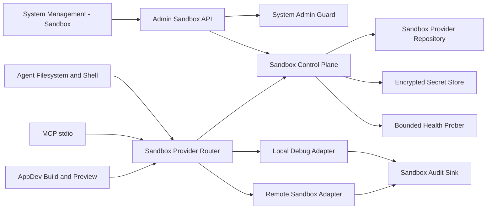

# Nuwax Sandbox Parity Design

Date: 2026-07-15

## 1. Context

Coze Studio already contains several sandbox-related building blocks, but they
do not form one production control plane:

- `idl/admin/config.thrift` defines a single `SandboxConfig` with environment,
  filesystem, process, network, FFI, timeout, and memory restrictions.
- `backend/infra/coderunner/impl` consumes that configuration for code runner
  execution.
- AppDev resolves an enabled `appdev` remote provider from the persistent
  Sandbox provider repository. Remote endpoints must use HTTPS and provider
  credentials remain encrypted at rest.
- MCP stdio has policy and sandbox boundaries, but the project documentation
  still records the concrete production provider as incomplete.
- Runtime Doctor can display a bounded sandbox summary, while the new system
  management page does not expose a typed sandbox management workflow.

The local Nuwax reference provides a system-level `enabledSandbox` switch,
sandbox configuration management, a dedicated sandbox backend module, runtime
request rewriting, and provider lifecycle services. Visual parity alone would
therefore be insufficient. Coze must align both the administrator workflow and
the runtime isolation boundary.

This design introduces a Go-native Sandbox Control Plane. It does not copy the
Nuwax Java module and does not add a Java or Python sidecar.

## 2. Goals

1. Add a production system-management workflow for sandbox providers.
2. Persist provider configuration, health state, supported scopes, and policy
   limits with system-admin authorization and auditability.
3. Route Agent, MCP stdio, and AppDev execution through one fail-closed provider
   selection contract.
4. Keep host execution available only in explicit local debug mode.
5. Protect credentials, internal endpoints, host paths, and provider responses
   from Workbench and browser exposure.
6. Provide deterministic tests and in-app-browser acceptance evidence for all
   administrator and runtime states.

## 3. Non-goals

1. Reimplement Nuwax subscription, payment, marketplace, or full menu-RBAC
   modules.
2. Expose arbitrary host shell execution to users or models.
3. Store provider tokens in plaintext or return them through read APIs.
4. Treat an iframe `sandbox` attribute as the runtime isolation boundary.
5. Migrate existing production workloads automatically before a provider passes
   health and capability checks.
6. Make legacy `sandbox_config` the long-term primary data source.

## 4. Parity Boundary

The completed feature must cover these Nuwax-visible capabilities:

| Capability | Required Coze behavior |
| --- | --- |
| Global availability | Administrators can see whether sandbox execution is available without reading environment variables. |
| Provider management | Create, edit, enable, disable, delete, list, and inspect providers. |
| Default selection | Select a default provider per supported runtime scope. |
| Health check | Run a real bounded connectivity and capability probe and retain the safe result. |
| Runtime routing | Agent, MCP stdio, and AppDev resolve providers through the same control-plane projection. |
| Limits | Configure bounded timeout, memory, concurrency, network, process, filesystem, FFI, and Node module policies. |
| Safety | Production fails closed and never silently falls back to host execution. |
| Audit | Record administrator mutations, health probes, provider selection, denial, timeout, and normalized failure metadata. |

## 5. Architecture



The control plane owns persisted configuration and safe projections. The router
owns runtime selection. Provider adapters own transport-specific behavior. No
consumer reads database rows or decrypts credentials directly.

## 6. Domain Model

### 6.1 Sandbox Provider

`SandboxProvider` contains:

| Field | Meaning |
| --- | --- |
| `id` | Stable provider identifier. |
| `name` | Administrator-visible unique name. |
| `provider_type` | `remote` or `local_debug`. |
| `endpoint` | Canonical provider endpoint. Empty only for `local_debug`. |
| `secret_ref` | Opaque encrypted-secret reference. Never returned to the frontend. |
| `supported_scopes` | Bounded set of `agent`, `mcp_stdio`, and `appdev`. |
| `enabled` | Whether new runtime selection may use the provider. |
| `is_default` | Default flag resolved independently for each supported scope. |
| `policy` | Validated execution policy projection. |
| `health_status` | `unknown`, `healthy`, `degraded`, or `unhealthy`. |
| `health_message` | Sanitized bounded message without endpoint internals or provider body. |
| `last_checked_at` | Last completed probe time. |
| `created_by` | Authenticated system administrator ID. |
| `created_at` | Creation time. |
| `updated_at` | Last mutation time. |
| `version` | Optimistic-lock version. |

### 6.2 Policy

The policy projection contains bounded values rather than free-form runtime
configuration:

- timeout seconds
- memory limit MB
- maximum concurrent sessions
- maximum output bytes
- allowed environment variable names
- allowed virtual read prefixes
- allowed virtual write prefixes
- allowed executable names
- allowed network host patterns
- FFI enabled flag
- Node modules mode and optional approved directory reference

Host paths, arbitrary command strings, environment values, and credentials are
not accepted through this policy.

### 6.3 Health Projection

Health checks return only:

- normalized status
- capability flags for the three runtime scopes
- bounded latency bucket
- sanitized reason code
- checked time

Raw provider bodies, stack traces, internal IP addresses, authentication
details, and runner versions are not exposed by the Workbench API.

## 7. Persistence

Add a migration for these tables:

| Table | Purpose |
| --- | --- |
| `sandbox_providers` | Provider identity, endpoint, status, safe policy, health projection, optimistic lock, and audit timestamps. |
| `sandbox_provider_defaults` | One active default provider per runtime scope. |
| `sandbox_provider_audit_events` | Bounded mutation, probe, selection, denial, and failure metadata. |

Provider secrets use the existing encrypted secret infrastructure. If that
infrastructure is unavailable, provider creation and credential replacement
fail closed. Secrets are not stored inside the policy JSON.

The legacy `BasicConfiguration.sandbox_config` remains a read-only migration
source during rollout. A migration adapter may create one disabled provider
projection from it, but new writes use the new repository only.

## 8. Runtime Contracts

```go
type SandboxScope string

const (
	SandboxScopeAgent   SandboxScope = "agent"
	SandboxScopeMCP     SandboxScope = "mcp_stdio"
	SandboxScopeAppDev  SandboxScope = "appdev"
)

type SandboxProviderRouter interface {
	Resolve(ctx context.Context, req ResolveSandboxRequest) (SandboxRuntime, error)
}

type SandboxRuntime interface {
	Create(ctx context.Context, req CreateSandboxRequest) (SandboxSession, error)
	Get(ctx context.Context, sessionID string) (SandboxSession, error)
	Execute(ctx context.Context, req ExecuteSandboxRequest) (SandboxExecution, error)
	Close(ctx context.Context, sessionID string) error
	Health(ctx context.Context) (SandboxHealth, error)
}
```

The router resolves an enabled and healthy provider that supports the requested
scope. Explicit provider selection is allowed only through server-owned policy,
not a user-submitted provider ID.

Resolution behavior is deterministic:

1. Validate authenticated tenant, user, space, thread, and run ownership.
2. Resolve the server-owned default provider for the runtime scope.
3. Verify enabled state, health state, scope capability, concurrency, and policy.
4. Decrypt credentials only inside the adapter call boundary.
5. Emit a bounded audit event for selection or denial.
6. Return a normalized error without falling back to another trust boundary.

## 9. Provider Adapters

### 9.1 Remote Sandbox

The production adapter requires HTTPS, request authentication, timeout,
idempotency, cancellation, response size limits, SSRF protection, and a bounded
capability handshake. Loopback, link-local, metadata-service, and private target
ranges are rejected unless an explicit deployment allowlist permits them.

### 9.2 Local Debug

The local adapter wraps the existing Code Runner restrictions. It is available
only when all of these conditions are true:

- `APP_ENV=debug`
- an explicit host-runtime feature flag is enabled
- the provider type is `local_debug`
- the requested scope is allowed by local policy

It cannot be enabled in production or shared test environments.

### 9.3 AppDev Production Wiring

The persistent Sandbox provider repository is the only production source for
the AppDev remote endpoint, credential, enabled state, and `appdev` scope.
`APP_DEV_RUNNER_ENDPOINT` and `APP_DEV_RUNNER_TOKEN` have been removed and are
not compatibility inputs.

Production wiring requires `SANDBOX_CONTROL_PLANE_ENABLED=true`, an enabled
default remote provider with an HTTPS endpoint and encrypted credential, and a
stable keyring supplied through `SANDBOX_CREDENTIAL_KEYS_JSON` plus
`SANDBOX_CREDENTIAL_ACTIVE_KEY_ID`. The same stable keyring protects provider
credentials and encrypted execution checkpoints across restarts. It also
requires production Redis, object storage,
`APP_DEV_PREVIEW_GATEWAY_BASE_URL`, `APP_DEV_ARTIFACT_GATEWAY_BASE_URL`, and
`APP_DEV_PROVIDER_AUTH_TOKEN`; trusted proxy deployments additionally configure
`APP_DEV_ARTIFACT_TRUSTED_PROXY_CIDRS`. Missing dependencies fail closed without
an in-memory or host-runtime fallback.

Host execution and loopback HTTP preview/artifact gateways are allowed only
when both `APP_ENV=debug` and `APP_DEV_HOST_RUNTIME_ENABLED=true`. The HTTP
exception accepts literal loopback IP addresses only, not `localhost` DNS.

### 9.4 Agent and MCP

Agent filesystem/shell and MCP stdio use virtual paths and bounded executable
names. They do not receive provider endpoints, secrets, host work directories,
or raw sandbox session metadata.

## 10. Admin API

All endpoints require the existing server-side system-admin guard.

| Method | Path | Purpose |
| --- | --- | --- |
| `GET` | `/api/admin/sandboxes` | List safe provider projections with filters and pagination. |
| `POST` | `/api/admin/sandboxes` | Create a provider and encrypted credential reference. |
| `GET` | `/api/admin/sandboxes/:id` | Read a safe provider projection. |
| `PUT` | `/api/admin/sandboxes/:id` | Update metadata, scopes, and policy with optimistic locking. |
| `DELETE` | `/api/admin/sandboxes/:id` | Delete an unused non-default provider. |
| `POST` | `/api/admin/sandboxes/:id/enable` | Enable a provider after validation. |
| `POST` | `/api/admin/sandboxes/:id/disable` | Disable a provider and prevent new selection. |
| `POST` | `/api/admin/sandboxes/:id/credentials` | Replace credentials without returning them. |
| `POST` | `/api/admin/sandboxes/:id/health` | Run a bounded real health probe. |
| `POST` | `/api/admin/sandboxes/:id/defaults` | Set defaults for validated supported scopes. |
| `GET` | `/api/admin/sandboxes/:id/audit-events` | List bounded administrator and runtime audit projections. |

Mutation endpoints use idempotency keys where retries could duplicate work.
Delete, disable, and default changes reject stale versions.

## 11. System Management UI

Add a second-level `沙箱管理` item under `系统配置`. The page follows the
Nuwax information architecture while preserving Coze Design components and
accessibility behavior.

The page includes:

- summary cards for total, enabled, unhealthy, and runtime-scope coverage
- provider search, type, scope, status, and health filters
- provider table with safe endpoint display and last health time
- create and edit sheet
- credential replacement flow
- enable, disable, delete, health-test, and set-default actions
- scope badges for Agent, MCP stdio, and AppDev
- policy editor with bounded numeric inputs and controlled lists
- provider details and audit drawer

Required states are loading, empty, error, refreshing, disabled, readonly,
conflict, permission denied, unhealthy, and stale-health warning.

The UI never displays secret values, request authorization headers, raw health
responses, host paths, or internal sandbox session IDs.

## 12. Error Handling

Public errors use stable codes:

| Code | Meaning |
| --- | --- |
| `SANDBOX_PROVIDER_NOT_FOUND` | Provider does not exist in the authorized control plane. |
| `SANDBOX_PROVIDER_DISABLED` | Provider cannot accept new work. |
| `SANDBOX_PROVIDER_UNHEALTHY` | Health policy blocks selection. |
| `SANDBOX_SCOPE_UNSUPPORTED` | Provider does not support the requested runtime scope. |
| `SANDBOX_POLICY_DENIED` | A bounded policy rule rejected the request. |
| `SANDBOX_CAPACITY_EXCEEDED` | Concurrency or quota is exhausted. |
| `SANDBOX_TIMEOUT` | Provider or execution exceeded its bounded deadline. |
| `SANDBOX_CONFIGURATION_INVALID` | Administrator configuration failed validation. |
| `SANDBOX_VERSION_CONFLICT` | Optimistic-lock version is stale. |
| `SANDBOX_UNAVAILABLE` | No eligible production provider exists. |

Provider details remain in protected logs and bounded audit metadata. They are
not copied into user-facing error messages.

## 13. Security Requirements

1. Every admin API revalidates system-admin authorization on the server.
2. User-submitted `space_id`, `user_id`, provider ownership, and default flags
   are never trusted without authenticated projection.
3. Provider credentials are encrypted and replaced through write-only APIs.
4. Remote endpoints pass scheme, hostname, DNS rebinding, redirect, and IP range
   checks before every connection.
5. Production cannot select `local_debug` or silently execute on the host.
6. Filesystem access uses virtual paths and approved prefixes.
7. Process execution uses approved executable names and bounded arguments.
8. Network, output, memory, timeout, and concurrency limits are enforced in the
   adapter, not only validated in the UI.
9. Audit events contain bounded metadata and never contain prompts, tool
   arguments, tool results, credentials, provider bodies, or object URIs.

## 14. Delivery Slices

### Slice 1: Control Plane

- domain entity, repository, migrations, encrypted secret integration
- admin API, service authorization, validation, health prober, and audit
- system-management Sandbox page and browser acceptance
- legacy configuration read adapter

### Slice 2: Runtime Router

- shared router and remote/local adapters
- AppDev runtime migration
- Agent filesystem/shell integration
- MCP stdio integration
- deterministic provider selection and normalized failures

### Slice 3: Production Hardening

- concurrency leases, cancellation, idempotency, retries, and cleanup
- SSRF and redirect enforcement
- Runtime Doctor, metrics, audit UI, and operational runbook
- fault injection, security tests, migration rollback, and production gates

All three slices are required before claiming full Nuwax sandbox parity.

## 15. Testing and Acceptance

### Backend

- entity validation and optimistic locking
- repository tenant isolation and unique defaults
- admin authorization for every endpoint
- secret write-only behavior and log redaction
- endpoint and SSRF validation
- health probe success, timeout, malformed response, auth failure, and redaction
- router scope, health, capacity, environment, and fail-closed behavior
- Agent, MCP stdio, and AppDev adapter integration tests
- audit event bounds and prohibited-field tests

### Frontend

- list, filters, pagination, empty, loading, error, and refresh
- create, edit, credential replacement, enable, disable, delete, and default
- policy validation and version-conflict recovery
- safe projection tests proving secrets and internal fields never render
- permission-denied and readonly states

### Migration

- Atlas hash and validate
- legacy single configuration projection
- idempotent migration retry
- no production default activation without a passing health probe

### Browser Acceptance

Use the Codex in-app browser and record:

- exact system-management URL and administrator account
- provider list and all safe visible fields
- create, edit, health test, enable, set-default, disable, and delete flows
- failed health probe and version-conflict behavior
- AppDev, Agent, and MCP stdio execution through the configured defaults
- console errors and server-side normalized audit evidence

## 16. Rollout and Compatibility

1. Ship schema and read-only APIs with runtime routing disabled.
2. Import a disabled projection from legacy configuration when present.
3. Let administrators configure and health-check remote providers.
4. Enable AppDev routing for selected environments.
5. Enable Agent and MCP scopes after their targeted acceptance suites pass.
6. Remove environment-only compatibility after the documented migration window.
7. Keep local debug execution unavailable outside explicit debug mode throughout
   the rollout.

Rollback disables new runtime routing while retaining the Provider control plane
and audit data. Running workloads finish or are explicitly cancelled. It never
returns to an environment-only endpoint, another Provider, or host execution in
production.

### Implementation Status

| Capability | Status | Evidence |
| --- | --- | --- |
| Provider CRUD, health, defaults, and encrypted credentials | implemented | Sandbox application and infra targeted tests |
| Scope routing, capacity, timeout, and cancellation | implemented | Router, Service, and Provider targeted tests |
| Agent, AppDev, MCP, and CodeRunner integration | implemented | application, infra/appdev, and mcpruntime targeted tests |
| Runtime Doctor bounded projection | implemented | Workbench backend and frontend component tests |
| Low-cardinality Prometheus metrics | implemented | Sandbox metrics tests; deployment flag remains opt-in |
| Configuration and runtime audit | implemented | runtime audit backend and audit drawer frontend tests |
| Staged rollout and fail-closed rollback | implemented | wiring configuration-matrix tests |
| MySQL integration and real Provider E2E | pending environment acceptance | requires an exclusive test DSN and controlled Provider |
| Browser acceptance | pending | Codex in-app browser evidence required |

Management and runtime traffic use separate switches. Operators first enable
`SANDBOX_CONTROL_PLANE_ENABLED` with
`SANDBOX_RUNTIME_ROUTING_ENABLED=false`, configure and validate the three
scopes, and only then enable runtime routing. The unset runtime-routing value
retains the old enabled behavior for compatibility, but production deployments
must set it explicitly.

Operational details are maintained in
`docs/superpowers/runbooks/sandbox-control-plane-operations.md`. A row is not
marked accepted merely because its code exists; the final status requires the
Task 16 runtime and browser evidence.

## 17. Decisions

1. Use a Go-native control plane and adapters.
2. Persist multiple providers instead of extending the legacy single config.
3. Use one router for Agent, MCP stdio, and AppDev.
4. Require a real bounded health probe before enabling production defaults.
5. Treat UI parity as incomplete until runtime isolation and security acceptance
   pass.
6. Deliver in three slices but claim completion only after all slices pass.
