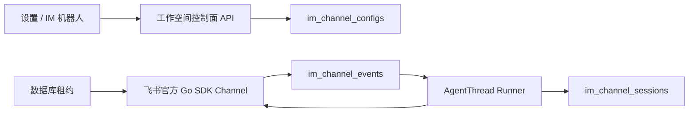

# 飞书 IM 机器人生产设计

## 目标

在 Coze 现有账号设置弹窗中新增 `IM 机器人`，按当前工作空间管理飞书
机器人。首期只支持飞书，不新增一级菜单、生态市场或其他 IM 平台。

## 对齐结论

参考 Nuwax 的配置、启停、连接检测、Agent 绑定和会话能力，但不复制其明文
配置与同步 Webhook 执行方式。Coze 使用飞书官方 Go SDK Channel API 和
WebSocket 长连接，并复用现有 `agentthread` 作为唯一 Agent 运行时。

## 架构



## 控制面

- 配置属于工作空间；成员可查看，Owner/Admin 才能新增、编辑、启停、检测和
  删除。
- 配置字段包括名称、App ID、只写 App Secret、目标已发布 Agent、回复方式
  和群聊策略。
- App Secret 通过 AES-GCM keyring 加密，只返回 `secret_configured`。
- 启用状态与运行状态分离，运行状态包括等待、连接、重连、正常和异常。

## 运行面

- 使用 `github.com/larksuite/oapi-sdk-go/v3/channel` 和官方 WebSocket client。
- 私聊默认响应；群聊默认要求明确 @机器人；不响应 @all；也可完全关闭群聊。
- 每个启用配置通过数据库租约保证同一时间只有一个实例持有长连接。
- 收到消息先持久化安全归一化数据并按事件 ID 去重，再由后台 worker 执行。
- 飞书 chat 映射到持久化 `agentthread`；同一 chat 连续消息复用线程。
- Agent run 使用事件 ID 作为幂等键，失败最多重试三次。
- 运行完成后使用官方 SDK 发送 Markdown；流式模式使用官方 StreamController。
- 成功事件清空 payload，七天后清理记录，避免长期保存外部消息正文。

## 安全边界

- 不存储 SDK RawEvent、原始凭据、工具参数或工具结果。
- API 不接收客户端 user_id/owner 权限事实，身份来自服务端 session。
- App Secret 不回显、不记录日志；连接错误仅返回截断后的安全摘要。
- 目标 Agent 必须属于当前工作空间且已经发布。
- 未配置 keyring 时控制面只读，新增和启用 fail closed。

## 环境变量

```bash
IM_CHANNEL_CREDENTIAL_KEYS_JSON='{"key-2026":"<32-byte-key-base64>"}'
IM_CHANNEL_CREDENTIAL_ACTIVE_KEY_ID='key-2026'
```

未设置独立 keyring 时复用
`SANDBOX_CREDENTIAL_KEYS_JSON` / `SANDBOX_CREDENTIAL_ACTIVE_KEY_ID`。

## 验收口径

- 普通成员可查看但无法修改；Owner/Admin 可完成 CRUD、连接检测和启停。
- 浏览器与 API 均不出现 App Secret。
- 飞书私聊、群聊 @、群聊无 @、@all 的策略行为符合配置。
- 多实例只保留一个活动连接；实例退出后租约到期可恢复。
- 同一飞书事件不重复创建 Agent run；连续消息复用同一任务线程。

