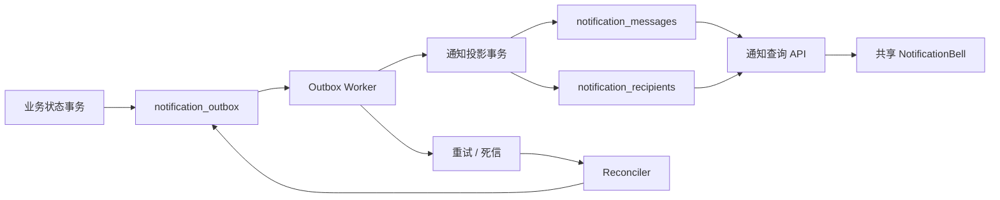

# 可靠通知事件系统设计

## 状态

- 设计日期：2026-07-24
- 参考产品：Nuwax 通知中心
- 实施基线：Coze Studio `dev`
- 复用分支：`codex/nuwax-notification-center-impl`
- 本文取代旧设计中“业务提交后直接同步写通知”的投递方案；旧设计的通知
  列表、未读/已读交互、租户隔离和安全展示规则继续有效。

## 目标

在 Coze Studio 内建立一套生产级通知能力：

1. 对齐 Nuwax 的通知列表、未读数量、单条已读、全部已读和业务跳转闭环；
2. 覆盖任务、定时任务、AppDev、MCP、技能/插件/资源、工作空间、飞书 IM、
   订阅积分和系统告警等用户可感知的关键状态；
3. 业务事务成功后，即使进程退出、请求超时或通知投影短暂不可用，通知仍可
   重试和补偿；
4. 通知系统故障不得改变任务或其它主业务的最终状态；
5. 接收人、工作空间和跳转权限全部由服务端事实计算，不信任客户端输入；
6. 通知正文只保存受控摘要，不暴露 prompt、模型输出、工具参数、凭据、
   provider 原始错误或其它内部运行数据。

## 非目标

- 首期不发送短信、邮件或飞书主动通知，统一先进入站内通知中心；
- 不为排队、运行中、心跳、普通重试、子智能体步骤或工具调用制造未读消息；
- 不把同步 CRUD 成功、轮询错误和瞬时网络错误写入通知中心；
- 不新增通知一级菜单，入口继续使用各页面顶部共享铃铛；
- 不照搬 Nuwax “打开弹层即全部已读”的行为；
- 不依赖 Redis 临时队列作为唯一可靠来源。

## 参考证据

Nuwax 的通知实现采用通知主表、用户接收表和 Redis 事件消费：

- 前端入口：
  `/Users/liuwenbo/code/BuildingAI/nuwax-ai/nuwax/src/layouts/Message`
- 前端接口：
  `/Users/liuwenbo/code/BuildingAI/nuwax-ai/nuwax/src/services/message.ts`
- 控制器：
  `/Users/liuwenbo/code/BuildingAI/nuwax-ai/nuwax-backend/app-platform-modules/platform-system/system-web/src/main/java/com/xspaceagi/system/web/controller/NotifyMessageController.java`
- 应用服务：
  `/Users/liuwenbo/code/BuildingAI/nuwax-ai/nuwax-backend/app-platform-modules/platform-system/system-application/src/main/java/com/xspaceagi/system/application/service/impl/NotifyMessageApplicationServiceImpl.java`
- 领域服务：
  `/Users/liuwenbo/code/BuildingAI/nuwax-ai/nuwax-backend/app-platform-modules/platform-system/system-domain/src/main/java/com/xspaceagi/system/domain/service/impl/NotifyMessageDomainServiceImpl.java`

可复用的产品口径：

- 通知与用户已读状态分离；
- 支持列表、未读数、单条已读和全部已读；
- 后台任务、MCP、发布、账单等关键结果进入通知中心；
- 通知可关联业务目标。

需要改进的工程边界：

- 业务服务不能直接依赖通知持久化实现；
- Redis 事件不能成为唯一事实来源；
- 必须有稳定事件幂等键、持久化重试、死信和补偿扫描；
- 打开弹层不能自动清空全部未读；
- 通知跳转不能接受任意 URL；
- 原始异常和敏感业务正文不能进入通知或日志。

## 当前 Coze 基线

`codex/nuwax-notification-center-impl` 已具备可复用基础：

- `notification_messages` 与 `notification_recipients` 表；
- 用户隔离的列表、未读数、单条已读和全部已读；
- 游标分页、幂等消息键和接收人唯一键；
- AgentThread、定时任务和工作空间的首批生产者；
- 共享 `NotificationBell`、通知弹层、轮询、焦点刷新和错误恢复；
- 通知 API、IDL、前端生成客户端和针对性测试。

现有阻塞：

- 生产者在业务提交后同步调用 `SafePublisher`；
- 重试只存在于当前进程的短时间预算内；
- 进程退出或持续数据库故障会永久漏通知；
- 没有统一事件信封、持久化 outbox、消费者租约、死信和补偿扫描；
- 事件覆盖尚未包含等待用户输入、AppDev、MCP、IM、订阅积分等主线。

因此不直接把旧分支整体合并到 `dev`。实施时从最新 `dev` 建立新集成分支，
按层复用旧分支成果，并将生产者边界升级为本文方案。

## 总体架构



核心原则：

1. 业务模块只发布类型化领域事件，不组装数据库通知记录；
2. 能共享数据库事务的状态变更，必须在同一事务内写入 outbox；
3. 无法共享事务的外部回调，先持久化权威业务状态，再以幂等键写 outbox，
   并由补偿扫描兜底；
4. Worker 将事件投影为通知消息和接收人记录；
5. 投影失败只影响通知交付，不回滚已完成的主业务；
6. 所有步骤都以事件幂等键和数据库唯一约束支持重复执行。

## 领域事件合同

生产者提交内部 `NotificationEvent`：

- `event_id`：全局唯一 ID；
- `event_type`：稳定事件类型，例如 `agent_run.succeeded`；
- `aggregate_type`：业务聚合类型；
- `aggregate_id`：聚合 ID；
- `aggregate_version`：状态版本或终态版本；
- `occurred_at`：业务事实发生时间；
- `actor_id`：可选操作人；
- `space_id`：服务端解析的真实空间；
- `recipient_policy`：类型化接收策略；
- `payload_schema`：受控 payload 版本；
- `payload`：生成通知所需的最小、脱敏字段。

稳定幂等键：

```text
event_type + aggregate_type + aggregate_id + aggregate_version
```

同一事件只写一条 outbox。投影到多个用户时，通过
`(notification_id, user_id)` 唯一键保证接收人幂等。事件修复或重新投影不得
修改已经生成的通知正文；若业务状态产生新版本，应生成新事件。

`payload` 禁止包含：

- prompt 或模型完整输出；
- 工具参数、工具结果和 MCP 原始返回；
- checkpoint、对象存储 URI 和内部运行配置；
- API Key、Token、Cookie、App Secret；
- provider 原始响应、堆栈或数据库错误；
- 用户提交的任意跳转 URL。

## 接收人策略

接收人只允许使用服务端策略枚举：

- `actor`：触发操作的用户；
- `resource_owner`：资源所有者；
- `workspace_owners_admins`：空间 Owner/Admin；
- `workspace_members`：事件发生时的真实成员快照；
- `system_admins`：服务端系统管理员；
- `explicit_internal_users`：仅允许可信应用服务传入，HTTP API 不开放。

Worker 通过服务端仓储解析接收人。客户端不能提交 `recipient_ids`、
`space_id`、系统广播范围或角色信息。

成员移除事件必须在成员关系删除事务中记录必要的目标用户 ID，避免投影时因
关系已经删除而找不到接收人。其它工作空间事件在投影时仍需复核空间关系。

## 数据模型

### notification_outbox

- `id`
- `event_id`，唯一
- `event_type`
- `aggregate_type`
- `aggregate_id`
- `aggregate_version`
- `space_id`
- `actor_id`
- `recipient_policy`
- `payload_schema`
- `payload_json`
- `status`：`pending`、`processing`、`delivered`、`dead`
- `attempt_count`
- `available_at`
- `locked_at`
- `locked_by`
- `last_error_code`
- `created_at`
- `updated_at`
- `delivered_at`

索引：

- 唯一 `event_id`；
- `(status, available_at, id)`；
- `(aggregate_type, aggregate_id, aggregate_version)`；
- `(locked_at, status)`。

`payload_json` 必须在写入前经过类型化 DTO 和长度校验。`last_error_code` 只
保存稳定错误分类，不保存原始异常。

### notification_messages

沿用旧分支模型，并补充：

- `event_id`，唯一；
- `severity`：`info`、`success`、`warning`、`error`；
- `target_type` 与 `target_id`；
- `created_at`。

通知消息创建后保持不可变。

### notification_recipients

沿用旧分支模型：

- `notification_id`
- `user_id`
- `read_at`
- `created_at`

唯一键 `(notification_id, user_id)`；查询索引覆盖用户、已读状态和倒序游标。

## Outbox Worker

Worker 使用数据库轮询，不要求 Redis 才能运行：

1. 每批领取有限数量的 `pending` 或租约过期记录；
2. 使用数据库行锁和 `SKIP LOCKED` 防止多实例重复占有；
3. 设置 `processing`、`locked_by` 和 `locked_at`；
4. 解析类型化事件、计算接收人、渲染安全模板；
5. 在一个事务中创建消息和接收人，并将 outbox 标记为 `delivered`；
6. 失败时按有界指数退避更新 `attempt_count` 和 `available_at`；
7. 达到最大次数后标记 `dead`，等待补偿或人工重放。

建议默认值：

- 批次：50；
- 租约：30 秒；
- 单批超时：10 秒；
- 最大尝试：8；
- 退避：5 秒、30 秒、2 分钟、10 分钟、30 分钟，之后封顶 1 小时。

关机时停止领取新任务，等待当前批次在超时内结束。Worker 重启后可自动领取
租约过期记录。

## 补偿扫描

对无法与业务状态共享事务的生产者，以及历史偶发失败，提供 Reconciler：

- 扫描最近时间窗内的权威终态记录；
- 根据稳定幂等键检查 outbox 是否存在；
- 缺失时补写 outbox；
- 已存在、已投影或已死信时不重复生成消息；
- 每类聚合独立游标和限速，避免全表扫描。

补偿扫描只读取受控状态字段，不读取或复制任务正文。默认扫描最近 24 小时，
部署初期可临时扩展，稳定后缩短窗口。

## 事件覆盖矩阵

### 任务与对话

- `agent_run.awaiting_input`：通知任务创建者，需要用户继续输入；
- `agent_run.succeeded`：通知任务创建者；
- `agent_run.failed`：通知任务创建者，展示稳定错误摘要；
- `agent_run.canceled`：通知任务创建者。

排队、运行中、普通重试、子智能体、工具调用和内部补偿不生成未读消息。

### 定时任务

- `scheduled_execution.succeeded`
- `scheduled_execution.failed`
- `scheduled_execution.canceled`

接收人为任务创建者；跳转到对应定时任务或执行详情。

### 网页应用开发

- `appdev_build.succeeded`
- `appdev_build.failed`
- `appdev_deploy.succeeded`
- `appdev_deploy.failed`

接收人为操作人和资源所有者，去重后投递；跳转到对应 AppDev 项目。

### MCP

- `mcp_deployment.succeeded`
- `mcp_deployment.failed`
- `mcp_connection.degraded`
- `mcp_connection.recovered`

部署结果通知操作人；连接异常和恢复仅在状态真正转换时通知工作空间
Owner/Admin，持续探测失败不重复制造消息。

### 技能、插件和资源

- 导入、安装、构建、发布等异步操作的成功或最终失败；
- 同步创建、编辑、删除成功不生成通知；
- 接收人为操作人和资源所有者。

### 工作空间

- 邀请、成员加入、成员移除、角色变化；
- 目标成员收到与自身相关的变更；
- Owner/Admin 收到需要管理介入的异常；
- 普通成员变更不向全空间广播。

### 飞书 IM

- `im_channel.connection_failed`
- `im_channel.connection_recovered`
- `im_message.dead_lettered`

只通知对应工作空间 Owner/Admin。瞬时重连不通知；达到稳定失败阈值或消息
进入死信后才生成通知。正文不包含消息原文或飞书凭据。

### 订阅、积分与账单

- 支付成功、支付失败、退款结果；
- 订阅生效、续费失败、到期和取消；
- 积分低余额、耗尽和管理员调整；
- 接收人为账户所有者；企业账单可按工作空间策略通知 Owner/Admin。

### 系统管理

- 系统公告；
- 模型 Provider 或 Sandbox 持续不可用；
- 通知 outbox 死信积压等运维告警。

系统运行告警只通知系统管理员，不发送给普通用户。

## 通知模板

每个 `event_type` 在服务端注册固定模板：

- 标题；
- 摘要；
- 严重级别；
- 目标类型；
- 允许使用的 payload 字段；
- 接收人策略；
- 是否需要补偿扫描。

未知事件类型 fail closed：记录稳定错误分类并进入重试/死信，不把 payload
直接展示给用户。

模板输出上限：

- 标题 128 字符；
- 摘要 512 字符；
- 目标 ID 128 字符。

## API 与前端

优先复用当前 `dev` 已生成的通知客户端命名和合同，避免同时维护两套近似
接口。最终保留以下能力：

- 通知列表，游标分页和可选未读过滤；
- 未读数量；
- 单条/批量已读；
- 显式全部已读。

前端继续使用一个共享 `NotificationBell`：

- 工作台、任务详情和其它顶部栏复用同一组件；
- Badge 超过 99 显示 `99+`；
- 打开弹层不自动全部已读；
- 点击通知先标记已读，再按白名单目标跳转；
- 提供 loading、empty、error、retry、loading-more 和 disabled；
- 页面可见且已登录时有界轮询，窗口聚焦和弹层打开时立即刷新；
- 账号切换或退出时清理缓存和在途请求；
- 当前页面已展示成功/失败时不额外弹 Toast，通知中心记录仍保持一致。

跳转只根据 `target_type` 组装内部路由。后端不得返回任意 URL；前端必须再次
校验目标空间与当前用户权限。

## 一致性与错误处理

- 业务事务失败：不写 outbox；
- 业务事务成功、通知投影失败：业务保持成功，outbox 重试；
- 同一业务状态重复提交：唯一事件键阻止重复 outbox；
- Worker 重复消费：消息和接收人唯一键保证幂等；
- 接收人解析为空：按事件策略判定为已交付或进入死信，不创建无接收人消息；
- 目标资源已删除：通知仍可读取和已读，点击时给出温和提示；
- 用户已离开空间：查询不泄露其它用户通知，跳转时重新鉴权；
- 全部已读使用服务端快照边界，新到达通知保持未读。

## 安全

- API 仅从认证上下文读取用户 ID；
- 系统管理员和空间角色由服务端仓储判断；
- HTTP 请求不能创建系统通知或指定任意接收人；
- outbox payload 和通知正文均做字段白名单、长度限制和脱敏；
- 日志只记录 `event_id`、事件类型、聚合 ID、尝试次数、接收人数和错误分类；
- 不记录通知正文、用户消息、凭据、原始异常或 provider body；
- 通知查询、已读和跳转均执行租户隔离；
- 内部重放接口仅允许系统管理员或运维命令使用，并写审计记录。

## 可观测性

结构化日志：

- `event_enqueued`
- `event_claimed`
- `projection_succeeded`
- `projection_failed`
- `event_dead_lettered`
- `event_replayed`
- `reconciliation_repaired`

指标：

- outbox pending/dead 数量；
- 最老 pending 延迟；
- 投影成功率和重试次数；
- 按事件类型的生产/交付数量；
- 接收人解析失败；
- API 列表、计数和已读错误率。

告警：

- 最老 pending 超过 5 分钟；
- dead 数量持续增长；
- Worker 无心跳；
- 通知 API 错误率超过阈值。

## 迁移与兼容

1. 保留旧分支的消息表和接收人表迁移；
2. 使用后续 Atlas migration 新增 outbox 和消息扩展字段；
3. 不回填所有历史任务通知；
4. 部署顺序为 schema、读 API、Worker、生产者；
5. Worker 和生产者分别使用开关，先启用投影，再启用事件生产；
6. 上线初期运行补偿扫描并观察 pending/dead 指标；
7. 回滚时先关闭生产者和 Worker，保留表和已生成通知，不删除数据。

数据库 migration apply 仍需单独明确授权。

## 测试

### 后端

- outbox 与业务状态同事务提交/回滚；
- 事件幂等、并发重复写和不同版本事件；
- 多 Worker 领取、租约过期、重启恢复；
- 有界重试、死信、人工重放和补偿扫描；
- 接收人策略、成员移除快照和系统管理员隔离；
- 消息/接收人投影事务和重复消费；
- 单条已读、全部已读快照和跨用户访问；
- 未知模板、非法 payload、超长内容和敏感字段拒绝；
- 每类业务生产者只在权威状态转换时写事件；
- 通知故障不改变业务最终状态。

### 前端

- Badge、列表、分页、空态、错误重试；
- 打开不自动已读；
- 单条、批量和全部已读；
- 账号切换、请求竞态、StrictMode 和轮询清理；
- 白名单跳转与失效目标；
- 工作台、任务详情和其它顶部栏共享同一铃铛；
- 后端不可用时不出现未处理异常。

### 页面验收

使用 Codex in-app browser，至少验证：

- 任务等待输入、成功、失败、取消；
- 定时任务成功和失败；
- MCP 部署成功/失败以及连接异常/恢复；
- AppDev 构建/部署结果；
- 工作空间角色变化；
- 飞书连接异常/恢复；
- 订阅或积分关键状态；
- 系统公告；
- 单条和全部已读在刷新后保持；
- 控制台无未处理错误；
- 数据库中同一事件没有重复通知。

## 实施分层

1. **基线整合**：从最新 `dev` 复用旧分支的领域模型、API、前端组件和测试；
2. **可靠投递**：新增 outbox、Worker、租约、重试、死信和补偿扫描；
3. **核心生产者**：任务、等待输入、定时任务和工作空间；
4. **平台生产者**：AppDev、MCP、技能/插件/资源和飞书 IM；
5. **商业与系统生产者**：订阅积分、账单、系统公告和运维告警；
6. **验收与上线**：迁移校验、测试、内置浏览器全流程、指标和回滚演练。

每一层都必须保持主业务不依赖通知成功，并以稳定事件幂等键完成验证。

## 设计自检

- 可靠性：业务提交后有持久化恢复路径，不依赖进程内重试；
- 一致性：支持事务内 outbox，并为跨事务来源提供补偿；
- 幂等性：事件、消息和接收人三层唯一约束；
- 租户隔离：接收人和权限均由服务端解析；
- 安全：通知正文和日志均不暴露运行时敏感数据；
- 可用性：复用现有铃铛，不新增一级菜单；
- 可维护性：业务模块依赖类型化事件端口，不依赖通知表；
- 可运维性：有租约、重试、死信、重放、补偿、指标和告警；
- 产品口径：关键状态有通知，过程噪音不进入未读中心；
- 兼容性：复用当前生成客户端和旧分支成果，不直接粗暴合并分叉代码。
