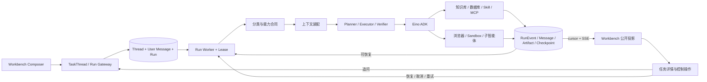
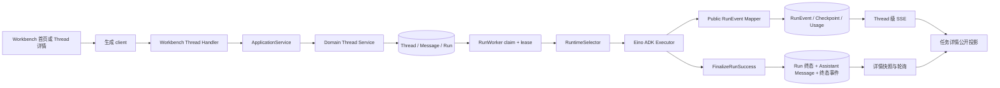

# Agent Execution Kernel V2 设计规范

> 文档性质：Agent Execution Kernel V2 的架构设计基线。
>
> 本期范围：只确认需求、规则、流程和验收口径，不授权业务代码改造。
>
> 主链约定：WorkbenchChat 是产品流程名称，生产主链统一使用
> `TaskThread -> Message -> Run -> RunEvent -> Artifact`。旧 ChatTask API、路由、IDL、
> 前后端 fallback、应用层和领域层已经退役，禁止重新作为兼容入口引入。
>
> 现状核验基线：`dev@851c4da8f`。本轮已按前端、IDL、Handler、Application、
> Domain、Repository、Worker、Eino ADK、RunEvent、SSE 和详情回读逐层核验。
>
> 运行时硬规则同时以
> `docs/superpowers/specs/2026-06-28-eino-agent-runtime-guidance.md` 为准。
>
> Workbench Thread 的目标路由、请求响应、SSE、SDK、迁移、注释和日志合同以
> `docs/superpowers/specs/2026-07-26-workbench-thread-api-contract-design.md` 为准。
>
> 事实标记：`现状` 表示上述基线中已经存在的行为；`目标` 表示经评审后才允许实施的
> 约束；`待决策` 表示尚未获准改变现有合同。本期不修改请求参数、IDL、数据库或业务代码。

## 1. 背景

当前 Workbench 已具备 Eino ADK、Skill、MCP、子智能体、长期记忆接口、
checkpoint、上下文压缩、工具搜索、Artifact 和 Sandbox 控制面等基础能力。
这些单点能力尚未组成稳定的任务执行闭环：

- 不同任务复杂度仍可能走近似的执行策略；
- 前端选择的知识库、数据库和扩展能力尚未全部转化为后端强约束；
- 可选 MCP 或工具异常可能污染甚至阻塞主任务；
- 复杂任务缺少明确的计划、验收条件和完成校验；
- Sandbox 控制面存在，但不能等同于每次任务都真正使用了沙盒；
- 长期记忆、Skill 沉淀和质量评测尚未形成持续学习闭环。

本设计在保持 Go-native、Eino ADK 内核和 Coze 控制面的前提下，参考
OpenClaw 与 Hermes Agent 的任务编排、工具、记忆、子智能体和沙盒经验，
建设生产级 Agent Execution Kernel V2。

## 2. 目标

- 提升复杂任务的端到端成功率和首次完成率；
- 让闪速、思考、Pro、Ultra 四种模式具有真实且可解释的后端差异；
- 让知识库、数据库、Skill、MCP、浏览器、代码执行和子智能体按任务动态装配；
- 对有副作用或不可信的执行默认使用受控 Sandbox，生产环境禁止宿主机回退；
- 为复杂任务增加计划、执行、验证和有限修正闭环；
- 支持中断、取消、幂等、checkpoint 和安全恢复；
- 建立可重复的任务评测集和发布质量门禁；
- 保持工作空间隔离、权限、凭据脱敏、审计和成本边界。

## 3. 非目标

- 不嵌入 OpenClaw 或 Hermes Agent 作为第二套运行时；
- 不引入 Python Agent sidecar；
- 不让模型直接连接业务数据库或宿主机 Shell；
- 不以无限反思、多轮自问自答或无上限子智能体换取表面智能；
- 不把原始 prompt、tool arguments、tool results、凭据或 Provider 响应暴露到
  Workbench UI；
- 不为了显示“已使用沙盒”而给纯问答或受控只读检索创建无意义的容器。
- 不新建与 TaskThread/Run 平行的 `/agent-runs` 资源体系；后续合同演进继续复用
  TaskThread/Run 领域主链，并通过 `/api/workbench/threads` canonical API 对外表达。

## 4. 对标结论

### 4.1 OpenClaw

OpenClaw 的核心优势是会话级 Agent Loop、工具事件、技能快照、持久记忆、
后台子智能体和可选沙盒。它适合个人 Agent，但沙盒关闭时工具会在宿主机执行，
该默认边界不适用于当前多租户平台。

参考：

- <https://docs.openclaw.ai/concepts/agent-loop>
- <https://docs.openclaw.ai/tools/subagents>
- <https://docs.openclaw.ai/gateway/sandboxing>
- <https://docs.openclaw.ai/concepts/memory>

### 4.2 Hermes Agent

Hermes Agent 的核心优势是统一工具注册、终端和浏览器、多执行后端、并行子智能
体、跨会话记忆和从经验沉淀 Skill 的学习闭环。其默认本机终端后端同样不适合
多租户生产环境，但工具分层、渐进加载和委派模式值得参考。

参考：

- <https://hermes-agent.nousresearch.com/docs/developer-guide/architecture>
- <https://hermes-agent.nousresearch.com/docs/user-guide/features/tools/>
- <https://hermes-agent.nousresearch.com/docs/user-guide/features/delegation>
- <https://hermes-agent.nousresearch.com/docs/user-guide/features/overview/>

### 4.3 当前项目的差异化方向

当前项目不追求复制个人 Agent 的宽松本机能力，而是建设：

- Eino ADK 原生执行内核；
- Coze 工作空间、租户、权限和审计控制面；
- Sandbox-first 的副作用工具执行；
- 受控、可恢复、可评测的复杂任务闭环；
- 对 C 端用户隐藏运行时复杂度，同时保留必要的进度和恢复能力。

## 5. 总体架构



### 5.1 WorkbenchChat 术语

| 对象 | 责任 | 不承担的责任 |
| --- | --- | --- |
| `WorkbenchChat` | 从输入到结果呈现的产品流程 | 不等同于 `/api/workbench/chat` 接口 |
| `TaskThread` | 稳定的会话、租户和页面路由容器 | 不表示某一次执行状态 |
| `Message` | 已提交的用户或 Assistant 消息 | 不保存运行时内部 transcript |
| `Run` | 一次用户 turn 对应的执行尝试 | 不复用为下一次追问 |
| `RunEvent` | 按 `event_id` 排序的公开事件投影 | 不作为原始 Eino 事件透传通道 |
| `Artifact` | 经审核、可授权访问的交付物 | 不暴露 Sandbox 路径或对象存储 URI |

`ChatTask`、`TaskEvent` 和 `TaskStatus` 只允许出现在历史迁移、负向测试或退役审计资料中，
不是当前领域对象，也不得进入新的公开合同。`legacy_task_id` 还可以出现在只删除、不读取
或映射业务对象的边界清洗 denylist 中，防止历史 metadata 被重新回显；该防御逻辑不构成
兼容能力。

`idl/workbench/workbench.thrift` 中名为 `WorkbenchChatService` 的生成 service 壳当前只承载
`GetWorkbenchRuntimeDoctor`。它不包含 `WorkbenchChat` 写方法、ChatTask DTO 或旧任务 route，
不能被视为 ChatTask 仍在线的证据；退役扫描应匹配旧 DTO、方法和调用，而不是误删现用
Runtime Doctor。

### 5.2 接口边界

接口边界分为“当前事实”和“目标合同”，两者不得混写：

| 分类 | 路径 | 定位 |
| --- | --- | --- |
| 当前 Workbench | `/api/workbench/task_threads` | 当前 UI 的唯一 TaskThread 产品合同；迁移期冻结行为 |
| 当前 LangGraph 兼容 | `/api/threads` | 独立兼容合同；迁移期冻结行为，不在原路径修正方法语义 |
| 目标 canonical | `/api/workbench/threads` | Workbench 产品与外部 SDK 的唯一长期入口 |
| 已退役 ChatTask | `/api/workbench/tasks*`、`/api/workbench/chat` | 当前必须为 `404`；只保留负向防复活测试 |

目标 Thread/Run 核心合同使用 LangGraph SDK 可解析的原始响应，Coze 私有字段统一放入
`coze` 命名空间；附件、产物、用量、记忆和安全审计作为同一 Thread 下的产品扩展。
所有 route adapter 复用现有 `agentthread.ApplicationService` 与同一持久化记录，不建立
平行数据主链。

当前 Workbench route 与目标 canonical route 在前端完全联调、灰度和观察期通过前并行
存在。迁移禁止 HTTP 重定向、写请求双写和 SSE 双重归并。当前完整路由、请求响应、
SSE、SDK 版本与删除门槛见
`2026-07-26-workbench-thread-api-contract-design.md`。

`/api/workbench/tasks*` 与 `/api/workbench/chat` 已完成代码退役，不进入本次 route 迁移，
不得注册 adapter、返回兼容数据或成为 canonical 失败时的 fallback。数据库旧表和
`legacy_task_id` 的环境清理继续遵循既有 Atlas runbook，但不改变当前代码合同。

### 5.3 已核验现状链路



现状请求兼容边界：

- 首页无附件只发送 `space_id`、`message`、`config`；
- 首页有附件先增加 `defer_start=true` 创建 Thread，上传后再以
  `input/config/metadata/message_content/message_metadata/idempotency_key` 创建首个 Run；
- 标准 Thread 追问发送与上述 Run 创建相同的一组当前 turn 字段；
- Workbench Web 当前不发送 `multitask_strategy`、`on_disconnect` 或 `durability`；
- Domain 对顶层 Run 规范化为 `reject/cancel/async`。详情页建立不带 `run_id` 的 Thread
  级 SSE，因此该连接断开不会触发 Run 取消；
- `defer_start` 分支当前只创建 Thread，并不消费创建请求中的 Run 策略或幂等字段。
- 但该分支会在创建 Thread 前规范化运行配置，并使用消息和配置推导标题；目标接口不能
  把它简化为不带上下文的空 Thread 创建。
- 顶层失败任务重试由详情页调用普通 Run 创建接口，使用详情 Task 投影中的输入文本和
  稳定键，但不追加 User Message；它当前重建默认 Workbench 模式与资源配置，不继承
  来源 Run 配置。
  `.../runs/:run_id/retry` 专用端点只处理子智能体重试。
- 人机恢复当前前端不发送 `idempotency_key`；服务端在缺省时根据来源 Run、interrupt
  和 response 派生稳定键。

本规格阶段冻结上述当前 Workbench 请求形状。canonical client 只按已确认的目标合同构造
新请求，并通过等价矩阵证明用户语义不变；不得把目标字段反向补进当前请求，也不得以
“SDK 对齐”名义改变 `/api/workbench/task_threads` 或 `/api/threads` 的默认值。

## 6. 核心合同

### 6.1 任务分类

```go
type TaskClass string

const (
    TaskClassDirectAnswer   TaskClass = "direct_answer"
    TaskClassKnowledge      TaskClass = "knowledge"
    TaskClassResearch       TaskClass = "research"
    TaskClassDataAnalysis   TaskClass = "data_analysis"
    TaskClassArtifact       TaskClass = "artifact_generation"
    TaskClassCode           TaskClass = "code_execution"
    TaskClassBrowser        TaskClass = "browser_operation"
    TaskClassBusinessAction TaskClass = "business_action"
    TaskClassAutomation     TaskClass = "automation"
)
```

分类结果必须包含：

- 主任务类型和置信度；
- 风险等级；
- 预期产物；
- 是否需要澄清；
- 是否需要计划；
- 是否存在副作用；
- 预计工具类别，而不是具体工具名称。

分类优先采用确定性规则和结构化模型输出。分类失败时根据用户模式选择安全默认
值，不能静默扩大工具权限。

### 6.2 能力合同

每次 Run 在持久化前生成不可变的能力快照：

```go
type CapabilityContract struct {
    Mode                 ExecutionMode
    TaskClass            TaskClass
    KnowledgeBaseIDs     []string
    DatabaseIDs          []string
    SkillIDs             []string
    MCPServerIDs         []string
    AllowWebSearch       bool
    AllowBrowser         bool
    AllowCodeExecution   bool
    AllowSubagents       bool
    RequireSandbox       bool
    MaxSubagents         int
    MaxCorrectionRounds  int
    MaxToolCalls         int
    MaxDurationSeconds   int
    MaxInputTokens       int
    MaxOutputTokens      int
    RiskLevel            string
}
```

能力合同以服务端权限、资源归属、健康状态和模式策略为准。客户端提交只表达用户
选择，不能直接授予能力。

### 6.3 计划合同

复杂任务的计划必须是可执行数据，而不是只展示给用户的自然语言：

```go
type ExecutionPlan struct {
    Goal               string
    AcceptanceCriteria []AcceptanceCriterion
    Steps              []ExecutionStep
    Revision            int
}

type ExecutionStep struct {
    ID             string
    Title          string
    DependsOn      []string
    CapabilityKind string
    Optional       bool
    RetryPolicy    RetryPolicy
    ExpectedOutput string
}
```

计划步骤不得预先保存敏感参数、凭据或完整工具入参。

### 6.4 验证合同

```go
type VerificationReport struct {
    Passed          bool
    Criteria        []CriterionResult
    MissingEvidence []string
    Repairable      bool
    RepairGuidance  []string
    Confidence      float64
}
```

验证器先执行确定性检查，再按需执行模型语义检查。确定性检查包括文件存在、格式、
工具终态、数据行数、引用数量、必填章节和安全扫描。

### 6.5 权威性与一致性

- 客户端只提交当前 turn、附件引用和用户选择，不提交完整对话历史；服务端按
  Thread 中已提交的 Message 重建权威上下文。
- 新任务的 Thread、首条 User Message 和 Run 必须原子创建。带附件时可以先创建
  deferred Thread；该请求仍须在持久化前校验运行配置并由服务端按当前消息和配置推导
  标题，但不得创建 Message/Run。附件上传完成后，必须用独立且稳定的 Run 幂等键原子
  创建 Message + Run。
- 同线程追问必须原子创建 User Message + Run，不能先写消息再单独碰运气创建 Run。
- Workbench 顶层 Run 的并发准入沿用服务端默认 `reject`。现有 Web 请求继续省略
  `multitask_strategy`；已有 `pending/queued/running` Run 时，新 turn 在写入 Message
  前整体拒绝。页面不得静默使用 `interrupt` 或 `rollback`，也不要求为表达现有默认值
  而调整请求参数。
- Run 的持久化状态是执行状态权威来源；RunEvent 用于解释过程，不能单独覆盖终态。
- Thread 生命周期状态是顶层 Run 的只读投影，只服务列表筛选和摘要。Thread 物理字段、
  派生投影或前端缓存均不得反向修改 Run。
- Assistant Message、必须产物和终态事件持久化成功后，Run 才能进入成功终态。
- ChatTask 兼容投影已经退役，任何 mapper、字段或数据修复流程都不得重新生成它。
- 用户扩大资源、权限、模式或预算时创建新 Run。历史 Run 合同保持不可变。

## 7. 执行状态机

公开执行阶段通过 RunEvent 表达：

```text
accepted
classifying
resolving_capabilities
planning
waiting_for_user
provisioning
executing
verifying
correcting
completed
failed
canceled
```

要求：

- 阶段变化追加为带版本号的 RunEvent，不扩张持久化 Run 状态；
- 每个工具调用使用稳定幂等键；
- `waiting_for_user` 不占用 Sandbox 和 Agent worker；
- `correcting` 最多执行能力合同允许的轮次；
- 进程重启后从最近 checkpoint 恢复，不重放已确认的外部副作用；
- 无法证明外部副作用是否成功时进入人工确认，不自动重试。

WorkbenchChat 同时维护三类状态，不允许混成一个 `loading`：

| 状态层 | 示例 | 权威来源 |
| --- | --- | --- |
| 提交状态 | `idle/submitting/accepted/ambiguous/rejected` | 当前客户端请求和幂等键 |
| Run 状态 | `pending/queued/running/interrupted/succeeded/failed/canceled` | 服务端 Run 记录 |
| 传输状态 | `snapshot/live/reconnecting/stale/closed` | 快照请求、SSE cursor 和心跳 |

现状中 Workbench Web 省略 `on_disconnect` 和 `durability`，Domain 持久化默认值
`cancel/async`。任务详情使用未绑定 `run_id` 的 Thread 级事件流；该流断开时取消函数
因没有 Run ID 而直接返回，所以不会取消正在执行的 Run。页面仍不得根据 SSE 连接状态
推断 Run 成功或失败，网络断开只改变传输状态，并由轮询或重连后的权威快照校准。

只有显式绑定并完成 Thread/Run 归属校验的 Run 级事件流，断开时才依据 Run 上已持久化
的 `on_disconnect` 执行 `cancel` 或 `continue`；取消结果必须进入 `canceled`，不能记为
`failed`。resume 继承来源 Run、subagent retry 继承父 Run 的断线与 durability 策略。
顶层失败任务 retry 当前省略策略字段并回到 Domain 默认 `reject/cancel/async`；它与
resume/subagent retry 的继承语义不同，是否改成来源能力快照重放必须单独评审。
当前 Workbench 请求继续省略该字段，不能原地改默认值。canonical UI 改为绑定明确 Run 的
SSE，因此必须显式使用 `on_disconnect=continue`，以保持当前“页面连接断开不取消后台
Run”的用户结果；该映射只在新 client 启用，并纳入断线、resume 和 retry 兼容测试。

## 8. 四种模式

| 模式 | 计划 | 工具 | 验证 | 子智能体 | Sandbox |
| --- | --- | --- | --- | --- | --- |
| 闪速 | 无显式计划 | 知识预取、低风险只读工具 | 确定性检查 | 禁止 | 默认不创建 |
| 思考 | 轻量内部计划 | 知识库、只读数据库、搜索 | 必要时语义检查 | 禁止 | 工具需要时按需创建 |
| Pro | 持久化计划 | 完整授权工具集 | 强制验证，最多一次修正 | 默认禁止 | 副作用工具强制 |
| Ultra | 层级计划 | 完整授权工具集 | 强制验证与汇总检查 | 允许，默认最多 3 个 | 父任务和子任务隔离 |

模式不能只改变 Prompt。能力合同、预算、状态机、验证策略和沙盒策略必须同步变
化。

## 9. 工具可靠性

### 9.1 工具发现

- 核心低风险工具直接暴露；
- MCP 和扩展工具通过 Tool Search 渐进加载；
- 只在当前工作空间、当前用户和当前 Run 合同允许的集合内搜索；
- 工具健康状态和版本进入能力快照；
- 已停用、未授权或不健康的工具不进入模型可见目录。
- `ADKToolPolicyProvider` 的过滤结果必须同时作为模型可见工具、可执行 ToolNode 和
  middleware 工具集合的唯一来源；`ApplicationADKAgentFactory` 不得重建第二份目录。

### 9.2 错误分类

统一错误类型：

```text
invalid_input
unauthorized
policy_denied
unavailable
transient
timeout
capacity_exhausted
execution_failed
result_invalid
```

处理规则：

- 可选工具失败不得自动终止主任务；
- `transient` 和提交结果不确定错误使用同一幂等键有限重试；
- `unauthorized`、`policy_denied` 和 `invalid_input` 不自动重试；
- 连续故障触发工作空间级熔断和健康降级；
- 错误反馈给模型时只提供安全原因码和可恢复建议；
- 前端不展示原始 Provider 错误或工具结果。

## 10. Sandbox 设计

### 10.1 何时使用

以下能力必须使用 Sandbox：

- Python、JavaScript 和后续受支持语言的代码执行；
- Shell、进程和通用文件系统操作；
- 浏览器自动化中的脚本、下载和文件处理；
- MCP stdio 进程；
- 不可信 Skill 的可执行部分；
- 需要安装依赖或运行构建工具的任务。

知识检索、只读数据库查询和模型推理使用各自受控服务，不进入通用 Sandbox。

### 10.2 生命周期

- 按 Run 创建 lease，直到完成、取消、超时或等待用户；
- Provider 选择固定在 checkpoint 中，恢复时不得换 Provider 继续副作用操作；
- 子智能体使用独立 lease 或独立 overlay；
- 输出通过 Artifact 服务导出，Sandbox 路径不直接暴露；
- 完成后释放运行资源，按策略保留加密快照或立即销毁；
- 生产环境 Provider 不可用时 fail closed，不回退宿主机。

### 10.3 安全策略

- 默认禁止网络访问；
- 域名、端口和协议使用精确 allowlist；
- 使用短时、最小权限凭据；
- 限制 CPU、内存、磁盘、PID、执行时间和输出大小；
- 限制可执行文件和虚拟读写前缀；
- 禁止访问宿主机 socket、用户主目录和服务端环境变量；
- 审计只记录 Provider 类型、scope、原因码、状态和脱敏关联号。

## 11. 上下文与记忆

上下文装配顺序：

1. 系统安全和模式合同；
2. 当前用户消息和最近对话；
3. 用户显式选择的文件、知识库和数据库元数据；
4. 高置信长期记忆；
5. 按需加载的 Skill；
6. 当前计划、checkpoint 和工具安全摘要；
7. Token 预算和压缩结果。

长期记忆只保存稳定偏好、用户确认事实、长期项目背景和可复用工作方式。自动写
入采用异步候选、去重、置信度、来源和作用域审查。凭据、健康信息、临时问题、
未经确认的推断和工具原始结果禁止进入长期记忆。

持久化继续使用现有 `agent_thread_memories` 和 `entity.Memory`，不建立平行记忆库。
Memory extraction/flush worker 只有在显式启用并配置 extractor 时运行；worker 不得用
启发式自然语言规则自行生成记忆事实。

复杂成功任务可以生成 Skill 候选，但必须经过结构校验、安全扫描和用户确认后
启用。

## 12. Planner、Executor、Verifier

### 12.1 Planner

- 只为需要多个依赖步骤的任务创建持久化计划；
- 先定义验收条件，再定义执行步骤；
- 计划只描述能力类别，不绑定未经解析的工具；
- 计划调整必须递增 revision 并记录安全差异摘要。

### 12.2 Executor

- 根据依赖图调度步骤；
- 独立步骤可以并行，但受全局预算和 Sandbox 容量限制；
- 工具结果进入 bounded evidence store，不直接无限追加到上下文；
- 外部副作用前执行风险策略和必要的人机确认；
- 失败时根据错误分类决定重试、降级、跳过或终止。

### 12.3 Verifier

- 先执行确定性验收；
- 仅在确定性检查不足时调用语义验证模型；
- 验证模型默认使用独立、低温度、结构化输出配置；
- 不允许验证器扩大能力合同或执行高风险工具；
- 修正只覆盖未通过的验收条件，不重新执行全部任务。

## 13. 子智能体

- Ultra 才允许自动委派；Pro 首期关闭，不接受客户端自行开启；
- 子智能体使用隔离上下文、收敛工具集合和独立预算；
- Ultra 同一轮子智能体工具调用并发上限为 3，当前 `dev` 中待评审的
  `runtime_config.go` 实现也使用该值；
  Eino 适配层另有 `max_subagents=16` 的可解析子智能体数量上限和 `max_depth=2` 深度
  上限。三项必须分别建模，不能把并发 3 写入 `max_subagents`；
- 委派复用 `ADKSubagentToolProvider` 和 Eino `adk.NewAgentTool`，不另写平行 delegation loop；
- 子智能体返回证据摘要和 Artifact 引用，不返回完整内部 transcript；
- 父智能体负责最终汇总和验收；
- 子智能体中断、超时和完成事件必须持久化并可安全恢复。

## 14. 模型策略

- 分类、标题和摘要使用轻量非思考模型；
- 主执行使用用户选择的模型和模式；
- 语义验证使用低温度结构化模型；
- 子智能体可按任务类别选择更经济的模型；
- 模型故障切换必须在同一能力等级和数据区域策略内；
- 模型切换不能绕过用户工作空间模型权限和费用上限。

## 15. 可观测性

安全事件至少包括：

```text
run.classified
run.capabilities_resolved
run.plan_created
run.plan_revised
run.sandbox_provisioned
run.step_started
run.step_completed
run.step_failed
run.verification_completed
run.correction_started
run.waiting_for_user
run.interrupted
run.completed
run.failed
run.canceled
```

Workbench 公开事件统一包含：

```text
schema_version
event_id
thread_id
run_id
event_type
created_at
payload
```

`event_id` 是服务端事件标识，SSE 已使用 `id:` 写入该值，并接受 `Last-Event-ID` 与
`after_event_id`。现状首次 EventSource 不携带快照 cursor；服务端在 query cursor 非零
时优先使用 query 值；前端按 `created_at` 后接字符串 ID 排序。因而“快照高水位 +
自动重连 Last-Event-ID”尚未形成闭环。

canonical 目标增强必须作为前后端成对改造：前端以快照最大 `event_id` 首连，服务端分别校验
两个非空 cursor 并取较大值，前端以无精度损失的 64 位十进制比较器去重排序。不能只改
任意一端，也不能用 JS `Number`、字典序或 `created_at` 替代事件序。心跳不进入业务
事件列表，不推进 cursor。

内部 Eino `AgentEvent`、模型 chunk、工具参数、工具原始结果和 checkpoint bytes
必须先经过公开事件映射、大小限制和脱敏，不能直接进入上述 envelope。

指标包括：

- 端到端成功率和首次完成率；
- 每类任务的工具选择准确率；
- 工具故障自动恢复率；
- 计划修订率和修正成功率；
- checkpoint 恢复成功率；
- Sandbox 创建、复用、超时和容量拒绝；
- 用户补充信息次数；
- Token、时延和费用；
- Artifact 可用率和引用覆盖率。

日志和事件不得包含 prompt、completion、tool arguments、tool results、凭据、
对象存储 URI 或原始 Provider 响应。

Workbench canonical API 的实现还必须遵循专项规格中的功能注释与结构化日志合同：

- route、handler、Thread/Run/state mapper、事务、wait/join/cancel、SSE cursor、
  resume/retry 和 client adapter 必须注释其业务不变量、返回类型与负面语义，不能只复述代码；
- 统一记录 request、principal、空间、Thread、Run、幂等 hash、状态迁移、SSE 生命周期、
  `Location/Content-Location` 类型、限流和调用方合同，使用稳定 event name 与
  `route_template`；
- gateway、handler、application/domain、repository、worker/runtime、SSE 和前端只记录
  各自确认的事实，以关联 ID 拼接完整链路，不重复伪造下游成功；
- 状态迁移成功日志只由真正提交状态的层记录一次；高频 chunk 和 heartbeat 成功不逐条
  打 INFO；
- 所有日志、trace、指标和错误响应执行同一敏感信息禁止清单，并以自动扫描作为发布门禁。

## 16. 评测体系

首批 Golden Set 覆盖：

- 简单问答；
- 知识库事实问答；
- 数据库聚合分析；
- 多来源研究报告；
- Word、PDF、表格和演示文稿生成；
- 代码生成、运行和修复；
- 浏览器信息收集和表单前置确认；
- MCP 工具成功、停用、超时和故障；
- 多智能体并行研究；
- 中断、恢复、取消和幂等；
- 越权、提示注入、凭据泄漏和租户隔离。

发布门禁至少检查：

- 核心任务成功率不得回退；
- 安全用例必须全部通过；
- 可选工具故障不得导致无关任务失败；
- 复杂任务的 Pro/Ultra 效果必须显著高于闪速模式；
- Token、时延和费用在模式预算内。

## 17. 前端呈现

任务详情页只展示用户有价值的信息：

- 当前阶段和进度；
- 已完成步骤和安全摘要；
- 等待用户确认或补充的内容；
- 生成的 Artifact；
- 可恢复错误和明确操作；
- Sandbox 仅显示“安全执行环境已启用”、状态和原因码，不显示 Provider、路径
  或凭据；
- 用量展示任务总量和当前回复，不展示内部隐藏调用细节。

页面的 canonical 目标恢复顺序如下；第 2 至 4 项不代表当前 Workbench 合同已经实现：

1. 读取 Thread、Messages、Runs、RunEvents 和 Artifacts 快照；
2. 记录快照中的最大 `event_id`，再建立 SSE；
3. 按 `event_id` 去重并升序归并，未知 `event_type` 只记录安全遥测；
4. Assistant 增量按 `run_id + message identity` 聚合，终态 Message 替换临时投影；
5. Run 终态、Message 和 Artifact 不一致时停止展示“已完成”，刷新权威快照并显示
   可恢复提示；
6. 组件卸载、切换 Thread 或请求 generation 变化后，旧响应不得写入当前页面。

对已经携带且服务端实际消费 Run 幂等键的操作，提交结果不明确时保留原键、原 payload
和草稿，页面显示“确认提交结果”；重放时不得生成新键。无附件 `CreateTaskThread` 与
`defer_start` Thread 当前不具备这项保证：在完整幂等合同落地前只能保留草稿并提示
人工确认，不能自动重放创建请求。

## 18. 发布策略

接口迁移与执行内核能力灰度使用独立开关和门禁：

1. 冻结 `/api/workbench/task_threads` 与 `/api/threads` 当前合同，同时冻结
   `/api/workbench/tasks*`、`/api/workbench/chat` 的 `404` 负向合同；
2. 并行增加 `/api/workbench/threads`，完成真实 SDK、权限、SSE 和兼容测试；
3. 前端在 client 边界引入 `TaskThreadV1Client/CanonicalThreadClient` 双实现，默认仍
   使用 `TaskThreadV1Client`，写请求不得双写；
4. test/staging 全量 canonical 后，生产按空间和用户灰度；
5. 100% canonical 后保留回滚观察期；只对 `/api/workbench/task_threads` 和
   `/api/threads` 分别完成调用方审计与删除决策，ChatTask 路由不参与该阶段；
6. 建立当前执行路径基线和 Golden Set；
7. 以工作空间 feature flag 开启分类和能力合同，只记录不改变执行；
8. 依次开放工具隔离、Sandbox、Pro 计划验证、checkpoint 和 Ultra；
9. 接口回滚只切 client，执行策略回滚只关能力开关，均不回退数据或宿主机执行。

## 19. 决策

- 继续使用 Eino ADK，不引入第二套 Agent Runtime；
- Coze 作为控制面和系统记录，Eino ADK 作为执行内核；
- 生产消息基线保持 `*schema.Message`；`*schema.AgenticMessage` 在取消、重试、checkpoint、
  streaming 和 provider parity 合同完成前保持实验态；
- Eino `AgentEvent`、checkpoint bytes、Skill runtime state 和 provider metadata 只作为
  内部合同，经 Coze adapter 映射后才能进入公开 API、事件或持久化投影；
- Sandbox 对副作用工具强制，对纯推理和受控只读服务按需；
- 复杂任务采用 Planner、Executor、Verifier 和有限修正；
- 质量提升以 Golden Set 和线上安全指标为准，不以功能数量或演示效果判断。
- WorkbenchChat 统一以 TaskThread/Run 为生产主链，不引入平行 Agent Run API；
- 长期 canonical 路径统一为 `/api/workbench/threads`；当前 `/api/workbench/task_threads`
  与 `/api/threads` 只作为冻结的迁移入口；
- core route 返回 LangGraph SDK 可解析的稳定形状，Coze 扩展统一放在 `coze` 命名空间；
- `GET .../join` 直接返回最终公开 state values，`cancel` 成功返回 `204` 无 body，
  `GET .../stream` 只返回 SSE；当前来源入口不原地改语义；
- `runs/wait` 的失败投影同时兼容固定 JS/Python async 的本地 `__error__`
  检查与 Python sync 的 `raise_error=true|false`；`join` 失败返回脱敏
  `__error__` values，任何投影差异都不改变 Run 持久化终态；
- JavaScript `@langchain/langgraph-sdk==1.6.0` 和 Python `langgraph-sdk==0.4.2`
  是首期固定兼容矩阵，不承诺完整 Agent Server API；
- Run 创建回调和自动重连依赖 API-base-relative `Content-Location`/`Location`；网关必须
  透传并校验，流重连使用 GET 与 `Last-Event-ID`；
- Thread/Run 只返回固定 SDK core 字段和审核后的 `coze` 扩展；get-state 使用安全投影，
  update-state 同时返回一致的 `checkpoint` 与 `configurable`；
- canonical Thread 删除在非 busy 时复用现有级联硬删除，busy 返回 `409`；
  当前 `/api/threads` 行为不原地改动，存量调用方逐个验收后才迁移；
- 当前 Workbench 与目标 canonical 接口共用 application/domain/persistence；迁移不重定向、
  不双写、不复制数据；
- `/api/workbench/tasks*` 与 `/api/workbench/chat` 已退役并保持 `404`，不得实现 adapter、
  fallback 或新的历史数据投影；
- 用户 turn 以 Message + Run 原子提交，完整历史由服务端重建；
- 快照是恢复基线，RunEvent 是有序增量，Run 记录是终态权威来源；
- 当前 Workbench Web 保持省略 `multitask_strategy`、`on_disconnect` 和 `durability`，
  由 Domain 规范化为 `reject/cancel/async`；canonical UI 的 Run 级 SSE 显式使用
  `continue`，保持当前页面断线不取消后台 Run 的结果，当前来源入口不反向补参数；
- resume 创建新 attempt，来源 `interrupted` Run 保持历史记录；
- Thread 生命周期由顶层 Run 只读投影，不反向覆盖 Run；
- canonical SDK `Thread.status=interrupted` 只表示审核后的可恢复 human interaction；
  Workbench `coze.product_status` 继续保持当前将 interrupted 投影为 `idle` 的语义；
- canonical route 的功能注释、结构化日志、脱敏和排障字段属于完成定义；
- 本期只升级文档、规则和流程，不修改业务代码、IDL、数据库或运行配置。
