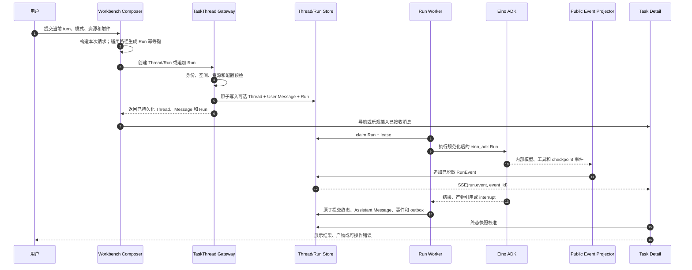
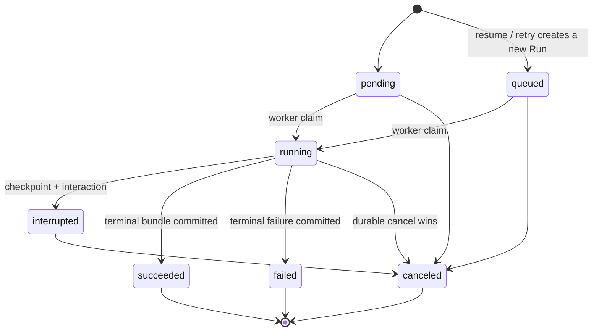

# Agent Execution Kernel V2 生产级产品与技术规格

> 文档状态：待业务与技术评审
>
> 版本：v1.0-rc8
>
> 更新日期：2026-07-26
>
> 适用项目：Coze Studio
>
> 实施状态：代码冻结，规格确认前不得继续实施或合并相关代码
>
> 本期边界：只升级需求文档、规则和流程，不修改业务代码、IDL、数据库或运行配置
>
> 现状核验基线：`dev@851c4da8f`。本轮已逐层核验 Workbench 前端、IDL、Handler、
> Application、Domain、Repository、Worker、Eino ADK、RunEvent、SSE 和详情回读。
>
> 运行时硬规则同时以
> `docs/superpowers/specs/2026-06-28-eino-agent-runtime-guidance.md` 为准。
>
> Workbench Thread 的目标路由、请求响应、SSE、SDK、迁移、注释和日志合同以
> `docs/superpowers/specs/2026-07-26-workbench-thread-api-contract-design.md` 为准。
>
> 规则分级：`现状` 是上述基线已存在行为；`目标` 需评审后另行实施；`待决策` 不得进入
> 开发。本期冻结现有请求形状，不调整请求参数、默认值、IDL、数据库或业务代码。

## 1. 文档目的

本文档定义 Coze Studio 任务执行核心的完整产品行为、运行时架构、安全边界、
数据合同、失败恢复、用户体验、质量指标和上线门槛。后续实现、测试、验收和
上线均以本文档为主基线，不能只按页面效果或局部接口完成。

本文档中的 WorkbenchChat 是产品能力名称，不是单个 HTTP 方法。其唯一生产主链是
`TaskThread -> Message -> Run -> RunEvent -> Artifact`。旧 ChatTask API、路由、IDL、
前后端 fallback、应用层、领域层和 runner/gateway 已经退役；本文档不再规划与
TaskThread/Run 平行的 `/api/workspaces/{space_id}/agent-runs` 资源体系。

本文档要求系统在模型调用之外具备稳定、智能、可控、可恢复、可证明的任务完成能力：

- 用户选择的知识库、数据库、技能、MCP 和附件必须真实进入本次任务上下文。
- Flash、Thinking、Pro、Ultra 必须体现为不同执行策略，而不是只更换名称或图标。
- 涉及代码、文件、浏览器、MCP stdio 和外部副作用时必须进入受控 Sandbox。
- 系统不能因为一个未启用或不可用的可选 MCP 服务而让主任务失败。
- 关键任务只有取得独立验证证据才算完成。
- 服务重启、网络闪断、模型超时和工具失败后，应能安全恢复或给出可操作错误。
- 全链路必须可观测，但不能向前端、日志或审计泄露密钥和内部提示词。

## 2. 当前冻结说明

规格评审期间暂停 Agent Execution Kernel V2 业务代码实施。

当前 `dev` 已在 `backend/application/agentthread/runtime_config.go` 及对应测试中实现部分
模式、Planner 和子智能体能力解析。它们是现状代码事实，但对应 V2 产品语义尚未完成评审，
不能因代码已经存在就反向视为最终方案。

当前源码没有独立的 capability/execution contract 实现文件；第 10 节定义的不可变能力合同
仍是目标需求，不能作为已交付能力使用。本期不修改或回退现有 runtime config 代码。规格
获得确认后，应先按最终决策逐项审查其行为，再决定保留、调整或退役。

## 3. 产品定位

Coze Studio 的任务执行能力定位为：

> 以 Coze Studio 作为控制面、账号与租户系统、资源系统和任务记录中心，以
> Eino ADK 作为 Go 原生 Agent 执行内核，通过受控工具、持久化状态、Sandbox、
> 分层记忆和结果验证完成从对话到可交付成果的闭环。

系统不是单轮聊天包装，也不是无限自治的后台进程。系统应在用户授权、预算、
租户权限和安全策略范围内自主完成任务，并在需要决策或外部副作用时准确暂停。

## 4. 设计目标

### 4.1 业务目标

- 提升复杂任务一次完成率和最终可用结果比例。
- 降低“看似执行、实际未完成”的假成功率。
- 让用户能够理解系统当前在做什么、为什么暂停、如何继续。
- 让不同模式形成可感知的质量、速度、成本和自治能力差异。
- 支持知识检索、数据分析、内容交付、代码执行、网页操作和业务动作等任务。
- 为后续计划任务、IM 机器人和跨端任务复用同一套执行内核。

### 4.2 技术目标

- 新任务统一运行在 `eino_adk`，Coze 保持系统记录和外部合同控制权。
- 每个 Run 都生成不可变的能力快照、预算快照和资源快照。
- 所有步骤、工具调用、审批、产物、验证和状态迁移可持久化和恢复。
- 所有副作用操作可追踪、可审计、可幂等，必要时可取消或补偿。
- 所有高风险执行进入 Sandbox，并使用默认拒绝的网络和文件权限。
- 错误具备统一分类，不使用无上下文的 `500` 作为最终用户错误。

### 4.3 非目标

- 本阶段不构建完全无边界的自主智能体。
- 本阶段不允许 Agent 自行获取管理员权限或绕过租户权限。
- 本阶段不允许任意宿主机命令执行。
- 本阶段不把所有普通模型推理和知识检索强制放入 Sandbox。
- 本阶段不引入 Python sidecar 作为 Agent 主运行时。
- 本阶段不照搬 OpenClaw 或 Hermes 的产品外壳和全部能力。
- 本阶段不恢复 `/api/workbench/chat`、`/api/workbench/tasks*` 或任何 ChatTask
  adapter、IDL、client、fallback、application/domain 包和数据投影。
- 本阶段不实施本文档描述的业务代码改造；代码实施需在规格复审后另行立项。

## 5. 对标产品结论

### 5.1 OpenClaw 可借鉴能力

- 清晰的 Agent loop：接收、规划、执行、观察、继续或结束。
- 子智能体隔离执行和结果回传。
- Sandbox 与工具策略分离，按执行风险决定隔离方式。
- 长期记忆作为显式可检索资源，而非无限追加聊天记录。

### 5.2 Hermes Agent 可借鉴能力

- 长任务持续执行、过程可观察和中断后继续。
- 工具与技能是 Agent 的一等能力。
- 任务委派和多 Agent 协作有明确父子关系。
- 通过上下文压缩和持久化状态支撑较长执行过程。

### 5.3 Coze Studio 必须保留的优势

- 工作空间、成员、角色和资源权限以 Coze 服务端事实为准。
- 任务、事件、产物、通知、计量和审计统一进入平台数据合同。
- 使用 Go 原生 Eino ADK，与现有后端部署、限流和治理体系一致。
- 用户级、工作空间级和系统级模型配置保持清晰边界。
- 面向 C 端用户提供简洁体验，不把底层 Agent 调试界面直接暴露给普通用户。

### 5.4 最终取舍

采用“有边界的强自治”方案：

- 低风险任务尽量自动完成。
- 高风险任务执行前必须获得明确授权。
- 复杂任务允许自动规划、修正和委派。
- 所有自治行为受能力合同、预算、租户权限和 Sandbox 策略共同约束。
- 安全条件不满足时失败关闭，不静默降级到宿主机或越权工具。

## 6. 核心设计原则

### 6.1 结果优先

任务的目标是交付可用结果，不是展示大量思考文本或工具调用动画。

### 6.2 证据优先

关键结果必须由结构化规则、工具返回、文件校验、页面状态或独立 Verifier 证明。

### 6.3 安全默认

未明确允许的工具、网络、文件、租户资源和副作用一律拒绝。

### 6.4 预算有界

每个 Run 都必须具有时间、迭代、工具调用、Token、并发和修正次数上限。

### 6.5 可恢复

关键步骤完成后持久化 checkpoint，服务重启后不得重复执行已确认副作用。

### 6.6 可解释但不泄密

用户可以看到目标、阶段、结果、错误和安全审批，不显示内部提示词、完整工具参数、
密钥、原始 provider body 或 checkpoint bytes。

### 6.7 可选能力不阻塞主流程

可选 MCP、可选记忆、通知投递和非关键标题生成失败时，不得直接导致主任务失败。

### 6.8 Eino First 与 Coze 边界

- Agent loop、streaming、tool calling、interrupt/resume、checkpoint、TurnLoop 和委派先
  复用 Eino ADK 原语，再由 Coze adapter 施加租户、持久化、审计和产品策略。
- 生产消息基线保持 `*schema.Message`；`*schema.AgenticMessage` 在取消、重试、checkpoint、
  streaming 和 provider parity 合同测试齐备前保持实验态。
- Eino `AgentEvent`、checkpoint bytes、Skill runtime state 和 provider metadata 是内部
  合同，不能直接成为 Workbench DTO、RunEvent payload 或持久化公开字段。
- Coze 继续拥有 Thread/Run/Message/Event、身份权限、lease、取消、重试、成本和审计的
  外部合同，不能因引入新 Eino primitive 建立平行系统记录。

## 7. 任务类型

每个新 Run 在持久化前生成任务类型。分类用于选择执行策略，不用于替代权限校验。

| 类型 | 典型任务 | 默认风险 | 主要能力 | 默认最低模式 |
| --- | --- | --- | --- | --- |
| `direct_answer` | 解释概念、普通问答 | 低 | 模型、短期上下文 | Flash |
| `knowledge_query` | 基于选中知识库回答 | 低 | 检索、引用 | Flash |
| `deep_research` | 多来源研究、对比报告 | 中 | 搜索、抓取、引用、计划 | Thinking |
| `data_analysis` | 查询数据库、统计分析 | 中 | 只读数据工具、计算 | Thinking |
| `artifact_generation` | 文档、表格、演示稿、网页 | 中 | 文件、渲染、产物校验 | Pro |
| `code_execution` | 编写并运行代码、修复项目 | 高 | 文件系统、命令、测试、Sandbox | Pro |
| `browser_operation` | 登录后页面操作、表单处理 | 高 | 浏览器、截图、DOM、审批 | Pro |
| `business_action` | 发消息、创建记录、修改外部系统 | 高 | 外部 API、审批、幂等 | Pro |
| `automation` | 定时、持续或事件触发任务 | 高 | 调度、恢复、通知、审计 | Pro |
| `mixed` | 同时包含研究、代码和业务动作 | 高 | 计划、子任务、验证 | Ultra |

分类采用两层机制：

1. 确定性规则识别显式资源、工具需求、副作用和安全风险。
2. 轻量分类模型补充语义类型，但不能降低确定性规则给出的风险等级。

分类失败时使用安全默认：普通无工具请求归为 `direct_answer`，包含附件、资源、
工具或外部动作的请求归为 `mixed` 并执行严格预检。

## 8. 四种执行模式

### 8.1 模式语义

| 维度 | Flash | Thinking | Pro | Ultra |
| --- | --- | --- | --- | --- |
| 目标 | 最快完成简单任务 | 更充分地分析与检索 | 可靠完成多步骤任务 | 完成复杂并行任务 |
| 显式 Planner | 否 | 按需轻量规划 | 是 | 是，支持分解 |
| 结果 Verifier | 确定性校验 | 条件触发 | 必须 | 必须且可独立复核 |
| 工具范围 | 低风险只读 | 只读检索与分析 | 完整受控工具 | 完整工具和子智能体 |
| Sandbox | 默认不需要 | 按能力触发 | 副作用工具必须 | 副作用工具必须 |
| 子智能体 | 否 | 否 | 首期否 | 是 |
| 自动纠错 | 否 | 否 | 最多 1 轮 | 最多 2 轮 |
| 适用任务 | 问答、简单知识检索 | 研究、只读数据分析 | 代码、产物、浏览器、业务动作 | 大型复杂任务 |

### 8.2 初始预算上限

下列值是服务端初始上限，可通过系统策略调整。前端不得覆盖。

| 预算 | Flash | Thinking | Pro | Ultra |
| --- | ---: | ---: | ---: | ---: |
| 最大 Agent 迭代 | 8 | 16 | 40 | 80 |
| 最大工具调用 | 4 | 8 | 24 | 64 |
| 最大执行时间 | 60 秒 | 180 秒 | 900 秒 | 1800 秒 |
| 最大纠错轮次 | 0 | 0 | 1 | 2 |
| 最大子智能体并发 | 0 | 0 | 0 | 3 |
| 最大子智能体深度 | 0 | 0 | 0 | 2 |

表中的 Ultra `3` 是同一轮子智能体工具调用并发上限，当前 `dev` 中待评审的
`runtime_config.go` 实现也使用该值；表中的深度 `2` 对应 Eino 适配层深度上限。适配层另有
`max_subagents=16` 的可解析子智能体数量上限，它不表示并发数。后续合同必须分别保留
“可用数量、执行并发、委派深度”三项，不能互相覆盖；本期不修改运行配置。

预算耗尽时不能伪装成功。Run 应进入 `failed`；存在可用结果时设置
`outcome=partial`，并返回已完成部分、未完成项和继续执行建议。

### 8.3 模式不兼容处理

推荐采用“显式模式不静默升级”策略：

- 用户手动选择 Flash，但任务需要代码执行时，预检返回模式不兼容并推荐 Pro。
- 用户手动选择 Thinking，但任务需要写入外部系统时，预检返回模式不兼容。
- 后续可新增“智能选择”模式，用户预先设置可接受的最高模式后允许自动升级。
- 自动升级必须在提交前显示最终模式、预计成本等级和需要的能力。
- 不允许为了完成任务静默扩大工具、成本或副作用权限。

## 9. 任务入口与预检

### 9.1 创建 Run 的输入

客户端可以提交：

- 用户输入文本和附件引用。
- 用户选择的模式或智能选择范围。
- 用户选择的知识库、数据库、技能和 MCP 服务 ID。
- 用户选择的模型 ID。
- 当前工作空间和线程上下文。
- 合法的幂等键。

客户端不能提交或决定：

- 最终租户、用户角色和资源权限。
- 内部模型凭证。
- Sandbox endpoint 和凭证。
- 服务端工具白名单。
- 最终预算和验证策略。
- 是否绕过审批。
- 内部 prompt、checkpoint 和 provider 参数。

### 9.2 预检顺序

1. 解析服务端认证上下文。
2. 校验工作空间成员关系和资源可见性。
3. 规范化消息、附件和所选资源。
4. 执行确定性风险分类。
5. 执行语义任务分类。
6. 校验所选模式与任务能力是否兼容。
7. 解析用户级、工作空间级和系统级模型配置。
8. 生成能力合同、预算快照和资源版本快照。
9. 校验 Sandbox、工具和 provider 是否满足必需能力。
10. 在同一事务边界创建 Run、首个事件和 outbox 记录。
11. 异步生成短标题，不阻塞任务执行。

### 9.3 标题生成

- 标题由独立轻量模型异步生成，不占用主 Agent 的思考模式。
- 使用当前主模型的非思考接口优先；不可用时使用系统配置的 utility model。
- 输入只包含经过清洗的首条用户意图，不包含密钥和完整资源内容。
- 标题建议 8 至 24 个中文字符，最大 40 个字符。
- 超时或失败时使用确定性截断标题，不能阻塞 Run。
- 标题生成完成后通过事件更新侧边栏和详情页，允许出现短暂延迟。

### 9.4 WorkbenchChat 端到端主链

#### 9.4.1 权威对象

WorkbenchChat 使用一套持久化对象，不再把“聊天”“任务”和“Agent Run”拆成相互
竞争的记录体系。

| 对象 | 生命周期 | 权威内容 |
| --- | --- | --- |
| `TaskThread` | 跨多个 turn | 空间、创建者、标题、稳定页面路由和会话元数据 |
| `Message` | 一次已提交消息 | 角色、正文、安全元数据及所属 Thread/Run |
| `Run` | 一次执行尝试 | 状态、不可变配置快照、幂等键、执行租约和错误分类 |
| `RunEvent` | Run 内追加 | 已审核的阶段、增量、工具摘要、审批、用量和终态事件 |
| `Artifact` | 由 Run 产生 | 可授权访问的产物元数据、校验和、扫描与验证状态 |

不变量：

- 一个用户 turn 对应一个 User Message 和一个 Run；重试或恢复创建新的 attempt，
  通过来源 Run 关联，不改写历史执行。
- Run 状态是执行状态和 attempt 结束原因的权威来源。RunEvent 解释过程，Message 承载对话结果，
  Artifact 承载文件结果，三者不能互相伪造状态。
- 客户端不提交完整历史。服务端根据已提交 Message、有效 Run 和回滚记录重建上下文。
- ChatTask 不是当前对象，不存在从 ChatTask 反向覆盖 Thread、Message、Run 或 RunEvent
  的兼容路径。
- Thread `status` 是顶层 Run 的只读生命周期投影：存在
  `pending/queued/running` 时为 `running`；否则按最新顶层 Run 将 `succeeded`、
  `failed`、`canceled` 映射为 `completed`、`failed`、`canceled`。`interrupted`
  映射为 `idle`。当前合同没有 `attention_required` Thread 状态；详情页从
  `run.interrupted` 与 `human.interaction.resolved` 事件推导未解决 interaction。
- Thread 列表可以短暂延迟，但不得显示与权威 Run 相反的成功或失败状态。详情页发现
  不一致时以 Run 快照为准并触发投影修复，不能用 Thread 状态覆盖 Run。

#### 9.4.2 现有入口与 V2 定位

| 场景 | 当前生产入口 | V2 规则 |
| --- | --- | --- |
| 新任务，无附件 | `POST /api/workbench/task_threads` | 目标 `POST /api/workbench/threads` + `coze.initial_run`，保持 Thread + User Message + Run 原子创建 |
| 新任务，有附件 | 创建 `defer_start` Thread，上传附件，再创建 Run | 目标用 `coze.deferred_initial_run` 先校验配置、推导标题并只建 Thread，再上传和原子创建 Message + Run |
| 标准任务详情追问 | `POST /api/workbench/task_threads/:thread_id/runs` | 目标 `POST /api/workbench/threads/{thread_id}/runs`；只提交当前 turn，服务端重建历史 |
| 事件增量 | `GET /api/workbench/task_threads/:thread_id/run_events/stream` | 目标 `GET /api/workbench/threads/{thread_id}/runs/{run_id}/stream`，支持 cursor、去重、心跳和断线续传 |
| 人机恢复 | `POST .../runs/:run_id/resume` | canonical 路径绑定来源 Run，创建新 attempt，不原地改写 interrupted Run |
| 取消 | `POST .../runs/:run_id/cancel` | canonical 幂等终止，不再启动新工具调用 |
| 失败任务重试 | `POST .../runs` | canonical 普通 Run 创建表达新顶层 attempt，不追加重复 User Message |
| 子智能体重试 | `POST .../runs/:run_id/retry` | 作为 canonical 产品扩展保留，只表示子智能体重试 |

本文档原先使用的 `POST /api/workspaces/{space_id}/agent-runs` 不再是目标合同。
目标统一使用 `/api/workbench/threads`：Workbench UI 与外部 LangGraph SDK 共享同一
canonical Thread/Run 合同，通过不同 principal、scope、限流和容量池接入，不能建立
第二套持久化主链。迁移期只并行保留当前 `/api/workbench/task_threads`、现有
`/api/threads` 与目标 `/api/workbench/threads`；已退役 `/api/workbench/tasks*` 和
`/api/workbench/chat` 必须继续返回 `404`，不参与灰度或回滚。

已核验的现状差距如下。本期只冻结目标规则和验收口径，不在本期修改对应代码：

| 编号 | 已核验现状 | V2 目标规则 |
| --- | --- | --- |
| WBC-G01 | 首页无附件新建未携带幂等键；带附件路径只给后续 Run 生成键；`defer_start` 不消费创建请求幂等键 | 当前 TaskThread 接口保持不变；canonical 所有写操作使用 header key、规范化 payload fingerprint 和冲突响应 |
| WBC-G02 | 首页和标准 Thread 追问省略 `on_disconnect/durability`；Domain 写入 `cancel/async`；详情使用 Thread 级流且断线不会取消 Run | 当前 TaskThread 接口保持省略；canonical Run SSE 显式 `continue`，保持页面断线不取消后台 Run 的用户结果 |
| WBC-G03 | 首页发送流程以单个 `loading` 表达提交、执行和页面阻塞 | 分离提交状态、Run 状态和传输状态，三个状态机不得相互推断 |
| WBC-G04 | 详情页初次 EventSource 未使用快照最大 `event_id`，事件按 `created_at + 字符串 id` 归并 | canonical 前后端成对实现快照高水位、无精度损失的 `event_id` 去重与升序归并 |
| WBC-G05 | query cursor 非零时服务端固定优先 query，可能覆盖自动重连的 `Last-Event-ID` | canonical 分别校验两个 cursor 并取较大值，与 G04 同批上线 |
| WBC-G06 | 失败任务可通过 `CreateTaskThreadRun` 新建顶层 retry Run；专用 `.../retry` 只覆盖子智能体 | 明确两类重试的对象、输入、消息和幂等边界，不能用端点名称混为一谈 |
| WBC-G07 | `/api/workbench/tasks*` 与 `/api/workbench/chat` 已无 route/handler，负向测试要求 `404` | 保持退役，任何非 `404`、新 DTO、fallback 或 application/domain 依赖均阻塞发布 |
| WBC-G08 | Workbench 顶层请求省略策略，Domain 已规范化为 `reject`，Repository 在事务内拒绝活动顶层 Run | 保持服务端准入语义；补页面冲突体验和稳定错误合同前，不要求客户端增加策略字段 |
| WBC-G09 | 顶层失败任务 retry 使用详情页当前 Thread 投影中的输入文本并记录来源元数据，但重建当前默认 Workbench 模式/资源配置；resume 与 subagent retry 则继承来源或父 Run 策略 | 单独决定“重新执行当前默认”还是“重放来源能力快照”；本期保持现状，不暗改 config |

#### 9.4.2.1 当前 TaskThread 接口参数冻结矩阵

| 字段 | 当前调用方 | 当前服务端语义 | 当前接口冻结结论 |
| --- | --- | --- | --- |
| `space_id/message/config` | 首页新建 | 必填身份范围、当前 turn 和运行配置；viewer 取认证上下文 | 保持 |
| `defer_start` | 仅首页有附件新建 | 只创建 Thread，不创建 Message/Run，也不消费 Run 策略字段 | 保持 |
| `input` | 首个附件 Run、标准追问、重试 | `message_content` 存在时由服务端结合历史重建权威输入 | 保持 |
| `config` | 首页新建、首个附件 Run、标准追问、顶层失败 retry | 普通提交使用 Composer 选择；顶层失败 retry 当前重新生成默认模式/资源配置，不继承来源 Run | 当前接口保持；canonical 首期也保持当前 retry 结果，来源能力快照重放不在本次迁移范围 |
| `message_content/message_metadata` | 首个附件 Run、标准追问 | 与 Run 原子创建 User Message | 保持 |
| `metadata` | Run 创建 | 安全来源和模式元数据 | 保持 |
| `idempotency_key` | 附件首个 Run、标准追问和失败任务 retry 由前端发送；resume/subagent retry 可由后端派生；无附件新建未发送 | `agent_runs` 仅按 `(space_id, key)` 唯一；回放校验结构归属，不校验 payload hash | 当前接口不扩展；canonical 按专项规格增加 operation scope、payload fingerprint 和冲突合同 |
| `multitask_strategy` | Workbench Web 未发送 | Domain 默认 `reject`；活动顶层 Run 在事务内拒绝 | 保持省略 |
| `on_disconnect` | Workbench Web 未发送 | Domain 默认 `cancel`；只对绑定 `run_id` 的流断线有取消含义 | 保持省略 |
| `durability` | Workbench Web 未发送 | Domain 默认 `async`；当前主要用于持久化和继承 | 保持省略 |
| `stream_mode` | Workbench Web 未发送 | Domain 使用默认事件模式 | 保持省略 |

IDL 中字段“可选”不等于当前 Workbench 必须显式发送。下表只复核是否应修改现有请求，
结论均不覆盖 canonical 新合同；canonical 的字段、header 和等价语义由 Thread API 子规格
第 10.1 节定义。

曾拟议参数的影响复核：

| 拟议调整 | 对当前核心流程的实际影响 | 结论 |
| --- | --- | --- |
| 显式发送 `multitask_strategy=reject` | 当前结果与 Domain 默认相同，但把服务端准入策略耦合到每个 Web 调用方 | 无收益，不调整 |
| 在当前请求显式发送 `on_disconnect=continue` | 改变当前 Run 记录及 resume/subagent retry 继承值 | 当前接口不调整；canonical Run SSE 用该值保持现有用户结果 |
| 显式发送 `durability=async` | 当前与 Domain 默认相同，主要改变请求冗余和调用方耦合 | 无必要，不调整 |
| 无附件新建增加 `idempotency_key` | 启用空间级唯一查找；同键不同 payload 当前不会比较摘要，跨操作碰撞可能返回错误对象或报结构冲突 | 先设计完整合同，不调整 |
| defer Thread 增加 `idempotency_key` | `CreateTaskThread(defer_start=true)` 当前忽略该字段 | 不能提供保护，不调整 |
| 首连增加 `after_event_id` | 与服务端 query 优先规则及浏览器自动 `Last-Event-ID` 发生组合效应 | 仅允许前后端成对实施 |

#### 9.4.2.2 现状证据索引

下列证据均来自 `dev@851c4da8f`，用于把本节现状结论直接映射到实现。后续分支若改变
任一入口或合同，必须先重跑同一证据链，再更新本文档：

| 核验面 | 源码与测试证据 | 已确认事实 |
| --- | --- | --- |
| 首页新建 | `frontend/apps/coze-studio/src/pages/workbench/index.tsx` 的 `handleSend`；`src/pages/workbench/__tests__/workbench.test.tsx` | 无附件直接创建 bundle；有附件先 defer、上传、再创建首个 Run；请求未补三项策略字段 |
| 追问与控制 | `task-follow-up.ts` 的 `sendFollowUpMessage`；`task-run-actions-hook.ts` 的 `handleRetryTaskRun`；`task-detail-hooks.ts` 的 resume 调用；对应 `task-detail.test.tsx` | canonical 追问走 Run API；顶层失败重试不写 User Message；resume 前端省略幂等键 |
| IDL 与 Handler | `idl/workbench/task.thrift`；`backend/api/handler/coze/workbench_thread_service.go` 的 `CreateTaskThread`、`CreateTaskThreadRun`、`ResumeTaskThreadRun` | 策略和幂等字段均为可选；Handler 只透传调用方实际提交值 |
| 原子创建与默认值 | `backend/application/agentthread/service.go` 的 `CreateTaskThread/CreateRun`；`backend/domain/agentthread/service/service_impl.go` 的 `CreateRunBundle` 与规范化函数 | 当前 turn 由服务端重建历史；bundle 事务创建；默认策略为 `reject/cancel/async` |
| 幂等与并发 | `backend/domain/agentthread/repository/mysql.go` 的 `findExistingThreadBundle/findExistingRunBundle/CreateRunBundle`；`docker/atlas/migrations/20260614000200_agent_runs.sql` | 唯一范围为 `(space_id, idempotency_key)`；校验结构归属但不比较 payload hash；活动顶层 Run 原子拒绝 |
| Worker 与 Eino | `runner.go` 的 `ProcessPendingRunsWithResult`；`worker.go` 的 `RunOnce`；`runtime_selector.go` 的 `RuntimeSelector.Execute`；`adk_executor.go` 的 `ADKExecutor.Execute` | Worker claim lease 后经 RuntimeSelector 进入 Eino ADK；显式不可用时失败关闭 |
| 事件与终态 | `event_sink.go` 的 `applicationRunEventSink.EmitRunEvent`；`service_impl.go` 的 `FinalizeRunSuccess`；对应 application/domain/repository 测试 | ADK 事件经公开 sink 持久化；成功终态与 Assistant Message、完成事件在事务边界收口 |
| SSE 与详情回读 | `task-run-event-stream.ts` 的 EventSource；`task-detail-loader.ts` 的 `fetchTaskDetail`；Handler 的 `resolveTaskThreadRunEventCursor` | 当前首连无初始 cursor，详情同时使用快照、轮询和 Thread SSE；query cursor 非零时优先于 `Last-Event-ID` |
| 附件与空 Thread | `backend/application/agentthread/upload_file.go` 的 `uniqueUploadFileName`；Repository 的 `ListThreads` | 重名文件安全改名并计算 SHA-256，不做 submission 去重；defer 空 Thread 没有隐藏或 TTL 合同 |
| ChatTask 退役 | `backend/api/router/coze/workbench_legacy_route_test.go`；`canonical-frontend-contract.test.ts`；`docs/superpowers/context/workbench-chat.md` | 退役 route 固定 `404`；前端生产源码禁止退役标识符；ChatTask API/IDL/fallback/application/domain 已删除 |

#### 9.4.2.3 本轮验证记录

- 前端执行以下命令，3 个测试文件、93 个用例全部通过，其中包含生产源码退役标识符
  扫描。测试输出包含既存 React mock 与通知接口连接噪声，但退出码为 0：

```bash
cd frontend/apps/coze-studio
npm run test -- \
  src/pages/tasks/__tests__/canonical-frontend-contract.test.ts \
  src/pages/workbench/__tests__/workbench.test.tsx \
  src/pages/tasks/__tests__/task-detail.test.tsx
```

- 后端 application、repository 和 handler 的原子创建、历史重建、resume、断线策略、
  runtime selector、并发拒绝、终态事务和 cursor 用例通过：

```bash
cd backend
GOCACHE=/private/tmp/coze-go-build go test -p 1 -gcflags="all=-l -N" \
  ./application/agentthread ./domain/agentthread/repository ./api/handler/coze \
  -run 'Test(ApplicationCreateTaskThread|ApplicationCreateRun|ApplicationResumeHumanInteraction|ApplicationCancelRunOnDisconnect|RuntimeSelector|ThreadRepositoryCreateRunBundle|ThreadRepositoryFinalizeRunSuccess|CreateTaskThreadHandler|CreateTaskThreadRunHandler|ResumeTaskThreadRunHandler|ResolveTaskThreadRunEventCursor|SubagentRetry)' \
  -count=1
```

- ChatTask route 防复活测试与 `backend/domain/agentthread/service` 全包测试通过：

```bash
cd backend
GOCACHE=/private/tmp/coze-go-build go test -p 1 -gcflags="all=-l -N" \
  ./api/router/coze -run '^TestRegisterExcludesLegacyWorkbenchChatRoutes$' -count=1
GOCACHE=/private/tmp/coze-go-build go test -p 1 -gcflags="all=-l -N" \
  ./domain/agentthread/service -count=1
```

先前基线记录的 `InterruptRun` 测试签名编译漂移在 `dev@851c4da8f` 已不存在，不能继续
作为当前测试债务引用。

#### 9.4.3 已核验现状时序

当前主链按入口分为四种接收方式，但落到同一 Run 执行链：

1. 无附件新建：`CreateTaskThread` 原子创建 Thread、User Message 和 pending Run。
2. 有附件新建：先以 `defer_start=true` 只创建 Thread，再上传文件，最后
   `CreateTaskThreadRun` 原子创建 User Message 和 pending Run。
3. 标准追问：可选上传附件后，`CreateTaskThreadRun` 以当前 turn 的
   `message_content` 创建 User Message，并由服务端读取历史 Message 重建权威 Run input。
4. 失败任务重试：详情页以 `CreateTaskThreadRun` 创建新的 pending Run，关联来源 Run
   元数据但不追加 User Message；专用 retry 端点只处理子智能体。

pending Run 由主 Worker claim 为 running 并取得 lease，RuntimeSelector 将新生产 Run
路由到 Eino ADK。ADK 事件逐条映射为公开 RunEvent 并持久化；成功收口时事务提交 Run
终态、Assistant Message、完成事件、可选标题事件/checkpoint 和 outbox。详情页先加载
快照，再以 2 秒轮询与 Thread 级 SSE 合并公开状态。



#### 9.4.4 提交与幂等

- 现状在点击发送时从当前文本、文件、模式、模型和资源选择构造请求；只有下述适用
  路径生成 Run 幂等键。显式、可恢复的不可变 submission snapshot 属于后续目标。
- 现状附件首个 Run、标准追问和失败任务 retry 由前端发送 Run 幂等键；resume 和
  subagent retry 在客户端省略时由后端派生稳定键。无附件新建不发送幂等键，
  `defer_start` 创建分支也不消费该键。本期不得把目标能力描述成已经具备。
- 当前数据库唯一范围是 `(space_id, idempotency_key)`。Repository 对命中记录校验
  Thread、父 Run、Run kind 或创建者等结构归属，但不保存或比较规范化 payload hash；
  因此当前不承诺“同键不同 payload 返回 `idempotency_conflict`”。
- 现有调用方已生成的键必须在一次请求重试期间保持稳定。canonical 已冻结
  `principal + space_id + operation` scope、规范化 payload fingerprint、`409
  idempotency_conflict` 和 header 传输合同；保留期与持久化实现必须在实施计划中落到
  migration 和兼容测试。当前 `/api/workbench/task_threads` 不因此新增或改读请求字段。
- 附件上传失败时不创建 Run，已创建的空 Thread 当前会出现在普通 Thread 列表中；系统
  也没有 24 小时提交 TTL、过期状态或按提交身份去重文件的合同。本期不新增、不隐藏、
  不自动清理这些对象。
- 当前重复文件名通过安全重命名保留为不同上传，内容会计算 SHA-256 并登记；不得在没有
  产品决策和引用迁移方案时改成 checksum 去重。
- 附件引用必须绑定 Thread、空间、上传者、校验和和扫描状态。Run 只能引用本 Thread
  中已完成上传且允许执行的文件。
- 服务端在任何持久化之前校验用户、空间和资源权限，不能信任客户端 `space_id`、
  `user_id`、owner、模型能力或预算字段。

同一 Thread 的顶层 Run 并发规则：

- Workbench Web 继续省略 `multitask_strategy`，Domain 将其规范化为 `reject`。存在
  `pending/queued/running` 顶层 Run 时，Repository 在同一事务准入阶段返回 HTTP 409
  和当前消息 `thread already has an active run`，不能写入孤立 User Message 或第二个
  Run。稳定业务码 `active_run_exists` 属于后续 API 合同目标，不是现状字段。
- 页面执行中禁用普通追问发送，保留显式 cancel。Run 进入结束状态并完成快照校准后，
  Composer 才恢复普通追问。
- 存在未解决 human interaction 时，Composer 只提交结构化 resume response；用户可
  显式取消等待，不能用普通追问绕过 interaction 合同。
- `interrupt` 和 `rollback` 只保留给有独立产品合同的调用方。Workbench 不提供隐式
  打断开关，也不根据新消息自动回滚历史。

#### 9.4.5 服务端接收与原子边界

现状已实现认证范围校验、运行配置规范化、服务端历史重建，以及 Thread + Message + Run
或 Message + Run 的事务创建。分类、能力/预算快照、初始事件和 outbox 属于 V2 后续目标，
不得写成当前请求已经触发的步骤。目标接收顺序如下：

1. 从认证上下文解析 viewer，校验其对 Thread 和 workspace 的访问权限。
2. 规范化文本、当前 Message 元数据、附件引用、模式和资源选择。
3. 将新 Run 强制规范化为 `runtime=eino_adk`；策略未启用时 fail closed。
4. 从 Thread 的已提交 Message 重建权威历史，排除已回滚或未提交的结果。
5. 生成服务端能力、预算、资源和模型快照，客户端值只表达意图。
6. 原子写入 User Message、Run，并在对应合同落地后同事务写入初始 RunEvent 和必要
   outbox；任一步失败整组回滚。
7. 返回 `thread_id`、`run_id`、持久化状态和安全错误，不等待 Agent 完成。

带附件的新任务使用 `coze.deferred_initial_run` 先创建 deferred Thread；在持久化前仍须
按当前流程校验运行配置并由服务端推导标题，但 Message + Run 只在上传后的单一事务中
提交。不得出现“页面已显示用户消息，但没有 Run 且无法恢复”的半提交状态。

#### 9.4.6 Worker 与执行内核

- Worker 只 claim `pending` 或 `queued` Run，并获得带 TTL 的 lease、lease token 和
  execution generation。续租失败后当前执行必须停止提交新结果。
- Run 进入 `running` 后才调用执行内核；Runtime Selector 对新 Run 只允许
  `eino_adk`，不静默回退 legacy。
- 能力合同解析、上下文装配、Planner、Executor 和 Verifier 都使用同一 Run 快照。
  运行中不得因为系统默认值变化扩大权限。
- Eino 内部事件先经过公开投影。prompt、completion、tool arguments、tool results、
  checkpoint bytes、provider metadata 和 credentials 不进入 Workbench DTO。
- 工具调用、外部副作用、子智能体和产物均绑定 `thread_id + run_id`，并使用稳定
  tool/step idempotency key。
- Worker 崩溃由 lease recovery 处理。可证明无副作用的步骤可从 checkpoint 恢复；
  副作用结果不确定时进入 `interrupted`，等待人工确认。

#### 9.4.7 快照、SSE 与页面归并

现状先读取 Thread，再并行读取 Messages、顶层 Runs、RunEvents 和 Artifacts；页面同时
使用 2 秒快照轮询和不带 `run_id/after_event_id` 的 Thread 级 SSE。以下是 canonical
已确认的成对实施顺序，不表示当前前端已经完成：

1. 并行读取 Thread、Messages、Runs、RunEvents、Artifacts 和必要用量快照。
2. 校验所有对象属于当前 Thread 和 workspace，丢弃跨作用域响应。
3. 以快照最大 `event_id` 作为 cursor 建立 SSE。
4. SSE 事件按 `event_id` 去重并升序归并；重复事件必须是幂等操作。
5. 收到当前 attempt 结束状态或 SSE `done` 后再拉一次权威快照，校准 Run、Message
   和 Artifact。

事件流规则：

- 服务端现状已在 SSE `id:` 中写入 `event_id`，并接受 `Last-Event-ID` 和
  `after_event_id`；但 query cursor 非零时直接优先 query，错误返回 HTTP 400 和
  `event cursor is invalid`。取两个 cursor 较大值及稳定业务错误码必须与前端首连
  cursor 同批实施、同批测试、同批上线。
- 心跳与业务事件分离。心跳不写数据库、不推进 cursor、不触发页面业务状态变化。
- 当前 Workbench Web 省略 `on_disconnect/durability`，Domain 写入 `cancel/async`；
  当前来源请求保持不变。canonical UI 使用绑定 Run 的 SSE，并显式持久化
  `continue/async`，保持
  页面断线不取消后台 Run 的现有用户结果。
- 详情页使用 Thread 级流，因不携带 `run_id`，断线不会取消任何 Run；页面只改变连接
  状态，并继续由轮询和重连结果校准。
- 底层 Run API 只允许 `continue` 或 `cancel`。非 Workbench 调用方显式选择
  `cancel` 时，SSE 断线可以触发幂等取消，但终态必须为 `canceled`；服务端必须读取
  Run 上的已持久化值，不能按请求或内存默认值猜测。
- 未携带 `run_id` 的流属于 Thread 级事件流，其断线不得取消任何 Run。只有携带并完成
  Thread/Run 归属校验的 Run 级流，才能对该 Run 应用已持久化的 `on_disconnect`。
- 重连先补齐 cursor 之后的持久化事件；超出保留窗口时返回明确原因，页面重新加载
  全量快照。
- 未知 `event_type` 不能让页面崩溃。前端记录安全遥测并保留后续已知事件。
- 现状前端按 `created_at` 后接字符串 ID 排序。canonical 必须改为 64 位十进制事件序
  比较器；不得用 JS `Number`、字符串字典序或 `created_at` 代替其顺序。
- Assistant 增量按 `run_id + message identity` 聚合；已持久化终态 Message 替换临时
  文本，不能重复追加。
- 页面切换 Thread 或请求 generation 变化后，旧请求和旧 SSE 事件不得写入当前页面。

#### 9.4.8 人机恢复、取消与重试

- `interrupted` 表示执行已释放 worker/lease，且存在可验证的 checkpoint 或人工交互。
- resume 通过路径中的 `thread_id/run_id` 绑定来源 Run，当前前端提交 `interrupt_id`
  和结构化 response，不发送 `idempotency_key`；服务端缺省时派生确定性键，并校验交互
  仍未处理、提交者有权操作、checkpoint 与来源 Run 一致。
- resume 创建或调度新的 queued attempt，保留来源 Run，不把旧 Run 直接改回 running。
- cancel 对 `pending/queued/running/interrupted` 幂等。服务端先持久化取消意图，再通知
  Eino、子智能体、Sandbox 和工具层；晚到的成功结果不得覆盖 canceled 终态。
- 失败任务重试当前由详情页调用 `CreateTaskThreadRun` 创建新顶层 attempt，输入取详情
  页当前 Thread 投影中的任务文本，配置重建为当前默认 Workbench 选择，并以
  `thread_id + source_run_id + task_retry` 作为稳定键；该路径不追加 User Message。
- 该顶层 retry 不是来源 Run 能力/模型/资源快照的原样 replay，策略字段省略后重新落到
  `reject/cancel/async`。是否改成继承来源合同属于 WBC-G09，不在本期调整请求。
- `.../retry` 专用端点只支持子智能体重试，并创建带来源关系的 queued 顶层 replay
  attempt。两类重试均保留来源 Run，不能互相冒充。
- 已确认的外部副作用不重放。无法确认的副作用进入人工核对，不能用 retry 绕过。

#### 9.4.9 终态提交与一致性

- `succeeded` 必须原子提交 Run 终态、最终 Assistant Message、完成事件和通知 outbox。
- 任务要求 Artifact 时，Artifact 元数据、扫描状态和 Verifier 结果满足合同后才能成功。
- `failed` 保存稳定错误码和安全提示；原始堆栈、provider body 和工具结果只进入受控
  内部诊断，不进入公开事件。
- `canceled` 和 `failed` 不生成伪造 Assistant 成功消息。已经形成的部分结果以明确的
  partial metadata 展示。
- 页面发现终态 Run 缺少必需 Message 或 Artifact 时，按不一致处理：停止显示“完成”，
  刷新快照并提供 trace reference。前端不得自行补造结果。

#### 9.4.10 ChatTask 退役防回归规则

`dev@851c4da8f` 已删除 `/api/workbench/tasks*`、`/api/workbench/chat`、ChatTask
IDL/生成 client、前后端 fallback、`backend/application/task`、`backend/domain/task`
以及旧 Workbench runner/gateway。后续要求如下：

- `backend/api/router/coze/workbench_legacy_route_test.go` 持续断言退役路径返回 `404`；
- `canonical-frontend-contract.test.ts` 持续扫描生产源码中的退役标识符和调用；
- `langGraphStoredThreadMetadata` 可以继续删除 `legacy_task_id` 等历史 metadata key；
  denylist 只做出站/入站清洗，不得查询旧表、恢复映射或改变路由；
- 新功能、故障回滚、SDK 兼容和数据修复均不得恢复 ChatTask adapter 或旁路写入；
- 退役路径探测只记录安全的 route template、请求关联和 `404`，不得查询历史表或调用
  application/domain；
- 各环境旧表、`legacy_task_id` 和 metadata 旧键的清理遵循
  `docs/superpowers/runbooks/workbench-chat-legacy-cleanup.md`，运维迁移与 canonical route
  上线相互独立。

## 10. 能力合同

### 10.1 定义

能力合同是服务端为每个 Run 生成的不可变执行快照，回答以下问题：

- 本任务是什么类型、风险多高。
- 能使用哪些资源和工具。
- 哪些操作必须进入 Sandbox。
- 哪些操作需要用户审批。
- 预算和验证标准是什么。
- 使用哪些策略版本、资源版本和模型能力。

能力合同必须持久化，并计算不可变 hash。恢复、重试和审计均使用原合同；用户要求
扩大能力时应创建新 Run 或新合同版本，不能直接篡改历史快照。

### 10.2 示例

```json
{
  "version": "v1",
  "policy_version": "2026-07-26",
  "task_class": "artifact_generation",
  "risk_level": "high",
  "mode": "pro",
  "model": {
    "model_config_id": "10002",
    "capabilities": ["chat", "tool_call"]
  },
  "resources": {
    "knowledge_bases": [
      {"id": "kb_1", "version": "17", "permission": "read"}
    ],
    "databases": [
      {"id": "db_1", "schema_version": "9", "permission": "read"}
    ],
    "skills": [
      {"id": "skill_1", "version": "1.2.0", "digest": "sha256:..."}
    ],
    "mcp_servers": []
  },
  "capabilities": {
    "knowledge_retrieval": true,
    "database_read": true,
    "database_write": false,
    "web_search": true,
    "browser": false,
    "code_execution": true,
    "file_write": true,
    "external_side_effect": false,
    "subagents": false
  },
  "sandbox": {
    "policy": "required_for_effects",
    "scope": "agent",
    "network_policy": "allowlist"
  },
  "approval": {
    "required_for": ["external_write", "publish", "send_message"]
  },
  "budget": {
    "max_iterations": 40,
    "max_tool_calls": 24,
    "max_execution_seconds": 900,
    "max_correction_rounds": 1
  },
  "verification": {
    "policy": "required",
    "evidence_required": true
  }
}
```

### 10.3 关键不变量

- 合同只能由服务端生成。
- 客户端选择资源不代表自动授权，服务端必须重新校验。
- 已停用 MCP 不进入合同，也不能在运行时被 Agent 发现。
- 没有启用 MCP 时应得到空能力集合，不能得到 `500`。
- 合同中只保存凭证引用，不保存明文凭证。
- 工具执行前必须再次检查合同，不能只在创建 Run 时检查一次。

## 11. 所选资源的真实执行语义

### 11.1 知识库

选中知识库后：

- 只检索合同中记录的知识库和版本。
- 检索请求继承当前用户和工作空间权限。
- 返回经过裁剪的片段、文档标识和可展示引用。
- 文档内容视为不可信数据，不能覆盖系统指令或工具策略。
- 最终回答使用知识内容时应展示来源；无有效来源时明确说明。
- 单次 top-k、片段长度和总上下文占用受预算控制。

### 11.2 数据库

选中数据库后：

- 首先读取经过脱敏的 schema 和字段说明，不直接注入全库数据。
- 默认只允许只读查询。
- SQL 或查询 DSL 必须经过语法检查、表级权限、行级权限和执行预算检查。
- 禁止多语句、DDL、DML、危险函数和未设置上限的大结果集。
- 写操作必须使用独立业务动作工具，不能借只读数据库工具绕过。
- 查询结果应在进入模型前截断、脱敏和结构化。

### 11.3 技能

选中技能后：

- 固定技能版本和 digest，避免运行中内容变化。
- 技能只提供允许的操作流程和元数据，不能自行扩大工具权限。
- 技能引用的工具仍要经过能力合同和租户权限检查。
- 技能加载失败时，必需技能导致可解释失败；可选技能降级并记录事件。
- 技能内容视为受管理但非绝对可信，仍需防止 prompt injection。

### 11.4 MCP

选中 MCP 后：

- 只有已启用、健康且用户有权使用的 server 进入能力合同。
- 运行时固定 server 配置版本和可调用 tool schema。
- MCP 列表接口失败不能影响不依赖 MCP 的任务。
- 可选 MCP 运行失败允许降级；计划中标记为必需的 MCP 失败才终止相关步骤。
- stdio MCP 必须进入 Sandbox，HTTP MCP 必须经过 SSRF 和网络 allowlist 校验。
- MCP 返回内容按不可信外部数据处理。

### 11.5 附件

- 附件必须完成病毒检查、类型识别、大小限制和权限校验。
- 模型只接收必要的文本或低风险预览，不直接获得对象存储凭证。
- 需要解析或转换时进入受控文件处理流程。
- 产物和输入文件使用不同目录和权限。

## 12. Run 状态机

Run 持久化状态复用现有合同，不把产品阶段继续扩张为数据库状态。



### 12.1 状态语义

| 持久化状态 | 用户含义 | 当前 attempt 是否结束 |
| --- | --- | --- |
| `pending` | Run 已持久化，等待普通 worker | 否 |
| `queued` | 恢复或重试 attempt 已排队 | 否 |
| `running` | worker 持有有效 lease 并正在执行 | 否 |
| `interrupted` | 当前 attempt 已停止并保留 checkpoint，可派生 resume attempt | 是 |
| `succeeded` | 验收通过，终态 bundle 已提交 | 是 |
| `failed` | 未满足完成条件，保存稳定错误码 | 是 |
| `canceled` | 取消意图已持久化，不接受晚到成功 | 是 |

有效 resume 不修改来源 `interrupted` Run，而是原子创建新的 User Message、`queued`
Run 和 resolved 事件。无效、过期或重复的 resume 返回稳定错误，来源 Run 保持不变；
用户显式放弃等待时，来源 Run 可以从 `interrupted` 幂等转为 `canceled`。

`preflight`、`planning`、`provisioning`、`executing`、`waiting_input`、
`waiting_approval`、`verifying` 和 `correcting` 是公开 `phase`，通过 RunEvent 展示，
不是第二套 Run 状态。阶段丢失或未知时，页面退化为持久化状态，不猜测执行结果。

`rejected` 是 Run 创建前的 API 结果，不产生半成品 Run。`partial` 是失败终态中的
公开 outcome，表示存在可用 Message 或 Artifact，但验收条件未全部通过；它不能映射
为 `succeeded`。状态迁移使用乐观锁、lease token 和 execution generation，事件按
`event_id` 升序追加。

## 13. Planner

### 13.1 触发条件

- Pro 和 Ultra 默认启用显式 Planner。
- Thinking 在任务包含多个独立目标或多来源检索时启用轻量 Planner。
- Flash 不启用显式 Planner。
- 任何包含外部副作用的任务必须先形成可审批步骤。

### 13.2 Planner 输出

Planner 只生成结构化计划，不直接执行工具。计划至少包括：

- 任务目标和完成标准。
- 已知事实、假设和缺失信息。
- 步骤 ID、目标、依赖和预期输出。
- 每一步所需能力类别，不直接指定未授权工具。
- 是否产生外部副作用。
- 是否需要审批。
- 验证方式和证据类型。
- 失败时的替代路径。

### 13.3 计划约束

- 计划步骤数量受模式预算限制。
- 计划不能引用能力合同之外的资源。
- 计划不能把内部凭证作为步骤输入。
- 对同一副作用不得生成无幂等保护的重复步骤。
- 用户可见计划只展示业务摘要，不展示内部 prompt 和隐藏策略。

### 13.4 重新规划

仅在以下情况触发：

- 工具返回确定性能力不匹配。
- 必需资源在运行中失效。
- 用户补充信息改变目标。
- Verifier 证明当前方案无法满足完成标准。
- 计划仍有剩余预算且替代方案不会扩大权限。

不得因为普通瞬时错误反复重新规划；瞬时错误先走受控重试。

## 14. Executor

Executor 按依赖顺序执行步骤，并负责：

- 在每次工具调用前重新检查权限、能力合同和预算。
- 为工具调用生成唯一 `tool_call_id` 和幂等键。
- 将工具错误映射为统一错误分类。
- 在副作用完成后立即记录 checkpoint 和业务回执。
- 响应取消信号，不再启动新步骤。
- 对可并行且无共享写入的步骤进行有界并发。
- 将大工具结果存为受控 artifact，只向模型提供摘要和引用。

Executor 不得：

- 自动调用未进入能力合同的工具。
- 将工具描述中的外部指令当成系统指令。
- 在不确定副作用是否成功时盲目重试。
- 把 Sandbox 失败降级为宿主机执行。
- 在日志中输出密钥、Authorization header 或完整用户敏感数据。

## 15. Verifier

### 15.1 验证层级

验证按以下顺序进行：

1. 确定性验证。
2. 业务规则验证。
3. 独立模型验证。
4. 必要时的人工确认。

只要确定性验证已经证明失败，不能让模型 Verifier 将结果改为成功。

### 15.2 按任务类型验证

| 任务类型 | 必需证据 |
| --- | --- |
| 知识问答 | 引用存在、引用可访问、结论与片段一致 |
| 数据分析 | 查询成功、结果 schema 合法、统计可复算 |
| 文档产物 | 文件存在、类型正确、可打开、关键章节齐全 |
| 表格产物 | 工作表、公式、数据类型和关键单元格校验通过 |
| 演示稿 | 文件可渲染、页面数量和关键内容满足要求 |
| 代码任务 | 修改存在、构建或目标测试结果、无越权文件改动 |
| 网页操作 | 目标 DOM 状态、截图或服务端回执 |
| 业务动作 | 外部系统返回 ID、状态和幂等回执 |
| 自动化 | 调度记录存在、下一次执行时间和权限正确 |

### 15.3 验证结果

- `pass`：完成标准全部满足。
- `fail_correctable`：存在明确可修正问题且仍有预算。
- `fail_final`：无法修正、权限不足或预算耗尽。
- `uncertain`：证据不足，不能标记成功，应进入 `failed + outcome=partial` 或人工确认。

### 15.4 纠错

- Pro 最多 1 轮，Ultra 最多 2 轮。
- 纠错只修复 Verifier 指出的具体问题。
- 纠错不能扩大权限、自动批准副作用或重置全部预算。
- 同一失败原因连续出现时停止循环并输出根因。

## 16. 工具系统

### 16.1 工具元数据

每个工具必须声明：

- 工具 ID 和版本。
- 能力类别。
- 租户和角色要求。
- 是否只读。
- 是否产生副作用。
- 是否需要审批。
- 是否必须使用 Sandbox。
- 网络和文件权限。
- 超时、最大输出和重试策略。
- 是否支持幂等。
- 输入和输出 schema。
- 敏感字段脱敏规则。
- 确定性验证器。

项目硬边界：`ADKToolPolicyProvider` 过滤后的工具集合必须同时驱动模型可见工具、
`ToolsNodeConfig.Tools`、middleware `StaticTools/DynamicTools`；
`ApplicationADKAgentFactory` 不得重建第二套模型可见目录。缺少 `tool_policy` 保持现有
工具集合，显式空 allow-list 表示拒绝该工具类，二者不能混同。

### 16.2 错误分类

| 错误码 | 含义 | 默认处理 |
| --- | --- | --- |
| `tool_unavailable` | 工具未启用或不健康 | 可选工具降级，必需工具失败 |
| `tool_auth_failed` | 工具凭证无效 | 不重试，提示管理员或用户修复 |
| `tool_invalid_input` | 输入不符合 schema | 允许一次参数修复 |
| `tool_timeout` | 调用超时 | 幂等工具有限重试 |
| `tool_rate_limited` | 触发限流 | 按 `Retry-After` 有界等待 |
| `tool_transient` | 临时网络或服务错误 | 指数退避有限重试 |
| `tool_policy_denied` | 权限或能力合同拒绝 | 不重试，不允许模型绕过 |
| `sandbox_unavailable` | 必需 Sandbox 不可用 | 失败关闭 |
| `tool_output_invalid` | 输出不符合合同 | 重试或切换替代工具 |
| `tool_side_effect_unknown` | 副作用结果不确定 | 禁止盲目重试，进入人工确认 |
| `tool_internal` | 平台内部错误 | 记录 trace，返回安全错误信息 |

### 16.3 重试规则

- 只有明确可重试且幂等的错误才自动重试。
- 默认最多 2 次工具级重试，计入工具调用预算。
- 使用指数退避和抖动。
- 副作用调用必须携带幂等键。
- 返回不确定状态的副作用调用不得自动重试。

## 17. MCP 运行规则

### 17.1 服务发现

- MCP 管理页面展示官方服务和工作空间自定义服务。
- Agent 只发现能力合同中已启用的服务。
- 服务列表查询失败时，运行时使用空列表或最近一次有效快照。
- MCP 为零是合法状态，不得产生 `500`。
- 官方目录和用户运行配置分离，目录存在不代表运行时已启用。

### 17.2 健康与启停

- 启用前执行配置校验和健康检查。
- 停用立即阻止新 Run 使用，运行中的 Run 按合同策略安全结束或失败。
- 健康状态至少区分：未知、正常、异常、凭证失效、策略拒绝。
- 健康检查不能执行有副作用的业务工具。

### 17.3 stdio MCP

- 必须运行在 `mcp` scope Sandbox。
- 禁止直接在 Coze 宿主机启动任意命令。
- 文件系统默认临时隔离，网络默认拒绝。
- command、args 和 env 必须经过模板与 allowlist 校验。
- 凭证只在 Sandbox 运行时注入，不能回显或持久化到普通事件。

### 17.4 HTTP MCP

- 仅允许 HTTPS，debug 环境的字面 loopback 例外由单独策略控制。
- 防止 DNS rebinding、内网探测和 metadata service 访问。
- 重定向后重新执行目标地址校验。
- 响应大小、内容类型和超时必须受限。

## 18. Sandbox

### 18.1 必须进入 Sandbox 的能力

- 任意代码执行和 shell 命令。
- 可写文件系统操作和文件转换程序。
- 浏览器自动化。
- stdio MCP。
- AppDev 构建、预览和产物处理。
- 来源不可信的解析器或用户上传脚本。
- 需要受控网络访问的抓取和自动化任务。

### 18.2 不要求进入 Sandbox 的能力

- 普通 LLM 推理。
- 已审核的知识库检索。
- 经过平台封装的只读数据库查询。
- 纯服务端权限校验。
- 不执行用户代码的结构化数据转换。

### 18.3 路由开关

- `SANDBOX_CONTROL_PLANE_ENABLED` 只代表管理面可用。
- `SANDBOX_RUNTIME_ROUTING_ENABLED` 决定运行流量是否允许进入 Provider。
- 生产环境中必需 Sandbox 的任务必须同时满足 Provider 健康、scope 匹配和运行路由开启。
- 控制面存在但运行路由关闭时，必需 Sandbox 的任务应在预检阶段失败关闭。

### 18.4 Lease 生命周期

1. 根据能力合同申请 lease。
2. 校验 Provider scope、健康和容量。
3. 创建隔离工作目录和只读输入挂载。
4. 注入短期凭证引用和网络策略。
5. 执行步骤并持续采集受限日志。
6. 收集产物、校验 checksum 和类型。
7. 清理凭证、进程、临时文件和 lease。

### 18.5 隔离要求

- 每个 Run 或安全步骤拥有独立 lease，不跨租户复用可写状态。
- 默认非 root 用户。
- CPU、内存、进程数、磁盘和执行时长有限额。
- 网络默认拒绝，仅开放合同 allowlist。
- 输入目录只读，工作目录可写，产物目录单独收集。
- 禁止挂载宿主机源码以外的敏感目录。
- Sandbox ID 仅作为内部 opaque reference，不暴露 provider 细节。

### 18.6 失败处理

- Sandbox 创建失败：必需任务直接失败，不回退宿主机。
- Sandbox 执行超时：先终止进程，再收集有限日志和已完成产物。
- Sandbox 连接中断：查询 lease 最终状态，避免重复副作用。
- 产物收集失败：执行结果不能标记完整成功。

## 19. 浏览器任务

- 使用受控浏览器 Provider，不使用验收用的 Codex in-app browser 作为生产执行器。
- 浏览器会话与 Run、用户和工作空间绑定。
- 页面文本、DOM 和下载内容均视为不可信输入。
- 登录凭证通过安全凭证服务注入，不进入模型上下文。
- 点击提交、支付、发布、发送和删除前必须显示审批卡片。
- 审批卡片展示目标站点、动作、关键字段、影响范围和有效期。
- 完成后通过 DOM 状态、截图和必要的服务端回执验证。
- 验证失败时不得仅因点击动作已发出就标记成功。

## 20. 记忆体系

### 20.1 技术定位

记忆使用 Coze 控制面和 Eino ADK middleware 共同实现的 Go 原生 Agent Harness，
不依赖外部 Python Agent Harness。Eino 提供执行原语，Coze 负责记忆权限、数据合同、
持久化、审计、删除和用户可见能力。

持久化必须继续复用现有 `agent_thread_memories` 表和 `entity.Memory`，不得为了分层模型
建立第二套长期记忆存储。Working Memory 和 Thread Summary 可使用运行时/checkpoint
投影，但不能绕过 Coze 的租户、删除和公开字段边界。

### 20.2 记忆分层

| 层级 | 内容 | 生命周期 | 写入方式 |
| --- | --- | --- | --- |
| Working Memory | 当前步骤目标、观察和临时变量 | 单 Run | 执行内核自动 |
| Thread Summary | 当前会话的重要事实和决策 | 单线程 | 异步压缩 |
| User Memory | 用户长期偏好和稳定事实 | 跨线程 | 受策略控制 |
| Workspace Knowledge | 团队共享知识和业务资料 | 工作空间 | 显式资源管理 |
| Procedural Memory | 成功流程、技能和工具经验 | 版本化 | 审核后沉淀 |

### 20.3 写入规则

- 不把每条聊天内容都写入长期记忆。
- 用户长期记忆只保存稳定、可复用且低敏感的信息。
- 密码、Token、身份证号、支付信息和临时验证码禁止写入。
- 从外部文档推断的用户事实不能未经确认写入长期记忆。
- 工作空间记忆不能跨空间读取。
- 用户可以查看、修改、删除和关闭长期记忆。
- 记忆写入异步执行，失败不影响主任务最终结果。
- extraction/flush worker 默认关闭；只有显式配置并提供 extractor 时才启用，worker
  不得用启发式自然语言提取代替受控 extractor。

### 20.4 检索规则

- 先按租户、用户、空间和记忆类型过滤，再进行语义检索。
- 检索结果带来源、版本、时间和可信度。
- 冲突事实优先使用用户最新确认内容。
- 记忆占用独立上下文预算，不无限追加。
- Verifier 不能仅依据低可信记忆证明任务完成。

## 21. 上下文工程

每次模型调用的上下文由服务端按预算组装：

1. 系统安全策略和能力合同摘要。
2. 当前任务目标和计划步骤。
3. 用户最近输入。
4. 必要的 Thread Summary。
5. 经过权限过滤的长期记忆。
6. 所选知识库和数据库的必要内容。
7. 可用工具的最小 schema。
8. 最近相关工具观察和产物摘要。

上下文策略要求：

- 不将全部历史消息重复发送给模型。
- 大工具输出保存在 artifact 中，只注入摘要和引用。
- 压缩时必须保留用户约束、审批结果、完成标准和副作用回执。
- 外部内容使用明确边界标记，防止被解释为系统指令。
- Prompt injection 检测只能提高风险，不能自动授予能力。

## 22. 子智能体

### 22.1 首期范围

- Ultra 支持子智能体。
- Pro 首期不启用子智能体，避免成本和行为难以预测。
- 子智能体只能由父 Run 创建，不能成为脱离父任务的后台自治进程。
- 实现复用 `ADKSubagentToolProvider` 和 Eino `adk.NewAgentTool`，不手写第二套委派循环。

### 22.2 可用角色

- Researcher：多来源检索和证据整理。
- Analyst：数据分析和方案比较。
- Builder：代码或产物构建。
- Verifier：独立结果检查。

角色只是策略模板，不能绕过能力合同。

### 22.3 委派规则

- 父 Agent 生成清晰子目标、输入引用、预算和完成标准。
- 子 Agent 继承能力合同的子集，不能扩大权限。
- 子 Agent 默认只读共享输入，不共享可写工作目录。
- 子 Agent 不执行外部副作用；副作用由父 Agent 汇总后审批执行。
- 同一轮子智能体工具调用最多并发 3 个，委派深度最多 2 层；可解析子智能体数量另由
  `max_subagents` 控制，当前适配层缺省为 16，不能与并发上限混用。
- 父 Agent 负责合并、去重、冲突处理和最终验证。
- 子 Agent 失败不必导致整个任务失败，父 Agent 根据是否必需决定降级或终止。
- 子智能体 retry 创建新的 queued 顶层 task Run 并保留安全来源元数据，历史 child Run
  不得被修改或重新入队。

## 23. 模型路由

### 23.1 模型角色

| 角色 | 目的 | 是否使用思考 | 是否阻塞主流程 |
| --- | --- | --- | --- |
| Main Model | 执行主要任务 | 取决于模式 | 是 |
| Planner Model | 生成结构化计划 | Pro/Ultra 启用 | 是 |
| Verifier Model | 独立复核结果 | 建议与主执行隔离 | 是 |
| Classifier Model | 任务语义分类 | 否 | 超时可使用安全默认 |
| Title Model | 生成短标题 | 否 | 否 |
| Memory Model | 摘要和候选记忆提取 | 否或低思考 | 否 |

### 23.2 配置优先级

1. 用户明确选择且有权限的工作空间模型。
2. 工作空间默认模型。
3. 系统允许的默认模型。

用户级模型配置与系统模型管理含义不同：

- 系统模型管理定义平台允许的 provider、模型目录、能力、价格和健康状态。
- 工作空间或用户模型配置定义当前主体可用的接入凭证和模型实例。
- Run 只展示最终可选模型，不向普通用户暴露系统内部工具模型。
- Title、Classifier 等内部任务可使用配置的 utility model，但必须计量和审计。

### 23.3 能力匹配

- 需要工具调用时必须选择支持 tool calling 的模型。
- 需要图像理解时必须选择支持视觉输入的模型。
- 模式要求和模型能力冲突时在预检阶段提示，不能执行中途才失败。
- Provider fallback 只在等价能力和数据策略允许时发生。
- 不能从私有 provider 静默降级到会改变数据边界的外部 provider。

## 24. 人机协同与审批

### 24.1 必须审批的动作

- 发送消息、邮件或 IM。
- 发布、提交、支付或购买。
- 删除、覆盖或批量修改数据。
- 数据库写入。
- 创建或修改外部账号、权限和密钥。
- 对外公开文件或链接。
- 超出原能力合同的新增高风险操作。

### 24.2 审批卡片

审批卡片必须展示：

- 即将执行的业务动作。
- 目标系统和目标对象。
- 关键字段的安全摘要。
- 可能产生的影响。
- 幂等标识和审批有效期。
- 批准、拒绝和修改选项。

审批卡片不能展示完整密钥、内部 prompt、原始工具参数或未脱敏用户数据。

### 24.3 审批语义

- 审批只对指定动作、指定参数摘要和指定有效期生效。
- 参数发生实质变化时必须重新审批。
- 审批超时按策略进入 `canceled` 或 `failed`，不能让 Run 长期停留在 `running`。
- 用户拒绝后不得用替代工具执行同一副作用。

## 25. 产物

### 25.1 产物类型

- 文档、PDF、表格、演示稿。
- 代码包和构建结果。
- 图片、音频、视频。
- 网页应用和预览。
- 查询结果和结构化报告。
- 浏览器截图和业务回执。

### 25.2 产物合同

每个产物至少记录：

- `artifact_id`、Run、Step 和创建者。
- 类型、文件名、大小和 checksum。
- 安全扫描状态。
- 验证状态和验证摘要。
- 保留期和访问权限。
- 对象存储内部引用。

前端不得获得内部 bucket、object URI 或存储凭证，只通过受控下载 API 访问。

### 25.3 完成条件

- 产物上传成功但未通过格式验证时，任务不能标记完整成功。
- 产物可预览、可下载且 checksum 一致后才满足交付条件。
- 多产物任务必须明确必需产物和可选产物。

## 26. 通知

### 26.1 覆盖事件

| 事件 | 站内通知 | 飞书通知 | 默认策略 |
| --- | --- | --- | --- |
| 等待用户补充 | 是 | 可选 | 立即 |
| 等待高风险审批 | 是 | 可选 | 立即 |
| 长任务阶段完成 | 可选 | 可选 | 聚合 |
| 任务成功 | 是 | 可选 | 立即 |
| 任务部分完成 | 是 | 可选 | 立即 |
| 任务失败 | 是 | 可选 | 立即 |
| 任务取消 | 是 | 可选 | 立即 |
| 产物可下载 | 是 | 可选 | 与完成通知合并 |
| Sandbox 或 provider 异常 | 管理员 | 管理员可选 | 聚合或告警 |
| 配额接近上限 | 是 | 可选 | 去重提醒 |

### 26.2 通知实现

- 状态事务写入 notification outbox，不在主事务内同步调用飞书。
- 异步 worker 投递，支持幂等、重试和死信。
- 通知失败不改变任务成功状态。
- 同一 Run、同一状态和同一接收人只发送一次。
- 通知点击跳转到用户有权访问的任务详情。
- 通知正文不包含密钥、完整工具参数和敏感数据。
- 用户可配置渠道、事件类型和免打扰时间。

## 27. 可观测性

### 27.1 关联标识

- `trace_id`
- `run_id`
- `thread_id`
- `event_id`
- `idempotency_key_hash`
- `execution_generation`
- `step_id`
- `tool_call_id`
- `sandbox_lease_id`
- `artifact_id`
- `notification_id`
- `request_id`
- `stream_connection_id`
- `principal_type`
- `api_key_id_hash`
- `client_contract`

这些标识在内部日志中关联，但前端只展示安全、必要的 Run 和事件标识。

### 27.2 主流程日志

必须记录以下结构化事件：

- Run 创建、预检结果和能力合同 hash。
- 状态迁移和耗时。
- Planner 开始、结束和计划版本。
- 工具选择、开始、结束、错误分类和重试次数。
- Sandbox lease 获取、释放和失败类别。
- 审批请求和审批结果。
- Verifier 结果、证据类型和纠错轮次。
- checkpoint 写入和恢复。
- 最终状态、成本和使用量。
- 通知 outbox 和投递结果。
- canonical、`task_threads_v1`、`langgraph_v1` 与 retired route probe、SDK 语言和固定版本。
- 鉴权 principal、scope 和空间校验结果。
- API key、空间、IP、active Run、SSE 和 Token 限流结果。
- SSE 打开、cursor 回放、进入实时订阅、heartbeat 失败和关闭原因。
- canonical DTO 映射失败、来源 route 调用、retired route probe 和 shadow read 差异。
- Thread/Run/state projection 版本、固定 SDK 方法返回类型和响应 header 类型。
- deferred Thread、上传、Message + Run 提交之间的关联与每段独立幂等结果。

canonical API 使用稳定结构化 event name，例如 `workbench.run.accepted`、
`workbench.run.state_transition`、`workbench.stream.opened`、
`workbench.stream.replayed`、`workbench.stream.closed`、
`workbench.contract.retired_route_probe` 和 `workbench.rate_limit.rejected`。
可变 ID、状态和错误进入字段，不能拼接到 event name。

gateway、handler、application/domain、repository、worker/runtime、SSE service 和前端
client 只记录各自确认的事实，并以 `trace_id/request_id/thread_id/run_id/event_id` 关联。
请求接受、事务提交、worker 执行和终态是不同事件，任何一层不得把下游尚未发生的结果
提前记录为成功。完整事件清单、共同字段和逐症状查询顺序以 Thread API 专项规格为准。

日志必须使用 `route_template`，不能把原始 query string 或请求体当作字段。状态迁移
成功只由真正提交状态的层记录一次；handler 不重复记录伪成功。普通轮询、高频模型
chunk 和 heartbeat 成功不得逐条打 INFO，应使用指标或受控采样 DEBUG。

日志不得记录：

- API Key、Cookie、Authorization header。
- 完整 prompt 和 completion。
- 完整工具输入和原始工具结果。
- checkpoint bytes。
- 未脱敏数据库结果。
- signed URL、上传文件内容和可能包含个人信息的原始文件名。
- request/response body 全量 dump、原始 query string 和未脱敏错误链。

### 27.3 指标

- Thread + Message + Run 原子提交成功率。
- 幂等命中率、payload 冲突率和 ambiguous 提交恢复率。
- SSE 首连时延、重连次数、cursor 补齐量和快照回退率。
- RunEvent 投影失败率、重复率和终态一致性修复次数。
- Run 创建成功率。
- 预检拒绝率及原因分布。
- 任务成功率、部分完成率和失败率。
- Verified Success Rate。
- False Success Rate。
- 首次完成率和纠错后完成率。
- 各模式 p50、p95 执行时长。
- 模型 Token、工具调用和 Sandbox 成本。
- 工具错误、MCP 错误和 Sandbox 错误分布。
- checkpoint 恢复成功率。
- 用户取消率和人工审批等待时间。
- 通知投递成功率和去重率。
- canonical、`task_threads_v1` 与 `langgraph_v1` 的请求量、错误率和延迟。
- 已退役 ChatTask 路径探测量及非 `404` 响应数；非 `404` 必须为零。
- SDK 语言、版本、不支持字段和 stream mode 错误分布。
- 外部与 Workbench admission、worker、模型和 SSE 保留容量。
- SSE active connection、首帧时延、回放量、关闭原因和事件丢失。
- 日志与 trace 敏感信息扫描命中数，发布要求为零。

### 27.4 功能注释与排障合同

后续实现的 route、handler、公共 DTO mapper、原子事务、SSE、cancel/resume/retry、
前端 client adapter、鉴权和限流必须写清业务不变量、负面语义和移除条件。注释解释
“为什么”以及与 SDK、当前来源合同或已退役边界的关系，不逐行翻译代码。

- `wait/join` 必须注明返回最终公开 state values，并说明 `raise_error`
  双路失败投影；`cancel` 必须注明成功为 `204` 无 body，`stream` 必须注明返回 SSE；
- `resume` 必须注明创建新 attempt，顶层 retry 与子智能体 retry 必须分开；
- Thread 删除必须注明非 busy 才复用现有级联删除、busy 返回 `409`，不得通过删除隐式取消 Run；
- Thread/Run/state mapper 必须注明固定 SDK 字段、禁止回显字段、公开 checkpoint/interrupt
  边界和 JS/Python update-state 双字段依据；
- 长请求与 SSE 必须注明 API-base-relative `Location`、`Content-Location`、重连方法和
  `Last-Event-ID` 传递规则；
- 兼容 workaround 标注 SDK 精确版本、对应测试和删除条件；
- `TODO` 必须关联 tracker，生成代码的注释写在 IDL 或生成器输入；
- 代码评审同时核对注释、日志字段、OpenAPI、client 示例和测试，过期注释按缺陷处理。

完整 event name、字段、级别和敏感信息禁止清单见
`2026-07-26-workbench-thread-api-contract-design.md`。

## 28. 持久化模型

以下为逻辑实体，实施时优先复用现有 agentthread、event 和 artifact 记录，
只有现有合同无法表达时才新增表。

| 实体 | 作用 | 关键不变量 |
| --- | --- | --- |
| `task_thread` | Workbench 稳定会话容器 | 空间和创建者不可由客户端覆盖 |
| `task_thread_message` | 已提交对话消息 | User Message 与 Run 原子创建 |
| `agent_run` | Run 主记录 | 单调状态版本、租户隔离 |
| `agent_run.idempotency_key` | 现有 Run 幂等键 | `(space_id, key)` 唯一，结构归属回放 |
| `request_fingerprint`（canonical 目标） | 规范化请求摘要 | 与 principal、space 和 operation 共同校验幂等冲突；实现可复用现有表或新增受控记录 |
| `agent_run_capability` | 能力合同快照 | 不可变、带 hash |
| `agent_run_plan` | 计划版本 | 版本化、可追溯 |
| `agent_run_step` | 步骤状态 | 幂等、依赖明确 |
| `agent_run_event` | 已审核的 Workbench 公开事件 | `event_id` 单调、可重放 |
| `agent_run_checkpoint` | 恢复状态 | 加密、不可直接外露 |
| `agent_run_approval` | 审批记录 | 动作和参数摘要绑定 |
| `agent_run_artifact` | 产物元数据 | 权限、checksum、验证状态 |
| `task_thread_upload` | Thread 输入附件 | 所属空间、checksum、扫描状态 |
| `agent_run_evaluation` | 在线和离线评估 | 评估版本可追溯 |
| `notification_outbox` | 可靠通知投递 | 事务写入、幂等消费 |

以上是逻辑责任，不要求一项对应一张新表。现有表和事务合同能满足不变量时继续复用；
不得仅为匹配文档名称创建平行存储。

### 28.1 保留与清理

- 普通事件和产物按产品策略设置保留期。
- checkpoint 使用更短保留期，终态后按安全策略清理。
- 审计事件按合规要求保留，但必须脱敏。
- 用户删除任务时区分业务记录删除和法定审计保留。

## 29. API 合同

### 29.1 合同分层

当前生产入口与目标合同必须分别表述：

| 类型 | 路径 | 规则 |
| --- | --- | --- |
| 当前 Workbench | `/api/workbench/task_threads` | 迁移期冻结现有请求、响应、默认值和 SSE |
| 当前 LangGraph 形状 | `/api/threads` | 迁移期冻结，不能在原路径修正 `join/stream` 方法语义 |
| 目标 canonical | `/api/workbench/threads` | Workbench UI 与外部 SDK 的唯一长期合同 |
| 已退役 ChatTask | `/api/workbench/tasks*`、`/api/workbench/chat` | 必须保持 `404`，不注册 handler、adapter 或 fallback |

目标完整合同以 `2026-07-26-workbench-thread-api-contract-design.md` 为准。本节只保留
总规格需要的资源和发布摘要，不能替代专项规格中的字段、SSE 和兼容矩阵。

### 29.2 Canonical Thread 路由

```text
POST   /api/workbench/threads
POST   /api/workbench/threads/search
GET    /api/workbench/threads/{thread_id}
PATCH  /api/workbench/threads/{thread_id}
DELETE /api/workbench/threads/{thread_id}
GET    /api/workbench/threads/{thread_id}/state
POST   /api/workbench/threads/{thread_id}/state
GET    /api/workbench/threads/{thread_id}/history
POST   /api/workbench/threads/{thread_id}/history
GET    /api/workbench/threads/{thread_id}/messages
```

标准 SDK 的 `POST /threads` 创建空 Thread。Workbench 无附件首提在同一路由使用固定
`coze.initial_run` 扩展，服务端原子创建 Thread、User Message 和 Run；响应仍是稳定
Thread 形状，并在 `coze.initial_submission` 返回公开摘要。该扩展由 payload 明确触发，
不得根据调用方身份改变响应 schema。

带附件首提使用互斥的 `coze.deferred_initial_run`。服务端先执行与当前 `defer_start`
一致的运行配置校验和标题推导，成功后只创建 Thread，不创建 Message/Run；上传完成后
再由 canonical Run 请求原子创建 Message + Run。客户端不得复制服务端标题算法，也不能
把配置错误推迟到上传后。

Thread 删除的 idle 路径复用现有 `ApplicationService.DeleteThread` 和 repository
级联硬删除；存在活动 Run 时 canonical 返回 `409 thread_busy`，不隐式取消。
当前 `/api/threads` 的运行中删除行为继续冻结，依赖该行为的存量调用方不进入迁移灰度。

canonical Thread 的 SDK `status` 使用 `idle|busy|interrupted|error`；只有存在
审核后可恢复 human interaction 时投影为 `interrupted`。`coze.product_status`
继续保持当前 `idle|running|completed|failed|canceled` 语义，因此该情况仍为
`idle`；lease/multitask 等不可公开 interrupt 在两个投影中都为 `idle`。

### 29.3 Canonical Run 路由

```text
GET  /api/workbench/threads/{thread_id}/runs
POST /api/workbench/threads/{thread_id}/runs
POST /api/workbench/threads/{thread_id}/runs/stream
POST /api/workbench/threads/{thread_id}/runs/wait
GET  /api/workbench/threads/{thread_id}/runs/{run_id}
GET  /api/workbench/threads/{thread_id}/runs/{run_id}/stream
GET  /api/workbench/threads/{thread_id}/runs/{run_id}/join
POST /api/workbench/threads/{thread_id}/runs/{run_id}/cancel
POST /api/workbench/threads/{thread_id}/runs/{run_id}/resume
GET  /api/workbench/threads/{thread_id}/runs/{run_id}/events
```

- `POST runs` 创建 Run 并返回 Run JSON；普通 turn 同时原子写入当前 User Message。
- `POST runs/stream` 创建 Run 并返回 SSE。
- `POST runs/wait` 创建 Run，等待终态后直接返回最终公开 state values。
- `GET .../{run_id}/stream` 只连接或重连既有 Run 的 SSE。
- `GET .../{run_id}/join` 只等待既有 Run，并直接返回最终公开 state values，不是 SSE、
  Run JSON 或 ThreadState envelope；`cancel_on_disconnect` 只接受省略、`false` 或 `0`，
  `true/1` 在首期返回 `422`。
- `cancel` 幂等并统一返回 `204` 无 body；调用方通过 get/state 校准实际终态。
- `resume` 从 path 中的 interrupted Run 创建新 attempt，并返回新 Run。
- 顶层失败 retry 使用普通 Run 创建并引用来源；专用 retry 只表示子智能体 retry。

canonical 不提供 `POST .../{run_id}/stream` 或 `POST .../{run_id}/join`。当前
`/api/threads` 即使
存在这些方法，也不得进入新 client、外部文档或示例。

### 29.4 SSE 与 SDK

首期 stream mode allowlist 为 `values`、`updates`、`messages`、`messages-tuple`、
`custom` 和 `events`。未知 mode 返回 `422`，不能静默映射。请求 `messages-tuple` 时，
SSE 使用 `event: messages`，data 是 `[message_chunk, metadata]`。

SSE `id`、`Last-Event-ID` 和 `after_event_id` 使用公开 64 位十进制 `event_id`。服务端
必须从持久化回放平滑进入实时订阅，heartbeat 不推进 cursor。网关对 canonical 路径
单独关闭 buffering/cache 并设置长连接超时，不能改全局 `/api` 配置影响当前业务。

固定 SDK 的创建回调和自动重连属于核心合同：Run create/stream/wait 返回相对 SDK
`apiUrl` 的 `Content-Location: /threads/{thread_id}/runs/{run_id}`；Run SSE 返回
`Location: /threads/{thread_id}/runs/{run_id}/stream`；wait 返回指向同一 Run `join` 的
Location。网关必须原样透传并校验两个 header，不能重复拼接 `/api/workbench`、跳到
其他来源或已退役 route，也不能允许外部 origin。流重连固定使用 GET 和
`Last-Event-ID`。

首期固定兼容矩阵：

- JavaScript/TypeScript：`@langchain/langgraph-sdk == 1.6.0`；
- Python：`langgraph-sdk == 0.4.2`；
- 两个版本是最新 DeerFlow `origin/main` 的实际 lock 结果，不代表上游 registry 最新版本；
- `stream_resumable=false` 或省略可接受，`true` 在完整实现前返回 `422`；
- Run `if_not_exists` 仅接受省略或 `reject`，不为缺失的整型 path ID 隐式创建 Thread；
- `runs/wait` 接受 `raise_error=true|false`：显式 `true` 的失败 Run 返回非 `2xx`，
  省略或 `false` 的失败 Run 返回带脱敏 `__error__` 的 `200` values；这一
  双路合同同时兼容 JS 1.6.0、Python 0.4.2 async 的本地错误检查和 Python
  0.4.2 sync 发送的 `raise_error`，不改变 Run 持久化终态；
- `GET .../join` 的失败 Run 返回带同一安全 `__error__` 的 `200` values，
  Run 状态仍由 get/list 校准；
- Thread 必须返回 `interrupts`；get-state 使用安全 `ThreadState`，update-state 同时返回
  一致的 `checkpoint` 与 `configurable`；
- wait/join 返回 values，cancel 返回 `undefined/None`；真实 SDK 测试必须断言返回值，
  并覆盖 sync/async 的 `raise_error` 发送差异、抛错行为和 `__error__` 安全投影；
- 只承诺 Thread/Run core profile，不承诺 assistants、store、crons、stateless runs、
  thread stream 或完整 Agent Server。

### 29.5 Workbench 产品扩展

当前 UI 完整迁移还必须覆盖同一 Thread 下的：

- messages 与 suggestions；
- uploads 的列表、上传和删除；
- artifacts 的列表、内容、signed URL、删除、恢复和扫描审核；
- artifact scan jobs 的列表与重试；
- token usage；
- memories 的列表、更新、删除、清理、恢复、导入、导出和审计；
- guardrail audit 的列表与导出；
- MCP runtime audit；
- 子智能体 retry。

这些扩展不能用一个泛型 proxy endpoint 代替，也不能因为 core SDK 测试通过就视为 UI
迁移完成。signed URL、文件内容、Message 正文、工具载荷和审计敏感字段必须执行专项
权限、大小限制和日志脱敏。

### 29.6 外部接入与错误

Workbench session、Bearer token 和 SDK `x-api-key` 使用相同响应合同，但通过不同
principal 认证。外部请求必须提交经服务端验证的 `X-Coze-Space-ID`，并按 API key、
空间、IP、active Run、SSE、Token 和高成本操作限流。外部使用独立 admission budget，
不得挤占 Workbench 保留容量；安全依赖不可用时 fail closed。

canonical 错误至少包含：

```json
{
  "detail": "Run does not belong to thread",
  "code": "run_thread_mismatch",
  "retryable": false,
  "trace_id": "01K..."
}
```

稳定错误码包括 `idempotency_conflict`、`active_run_exists`、`event_cursor_invalid`、
`thread_access_denied`、`run_thread_mismatch`、`unsupported_stream_mode`、
`mode_incompatible`、`resource_permission_denied`、`run_not_resumable`、
`rate_limit_exceeded` 和 `external_capacity_unavailable`。错误不返回内部堆栈或敏感载荷。

### 29.7 迁移约束

前端通过 `TaskThreadV1Client` 与 `CanonicalThreadClient` 实现同一
`WorkbenchThreadClient`，第一阶段只替换 service/client，不同时重写页面状态管理。
读请求可以安全 shadow compare；创建、追问、cancel、resume 和 retry 绝对禁止双写。

当前来源 route 参数保持不变。canonical Run 级 SSE 必须显式使用
`on_disconnect=continue`，
以保持当前 Thread 级 SSE 断开不取消 Run 的用户语义；这属于 transport 等价映射，不能
反向修改当前请求默认值。其他字段逐项映射见专项规格 10.1。

`/api/workbench/task_threads` 与 `/api/threads` 只有各自满足完整观察期无流量、无回滚和
调用方迁移后才能分别删除。当前来源与 canonical route 复用同一
application/domain/persistence；切换 client 不迁移数据，不改变 ID。已退役 ChatTask
route 不参与本次迁移，任何回滚都不得恢复它们。

## 30. 前端体验

### 30.1 首页输入框

- 模式、资源和模型选择使用同一套共享 Composer 组件。
- 所选知识库、数据库、技能和 MCP 以与文本基线对齐的 chip 展示。
- 提交前即可看到模式、模型和已选资源。
- 模式不兼容时在提交前显示原因和推荐模式。
- 输入框不显示内部工具模型、系统凭证和 Sandbox 细节。
- 目标体验在提交时冻结文本、文件、模式、模型和资源快照；现状首页仍以单个
  `loading` 管理请求，本期只记录差距，不改变请求。
- 现状无附件流程没有 Thread bundle 幂等键；带附件流程只有 Message + Run bundle 键，
  上传按文件名安全重命名而不是按 submission identity 去重。新增 submission identity
  必须等待 9.4.4 的幂等合同获批。
- 无附件时直接创建 Thread + Message + Run；有附件时先创建 `defer_start` Thread，
  上传完成后再创建 Message + Run。
- 现状只有 User Message + Run 完成后才清空草稿；上传失败会保留当前页面输入，但没有
  已批准的文件级幂等重试或 defer Thread 过期清理合同。
- 结果不明确时保留草稿是目标体验；无附件新建在增加服务端幂等能力前，不能宣称可用
  原键安全重放。

### 30.2 模式选择器

每种模式展示：

- 一句话定位。
- 速度与成本等级。
- 是否支持多步骤、工具、Sandbox 和子智能体。
- 典型使用场景。

图标和触发按钮应简洁、无突兀外边框，并与页面的绿色 C 端视觉系统一致。

### 30.3 任务详情

用户看到：

- 任务标题、创建时间和最终状态。
- 用户消息与 Agent 结果。
- 计划进度的业务摘要。
- 工具步骤的安全摘要。
- 等待输入或审批卡片。
- 产物、下载和验证状态。
- 用量摘要和展开后的明细。
- 可操作的错误原因、重试或继续按钮。

现状页面先加载权威快照，并以 2 秒轮询和不带初始 `after_event_id` 的 Thread 级 SSE
校准状态。canonical 必须以快照最大 `event_id` 接流，补齐“先读快照、后开流”窗口；
这不是当前 TaskThread 接口已有能力。Thread 切换时仍必须关闭来源流并使来源请求失效。

用户看不到：

- Chain of Thought。
- 内部 prompt。
- 完整工具参数和原始工具结果。
- 凭证和对象存储 URI。
- 原始 checkpoint 和 provider body。

### 30.4 状态展示

WorkbenchChat 的目标状态模型如下。现状首页和部分详情操作仍使用独立布尔 loading，
服务端也尚未返回 `submission_state`；本期不把目标字段写成现状：

| 状态层 | 允许值 | 页面依据 |
| --- | --- | --- |
| 提交 | `idle/submitting/accepted/ambiguous/rejected` | 当前操作、幂等键和服务端 `submission_state` |
| Run | `pending/queued/running/interrupted/succeeded/failed/canceled` | 权威 Run 快照和对应持久化事件 |
| 传输 | `snapshot/live/reconnecting/stale/closed` | 快照 generation、SSE cursor 和连接生命周期 |

- 提交状态、Run 状态和 SSE 连接状态分别管理，不共用一个布尔 loading。
- `accepted` 只表示 User Message + Run 已持久化；不表示执行成功。`ambiguous` 禁止生成
  新键发送，`rejected` 必须确认未提交后才能允许用户修改并重发。
- 执行中展示当前业务阶段，不显示虚假的百分比。
- 等待用户时 Composer 保持可用并聚焦必要输入。
- 失败时展示根因类别，不只展示“任务执行失败”。
- `outcome=partial` 明确展示已完成与未完成部分，Run 持久化状态仍为 `failed`。
- Run 成功前必须完成要求的 Verifier。
- SSE 断线显示“正在恢复连接”，不把仍在执行的 Run 标记失败。
- 收到未知事件或局部读取失败时保留已有对话，提供刷新动作，不清空整个页面。

### 30.5 无障碍与移动端

- 模式选择、审批、取消和重试支持键盘操作。
- 状态不能只靠颜色区分。
- 弹窗和抽屉正确管理焦点。
- 小屏幕下计划、对话和产物按单列顺序展示。

### 30.6 控制操作

- `cancel` 只对可取消 Run 启用；点击后先显示“正在取消”，直到服务端返回持久化状态。
- `resume` 只在存在有效 human interaction 时显示，提交中禁用重复操作；当前 Web 省略
  幂等键，由后端根据来源 Run、interrupt 和 response 派生稳定键。
- 顶层失败任务显示“重试任务”，通过普通 Run 创建接口生成新 attempt；子智能体失败项
  使用专用 retry 端点。两个按钮、来源关系和反馈状态必须区分。
- 顶层 Run 为 `pending/queued/running` 时禁用普通追问；服务端返回
  HTTP 409 和 `thread already has an active run` 时刷新 Run 快照，不在前端追加用户
  消息。稳定码 `active_run_exists` 落地后再切换判断依据。
- 普通追问创建新 Run，不复用或修改上一 Run 的 Message、模式快照和工具状态。
- 提交成功但刷新失败时显示“消息已发送，刷新失败”，不能恢复草稿后再次发送。

## 31. 安全与隐私

### 31.1 租户隔离

- 所有 Run、资源、工具、记忆、产物和通知以服务端身份绑定租户。
- 不信任客户端提交的 `user_id`、`space_id` 和 owner 字段。
- 子 Agent 和恢复任务继承原 Run 租户，不能切换空间。
- 交叉租户访问必须在 handler、application 和 repository 层均有防护。

### 31.2 凭证

- 凭证加密保存，只写入，不回显。
- 日志、事件、错误和模型上下文中禁止出现明文凭证。
- Sandbox 使用短期注入，lease 结束后销毁。
- 外部 provider 响应不得把请求 header 原样写入日志。

### 31.3 Prompt Injection

- 网页、知识库、附件、MCP 和工具返回均视为不可信。
- 外部内容不能修改能力合同、审批规则和系统策略。
- 检测到诱导泄密或越权指令时提高风险并记录安全事件。
- 模型提出调用新工具时仍由服务端工具网关决定是否允许。

### 31.4 数据最小化

- 只向模型发送完成当前步骤必要的数据。
- 数据库结果和附件内容在发送前脱敏、截断。
- 内部 utility model 的数据使用范围必须与主模型数据策略一致。
- 用户可查看主要数据来源和删除长期记忆。

## 32. 失败与恢复矩阵

| 故障 | 是否重试 | 是否阻塞主任务 | 最终行为 |
| --- | --- | --- | --- |
| 无附件创建响应丢失 | 当前不能安全自动重放 | 是 | 保留草稿并提示确认；完整幂等合同落地后才自动恢复 |
| 已使用 Run 幂等键的请求响应丢失 | 复用原键重试 | 是 | 按现有结构归属返回既有 Run，不重复创建 |
| 相同 Run 幂等键、不同 payload | 当前 TaskThread 接口无 payload 冲突检测 | 是 | 当前 client 禁止主动复用；canonical 返回稳定 `409 idempotency_conflict` |
| 附件上传失败 | 当前整次上传可重试 | 是 | 保留 `defer_start` Thread，不创建 Run；重复名会安全重命名 |
| 已携带 Run 幂等键的 Message + Run 原子提交失败 | 原键有限重试 | 是 | 全部回滚，不出现孤立消息 |
| 同一 Thread 已有活动顶层 Run | 否 | 是 | HTTP 409，不写入 Message/Run，等待或显式取消 |
| 页面切换后旧响应到达 | 否 | 否 | generation 校验丢弃旧响应 |
| 当前 Workbench Thread 级 SSE 网络断开 | EventSource 自动重连并由轮询校准 | 否 | 因无 `run_id` 不取消 Run；现状未携带快照 cursor |
| 非 Workbench Run 级 SSE 断开，Run 显式为 `on_disconnect=cancel` | 幂等取消 | 是 | 只取消绑定 Run，持久化 `canceled`，不得记为 `failed` |
| canonical SSE 断开 | 自动重连 | 否 | 按快照高水位和持久化事件补齐，再进入实时订阅 |
| canonical 无效或过期 cursor | 不重试旧 cursor | 否 | 返回稳定 cursor 错误，页面重载权威快照后再接流 |
| RunEvent 重复或乱序 | 当前 UI 按 ID 合并并按 `created_at + 字符串 id` 排序 | 否 | canonical 使用无精度损失的 `event_id` 去重和升序归并 |
| Worker lease 丢失 | recovery 接管 | 是 | 原 worker 停止提交，安全恢复或中断 |
| cancel 与晚到成功竞争 | 否 | 是 | durable canceled 终态胜出 |
| Assistant Message 终态提交失败 | 事务级重试 | 是 | 不进入 `succeeded` |
| 标题生成失败 | 否或异步重试 | 否 | 使用截断标题 |
| 可选 MCP 列表失败 | 后台重试 | 否 | MCP 显示暂不可用，主任务继续 |
| 必需 MCP 调用失败 | 按错误分类 | 是 | 替代工具、部分完成或失败 |
| 模型瞬时超时 | 有界重试 | 是 | 重试后失败或 provider fallback |
| 模型能力不匹配 | 否 | 预检阻塞 | 推荐兼容模型或模式 |
| Sandbox 不可用 | 否 | 高风险任务阻塞 | 失败关闭，不回退宿主机 |
| 只读数据库无权限 | 否 | 相关步骤阻塞 | 返回资源权限错误 |
| 外部副作用结果未知 | 否 | 是 | 人工确认，不自动重复 |
| Verifier 失败 | 有界纠错 | 是 | 纠错、部分完成或失败 |
| Artifact 上传失败 | 有界重试 | 是 | 不标记完整成功 |
| 通知投递失败 | 异步重试 | 否 | 任务状态不受影响 |
| 服务进程重启 | 恢复 | 否 | 从 checkpoint 和事件序号继续 |
| 用户取消 | 不适用 | 是 | 停止新动作，清理运行资源 |
| 预算耗尽 | 否 | 是 | `failed` + `outcome=partial`，或无结果失败 |
| 已退役 ChatTask route 返回非 `404` | 否 | 是 | 阻断发布，定位 route/IDL/client 或 fallback 复活，不触发旁路数据修复 |

## 33. 质量评估体系

### 33.1 Golden Set

上线前必须建立固定版本的评估集，至少覆盖：

- 无附件新建任务的 Thread + Message + Run 原子提交。
- 有附件新建任务的 defer、上传、Run 创建和失败续传。
- 标准 Thread 追问只提交当前 turn，服务端重建历史。
- 同一业务用例分别通过 `TaskThreadV1Client` 和 `CanonicalThreadClient` 执行，比较权威
  记录和页面投影。
- 已有 Run 幂等路径的双击、超时和响应丢失恢复；无附件新建先记录当前缺口，不能假定
  当前来源 route 已具备幂等；canonical 首提必须覆盖 header 幂等和 payload fingerprint。
- 当前快照、轮询与 Thread SSE 的终态校准；canonical 同批验收快照接续窗口、重复事件、
  乱序事件、未知事件和 cursor 过期。
- 当前 Workbench Thread 级 SSE 与 canonical Run 级 SSE 断线都不得取消 Run；canonical
  必须专项验证持久化 `continue`、重连和权威快照校准。
- canonical Run SSE 覆盖所有 allowlist mode、`messages-tuple`、Last-Event-ID、回放到
  实时订阅和网关禁缓冲。
- cancel 与晚到成功竞争，canceled 终态不被覆盖。
- 活动 Run 期间重复追问被原子拒绝，不生成孤立 Message 或并行顶层 Run。
- human interaction interrupt、重复提交、resume 和 checkpoint 失效。
- 顶层失败任务通过普通 Run 创建接口重试且不追加 User Message；子智能体重试使用
  专用端点，两者来源关系和幂等键分别验证。
- `/api/workbench/tasks*` 与 `/api/workbench/chat` 始终返回 `404`，前端生产 bundle、IDL、
  handler、application/domain 中不存在 ChatTask 标识符或 fallback。
- 简单问答。
- 带引用的知识库问答。
- 只读数据库分析。
- 多来源研究。
- 文档、表格、演示稿和网页产物。
- 代码修改、执行和测试。
- 浏览器多步骤操作。
- 带审批的外部业务动作。
- MCP 正常、停用、异常和零服务场景。
- Sandbox 正常、容量不足和路由关闭场景。
- 模型超时和限流恢复。
- 服务重启和 checkpoint 恢复。
- Prompt injection 和越权资源攻击。
- 跨租户访问。
- 用户取消和预算耗尽。
- Ultra 子智能体部分失败和结果合并。

### 33.2 核心指标

| 指标 | GA 门槛 |
| --- | ---: |
| Thread + Message + Run 原子提交一致性 | 100% |
| 已覆盖操作中相同幂等键产生重复 Message 或 Run | 0 次 |
| SSE cursor 恢复事件丢失 | 0 次 |
| Run 终态与 Message/Artifact 不一致 | 0 次 |
| Workbench 流量请求已退役 ChatTask route | 0% |
| 已退役 ChatTask route 非 `404` 响应 | 0 次 |
| Run 创建和状态一致性 | >= 99.9% |
| 可选 MCP 故障不阻塞无关任务 | 100% |
| 必需 Sandbox 任务进入 Sandbox | 100% |
| Sandbox 不可用时宿主机回退 | 0 次 |
| 跨租户资源泄漏 | 0 次 |
| 凭证和内部 prompt 泄漏 | 0 次 |
| 确定性任务 Verified Success | >= 95% |
| False Success Rate | < 0.5% |
| checkpoint 可恢复任务恢复成功率 | >= 99% |
| 取消信号到停止新步骤 p95 | < 2 秒 |
| 通知 outbox 不丢失 | >= 99.99% |

质量指标按模式、任务类型、模型、工具和 provider 分层统计，不能只看整体平均值。

### 33.3 线上质量闭环

- 用户反馈与具体 Run、步骤、模型和策略版本关联。
- 失败样本脱敏后进入评估候选集。
- 每次策略、工具或模型变更运行回归评估。
- 只有评估结果达到门槛才扩大灰度。
- 不使用线上用户敏感内容训练或评估，除非有明确授权和数据治理流程。

## 34. 上线策略

### 34.1 阶段划分

#### 阶段 0：合同和遥测

- 固化 TaskThread/Message/Run/RunEvent/Artifact 主链和 ChatTask 已退役边界。
- 并行增加 `/api/workbench/threads` canonical adapter，当前来源 route 行为保持冻结。
- 建立 JavaScript 1.6.0、Python 0.4.2 真实 SDK 合同测试和 SSE 网关测试。
- 建立 `WorkbenchThreadClient` 双实现，默认 `TaskThreadV1Client`，写请求禁止双写。
- 记录 client 合同、退役路径探测、幂等冲突、SSE 重连和终态一致性指标。
- 记录 route contract、SDK 版本、鉴权、限流、SSE 生命周期和 shadow read 差异。
- 固化任务分类、能力合同、预算和错误分类。
- 记录 shadow telemetry，不改变用户可见执行结果。
- 建立 Golden Set 和基线数据。

#### 阶段 1：工具可靠性和 Sandbox

- 接入统一工具网关。
- 修复 MCP 零服务和可选依赖阻塞问题。
- 完成 Sandbox 强制路由、lease、超时和清理。
- 完成主流程日志和 checkpoint。

#### 阶段 2：Pro 执行闭环

- 上线 Planner、Executor 和 Verifier。
- 上线受控纠错、审批和产物验证。
- 先对内部账号和指定空间灰度。

#### 阶段 3：记忆和通知

- 上线分层记忆读取与受控写入。
- 上线任务状态通知和飞书可选投递。
- 完成用户记忆管理和通知偏好。

#### 阶段 4：Ultra 与子智能体

- 上线有界委派、并发和结果合并。
- 验证成本、质量和取消传播。
- 达到 Ultra 专项 Golden Set 门槛后开放。

### 34.2 灰度

- canonical client 与执行内核能力使用独立开关，不得一次同时切换两类变量。
- canonical 先在 test/staging 完成全功能联调，再开放内部账号。
- 再指定测试空间，最后按 5%、25%、50%、100% 扩大。
- 每阶段至少观察成功率、假成功、成本、Sandbox 和工具错误。
- 接口灰度额外观察来源 route 流量、retired route probe、SDK 错误、重复 Message/Run、
  SSE 丢失、外部容量和
  Workbench p95。
- 发现安全、租户隔离或副作用问题立即关闭对应能力。

### 34.3 回滚

- 接口迁移异常时只切回 `TaskThreadV1Client`；已创建数据和 ID 不回滚。
- canonical 写入结果不明确时用原幂等键确认，禁止转向当前来源 route 再写一次。
- 回滚不得恢复 `/api/workbench/tasks*`、`/api/workbench/chat`、ChatTask client/IDL、
  fallback 或 application/domain。
- 外部 API 可独立关闭，不能连带关闭 Workbench session 或消耗其保留容量。
- 新生产 Run 仍保持 `eino_adk`，不回滚为 legacy runtime。
- 可关闭 Planner、Verifier、子智能体或特定工具能力，但不能绕过安全策略。
- 关闭 Sandbox runtime routing 后，必需 Sandbox 的任务失败关闭。
- 已创建 Run 按原能力合同完成、取消或安全终止。
- 回滚不删除审计、计划和 checkpoint 数据。

## 35. 实施工作包

### P0：合同基础

- WorkbenchChat 权威对象、原子提交和接口兼容规则。
- `/api/workbench/threads` canonical route、固定 DTO、错误与 Coze 命名空间扩展。
- JavaScript/Python 固定 SDK 矩阵、SSE mode/cursor 与网关合同。
- Workbench 双 client、灰度开关、读对比和禁止写双写规则。
- 外部 principal、scope、限流、容量隔离和 fail-closed 合同。
- 同源 OpenAPI、固定 SDK quickstart、Client factory、兼容矩阵和弃用文档。
- 幂等键、ambiguous 提交恢复和附件 defer 流程。
- 快照 + SSE cursor、事件去重和终态校准。
- durable Run 状态与公开 phase 映射。
- ChatTask 退役路径 `404`、前端标识符扫描和 application/domain 防复活门禁。
- 任务分类和风险分类。
- 四模式服务端权威策略。
- 能力合同、资源快照和预算快照。
- Run 状态机和统一错误分类。
- 主流程结构化日志、功能注释、脱敏扫描和排障字段。

验收条件：客户端不能扩大权限；已覆盖幂等合同的同一 turn 不产生重复 Message/Run；
Workbench Thread 级流断线不取消 Run，待 cursor 成对增强落地后验证不丢事件；
选中资源能够在能力合同中准确体现；模式不兼容在预检阶段被识别；canonical route
通过固定版本真实 SDK 测试，关闭 client 开关后无需数据回滚。

### P1：工具与 Sandbox

- 工具元数据和统一网关。
- MCP 发现、健康、零服务和错误降级。
- Sandbox lease、路由、资源限制和网络策略。
- 工具幂等、重试和副作用未知处理。
- checkpoint 和恢复基础。

验收条件：高风险工具 100% 进入 Sandbox；未启用 MCP 不产生运行错误；服务重启不
重复已确认副作用。

### P2：执行智能

- Planner。
- Executor。
- Verifier。
- 有界纠错和重新规划。
- 审批、产物和业务回执。

验收条件：Pro Golden Set 达标；假成功率低于门槛；失败原因可操作。

### P3：长期能力

- 记忆检索与受控写入。
- 通知 outbox 和飞书投递。
- Ultra 子智能体。
- 成本、配额和完整用量明细。

验收条件：无跨租户记忆；通知不丢失；子智能体不扩大能力合同。

### P4：体验与生产验收

- Composer、模式选择器和资源 chip。
- 任务详情快照、SSE 重连、计划、审批、错误和产物体验。
- 提交中、结果不明确、已接收、连接恢复和终态不一致状态。
- 移动端和无障碍。
- 全量 Golden Set、压测、故障注入和 in-app browser 验收。

验收条件：所有功能页面状态完整；生产指标达标；不存在 P0/P1 安全阻塞项。

## 36. 测试策略

### 36.1 单元测试

- canonical Thread/Run DTO、状态映射、Coze 扩展和稳定错误形状。
- stream mode allowlist、`messages-tuple` event/data 映射和不支持字段拒绝。
- `task_threads_v1/canonical_v1` view-model adapter 的 fixture 等价。
- 幂等键同 payload 命中、不同 payload 冲突和 ambiguous 状态判定。
- RunEvent `event_id` 去重、排序、未知事件和终态 Message 替换。
- durable Run 状态、公开 phase 和页面展示映射。
- 分类和模式兼容矩阵。
- 能力合同生成和不可变性。
- 工具权限和错误映射。
- 重试和预算。
- 状态迁移。
- 记忆过滤和敏感信息识别。
- 结构化日志 event name、共同字段和敏感字段脱敏。
- worker claim/lease/generation、最终化拒绝、`raise_error` 投影和外部依赖分类字段。

### 36.2 集成测试

- canonical 与当前来源 route 复用同一 application service 和持久化记录。
- Workbench session、Bearer、`x-api-key`、scope 与空间授权组合。
- JavaScript `@langchain/langgraph-sdk==1.6.0` 和 Python `langgraph-sdk==0.4.2`
  的真实 client 合同测试。
- 失败 Run 在 JS、Python async/sync 下的 `raise_error=true|false|省略`、
  `__error__` 脱敏 values、HTTP 错误与持久化终态一致。
- Thread + User Message + Run 原子创建与事务回滚。
- deferred Thread 的配置前置校验、标题等价、只建 Thread、附件上传、Message + Run
  提交和跨 Thread 文件拒绝。
- SSE `Last-Event-ID` / `after_event_id`、心跳和 cursor 过期回退。
- cancel 与完成竞争、worker lease 丢失和晚到结果拒绝。
- 非 busy Thread 删除复用现有级联边界并返回 `204`；busy Thread 在 canonical 返回
  `409 thread_busy`，当前来源 route 合同快照不变。
- Run 创建到终态。
- 资源权限和租户隔离。
- MCP 启停和健康变化。
- Sandbox lease、超时和清理。
- checkpoint 恢复和副作用幂等。
- outbox 通知。
- 外部 admission 打满时 Workbench 保留容量、错误率和 p95 不回退。

### 36.3 端到端测试

- 同一套首页新建、带附件新建、Thread 追问流程分别运行 `TaskThreadV1Client` 与
  `CanonicalThreadClient`。
- canonical 全功能覆盖 suggestions、uploads、artifacts、scan、token usage、memories、
  guardrail audit 和 MCP audit；另行验证 ChatTask route 始终 `404` 且生产前端无调用。
- 刷新、SSE 断线重连、切换 Thread 和提交响应丢失。
- interrupt/resume、cancel、顶层失败任务重试和子智能体 retry 的真实页面状态。
- resume 或 retry 创建新 Run 后切换到新 Run 的独立事件流，来源 Run 的晚到事件不能
  修改新 attempt 的页面状态。
- 四模式可见行为。
- 知识库和数据库真实参与上下文。
- 代码任务真实进入 Sandbox。
- 审批前后状态迁移。
- 产物预览和下载。
- 通知点击跳转。
- 服务断开和恢复。
- canonical 开关切回 `TaskThreadV1Client` 后继续读取同一 Thread/Run，无数据迁移或 ID 转换。

### 36.4 安全测试

- API key 吊销、轮换、scope、空间 header 和认证依赖 fail-closed。
- API key、空间、IP、active Run、SSE、Token、导入和导出限流。
- 跨租户资源 ID 枚举。
- Prompt injection。
- MCP SSRF 和恶意 tool schema。
- Sandbox escape 和网络绕过。
- 密钥日志扫描。
- Message、文件名、signed URL、工具载荷、checkpoint 和 provider body 日志扫描。
- 重放审批和幂等键冲突。

## 37. 页面验收口径

页面验收默认使用 Codex 自带 in-app browser，并记录：

- URL、账号和工作空间。
- 模式、模型和所选资源。
- 能力预检结果。
- 计划、执行、等待、验证和终态。
- 工具、MCP 和 Sandbox 的安全可见状态。
- 产物、通知和用量。
- 控制台错误和相关 trace reference。

WorkbenchChat 必测流程：

- 以下新 Thread 流程分别在 `TaskThreadV1Client` 与 `CanonicalThreadClient` 下运行；
  canonical 用例的网络记录不得出现 `/api/workbench/task_threads` 或 `/api/threads`。
- 首页无附件提交，确认只创建一个 Thread、一个 User Message 和一个 Run，并跳转到
  Thread 详情。
- 首页带附件提交，确认上传发生在 Run 创建前；上传失败时无 Run。重试上传按当前安全
  重命名规则核对，不宣称按 submission 或 checksum 自动去重。
- Thread 详情追问，确认当前 turn 立即可见，刷新后不重复，服务端历史连续。
- 执行中刷新页面：`TaskThreadV1Client` 按现状确认快照、轮询和 Thread SSE 最终一致；
  canonical client 必须从快照最大 `event_id` 无缝接入 Run SSE。
- 主动断开 SSE 再恢复，确认页面只显示连接状态变化，Run 不被误判失败。
- canonical 模式额外确认 `GET .../{run_id}/stream` 以公开 `event_id` 补齐且只由一个
  active stream 驱动 UI；首次 POST 流断开后依照 `Location` 用 GET 和 `Last-Event-ID`
  恢复；`GET .../{run_id}/join` 直接返回最终公开 state values 而非 SSE 或 Run JSON。
- 分别验证 interrupt/resume、cancel、顶层失败任务重试、子智能体 retry 和晚到响应竞争；
  顶层失败任务重试不得追加 User Message，并按现状核对其默认 config 与来源 Run 的差异。
- resume 或 retry 返回新 Run ID 后，确认页面关闭来源 Run 的活动流，以新 Run 自己的
  cursor 接流；再注入来源 Run 晚到事件，确认不会覆盖新 attempt 的状态。
- 分别删除 idle 与 busy Thread：idle 沿用现有级联删除并返回 `204`；busy 在 canonical
  返回 `409 thread_busy`，当前来源 route 的合同快照与运行时行为保持不变。
- 对已携带 Run 幂等键的请求模拟响应丢失，确认原键只恢复同一个 Run；对无附件新建
  确认当前不会自动重放，并记录人工确认提示。
- 切换 Thread 后让旧请求返回，确认旧数据不能污染当前页面。
- 使用无权访问的空间、Thread、Run、资源和 Artifact，服务端拒绝且页面不泄露存在性。
- 完整验证 uploads、suggestions、artifact 扫描/下载/删除/恢复、token usage、memory
  管理、guardrail audit 与 MCP audit，不以 core SDK 测试代替产品扩展验收。
- `/api/workbench/tasks*` 与 `/api/workbench/chat` 必须返回 `404`；新 Thread 全流程
  网络记录中不得出现这些路径，前端 bundle 不得包含 ChatTask fallback 标识符。

每个用例记录 `thread_id`、`run_id`、起止 `event_id`、幂等键哈希、最终状态、页面
截图、网络错误和控制台错误。不得记录完整 prompt、文件内容、工具原始结果或凭据。

API 测试和单元测试不能代替页面验收；页面正常也不能代替后端权限和安全测试。

## 38. 评审决策清单

以下为推荐默认值，规格确认时应逐项确认：

| 决策 | 推荐方案 |
| --- | --- |
| D1 执行内核 | Coze 控制面 + Go 原生 Eino ADK |
| D2 模式数量 | Flash、Thinking、Pro、Ultra 四种 |
| D3 显式模式不兼容 | 不静默升级，提交前推荐更高模式 |
| D4 Pro 子智能体 | 首期关闭 |
| D5 Ultra 子智能体 | 最多 3 并发、2 层深度 |
| D6 高风险执行 | Sandbox 强制，失败关闭 |
| D7 数据库 | 默认只读，写入使用独立审批工具 |
| D8 可选 MCP 故障 | 不阻塞无关主任务 |
| D9 结果成功标准 | Pro/Ultra 必须通过 Verifier |
| D10 标题生成 | 独立非思考模型异步生成 |
| D11 长期记忆 | 受控写入、用户可管理、禁止敏感信息 |
| D12 外部副作用 | 动作级一次性审批和幂等 |
| D13 通知 | 事务 outbox，站内默认，飞书可选 |
| D14 回滚 | 不回退 legacy runtime，新 Run 始终使用 Eino ADK |
| D15 上线顺序 | 合同、工具与 Sandbox、Pro、记忆通知、Ultra |
| D16 WorkbenchChat 主链 | TaskThread -> Message -> Run -> RunEvent -> Artifact |
| D17 ChatTask 退役 | API/route/IDL/client/fallback/application/domain 已删除；路径保持 `404`，禁止复活 |
| D18 公开阶段 | 用 RunEvent phase 表达，不扩张持久化 Run 状态 |
| D19 对话历史 | 客户端只提交当前 turn，服务端重建权威历史 |
| D20 部分完成 | `failed` + `outcome=partial`，不伪装 `succeeded` |
| D21 Retry 范围 | 失败任务通过 CreateTaskThreadRun 新建顶层 attempt；专用 retry 端点仅子智能体 |
| D22 Workbench 断线策略 | 当前 Web 保持省略字段和 Domain `cancel/async`；canonical Run SSE 显式 `continue`，等价保持页面断线不取消后台 Run |
| D23 顶层 Run 并发 | 保持 Domain 默认 `reject`；Workbench 不发送 `interrupt` 或 `rollback`，本期不补参数 |
| D24 Thread 状态 | 由顶层 Run 只读投影，不能反向成为执行权威；SDK `interrupted` 只表示公开可恢复交互，Workbench 产品状态仍为 `idle` |
| D25 Canonical API | `/api/workbench/threads`，core 返回 SDK 可解析原始形状，Coze 扩展放入 `coze` |
| D26 Join、Cancel 与 Stream | canonical `GET join` 返回最终 state values，cancel 返回 `204` 无 body，`GET stream` 返回 SSE；当前来源路径不原地改语义 |
| D27 SDK 矩阵 | JavaScript 1.6.0、Python 0.4.2；只承诺明确 core profile |
| D28 UI 迁移 | 双 client、默认 `TaskThreadV1Client`、读可对比、写禁止双写、按空间/用户灰度 |
| D29 外部隔离 | API key scope、限流和 admission 独立，保留 Workbench 容量 |
| D30 排障合同 | 关键功能注释、结构化日志、脱敏、指标和 trace 关联属于完成定义 |
| D31 Thread 删除 | canonical 非 busy Thread 复用现有级联硬删除，busy 返回 `409`；当前来源 route 不原地改语义 |

## 39. 开发准入条件

只有满足以下条件才进入代码实施：

- WorkbenchChat 唯一主链、ChatTask 已退役边界和防复活条件获得确认。
- canonical route、固定 SDK profile、Coze 扩展与当前来源接口逐项映射获得确认。
- Thread 首提原子扩展、Run + Message 原子边界和 `wait/join/cancel/stream/resume/retry`
  的返回类型、副作用与响应 header 语义获得确认。
- 外部 principal、scope、限流、容量隔离、SSE 网关和 fail-closed 规则获得确认。
- 功能注释、结构化日志、敏感禁止清单和排障验收获得确认。
- Thread、Message、Run、RunEvent、Artifact 的权威性和原子边界获得确认。
- durable Run 状态与公开 phase 的映射获得确认。
- 提交幂等、SSE cursor、快照归并和终态一致性规则获得确认。
- 本文档的四模式语义和预算获得确认。
- Sandbox 强制范围和失败关闭策略获得确认。
- 能力合同字段和资源语义获得确认。
- Planner、Verifier 和子智能体边界获得确认。
- 长期记忆和通知范围获得确认。
- P0 至 P4 的优先级获得确认。
- `dev` 中现有 P0 待评审实现经过逐项审查，不因已经存在而默认保留。
- 对应 tracker、测试计划和灰度方案建立完成。

## 40. 完成定义

该核心能力只有同时满足以下条件才可称为生产级完成：

- 产品行为与本文档一致。
- Workbench UI 100% 使用 `/api/workbench/threads` canonical client，关闭开关可无数据回滚
  切回 `TaskThreadV1Client`。
- JavaScript 1.6.0 与 Python 0.4.2 真实 SDK core profile 测试通过。
- canonical `join`、`stream`、SSE mode/cursor、resume、cancel 和 retry 语义符合专项合同。
- 外部压测达到上限时，Workbench 错误率增幅不超过 `0.1` 个百分点、p95 增幅不超过
  `5%`，外部流量不消耗 Workbench 保留容量。
- 新 Workbench 首页和 Thread 详情不调用 `/api/workbench/tasks*` 或 `/api/workbench/chat`；
  两组退役路径保持 `404`，旧 IDL/client/fallback/application/domain 不得复活。
- Thread + User Message + Run 提交满足原子性，同一幂等键不产生重复记录。
- 页面刷新和 SSE 重连不丢失、不重复 RunEvent，未知事件不会中断后续投影。
- Run 终态与最终 Message、必需 Artifact、Verifier 结果一致。
- cancel、resume、retry 和晚到结果遵守来源 Run、checkpoint 和终态竞争规则。
- 后端权限、租户隔离和安全边界测试通过。
- 四模式形成真实执行差异。
- 所选资源真实参与任务且可追溯。
- 高风险工具全部经过 Sandbox 和审批策略。
- MCP 零服务、停用和异常不再产生无关主流程错误。
- Pro/Ultra 结果有验证证据，假成功率达到门槛。
- checkpoint 恢复、取消和幂等测试通过。
- 通知、产物、用量和错误状态完整。
- Golden Set、故障注入和页面验收通过。
- 不存在 P0/P1 未关闭缺陷。
- 关键决策、验证命令、结果和已知风险可追溯。
- 关键 route 与状态分支注释准确，日志/trace/指标可串联且敏感扫描零命中。

## 41. 参考资料

- Workbench canonical API 权威合同：
  `docs/superpowers/specs/2026-07-26-workbench-thread-api-contract-design.md`
- Workbench TaskThread/Run IDL：`idl/workbench/task.thrift`
- Workbench 当前事实：`docs/superpowers/context/workbench-chat.md`
- ChatTask 旧数据清理：`docs/superpowers/runbooks/workbench-chat-legacy-cleanup.md`
- ChatTask route 防复活测试：`backend/api/router/coze/workbench_legacy_route_test.go`
- 前端退役合同扫描：
  `frontend/apps/coze-studio/src/pages/tasks/__tests__/canonical-frontend-contract.test.ts`
- Workbench 首页提交现状：`frontend/apps/coze-studio/src/pages/workbench/index.tsx`
- Workbench 追问现状：`frontend/apps/coze-studio/src/pages/tasks/task-follow-up.ts`
- Workbench 事件流现状：`frontend/apps/coze-studio/src/pages/tasks/task-run-event-stream.ts`
- TaskThread Run Handler：`backend/api/handler/coze/workbench_thread_service.go`
- Run 断线生命周期：`backend/api/handler/coze/run_stream_lifecycle.go`
- AgentThread 应用服务：`backend/application/agentthread/service.go`
- LangGraph 形状的当前模型：`backend/api/model/agent/langgraph/thread.go`、
  `backend/api/model/agent/langgraph/run.go`
- DeerFlow 固定对照：`main@04b7e693f03a639288cc3aa1b3ed08a865492fe8`
- AgentThread 领域规则：`backend/domain/agentthread/service/service_impl.go`
- Run Worker：`backend/application/agentthread/worker.go`
- Run Processor：`backend/application/agentthread/runner.go`
- Runtime Selector：`backend/application/agentthread/runtime_selector.go`
- Eino ADK Executor：`backend/application/agentthread/adk_executor.go`
- AgentThread Repository：`backend/domain/agentthread/repository/mysql.go`
- OpenClaw Agent Loop：https://docs.openclaw.ai/concepts/agent-loop
- OpenClaw Subagents：https://docs.openclaw.ai/tools/subagents
- OpenClaw Sandboxing：https://docs.openclaw.ai/gateway/sandboxing
- OpenClaw Memory：https://docs.openclaw.ai/concepts/memory
- Hermes Agent Architecture：https://hermes-agent.nousresearch.com/docs/developer-guide/architecture
- Hermes Agent Tools：https://hermes-agent.nousresearch.com/docs/user-guide/features/tools/
- Hermes Agent Delegation：https://hermes-agent.nousresearch.com/docs/user-guide/features/delegation
- Hermes Agent Overview：https://hermes-agent.nousresearch.com/docs/user-guide/features/overview/
- 本项目 Sandbox 运维说明：`docs/superpowers/runbooks/sandbox-control-plane-operations.md`
- 本项目 Eino Runtime 指引：`docs/superpowers/specs/2026-06-28-eino-agent-runtime-guidance.md`
