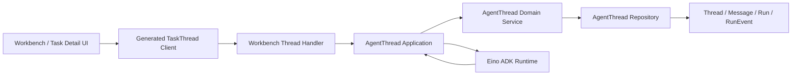

# WorkbenchChat 旧链路退役历史设计与验收记录

## 文档状态

- 状态：ChatTask 代码退役已完成；本文转为历史设计、迁移证据和验收清单；
- 迁移前基线：`dev@dcca3a9c4c7daf0b311317b1e99e94bc1d713513`；
- 当前核验基线：`dev@851c4da8fd72e8fa0cf1bcd8d06c9e489616507f`；
- 实施提交：`68d4a2772c4ecc626e59a29a6b32f1c5c93c46ef`；
- 当前权威：源码、IDL、迁移、测试和
  `docs/superpowers/context/workbench-chat.md`；
- 剩余边界：代码合入不等于各环境数据库已执行删除迁移，环境操作只遵循
  `docs/superpowers/runbooks/workbench-chat-legacy-cleanup.md`；
- 范围：保留迁移前事实、历史数据处置规则、代码退役边界和原验收依据；
- 排除：本文不定义当前 ChatTask 兼容能力，也不批准 Kernel V2/K2 代码实施。

> 阅读规则：下文的“迁移前”“原设计”“原计划”均为历史语境，不能据此恢复
> `/api/workbench/tasks*`、`/api/workbench/chat`、ChatTask IDL/client/fallback 或
> application/domain。当前产品与工程事实以本节列出的权威来源为准。

## 当前实施结果

截至 `dev@851c4da8f`：

- `/api/workbench/tasks*` 与 `/api/workbench/chat` 不再注册，负向路由测试固定断言
  `404`；
- `WorkbenchChatRequest/Data/Response`、ChatTask DTO/方法及其生成成员、前后端
  fallback、`backend/application/task`、`backend/domain/task` 和旧 Workbench
  runner/gateway 已删除；
- 前端生产源码由
  `frontend/apps/coze-studio/src/pages/tasks/__tests__/canonical-frontend-contract.test.ts`
  持续执行退役标识符扫描；
- `legacy_task_id` 只允许出现在删除历史 metadata key 的 denylist 清洗或历史迁移、
  runbook 和审计材料中，不得恢复对象映射或业务读取；
- 删除迁移
  `docker/atlas/migrations/20260726000100_drop_legacy_workbench_chat.sql`
  已进入迁移链，但每个环境仍需独立完成统计、备份、确认和 apply；
- `/api/workbench/task_threads` 仍是当前 Workbench 产品合同，未来
  `/api/workbench/threads` 的迁移由 Thread API 专项规格独立约束，不以 ChatTask 为
  fallback。

## 历史背景

WorkbenchChat 是工作台任务交互的业务域名称。迁移前，用户可见的新任务流程已经
使用 TaskThread，但仓库当时仍保留早期 ChatTask API、数据表、前端回退和运行编排。
如果把两者都描述成长期有效的主链，后续开发容易错误选择旧接口、旧状态模型
或旧持久化结构。

本设计当时用于解决两个问题：

1. 将仍需保留的历史 ChatTask 数据迁入 TaskThread，并彻底删除旧运行时链路；
2. 为清理后的 WorkbenchChat 建立受版本控制、可检索、可验证的长期上下文，
   确保代码变化后 Graphify 和 codebase-memory 审计及时同步。

## 已核实的迁移前现状

### 迁移前已生效主链

迁移前工作台首次提交已经使用 TaskThread 合同：

- 前端入口：`frontend/apps/coze-studio/src/pages/workbench/index.tsx`；
- 前端 API：`CreateTaskThread`、`CreateTaskThreadRun`；
- IDL：`idl/workbench/task.thrift`；
- HTTP handler：`backend/api/handler/coze/workbench_thread_service.go`；
- application：`backend/application/agentthread/service.go`；
- domain/repository：`backend/domain/agentthread/`；
- 持久化主实体：Thread、Message、Run、RunEvent，以及关联的 memory、artifact、
  checkpoint、token usage、guardrail 和 MCP audit 数据。

无附件的首次提交由 `CreateTaskThread` 原子创建 Thread、Run 和用户 Message。
带附件时先使用 `defer_start` 创建 Thread，上传文件后再调用
`CreateTaskThreadRun`。标准线程详情追问同样调用 `CreateTaskThreadRun`。

### 迁移前尚存的旧链

迁移前仓库存在以下可执行旧链：

- `/api/workbench/chat` 和 `WorkbenchChatRequest/Response`；
- `/api/workbench/tasks*` 的创建、列表、详情、取消、重试和事件接口；
- `ChatTask`、`TaskEvent`、`TaskStatus` 旧 IDL 合同；
- `backend/application/task/` 和 `backend/domain/task/`；
- `backend/application/workbench/` 中只服务旧链的 gateway、runner、task adapter
  和 AgentThread adapter；
- `chat_tasks`、`chat_task_attempts`、`chat_task_events`；
- `agent_threads.legacy_task_id`；
- 前端旧任务加载和追问回退。

迁移前详情路由会优先加载 TaskThread；只有 Thread 不存在时才读取 ChatTask。
历史 ChatTask 详情追问仍会调用 `/api/workbench/chat`。因此早期链已经不是新业务
主入口，但在删除前仍属于可达兼容路径。

### 提交历史证据

提交历史显示旧链与主链按以下顺序出现：

- `5562547cc`：新增 Workbench API contracts；
- `2bfd6e94b`：新增 chat orchestrator；
- `ff90f046b`：新增 AgentThread application service；
- `d71e51bd5`：`fix: create canonical task threads from workbench`。

仓库中没有正式 ADR 解释旧链为何一直保留。本文只把提交顺序、迁移前调用关系和
数据事实作为证据，不补写未经证明的业务动机。

### 外部测试数据库审计

2026-07-26 对项目 Debug 配置指向的外部测试 MySQL 做了只读统计。该结果只代表
测试环境，不外推为生产流量结论：

- `chat_tasks`：22 条，最后更新时间为 2026-06-27 23:53:09；
- 2026-06-28 之后新增 ChatTask：0 条；
- 最近 7 天新增 ChatTask：0 条；
- `agent_threads`：149 条；
- `legacy_task_id > 0` 的 Thread：2 条；
- 纯 canonical Thread：147 条；
- 没有关联 Thread 的 ChatTask：20 条；
- `chat_task_attempts`：0 条；
- `chat_task_events`：5,878 条；
- ChatTask 与 AgentThread 主键直接冲突：0 条。

旧任务状态分布为 `created=2`、`failed=9`、`succeeded=11`。旧事件分布为：

- `answer.delta`：5,784；
- `status_changed`：43；
- `created`：22；
- `turn.failed`：12；
- `answer.completed`：8；
- `task.step`：4；
- `user.message`：4；
- `task.thought`：1。

两个已关联 Thread 均没有 Message、Run 或 RunEvent。这些统计证明测试环境旧写入
已经停止，同时也证明直接删表会丢失历史数据。其它环境仍必须独立执行相同的
只读审计，不能复用测试环境结论。

## 原设计目标

1. WorkbenchChat 只保留 TaskThread 主模型和 AgentThread 执行链。
2. 仍需保留的历史任务迁入 Thread、Message、Run 和 RunEvent。
3. 删除所有 ChatTask 运行时 API、代码、字段、表和前端回退。
4. 当前上下文只描述已落地实现，并能追溯到源码、IDL、迁移和测试证据。
5. Graphify 负责审核后业务语义，codebase-memory 负责当前源码结构和影响分析。
6. WorkbenchChat 相关变化必须经过机器检查和两次 dev 集成审计。
7. K2/Kernel V2 设计稿不得被默认检索误认为当前实现。

其中代码、IDL、前后端 fallback 和迁移定义已经落地；各环境数据处置、migration apply
和备份销毁状态不能由 Git 推断，继续按环境 runbook 验收。

## 非目标

- 本设计不实现或批准 Kernel V2/K2；
- 不保留 `/api/workbench/chat` 的长期兼容层；
- 不保证废弃 ChatTask URL 或 ID 合同在清理后继续有效；
- 不删除或改造 `scheduledtask` 定时任务中心；
- 不编辑已有历史 Atlas migration；
- 不把 Graphify 输出或 codebase-memory 数据库提交到 Git；
- 不在数据库存在未迁移记录时用 UI fallback 掩盖问题。

## 术语与唯一事实模型

- **WorkbenchChat**：工作台任务交互业务域，不是旧 HTTP 方法名；
- **TaskThread**：当前唯一任务会话聚合；
- **Message**：Thread 内的用户或助手可见消息；
- **Run**：一次可独立追踪、取消、重试或恢复的执行轮次；
- **RunEvent**：Run 的持久化、可投影事件；
- **ChatTask**：迁移前待处置、当前代码已退役的历史实体，不属于最终架构；
- **Task**：可以继续作为产品界面用语，但代码合同必须明确映射到 TaskThread，
  不得重新引入 ChatTask 数据模型。

最终数据关系为：

```text
TaskThread
  -> Message
  -> Run
       -> RunEvent
       -> Checkpoint
       -> TokenUsage
       -> Artifact
  -> Memory
  -> GuardrailAudit / MCPRuntimeAudit
```

## 目标架构



以下路径在最终架构中禁止出现：

```text
UI -> /api/workbench/chat -> ChatTask -> chat_task_events
```

## 历史数据迁移

本节保留原迁移规则，用于解释删除迁移的前置条件和环境运维依据。它不是在线兼容
合同，也不表示当前代码仍能读取或写入 ChatTask。

### 发布原则

退役属于一个 P0，但按迁移和删除两个阶段执行。第二阶段完成前不得宣布任务
结束。每个环境分别执行审计、备份、dry-run、迁移和验收。

### 阶段 A：冻结与迁移

1. 核实 API gateway、服务日志和数据库最近写入；每个用户可访问环境必须连续
   7 天没有旧接口请求和旧表写入。明确无用户流量的临时环境只有在环境负责人
   记录豁免后才能跳过观察窗口；
2. 对旧接口进入维护冻结，防止审计和迁移期间产生新 ChatTask；
3. 创建访问受控、加密保存的源表备份；最终 drop 验收通过后至少保留 30 天，
   到期按环境数据保留策略销毁；
4. 运行迁移器 `dry-run`，输出任务、轮次、消息、事件、状态和冲突统计；
5. 逐 Task 开启数据库事务并执行幂等迁移；
6. 运行覆盖率、数量、状态和内容摘要校验；
7. 只有全部环境 `unmigrated=0` 且旧写入持续为零时，进入阶段 B。

迁移器是一次性运维能力，不进入在线请求路径。所有环境完成迁移和审计后，
迁移器本身也从最终运行时代码中删除；Git 和发布记录保留历史证据。

### 幂等与事务

- 每个源 Task 独立事务，单条失败不提交半成品；
- 使用稳定迁移键和审计映射记录 `task_id -> thread_id`；
- 已存在关联 Thread 时先验证空间、创建者、标题和已有子记录，再决定复用；
- 未关联 Task 使用当前 ID generator 创建 canonical ID，不假设不同表的旧 ID
  永远无冲突；
- 重复执行必须识别已完成记录，不能重复创建 Message、Run 或 RunEvent；
- 源表在阶段 A 保持只读，不边迁移边删除；
- 跨空间、所有者缺失、ID 冲突、已有 Thread 内容冲突立即阻断。

### 轮次恢复

测试库没有 attempt 数据，其它环境不能沿用该假设。迁移器先检查 attempt 的时间
区间、顺序和状态：只有区间完整、互不重叠且能唯一归属事件时，才把 attempt
作为 Run 边界；attempt 缺失或无法可靠分区时，按 Task 内有序消息事件恢复轮次。
attempt 与消息事件推导结果冲突时阻断，不静默选择其中一方。

消息事件恢复规则为：

1. `input.message` 创建初始用户消息并开始第一轮；
2. 每个后续 `user.message` 结束前一轮边界并开始新一轮；
3. 每轮创建一个顶层 Run；
4. `answer.completed.message` 作为该轮助手最终消息；
5. 若 `answer.completed` 缺失，按序合并该轮 `answer.delta`；
6. 仍无法恢复时，仅对最后一轮使用 `task.result.message` 兜底；
7. 无法唯一确定轮次或最终内容时进入阻断清单，不猜测配对。

`answer.delta` 是瞬时流片段，不逐条写入新 RunEvent。迁移后只保留恢复出的最终
助手消息及必要的受控执行事件。

### 事件映射

- `created`、`status_changed`：转换为 Thread/Run 状态，不复制为展示噪声；
- `user.message`：转换为用户 Message；
- `answer.completed`：转换为助手 Message，并完成对应 Run；
- `task.step`：只迁移 `title`、`detail`、`status`、`runtime`、`step_id`、
  `progress`；
- `task.thought`：只迁移允许公开的 bounded metadata；旧 `thought` 原文默认
  不进入 Workbench UI；
- `turn.failed`：迁移受限错误码和脱敏后的错误摘要；
- `answer.delta`：仅用于恢复最终消息，不生成逐条 RunEvent；
- 未识别事件类型：阻断并人工分类，不能原样搬运。

旧 prompt、model completion、tool arguments、tool results、credentials、对象存储
URI、checkpoint bytes、provider raw body 和 hidden config 不得因迁移进入公共 API
或 UI。

### 状态映射

- `created` -> Thread `idle`，Run `pending`；
- `queued` -> Thread `running`，Run `queued`；
- `running` -> Thread `running`，Run `running`；
- `succeeded` -> Thread `completed`，Run `succeeded`；
- `failed` -> Thread `failed`，Run `failed`；
- `canceled` -> Thread `canceled`，Run `canceled`；
- `canceling` 或迁移冻结后仍处于活动态的记录：阻断，先完成状态处置。

事件终态优先于 Task 汇总终态时必须报告冲突，不自动覆盖。

### 迁移校验

每个环境必须满足：

- 源 Task 处置覆盖率为 100%；
- 每个非空初始输入都有用户 Message；
- 每个恢复出的用户轮次都有且只有一个顶层 Run；
- 每个成功轮次都有助手最终消息；
- 失败轮次有脱敏错误摘要；
- Thread、Run 与 Message 的 `space_id`/creator 归属一致；
- 重复 dry-run 和重复迁移不产生新增数据；
- 审计映射、数量摘要和内容校验摘要可复核；
- 未迁移、未知事件、冲突和最近旧写入均为零。

### 阶段 B：代码和 schema 删除（代码侧已实施）

阶段 B 先发布不再读取旧表的代码，在最终页面与 API 验收通过后再执行 drop。
这样可以在删表前回滚新代码；旧表 drop 完成后只允许向前修复，不允许回滚到
依赖旧表的版本。

## 删除边界

### 前端

删除：

- `sendWorkbenchChat`；
- `getTask`、`listTaskEvents` 等旧任务 API client；
- `fetchLegacyTaskDetail` 和 `source: 'task'`/自动回退；
- 旧任务追问分支；
- `getTaskThreadDetailId` 等 `legacy_task_id` 适配；
- 生成的 `ChatTask`、`TaskEvent`、旧 `TaskStatus` 依赖。

Task detail 改为只接收 `thread_id`。现有页面如需统一展示模型，新增明确的本地
`TaskThreadDetailViewModel`，由 Thread、Message、Run 和 RunEvent 投影生成，
不再借用 `ChatTask` 作为视图模型。

现有详情 URL 可以保持 `/space/:space_id/tasks/:thread_id` 的外部形状，避免无关
书签破坏；React Router 参数、loader 和 hooks 内部只允许使用 `thread_id`，不得
再通过参数名或自动探测区分 ChatTask 与 TaskThread。

### IDL 和生成代码

删除：

- `WorkbenchChatRequest/Data/Response` 和 `WorkbenchChat` method；
- `CreateTask`、`ListTasks`、`GetTask`、`CancelTask`、`RetryTask`、
  `ListTaskEvents` 旧合同；
- `ChatTask`、旧 `TaskEvent`、旧 `TaskStatus`；
- 对应 Go/TypeScript 生成代码和 router。

Runtime Doctor 合同不得因删除旧 WorkbenchChat 而丢失。实施时将其保留在明确的
`idl/workbench/diagnostic.thrift` 中；`idl/api.thrift` 直接扩展 TaskThread 和
diagnostic service，随后删除不再承担职责的 `idl/workbench/workbench.thrift`，
避免继续依赖名为 `chat` 的生成 namespace。现有手写
`backend/api/model/workbench/diagnostic/diagnostic.go` 由同一合同生成链统一接管，
不能与 generated model 并存；前端改用 diagnostic generated client。

上述 namespace 搬迁没有按原提案落地。当前 `idl/workbench/workbench.thrift` 中的
`WorkbenchChatService` 只保留 `GetWorkbenchRuntimeDoctor`，生成 service/client 壳也只服务
该诊断方法；它不包含 `WorkbenchChat` 写方法、ChatTask DTO 或旧任务路由，不能作为旧链
仍存在的证据。

### 后端

删除：

- `backend/api/handler/coze/workbench_chat_service.go`；
- `backend/api/handler/coze/workbench_task_service.go`；
- `backend/application/task/`；
- `backend/domain/task/`；
- `backend/application/application.go` 中旧 task service 和 worker wiring；
- `backend/application/workbench/` 中仅服务旧链的 chat gateway、task adapter、
  AgentThread adapter、answer runner、agent runner、mode、result payload 和旧
  runtime settings；
- `backend/application/agentthread/` 中 `TaskToThreadSummary` 和旧状态适配。

`backend/application/workbench` 中仍服务 Runtime Doctor 和 suggestions 的能力
继续保留。迁移前定义在旧 answer runner 中的 chat model provider 必须迁到语义
明确的独立文件，不能因删除旧 runner 误删现用诊断和建议功能。迁移前定义在旧
chat gateway 中、仍被 Runtime Doctor handler 使用的 client error 分类也必须迁到
独立 `errors.go`。`ApplicationService` 重建为只包含 Runtime Doctor 和 suggestions
实际依赖的最小组件，移除 TaskSVC、AgentRunSVC、KnowledgeSVC 等旧 wiring。

### 数据库

原设计要求新增 Atlas migration 删除以下对象；当前迁移文件已经进入迁移链：

- `chat_tasks`；
- `chat_task_attempts`；
- `chat_task_events`；
- `agent_threads.legacy_task_id`；
- 对应索引。

已有历史 migration 保持不可变。源码文本扫描必须允许历史 migration 和本设计
出现旧名称，但最终运行时 schema、当前 IDL、在线代码和生成客户端不允许出现。

### 明确保留

- `backend/application/scheduledtask/`；
- `backend/domain/scheduledtask/`；
- Scheduled Task IDL、页面、worker 和数据库表；
- TaskThread、AgentThread runtime、memory、artifact、token、guardrail、MCP、
  sandbox 和 notification 能力。

## 最终负面约束

代码退役完成后必须持续满足：

- 在线路由不存在 `/api/workbench/chat` 和 `/api/workbench/tasks*`；
- 当前 IDL 和生成客户端不存在 `WorkbenchChatRequest/Data/Response`、`ChatTask`、旧
  `TaskEvent` 及旧任务方法；`WorkbenchChatService` 名称只允许承载 Runtime Doctor；
- 在线 Go/TypeScript 代码不得读取、映射或回显 `legacy_task_id`；只删除该 key 的
  denylist 清洗允许保留；
- 最终数据库 schema 不存在三个 `chat_task*` 表和 `legacy_task_id`；
- Task detail 不尝试加载 ChatTask；
- Graphify 当前语料不把旧链建成活动节点；
- codebase-memory 查不到被删除符号的有效调用方；
- 历史 migration、Git 和退役审计可以保留旧名称，但必须带历史语境。

## 历史提案：权威上下文设计

退役前现状由本文和 Git 保留。原设计曾计划建立目录化上下文与专用 manifest；最终
落地采用 `docs/superpowers/context/workbench-chat.md` 和仓库通用 AGENTS/runbook 规则。
下列 `current.md`、`sources.json` 与专用查询文件没有成为当前路径，不得作为已实现能力
引用。

原计划新增：

- `docs/superpowers/context/workbench-chat/current.md`；
- `docs/superpowers/context/workbench-chat/sources.json`；
- `docs/superpowers/context/workbench-chat/retrieval-queries.md`。

同时更新 `AGENTS.md`、`docs/superpowers/context/project-context.md` 和
`docs/superpowers/runbooks/dev-integration-audit.md`，加入该上下文入口、K2 排除、
Context Guard 命令和两次图谱审计要求。三处只保留短入口和执行规则，不复制
`current.md` 的业务正文。

### `current.md`

该文件是唯一当前语义事实源，只描述退役后的已落地 TaskThread 主链。核心事实
使用稳定 ID：

- `WBCHAT-ENTRY-*`：前端入口和用户流程；
- `WBCHAT-CONTRACT-*`：IDL、API 和 generated client；
- `WBCHAT-AUTH-*`：身份、空间和权限；
- `WBCHAT-STATE-*`：Thread/Run 状态和事件；
- `WBCHAT-RUNTIME-*`：执行、取消、重试和恢复；
- `WBCHAT-DATA-*`：持久化与事务；
- `WBCHAT-RESOURCE-*`：Skill、MCP、knowledge、file、memory、artifact；
- `WBCHAT-SECURITY-*`：脱敏和公共展示边界；
- `WBCHAT-TEST-*`：验证入口和测试证据。

每个关键事实至少包含证据路径和符号/合同 anchor。事实规则为：

- 行为事实：实现 + 测试；
- API 事实：IDL + handler/router + 调用方；
- 持久化事实：migration + entity/repository；
- 权限事实：服务端校验 + 拒绝路径测试；
- 运行时事实：application/domain 实现 + 状态/恢复测试。

证据冲突时标记 `conflict/unverified` 并阻止入图，不自行推断。

### `sources.json`

机器清单至少包含：

```json
{
  "schema_version": 1,
  "context_id": "workbench-chat-current",
  "authority": "current",
  "canonical_document": "current.md",
  "source_groups": [],
  "forbidden_corpus_paths": [],
  "forbidden_runtime_patterns": [],
  "verification": {
    "source_digest": "sha256:...",
    "impact": "context-updated",
    "reason": "...",
    "fact_ids": []
  }
}
```

`source_digest` 对排序后的仓库相对路径和文件内容计算，必须跨 macOS/Linux 稳定。
rename、delete 和新增文件都计入变化。`reason` 不允许空泛填写。

### 受监控源码组

至少覆盖：

- Workbench/Task detail 前端入口、service、route、hooks 和 tests；
- `idl/workbench/` 与 API 聚合 IDL；
- Workbench thread handler/router；
- AgentThread application、domain、repository、runtime 和 tests；
- Workbench Runtime Doctor、suggestions 及其依赖；
- memory、artifact、token、guardrail、MCP、skill、knowledge、sandbox 边界；
- AgentThread 和相关安全 schema migrations；
- dev 集成 runbook 与本上下文文件。

生成文件按生成校验处理，语义事实仍以源 IDL 和实现为准。

### K2 强排除

以下路径及同主题后续设计稿不得进入当前 Graphify corpus：

- `docs/superpowers/plans/2026-07-26-agent-execution-kernel-v2.md`；
- `docs/superpowers/specs/2026-07-26-agent-execution-kernel-v2-design.md`；
- `docs/superpowers/specs/2026-07-26-agent-execution-kernel-v2-production-spec.md`。

只有用户明确讨论 K2 设计时才能按设计资料读取；设计内容不得反向覆盖
`current.md`。

## 历史提案：双检索协议

以下流程是原设计输入。当前开工和完成流程以根 `AGENTS.md` 为准；不存在的专用
`current.md`、`sources.json` 或查询文件不构成门禁。

### 开工检索

1. 读取 `AGENTS.md`、项目上下文和 WorkbenchChat `current.md`；
2. Graphify 查询业务语义、跨模块关系和有效决策；
3. codebase-memory 检查索引项目和新鲜度；
4. 用 `search_graph`/`trace_path` 核实入口、调用链和依赖；
5. 修改前回读实际源码、IDL、migration 和相关测试。

图谱是导航和影响证据，不是源码替代品。Graphify、codebase-memory 与源码不一致
时，立即判定索引 stale，刷新后重新查询；未核实前不继续设计或改代码。

### 完成检索

1. codebase-memory `detect_changes()` 检查全部受影响符号；
2. 重新索引需求分支并运行固定调用链查询；
3. 上下文语料变化后运行 Graphify 增量更新；
4. 执行 `retrieval-queries.md` 的正向与负向问题；
5. 回读每个查询引用的源文件，确认没有旧链、K2 或历史文档污染。

固定查询至少覆盖：

- 首次任务如何从 Composer 到 Run；
- 带附件任务如何延迟启动；
- 追问如何创建新 Run；
- 空间权限在哪里强校验；
- Thread、Message、Run、RunEvent 如何持久化；
- cancel/retry/resume 如何改变状态；
- memory、artifact、Skill、MCP 和知识资源如何接入；
- Workbench UI 可展示和禁止展示哪些字段；
- 当前是否仍存在 ChatTask/WorkbenchChat 兼容链，预期答案为“不存在”。

## 历史提案：Graphify 语料与输出

Graphify 只扫描 `docs/superpowers/context/workbench-chat/` 受控目录，不扫描整个
monorepo。仓库根目录已有但不完整的 `graphify-out` 重建为该精选语料的派生图。

- `graphify-out/` 保持 ignored；
- 图谱文件不提交；
- `sources.json` 保存可审计 corpus digest；
- 当前文档变化后使用增量更新；
- 本地审计检查实际 graph 与 corpus digest 一致；
- CI 不依赖 LLM/Graphify 服务，只校验受版本控制语料和 digest；
- K2 路径出现在 Graphify manifest 或来源列表时直接失败。

## 未采纳的历史提案：Context Guard

原设计曾计划在 `backend/cmd/workbench-context-guard` 实现一个只依赖 Go 标准库和 Git 的
轻量 guard，支持：

- 计算受监控路径 digest；
- 校验 canonical doc、事实 ID、证据文件和 anchor；
- 根据 diff 对变更分类；
- 检查退役禁止项；
- 校验 K2 强排除；
- 输出机器可读和人类可读报告。

影响级别：

1. IDL、router/handler、鉴权、状态机、持久化、migration、运行编排、安全边界：
   必须更新上下文，不允许 `context-impact: none`；
2. UI 行为、错误恢复、resource/memory/artifact 接入：必须人工确认受影响事实；
3. 纯格式、纯测试整理或不改变可观察行为的重构：允许 `none`，但必须填写明确
   原因并更新已审计 digest。

以下情况直接失败：

- source digest 与当前文件不一致；
- 受监控路径或证据 anchor 消失；
- 高风险变化没有更新事实；
- `none` 缺少原因；
- K2 进入当前 corpus；
- 旧链禁止项重新进入在线代码、当前 IDL 或最终 schema；
- Graphify 或 codebase-memory 必需审计无法完成。

项目通用上下文允许工具故障时记录降级证据；WorkbenchChat 使用更严格规则：
只要任务涉及该核心域并需要图谱审计，工具故障就阻止集成。只有用户针对当前
SHA 和当前审计报告明确书面豁免，才允许例外。

## 未采纳的历史提案：专用 CI 门禁

原设计曾计划新增 `.github/workflows/workbench-context.yml`，触发范围覆盖相关 PR 和 `dev`
push。CI checkout 必须包含可计算 merge-base 的历史，使用完整 diff 基准执行
Context Guard、禁止项检查和文档证据校验，不运行需要本地 MCP 或 LLM 的图谱
构建。

本地流程固定为：

1. 需求完成：运行测试、Context Guard、codebase-memory 影响分析和 Graphify
   查询；
2. 第一次审计：需求分支对齐最新 `origin/dev`，重新验证并提交报告；
3. 用户第一次确认：才允许合入本地 `dev`；
4. 第二次审计：在合并后的本地 `dev` 重新索引、重建图谱、运行测试、schema
   校验和页面验收；
5. 用户第二次确认：才允许推送 `origin/dev`；
6. 推送后核对远程 SHA。

远程 `dev` 前进、分支分叉、图谱冲突、测试失败、迁移校验失败或出现额外提交
时，停止同步并重新从第一次审计开始。

## 测试设计

### 迁移器

覆盖：

- 空库；
- 单轮成功、失败和 created Task；
- 多轮 `user.message`；
- 只有 `answer.delta`；
- `answer.completed` 与 `task.result` 冲突；
- malformed JSON；
- 未识别事件；
- 已存在空 Thread；
- 已存在有内容 Thread；
- ID 冲突；
- 跨空间/创建者不一致；
- 重复 dry-run、重复 execute 和中断续跑；
- 单 Task 事务回滚；
- 敏感字段不进入公共消息和事件。

### 后端

覆盖：

- TaskThread 原子创建；
- 附件 defer-start -> upload -> run；
- 追问和幂等；
- Run 取消、重试、恢复和断连策略；
- Thread/Run 状态收敛；
- 空间成员、跨空间和非创建者权限；
- 安全事件投影；
- 旧 route 和 handler 不存在；
- Runtime Doctor 和 suggestions 未因旧链删除回归。

### 前端

覆盖：

- Workbench 首次提交；
- 附件上传后启动；
- Task detail 只加载 Thread；
- 追问只调用 `CreateTaskThreadRun`；
- loading、empty、error、disabled、readonly、refresh；
- stream、cancel、retry、resume；
- artifact、memory、token、guardrail、MCP 和 subagent 展示；
- ChatTask fallback 和旧 API mock 全部删除。

### 数据库和生成代码

- Atlas `v0.35.0` hash/validate；
- 从空库完整执行全部 migration；
- 从带旧数据 fixture 升级并验证最终 schema；
- 生成 Go/TypeScript client 和 router 后无 drift；
- `information_schema` 验证旧表、字段和索引不存在；
- 历史 migration 保持未修改。

### 检索与页面验收

- Context Guard 单元和 fixture 测试；
- Graphify 固定查询及来源核验；
- codebase-memory 主调用链和删除符号查询；
- Codex in-app browser 真实页面验收；
- 记录 URL、账号、空间、关键状态、交互结果和控制台错误。

## 失败和停止条件

任一条件满足即停止迁移、合并或推送：

- 任一环境旧接口仍有调用或旧表仍有新增写入；
- migration dry-run 有未知事件、冲突或未处置 Task；
- 数据覆盖率、状态或内容摘要不一致；
- 权限、租户或脱敏测试失败；
- 新代码仍能触发旧 handler、表或 fallback；
- Atlas、生成代码、Go/TS 测试或页面验收失败；
- Context Guard、Graphify 或 codebase-memory 结论冲突；
- K2 设计进入当前事实；
- 用户尚未完成对应阶段确认。

## 原设计完成标准

1. 所有需保留 ChatTask 均已迁入 canonical TaskThread；
2. 所有环境未迁移记录和旧写入均为零；
3. 旧 API、IDL、Go/TS 代码、worker、字段和表已删除；
4. Scheduled Task 能力未受影响；
5. TaskThread 首次提交、附件、追问、取消、重试和恢复通过验证；
6. 当前上下文只描述已落地 TaskThread 主链；
7. Graphify 当前 corpus 不含 K2 或活动旧链；
8. codebase-memory 主链可追踪且旧符号无调用方；
9. Context Guard 和 CI 能阻止上下文遗漏或旧链回流；
10. 两次 dev 审计及两次用户确认完成；
11. 本地与远程 `dev` SHA 最终一致。

## 原交付顺序

该顺序用于追溯退役项目，不是当前待办。代码退役已经通过 `68d4a2772` 合入当前
`dev`；数据库环境操作继续按清理 runbook 单独确认，canonical Thread API 则按新的
专项规格独立实施。

1. 用户复核本文；
2. 编写可执行实施计划，按迁移、代码删除、上下文、图谱和审计拆分任务；
3. 在独立 `codex/` 分支实施；
4. 完成第一次审计并等待用户确认合入本地 `dev`；
5. 完成第二次审计并等待用户确认推送远程。
