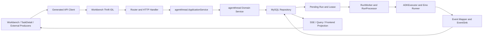

# Workbench 当前执行链图谱设计

日期：2026-07-26  
状态：已确认，待实施

## 背景

WorkbenchChat 已统一到 `TaskThread` 主模型，旧 `ChatTask` 链路已退役。当前长期
上下文已经记录主模型、代码所有权和退役边界，但现有 Graphify 图仍是三个局部
语料：

- `docs/superpowers/context`：2 个文件，48 个节点、56 条边；
- `backend/application/workbench`：7 个文件，111 个节点、211 条边；
- `frontend/apps/coze-studio/src/pages/tasks`：95 个文件，885 个节点、1950 条边。

这些图可以说明业务边界和局部源码结构，但不能完整遍历
`frontend -> IDL -> HTTP -> application -> domain -> repository -> worker -> Eino -> event -> frontend`
的真实执行路径。业务事实图中，`Workbench Frontend Entry` 到
`Eino ADK Execution Kernel` 的现有最短路径只是经由
`WorkbenchChat Current Facts` 的两条 `references` 边，不是调用边。前端结构图中，
`sendFollowUpMessage()` 也没有连接到源码实际调用的 `uploadTaskThreadFiles()` 和
`createTaskThreadRun()`。

因此，当前图谱不能声称已经保存 Workbench 的完整执行链。

## 目标

1. 建立一张只描述当前生产实现的 Workbench 有向执行链图。
2. 每个权威节点和边都能反查源码符号、稳定代码标识或测试证据。
3. 覆盖入口、异步执行、持久化、事件回传、控制恢复和附属数据链。
4. 让 Graphify 提供稳定业务关系检索，让 codebase-memory 提供实时结构追踪。
5. 在源码变化后能够检测图谱语料过期、链路断裂和上下文漏更。
6. 明确隔离 K2、旧 ChatTask 和历史设计语料，禁止用其推断当前实现。

## 非目标

- 不修改 Workbench、AgentThread、Eino ADK 或数据库的业务行为。
- 不把整个仓库无差别提交给 Graphify。
- 不提交 Graphify 的派生 `graph.json`、HTML 或缓存。
- 不把历史 plans/specs 转换为当前事实。
- 不保存 prompt、模型原始输出、工具参数或结果、凭据、对象地址、checkpoint bytes
  或原始审计载荷。
- 不为 K2 设计创建当前生产节点或执行边。

## 权威与持久化

采用四层结构：

1. **权威事实层**：
   `docs/superpowers/context/workbench-execution-chain.md` 保存人工可读、源码锚定的
   当前执行链。
2. **机器合同层**：
   `docs/superpowers/context/workbench-execution-graph.json` 保存节点、边、链路、
   源码锚点、测试证据和排除边界。
3. **构建校验层**：
   `scripts/workbench-execution-graph.mjs` 校验合同并从白名单语料重建有向图。
4. **检索层**：Graphify 查询稳定业务关系，codebase-memory 查询实时符号调用和
   影响范围，最终结论必须回到源码、IDL 和测试核实。

Markdown、JSON 合同和校验脚本提交到 Git。Graphify 输出保存在 ignored
`docs/superpowers/context/workbench-execution-graphify/graphify-out/`，由已提交语料
重建，不作为独立事实源。该目录同时保存 ignored 临时语料和构建元数据，形成
唯一、稳定的 Workbench Graphify 查询入口。

## 总体结构



该图只表达顶层主链。取消、恢复、重试、审计和附属数据使用独立链路 ID 描述，
不能压缩成无法验证的单一“大节点”。

## 图谱合同

### 顶层字段

`workbench-execution-graph.json` 至少包含：

```json
{
  "schema_version": 1,
  "authority": {},
  "scope": {},
  "nodes": [],
  "edges": [],
  "chains": [],
  "exclusions": [],
  "required_queries": []
}
```

### 节点

每个节点包含：

- 稳定且唯一的 `id`；
- `label`、`layer`、`kind`；
- `production_status`，权威执行链只能引用 `current` 节点；
- 一个或多个 `source_anchors`；
- 至少一个 `evidence`，可指向测试或合同；
- 可选的 `bounded_metadata`，不得包含敏感运行内容。

源码锚点包含仓库相对路径和精确符号或稳定代码标识。行号只能作为辅助信息，
不能作为唯一锚点。

### 边

每条边包含：

- 唯一 `id`；
- `from`、`to`；
- 关系类型；
- 所属 `chain_ids`；
- 源码或测试证据；
- `confidence: "extracted"`。

权威关系类型限定为：

- `routes_to`
- `calls`
- `delegates_to`
- `persists_via`
- `claims`
- `executes`
- `emits`
- `maps_to`
- `streams_to`
- `projects_to`
- `cancels`
- `resumes`
- `retries`
- `audits`
- `excludes`

Graphify 可以生成推断关系，但推断关系不能满足机器合同中的必需边。

### 链路

每条链包含：

- 稳定 `id` 和名称；
- 入口与终点；
- 按顺序排列的必经节点和边；
- 成功、错误和恢复路径；
- 生产状态；
- 至少一个测试证据。

校验器必须验证入口到终点可达，并验证声明的顺序和边类型。

## 必须覆盖的链路族

### 1. 任务入口

- Workbench 首次即时提交；
- Workbench 延迟启动；
- TaskDetail 追问、附件上传与原子建 Run；
- LangGraph 兼容 API 创建 Thread/Run；
- 定时任务触发 TaskThread/Run；
- 飞书消息触发 TaskThread/Run。

LangGraph、定时任务和飞书是当前真实生产者，必须连接到共享 AgentThread 主链，
但不能被描述为 Workbench UI 的内部组件。

### 2. 权威持久化

- Thread、Message、Run 原子创建；
- 幂等键和重复请求处理；
- 用户、空间、Thread 和 Run 所有权校验；
- Domain Service 到 MySQL Repository 的持久化关系。

### 3. 异步执行

- Pending Run；
- Worker 领取和 Lease；
- Lease 心跳；
- RunProcessor；
- Runtime 选择和 fail-closed；
- ADKExecutor；
- Eino Agent Factory、Runner、Tool 和 Subagent。

### 4. 事件和结果回传

- Eino `AgentEvent`；
- `MapADKEvent`；
- EventSink；
- Checkpoint、TokenUsage、Artifact 和 RunEvent 持久化；
- Run 终态和 Assistant Message；
- SSE 或查询接口；
- 前端事件投影、Todo、工具调用和结果展示。

### 5. 控制和恢复

- Cancel；
- Human Interaction Resume；
- Subagent Retry；
- Checkpoint 恢复；
- Lease 超时恢复；
- Multitask interrupt/rollback；
- Worker 重启和重复执行保护。

### 6. 附属数据链

- Memory 增删改、导入导出、恢复和审计；
- Artifact 上传、扫描、审核、下载、删除和恢复；
- Token Usage 聚合；
- Guardrail Audit；
- MCP Runtime Audit。

### 7. 边界链

- Runtime Doctor 和建议生成只作为辅助能力，不连接为状态机所有者；
- 旧 ChatTask 节点全部标为 retired，且不进入当前链路；
- K2 只存在于排除声明，不进入当前节点和执行边。

## 构建流程

`scripts/workbench-execution-graph.mjs build` 执行以下步骤：

1. 读取并验证机器合同；
2. 根据合同中的源码锚点生成白名单文件集合；
3. 从合同确定性渲染节点、显式边和链路顺序账本，作为 Graphify 的权威关系
   语料；
4. 将权威 Markdown、关系账本和白名单源码复制到 ignored 临时语料目录；
5. 保持仓库相对路径，避免同名文件失去所有权信息；
6. 计算合同、文档和源码语料的确定性 SHA-256 摘要；
7. 使用 Graphify 构建有向图，源码 AST 关系用于补充结构上下文，不能覆盖合同
   中的显式关系；
8. 写入派生图元数据，包括 Git tree、语料摘要、Graphify 版本和生成时间；
9. 执行派生图健康检查和必需查询。

构建不得读取历史 plans/specs、K2 文档、旧 ChatTask 源码或未列入白名单的目录。

## 校验流程

脚本提供：

```bash
node scripts/workbench-execution-graph.mjs verify
node scripts/workbench-execution-graph.mjs build
node scripts/workbench-execution-graph.mjs verify-derived
```

`verify` 必须检查：

- JSON 可解析且 schema version 受支持；
- 节点、边和链路 ID 唯一；
- 所有边端点存在；
- 所有链路节点、边和测试证据存在；
- 源码路径和锚点真实存在；
- 当前链路不引用 retired、K2 或历史节点；
- 每条链从入口到终点可达；
- 白名单路径位于仓库内，且不包含敏感或生成目录。

`verify-derived` 必须检查：

- 派生图语料摘要与当前文件完全一致；
- Graphify 图中无悬空端点、自环和重复关系边；
- 必需业务节点和显式链路都能查询到；
- Workbench 前端到 Eino 的路径经过真实跨层节点，不只经过文档
  `references`；
- K2 和旧 ChatTask 当前节点数为 0。

## 变化检测

校验器支持指定比较基线，例如：

```bash
node scripts/workbench-execution-graph.mjs verify --changed-from origin/dev
```

当以下内容发生变化时，当前需求分支必须同步执行链文档和机器合同：

- Manifest 白名单源码；
- Workbench TaskThread API 或生成 client；
- AgentThread Application、Domain、Repository；
- Worker、Lease、Runtime Selector、ADKExecutor；
- Event、Checkpoint、Memory、Artifact、Token、Guardrail、MCP；
- 认证、租户隔离、bounded projection 或 fail-closed 边界。

相关源码变化而两个权威文件均未更新时，变化检测必须失败。只更新文档但未更新
合同，或只更新合同但未更新文档，同样失败。

## 故障处理

- 缺少 Graphify：`verify` 仍可运行，`build` 明确失败并给出安装检查结果。
- 缺少 codebase-memory MCP：记录降级，使用 Graphify、`rg`、源码和测试完成
  验证，不伪造结构查询结果。
- 源码锚点漂移：校验失败，要求重新核实源码后更新合同。
- 派生图过期：禁止查询为“当前图”，必须重建。
- 图谱推断与源码冲突：源码、IDL、生成代码和测试优先，删除或修正推断边。
- 工作树含相关未提交改动：摘要覆盖实际文件内容，审计必须明确当前 tree 和 diff。

## 安全边界

- 所有文件路径必须在仓库内并通过白名单选择。
- 不读取 `.env`、密钥文件、凭据缓存、对象内容或运行日志原文。
- 不把 prompt、completion、tool arguments、tool results、checkpoint bytes、
  credentials、object URI、raw provider body 或 raw audit payload 写入图谱。
- Graphify 语料只包含源码结构、公开合同、bounded metadata 和测试名称。
- 派生图不得自动上传外部服务。

## 测试和验收

必须完成以下验证：

1. 合同正向校验通过；
2. 损坏符号故障注入能够失败；
3. 悬空边故障注入能够失败；
4. K2 当前节点故障注入能够失败；
5. 过期摘要故障注入能够失败；
6. Graphify 有向图健康检查通过；
7. 每个必需链路查询返回入口、真实跨层节点和终点；
8. codebase-memory 在相同 Git tree 上刷新；
9. codebase-memory 能找到当前关键符号，并确认旧 ChatTask 生产符号为 0；
10. `git diff --check`、敏感信息扫描和工作树清洁检查通过。

本需求不改变业务代码，因此不要求页面行为变化。若实施过程中发现必须修改业务
代码才能使声明链路成立，应停止并拆成新的业务修复需求，不能在图谱需求中顺手
修补。

## 分支与合并

实施使用独立分支 `codex/workbench-execution-graph-completion`。完成后：

1. 提交首次代码和文档审计；
2. 用户确认后合入本地 `dev`；
3. 在合并后的本地 `dev` 上执行第二次严格审计；
4. 用户再次确认后才推送 `origin/dev`。

任何阶段都不得自动合并或推送。

## 方案取舍

### 采用：精选执行链图谱

优点是边界明确、可验证、噪声低，并能把业务语义与真实源码连接起来。代价是
新增执行入口时必须同步维护合同，这正是防止长期上下文漂移所需的约束。

### 不采用：全仓 Graphify 扫描

全仓扫描会引入大量测试、历史模块、同名符号和无关关系，不能稳定回答“当前
Workbench 权威执行链是什么”。全库结构检索继续交给 codebase-memory。

### 不采用：仅依赖 codebase-memory

codebase-memory 擅长实时结构查询，但不能单独表达经过确认的业务边界、排除项和
完整链路验收。它作为结构检索层，而不是唯一长期事实源。
