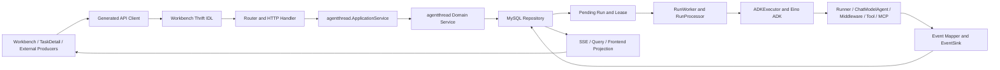

# Workbench 当前执行链图谱设计

日期：2026-07-26
状态：已实施，待首次合入审计

## 背景

WorkbenchChat 已统一到 `TaskThread` 主模型，旧 `ChatTask` 链路已退役。当前长期
上下文已经记录主模型、代码所有权和退役边界，但现有 Graphify 图仍是三个局部
语料：

- `docs/superpowers/context`：2 个文件，48 个节点、56 条边；
- `backend/application/workbench`：7 个文件，111 个节点、211 条边；
- `frontend/apps/coze-studio/src/pages/tasks`：95 个文件，885 个节点、1950 条边。

这些图可以说明业务边界和局部源码结构，但不能完整遍历
`frontend -> IDL -> HTTP -> application -> domain -> repository -> worker -> Eino -> event -> frontend`
的真实执行路径。业务事实图中，`Workbench Frontend Entry` 到
`Eino ADK Execution Kernel` 的现有最短路径只是经由
`WorkbenchChat Current Facts` 的两条 `references` 边，不是调用边。前端结构图中，
`sendFollowUpMessage()` 也没有连接到源码实际调用的 `uploadTaskThreadFiles()` 和
`createTaskThreadRun()`。

因此，当前图谱不能声称已经保存 Workbench 的完整执行链。

## 目标

1. 建立一张只描述当前生产实现的 Workbench 有向执行链图。
2. 每个权威节点和边都能反查源码符号、稳定代码标识或测试证据。
3. 覆盖入口、异步执行、持久化、事件回传、控制恢复和附属数据链。
4. 让 Graphify 提供稳定业务关系检索，让 codebase-memory 提供实时结构追踪。
5. 在源码变化后能够检测图谱语料过期、链路断裂和上下文漏更。
6. 明确隔离 K2、旧 ChatTask 和历史设计语料，禁止用其推断当前实现。
7. 建立源码锚定的框架使用子图，准确回答每个框架在执行链中的职责、入口、
   版本来源和兼容边界，尤其覆盖 Eino SDK/ADK 的实际使用方式。

## 非目标

- 不修改 Workbench、AgentThread、Eino ADK 或数据库的业务行为。
- 不把整个仓库无差别提交给 Graphify。
- 不提交 Graphify 的派生 `graph.json`、`query-graph.json`、HTML 或缓存。
- 不把历史 plans/specs 转换为当前事实。
- 不保存 prompt、模型原始输出、工具参数或结果、凭据、对象地址、checkpoint bytes
  或原始审计载荷。
- 不为 K2 设计创建当前生产节点或执行边。

## 权威与持久化

采用四层结构：

1. **权威事实层**：
   `docs/superpowers/context/workbench-execution-chain.md` 保存人工可读、源码锚定的
   当前执行链。
2. **机器合同层**：
   `docs/superpowers/context/workbench-execution-graph.json` 保存节点、边、链路、
   源码锚点、测试证据和排除边界。
3. **构建校验层**：
   `scripts/workbench-execution-graph.mjs` 校验合同并从白名单语料重建有向图。
4. **检索层**：Graphify 查询稳定业务关系，codebase-memory 查询实时符号调用和
   影响范围，最终结论必须回到源码、IDL 和测试核实。

Markdown、JSON 合同和校验脚本提交到 Git。Graphify 稳定路径
`docs/superpowers/context/workbench-execution-graphify/` 是 ignored 原子指针，
指向 `workbench-execution-graphify-versions/` 中已完整校验的版本，由已提交语料
重建，不作为独立事实源。版本内的 `graph.json` 是无检索边的执行路径视图，
`query-graph.json` 是在同一基底上增加业务问题 overlay 的检索视图；临时语料和
构建元数据也保存在 ignored 版本目录。稳定 current 指针原子切换，previous 指针
保留上一完整版本。两图职责固定，不能互换。

机器合同使用 `workbench_execution_v1` profile。canonical 模式由调用者默认强制，
不能由合同内部的 profile 或 authority path 自行关闭。profile 对 authority rule、scope、
全部 node/edge、chain、query 和 exclusion 的稳定投影计算 SHA-256，从而固定
查询集合、链顺序/side edge、排除语义、关键节点属性及边方向，并固定
`canonical_runtime=eino_adk`、`queue_backend=mysql` 和敏感内容策略；合同不能通过
删除自身约束或改写禁词静默降级。

## 总体结构



该图只表达顶层主链。取消、恢复、重试、审计和附属数据使用独立链路 ID 描述，
不能压缩成无法验证的单一“大节点”。

## 图谱合同

### 顶层字段

`workbench-execution-graph.json` 至少包含：

```json
{
  "schema_version": 1,
  "authority": {},
  "scope": {},
  "nodes": [],
  "edges": [],
  "chains": [],
  "exclusions": [],
  "required_queries": []
}
```

### 节点

每个节点包含：

- 稳定且唯一的 `id`；
- `label`、`layer`、`kind`；
- `production_status`，权威执行链只能引用 `current` 节点；
- 框架节点还必须包含 `runtime_scope`、`package` 和 `version_source`，其中版本只能
  从 `go.mod`、`package.json` 或锁文件读取，不能手工猜测；
- 一个或多个 `source_anchors`；
- 至少一个 `evidence`，可指向测试或合同；
- 可选的 `bounded_metadata`，不得包含敏感运行内容。

源码锚点包含仓库相对路径和精确符号或稳定代码标识。行号只能作为辅助信息，
不能作为唯一锚点。

### 边

每条边包含：

- 唯一 `id`；
- `from`、`to`；
- 关系类型；
- 所属 `chain_ids`；
- 源码或测试证据；
- `confidence: "extracted"`。

权威关系类型限定为：

- `routes_to`
- `calls`
- `delegates_to`
- `persists_via`
- `claims`
- `executes`
- `emits`
- `maps_to`
- `streams_to`
- `projects_to`
- `cancels`
- `resumes`
- `retries`
- `audits`
- `implemented_with`
- `configures`
- `adapts_to`
- `observes`
- `excludes`
- `precedes`

`precedes` 只表达同一已验证业务流程中的时序先后，例如上传完成后创建 Run、
MySQL claim 完成后交给 RuntimeSelector，以及 middleware 的源码装配顺序；它不
得伪装成函数调用关系。

Graphify 可以生成推断关系，但推断关系不能满足机器合同中的必需边。

### 链路

每条链包含：

- 稳定 `id` 和名称；
- 入口与终点；
- 按顺序排列的必经节点和边；
- 成功、错误和恢复路径；
- 生产状态；
- 至少一个测试证据。

校验器必须验证入口到终点可达，并验证声明的顺序和边类型。

## 必须覆盖的链路族

### 1. 任务入口

- Workbench 首次即时提交；
- Workbench 延迟启动；
- TaskDetail 追问、附件上传与原子建 Run；
- LangGraph 有 Thread 的 API 直接创建 Run，stateless API 先创建 backing Thread
  再创建 Run；
- 定时任务由 `AgentTaskExecutor.Execute` 在 `StartNew -> CreateTaskThread` 与
  `StartInThread -> CreateRun` 间分支；
- 飞书 `startRun` 在无 session 时创建 TaskThread，在已有 Thread 时创建 Run。

LangGraph、定时任务和飞书是当前真实生产者，必须连接到共享 AgentThread 主链，
但不能被描述为 Workbench UI 的内部组件。

### 2. 权威持久化

- Thread、Message、Run 原子创建；
- 幂等键和重复请求处理；
- 用户、空间、Thread 和 Run 所有权校验；
- Domain Service 到 MySQL Repository 的持久化关系。

### 3. 异步执行

- Pending Run；
- Worker 领取和 Lease；
- Lease 心跳；
- RunProcessor；
- Runtime 选择和 fail-closed；
- ADKExecutor；
- Eino Agent Factory、Runner、Tool 和 Subagent。

### 4. 核心框架使用子图

框架子图不能只保存“项目用了 Eino、Hertz、React”这种技术栈标签。每个框架
节点必须连接到实际生产符号，并标明它在主链中的职责：

- 前端：React 18、React Router、生成的 `@coze-studio/api-schema` 客户端和浏览器
  `EventSource`；Coze Design 只标记为 UI 依赖，不得连接为执行状态所有者。
- 合同与传输：Workbench Thrift IDL、thriftgo/API Schema 代码生成、Hertz HTTP 和
  Hertz SSE；必须明确线上协议是 HTTP JSON/SSE，而不是 Thrift 二进制 RPC。
- 应用与持久化：Go 原生 `agentthread` Application/Domain 编排、GORM、MySQL 事务、
  `FOR UPDATE SKIP LOCKED`、Lease 和 Heartbeat。
- 异步调度：Go goroutine/ticker 加 MySQL 持久化队列；Kafka、RabbitMQ、NATS、
  Asynq 和 Redis Queue 必须作为“不在当前主链”排除项，不能生成当前节点。
- Eino SDK：`adk.NewRunner`、`RunnerConfig`、`Run`、`Resume`、
  `ResumeWithParams`、`adk.NewChatModelAgent`、`ChatModelAgentConfig`，以及
  `schema`、`components/model`、`components/tool`、`compose`、`callbacks`。
- Eino middleware：按源码中的真实顺序收录 reduction、filesystem、uploaded
  files、patch tool calls、tool error normalization、memory、skill、transcript、
  summarization、plan task、provider capability、multimodal budget、tool search、
  parity state、context budget、safety finish、subagent limit 和 semantic loop。
- Eino 扩展：当前实际导入的 Ark、Claude、DeepSeek、Gemini、OpenAI、Qwen 模型
  适配，以及 DuckDuckGo、Wikipedia 工具；不得把“依赖存在”误写成“当前 Run
  一定调用”。
- MCP：`mark3labs/mcp-go` 客户端和 transport 适配为 Eino `tool.BaseTool`，覆盖
  stdio、SSE、Streamable HTTP、Sandbox、安全策略、输出预算和审计边界。
- 运行支撑：Prometheus 只作为可选观测层，Sonic 只作为 JSON 编解码层，OSS
  抽象只连接附件、Artifact、运行时 offload 和审计归档，不得提升为 Agent 内核。
- 外部生产者：`robfig/cron` 和飞书官方 Go SDK 只连接到任务入口，不得连接为
  Run 执行器。

框架节点的 `runtime_scope` 只能取：

- `canonical_runtime`
- `conditional_runtime_extension`
- `transport_contract`
- `persistence_runtime`
- `integration_ingress`
- `optional_observability`
- `ui_only`
- `compatibility_contract`
- `historical_compatibility`
- `build_or_test_only`

下列名称必须用明确边界节点表达，不能被误认为并行生产框架：

- LangGraph 仅是兼容 API，最终委托 `agentthread.ApplicationService`，不运行
  LangGraph SDK；
- DeerFlow 仅表示当前 Go/Eino 实现对其配置、模式和行为语义的兼容，不导入
  DeerFlow 运行时；
- `legacyAgentRunExecutor` 只服务历史无 runtime 标记记录；新 Run 拒绝选择
  `legacy` 并持久化 `runtime=eino_adk`；
- Rush、Rsbuild、Vitest 和 Atlas 属于构建、测试或迁移工具，不进入生产执行链。

### 5. 事件和结果回传

- Eino `AgentEvent`；
- `MapADKEvent`；
- EventSink；
- Checkpoint、TokenUsage、Artifact 和 RunEvent 持久化；
- Run 终态和 Assistant Message；
- SSE 或查询接口；
- 前端事件投影、Todo、工具调用和结果展示。

### 6. 控制和恢复

- Cancel；
- Human Interaction Resume；
- Subagent Retry；
- Checkpoint 恢复；
- Lease 超时恢复；
- Multitask interrupt/rollback；
- Worker 重启和重复执行保护。

### 7. 附属数据链

- Memory 增删改、导入导出、恢复和审计；
- Artifact 上传、扫描、审核、下载、删除和恢复；
- Token Usage 聚合；
- Guardrail Audit；
- MCP Runtime Audit。

### 8. 边界链

- Runtime Doctor 和建议生成只作为辅助能力，不连接为状态机所有者；
- 旧 ChatTask 节点全部标为 retired，且不进入当前链路；
- K2 只存在于排除声明，不进入当前节点和执行边。

## 构建流程

`scripts/workbench-execution-graph.mjs build` 执行以下步骤：

1. 读取并验证机器合同；
2. 根据合同中的源码锚点生成白名单文件集合；
3. 从合同确定性渲染节点、显式边和链路顺序账本，作为 Graphify 的权威关系
   语料；
4. 将权威 Markdown、关系账本和白名单源码复制到 ignored 临时语料目录；
5. 保持仓库相对路径，避免同名文件失去所有权信息；
6. 分别计算合同/文档/源码语料和图谱构建脚本的确定性 SHA-256 摘要；
7. 使用 Graphify 构建有向图；代码语料必须产出非空 AST 节点和边，并覆盖每个
   可解析白名单源码文件；
8. 为无 ID 的 AST 边按有向三元组生成稳定 ID，并用 `anchored_in` 把每个 current
   合同节点桥接到 Graphify 识别的真实文件节点；IDL 合同使用生成 Go/TypeScript
   产物作为可解析桥；
9. 生成同基底双图：主执行图只注入合同边和源码桥，检索图额外注入业务问题
   `query_overlay`；
10. 写入派生图元数据，包括 Git tree、语料/构建器摘要、两图节点/边数量、
    AST/桥接/overlay 数量、AST 源文件列表、Graphify 版本和生成时间；
11. 写入受管标记；在临时目录验证两图基底逐项一致，业务问题只查检索图，边与执行路径只查
    主执行图；全部健康、路径和查询校验通过后，把完整目录移入版本区，再用一次
    rename 原子替换稳定符号链接，并更新 previous 指针但不立即删除上一版本。
    受管实体目录迁移带失败回滚；任何无标记目录都拒绝替换，不根据旧文件布局
    猜测所有权。
12. 元数据记录 Git commit、dirty 状态和 status digest；后续验证与当前工作树逐项
    比较，提交或工作树状态变化后必须重建。

框架语料账本必须从合同确定性生成，记录框架节点、版本来源、生产符号和边界
分类。Graphify 的 AST 可以补充 import/call 关系，但不得仅凭 `go.mod` 或
`package.json` 中存在某个依赖就推断它位于当前执行主链。

构建不得读取历史 plans/specs、K2 文档、旧 ChatTask 源码或未列入白名单的目录。

## 校验流程

脚本提供：

```bash
node scripts/workbench-execution-graph.mjs verify
node scripts/workbench-execution-graph.mjs build
node scripts/workbench-execution-graph.mjs verify-derived
```

`verify` 必须检查：

- JSON 可解析且 schema version 受支持；
- 节点、边和链路 ID 唯一；
- 所有边端点存在；
- 所有链路节点、边和测试证据存在；
- 源码路径和锚点真实存在；
- 生成 TypeScript client、生成 Go model、生成 Hertz route 和自定义 SSE route 均
  纳入监控与锚点；
- 当前链路不引用 retired、K2 或历史节点；
- 每条链从入口到终点可达；
- 白名单路径位于仓库内，且不包含敏感或生成目录。
- 框架版本来源文件存在，声明的 package 和版本与当前 manifest 一致；
- 每个 `canonical_runtime` 框架至少有一个生产源码符号锚点，不能只锚定依赖
  清单；
- Eino middleware 顺序与 `adkMiddlewareOrder` 完全一致；
- 每个 Graphify 冒烟节点的完整标签必须作为独立 `expanded_terms` 词项存在；
- 必需 chain/query/exclusion 和关键生产分支不能被删空；query ID 唯一，edge 的
  `chain_ids` 必须引用真实 chain，ordered/side edge 必须反向声明所属 chain；
- canonical 校验由调用者强制；同时删除 profile 并改写两条 authority path 仍必须
  因完整结构摘要失败；
- 每个 exclusion 都有可读取、locator 可命中的独立 evidence；
- 合同引用的每个源码、测试和版本清单必须被 `monitored_paths` 覆盖；
- `conditional_runtime_extension`、`compatibility_contract`、
  `historical_compatibility`、`ui_only`、`optional_observability` 和
  `build_or_test_only` 节点不能出现在 Run 执行器必经边中。

`verify-derived` 必须检查：

- 派生图语料摘要和构建器摘要与当前文件完全一致；
- Git commit、dirty 状态和 status digest 与当前工作树一致；
- 派生根具有受管标记；既有普通目录不能成为安装或清理目标，previous 版本保持
  完整可读；
- Graphify 图中 AST 节点/边非空、AST 源文件覆盖完整，且无悬空端点、自环、
  重复 ID 和重复关系边；
- 主执行图不含任何 `query_overlay` 或 `retrieves` 关系，检索图除合同声明的
  overlay 外不得增加其它
  节点或边，且两图的 AST、合同事实和源码桥基底逐项一致；
- 每个合同节点/边元数据、查询 overlay 和源码锚点桥均未被篡改，且每个 current
  合同节点至少有一条到真实 AST 文件节点的桥；
- 每个业务 `question` 在检索图查询并返回必需节点；每个 `required_edge_id` 另在
  主执行图以一跳 `graphify path` 校验方向和关系，不能把反向连通或 `retrieves`
  捷径当成执行边；
- 每个冒烟节点继续使用合同声明的完整标签独立查询并原样回显，避免宽查询的起始
  节点上限或 token 截断掩盖缺失节点；
- Workbench 前端到 Eino 的路径经过真实跨层节点，不只经过文档
  `references`；
- K2 和旧 ChatTask 当前节点数为 0。
- “当前主链使用哪些框架”查询必须返回框架职责和源码入口，而不是无方向的技术
  栈标签；
- “Eino SDK 如何执行 Run”查询必须经过 RuntimeSelector、ADKExecutor、Runner、
  ChatModelAgent、middleware/tool 和 EventSink；
- “LangGraph/DeerFlow/legacy 是否是当前并行运行时”查询必须返回明确否定边界。
- “LangGraph、Scheduled 和飞书如何进入共享 Run 主链”查询必须覆盖 stateless
  backing Thread、Scheduled 新建/复用和飞书新建/复用分支。

## 变化检测

校验器支持指定比较基线，例如：

```bash
node scripts/workbench-execution-graph.mjs verify --changed-from origin/dev
```

当以下内容发生变化时，当前需求分支必须同步执行链文档和机器合同：

- Manifest 白名单源码；
- Workbench TaskThread API 或生成 client；
- AgentThread Application、Domain、Repository；
- Worker、Lease、Runtime Selector、ADKExecutor；
- `go.mod`、Workbench 应用 `package.json`、Eino/Hertz/GORM/MCP/React 框架入口和
  `adkMiddlewareOrder`；
- Event、Checkpoint、Memory、Artifact、Token、Guardrail、MCP；
- 认证、租户隔离、bounded projection 或 fail-closed 边界。

相关源码发生新增、修改、重命名或删除，而两个权威文件均未更新时，变化检测
必须失败。只更新文档但未更新合同，或只更新合同但未更新文档，同样失败。

## 故障处理

- 缺少 Graphify：`verify` 仍可运行，`build` 明确失败并给出安装检查结果。
- 缺少 codebase-memory MCP：记录降级，使用 Graphify、`rg`、源码和测试完成
  验证，不伪造结构查询结果。
- 源码锚点漂移：校验失败，要求重新核实源码后更新合同。
- 任一派生图过期或两图基底不一致：禁止查询为“当前图”，必须重建。
- 图谱推断与源码冲突：源码、IDL、生成代码和测试优先，删除或修正推断边。
- 工作树含相关未提交改动：摘要覆盖实际文件内容，审计必须明确当前 tree 和 diff。

## 安全边界

- 所有文件路径必须在仓库内并通过白名单选择。
- 不读取 `.env`、密钥/keystore、凭据/日志目录、数据库文件、对象内容或运行日志
  原文；符号链接解析后必须仍在仓库内。
- 不把 prompt、completion、tool arguments、tool results、checkpoint bytes、
  credentials、object URI、raw provider body 或 raw audit payload 写入图谱。
- Graphify 语料只包含源码结构、公开合同、bounded metadata 和测试名称。
- 两张派生图均不得自动上传外部服务。

## 测试和验收

必须完成以下验证：

1. 合同正向校验通过；
2. 损坏符号故障注入能够失败；
3. 悬空边故障注入能够失败；
4. K2 当前节点故障注入能够失败；
5. 过期语料摘要或构建器摘要故障注入能够失败；
6. 框架版本漂移故障注入能够失败；
7. Eino middleware 顺序漂移故障注入能够失败；
8. 把 LangGraph、DeerFlow 或 legacy 错标为 canonical runtime 的故障注入能够失败；
9. Graphify AST ID、每个 current 节点的文件桥、源文件覆盖、敏感 realpath/
   symlink 防护、受管目录拒绝和连续两次 current/previous 指针发布故障注入通过；
10. 主执行图无 overlay、两图基底一致；业务问题从检索图返回必需节点，有向边
    从主执行图独立核验，标签烟测通过；
11. LangGraph stateless、Scheduled 双分支、飞书双分支和 new-run/legacy 方向可查询；
12. 框架查询返回职责、版本来源、生产符号和明确兼容边界；
13. codebase-memory 在相同 Git tree 上刷新；
14. codebase-memory 能找到当前关键符号，并确认旧 ChatTask 生产符号为 0；
15. `git diff --check`、敏感信息扫描和工作树清洁检查通过。
16. 未跟踪监控文件和移出监控目录的 rename 都触发权威文件联动；Git provenance
    篡改可由 `verify-derived` 检出。

本需求不改变业务代码，因此不要求页面行为变化。若实施过程中发现必须修改业务
代码才能使声明链路成立，应停止并拆成新的业务修复需求，不能在图谱需求中顺手
修补。

## 分支与合并

实施使用独立分支 `codex/workbench-execution-graph-completion`。完成后：

1. 提交首次代码和文档审计；
2. 用户确认后合入本地 `dev`；
3. 在合并后的本地 `dev` 上执行第二次严格审计；
4. 用户再次确认后才推送 `origin/dev`。

任何阶段都不得自动合并或推送。

## 方案取舍

### 采用：精选执行链图谱

优点是边界明确、可验证、噪声低，并能把业务语义与真实源码连接起来。代价是
新增执行入口时必须同步维护合同，这正是防止长期上下文漂移所需的约束。

### 不采用：全仓 Graphify 扫描

全仓扫描会引入大量测试、历史模块、同名符号和无关关系，不能稳定回答“当前
Workbench 权威执行链是什么”。全库结构检索继续交给 codebase-memory。

### 不采用：仅依赖 codebase-memory

codebase-memory 擅长实时结构查询，但不能单独表达经过确认的业务边界、排除项和
完整链路验收。它作为结构检索层，而不是唯一长期事实源。
