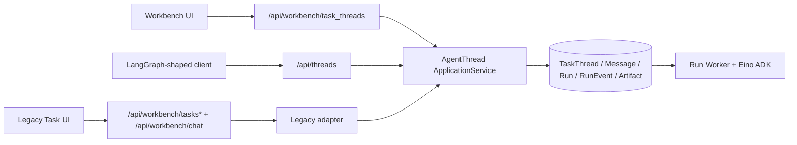

# Workbench Thread API 契约与无损迁移规范

> 文档状态：设计已确认，待书面复审
>
> 版本：v1.0-rc5
>
> 更新日期：2026-07-26
>
> Coze 现状基线：`dev@dcca3a9c4c7daf0b311317b1e99e94bc1d713513`
>
> DeerFlow 对照基线：`main@04b7e693f03a639288cc3aa1b3ed08a865492fe8`
>
> 本期边界：只升级需求、接口契约、规则、流程和验收口径，不修改业务代码、IDL、
> 网关、数据库或运行配置。
>
> 生效规则：本文定义目标态。目标接口实施并完成灰度前，当前源码、IDL 和运行时行为
> 仍是生产事实；不得把本文中的目标路由误写为已经上线。

## 1. 文档职责

本文是 Agent Execution Kernel V2 中 WorkbenchChat HTTP 边界的权威子规格，负责定义：

- `/api/workbench/threads` 的路由、HTTP 方法、请求、响应、SSE 和错误语义；
- LangGraph SDK 兼容范围及 Coze 产品扩展；
- Workbench 当前全部功能到目标接口的逐项映射；
- 新旧接口并行、前端切换、回滚和旧接口删除门槛；
- 外部生产接入所需的鉴权、限流、网关和隔离规则；
- 功能注释、结构化日志、指标和排障证据要求。

若本文与 V2 总规格中的接口摘要冲突，以本文为目标 API 合同；若与当前源码冲突，
源码只代表迁移前现状，必须先更新实现和测试，不能通过解释文档改变线上行为。

规范用语：

- “必须”表示发布阻塞条件；
- “应”表示默认工程要求，偏离时必须记录原因和补偿措施；
- “可以”表示兼容范围内的可选能力；
- “不得”表示安全、数据一致性或兼容性负面约束。

## 2. 目标与非目标

### 2.1 目标

- 使用 `/api/workbench/threads` 作为 Workbench 产品与外部 SDK 的唯一长期入口。
- 核心 Thread/Run 合同兼容指定版本的 LangGraph JavaScript 和 Python SDK。
- 保留 Workbench 的附件、消息、产物、用量、记忆和安全审计等完整产品能力。
- 路由名称、方法和功能语义一一对应，让调用链可以从 URL 直接定位到领域用例。
- 新旧接口共用 `agentthread.ApplicationService` 和同一套持久化记录，不复制数据。
- UI 完成真实联调和生产灰度后再删除旧入口，切换过程允许即时回滚。
- 外部流量不能挤占 Workbench 保留容量，也不能扩大租户、资源或运行时权限。

### 2.2 非目标

- 本期不改业务代码、请求参数、IDL、数据库、网关或现有路由行为。
- 不把 DeerFlow 或 LangGraph Agent Server 整体引入 Coze。
- 不建立第二套 Thread、Run、Message、Event、Checkpoint 或 Artifact 存储。
- 不承诺完整实现 assistants、store、crons、stateless runs、thread stream 或协议 v2。
- 不让新 API 直接暴露 Eino 事件、checkpoint bytes、provider body、工具原始参数或结果。
- 不以 HTTP 301/302/307/308 将旧接口重定向到新接口，SSE 尤其禁止重定向。
- 不在迁移期对创建、追问、恢复、重试或取消请求执行双写。

## 3. 已核验现状

### 3.1 四组现有入口

| 入口 | 当前职责 | 目标处置 |
| --- | --- | --- |
| `/api/workbench/task_threads` | 当前 Workbench UI 的 TaskThread 产品合同 | 冻结行为；UI 全量切换且观察期无流量后删除 |
| `/api/threads` | 当前 LangGraph 形状的兼容实现 | 冻结行为；外部调用方迁移后独立删除 |
| `/api/workbench/tasks*` | 历史 ChatTask 的列表、详情、事件、取消和重试 | 与历史数据一起保留，按 legacy 门槛退役 |
| `/api/workbench/chat` | 旧 ChatTask 详情追问 | 仅 legacy；无旧记录追问需求后单独删除 |

四组入口不能一次性删除。`/api/workbench/tasks*` 与 `/api/workbench/chat` 共同依赖
历史 Task；它们的退役条件与新 UI 或 SDK 迁移不同，但 chat 写入口仍需单独观测。

### 3.2 当前共同主链

当前 Workbench 和 `/api/threads` 最终都进入现有 AgentThread 应用服务和数据链：



迁移只允许增加路由 adapter、公共 DTO 和前端 client，不允许把目标路由连接到新的
数据库表或独立执行器。

### 3.3 当前 `/api/threads` 与目标合同的差距

| 编号 | 当前事实 | 目标要求 |
| --- | --- | --- |
| API-G01 | `GET .../join` 当前返回 SSE，`POST .../join` 返回 Run JSON | canonical 仅用 `GET .../join` 等待终态并返回最终公开 state values |
| API-G02 | `GET .../stream` 与 `POST .../stream` 同时存在 | canonical 仅用 `GET` 连接既有 Run；创建并流式执行只用 `POST .../runs/stream` |
| API-G03 | `stream_mode` 解析接受任意字符串 | 使用明确 allowlist，未知值返回 `422` |
| API-G04 | `messages-tuple` 可能作为 SSE event 名直接输出 | 请求该模式时输出 `event: messages`，data 为 `[message_chunk, metadata]` |
| API-G05 | 没有使用真实 SDK 依赖执行端到端兼容测试 | JavaScript 1.6.0 与 Python 0.4.2 必须跑真实 client 测试 |
| API-G06 | 认证主要依赖现有 Bearer/session 处理 | canonical 同时定义 session、`Authorization: Bearer` 和 `x-api-key` |
| API-G07 | Workbench 产品扩展仍只在 `task_threads` 下 | 逐项迁移到同一 canonical Thread 资源下 |
| API-G08 | Run 输入没有形成 Workbench 当前 turn 与 Message 的完整统一合同 | canonical 创建 Run 时原子写入当前 User Message 与 Run |
| API-G09 | SDK 允许客户端 UUID Thread ID，现有主链使用整型 ID | 首期明确拒绝自定义 ID，不引入映射表或伪支持 |
| API-G10 | 带附件首提的 `defer_start` 会先校验运行配置并用消息与配置推导标题，但不创建 Message/Run | canonical 使用显式 deferred 扩展保留校验、标题和延迟创建语义 |
| API-G11 | 当前 Run/Thread state 响应形状与固定 SDK 的返回类型未逐字段冻结 | canonical 使用最小 SDK core 字段、安全 state 投影和 JS/Python 共同可解析的 update-state 响应 |
| API-G12 | 当前长请求和 SSE 未把 SDK 重连所需响应 header 作为显式合同 | canonical 固定 `Location`、`Content-Location` 及网关透传规则 |
| API-G13 | 当前 `DeleteThread` 不检查活动 Run，直接进入现有级联删除 | canonical 仅对非 busy Thread 复用同一硬删除用例；busy 返回 `409` |

这些差距只能在新 `/api/workbench/threads` 下修正。不得为了“提前对齐”改变当前
`/api/threads` 或 `/api/workbench/task_threads` 的方法、响应和 SSE 行为。

## 4. 目标资源模型与不变量

目标公共名称使用 `Thread`，底层继续复用现有 `TaskThread` 实体。名称变化只发生在
API adapter 和 client，不触发数据库重命名。

| 公共对象 | 现有权威记录 | 语义 |
| --- | --- | --- |
| `Thread` | `TaskThread` | 跨多个 turn 的会话、空间、创建者、标题和状态投影 |
| `Message` | `TaskThreadMessage` | 已提交的用户或 Assistant 消息 |
| `Run` | `AgentRun` | 一次执行 attempt，不等同于整个 Thread |
| `RunEvent` | `AgentRunEvent` | 可公开、可排序、可重放的执行事件 |
| `Artifact` | `AgentRunArtifact` | 经授权和安全扫描的交付物元数据 |
| `Checkpoint` | 现有 checkpoint | 内部恢复依据，只投影审核后的 state/history |

必须保持以下不变量：

1. 一个普通用户 turn 只产生一个 User Message 和一个顶层 Run。
2. User Message 与对应 Run 在同一服务端事务内创建；失败不得留下单边记录。
3. Thread、Message、Run、RunEvent 和 Artifact 只有一套持久化事实。
4. 客户端只提交本次 state update 或当前 turn，不提交权威完整历史。
5. Run 状态是执行 attempt 的权威；Thread 状态只从顶层 Run 投影。
6. 恢复和重试创建新的 attempt，并引用来源 Run，不改写历史 Run。
7. cancel、resume、retry 和首个 Run 创建必须幂等；同键不同有效载荷返回冲突。
8. 内部事件必须经过公开投影、大小限制和脱敏后才能进入 API 或 SSE。
9. 切换 client 不迁移数据、不转换 ID，也不重放历史写请求。

## 5. Canonical 基础约定

### 5.1 Base URL 与命名

```text
SDK apiUrl: https://{host}/api/workbench
资源根路径: /api/workbench/threads
```

- 路径使用复数名词和小写下划线扩展名；核心 LangGraph 路径保持其既有命名。
- 文档使用 `{thread_id}`、`{run_id}`；Hertz 实现可以使用 `:thread_id`、`:run_id`。
- JSON 字段使用 `snake_case`；JavaScript SDK 自行负责 camelCase 参数转换。
- 所有 ID 在 JSON 中使用十进制字符串，禁止转为 JavaScript `Number`。
- 时间使用带时区的 RFC 3339 字符串；服务端存储和返回统一为 UTC。
- JSON 请求使用 `Content-Type: application/json`；SSE 使用 `text/event-stream`。

### 5.2 身份与工作空间

支持三类 principal：

| principal | 认证方式 | 空间来源 |
| --- | --- | --- |
| Workbench Web | 当前 session/cookie 和 CSRF 规则 | 当前空间上下文，仍需服务端校验成员关系 |
| 外部 Bearer | `Authorization: Bearer {token}` | `X-Coze-Space-ID`，必须属于 token 授权范围 |
| LangGraph SDK | `x-api-key: {key}` | `X-Coze-Space-ID`，必须属于 API key 授权范围 |

不得从 request body、Thread metadata、`user_id`、`creator_id` 或 `owner_id` 推导授权。
`X-Coze-Space-ID` 只是目标空间声明，不是授权证明。服务端必须把认证 principal、API key
scope、空间成员关系和资源归属一起校验。

一次请求只能解析为一种 principal。Cookie、Bearer 与 `x-api-key` 同时出现时必须拒绝
ambiguous credentials，不能按中间件顺序随机选一个，也不能在首选凭据失败后回退到
另一个身份。浏览器写请求继续执行 CSRF；API key/Bearer 不借用 Cookie 绕过 CSRF。

### 5.3 幂等与请求关联

- 写请求使用 `Idempotency-Key` header；旧 body 字段只在旧 route adapter 中保留。
- key 的唯一范围至少包含 `principal + space_id + operation`，不得只按空间全局碰撞。
- 服务端保存规范化 payload fingerprint；同键同 payload 返回原结果，同键不同 payload
  返回 `409 idempotency_conflict`。
- 日志只记录 `idempotency_key_hash`，不得记录原 key。
- 网关接受或生成 `X-Request-ID`，后端生成并返回 `trace_id`；两者贯穿 SSE 生命周期。

固定 SDK 不会自动为每次写请求生成 `Idempotency-Key`。官方外部接入包必须提供 Client
factory：JavaScript 使用 SDK `onRequest` hook，Python 使用其 header/HTTP transport
扩展点，为当前操作注入唯一 key。不使用该 factory 的调用仍可执行，但不得宣称网络
结果不明确时可以 exactly-once 重放。Workbench canonical client 必须始终发送 key。

### 5.4 成功与错误响应

LangGraph 核心 route 返回 SDK 预期的原始 Thread、Run、state 或数组，不套 Coze
`{code,msg,data}` envelope。Workbench 扩展 route 可以使用自己的稳定 DTO，但同一
route 不得因调用方是 UI 或 SDK 而改变响应形状。

统一错误形状：

```json
{
  "detail": "Run does not belong to thread",
  "code": "run_thread_mismatch",
  "retryable": false,
  "trace_id": "01K..."
}
```

最低状态码语义：

| HTTP | 场景 |
| --- | --- |
| `400` | JSON、cursor、header 或基础参数格式错误 |
| `401` | 未认证或凭据无效 |
| `403` | 已认证但 scope、空间或操作权限不足 |
| `404` | 资源不存在，或为防枚举而隐藏无权资源 |
| `409` | 幂等冲突、活动 Run 冲突、状态竞争 |
| `422` | SDK 字段存在但不受支持，或语义校验失败 |
| `429` | principal、空间、SSE 或运行预算限流 |
| `503` | 必需安全依赖或外部接入容量不可用 |

错误不得包含堆栈、SQL、对象存储地址、provider 响应、内部 prompt 或工具载荷。

## 6. Thread 核心合同

### 6.1 路由表

| 方法 | 路径 | 权威语义 |
| --- | --- | --- |
| `POST` | `/threads` | 创建 Thread；可通过 Coze 扩展原子创建首个 Message + Run |
| `POST` | `/threads/search` | 按当前授权空间搜索 Thread |
| `GET` | `/threads/{thread_id}` | 读取 Thread 公开快照 |
| `PATCH` | `/threads/{thread_id}` | 更新允许的 metadata/title，不修改 owner 或执行状态 |
| `DELETE` | `/threads/{thread_id}` | 非 busy Thread 复用现有级联硬删除用例；活动 Run 存在时返回冲突 |
| `GET` | `/threads/{thread_id}/state` | 读取最新公开 checkpoint state |
| `POST` | `/threads/{thread_id}/state` | 写入允许的 state update，不覆盖系统权威字段 |
| `GET` | `/threads/{thread_id}/history` | 使用 query 参数读取历史 state |
| `POST` | `/threads/{thread_id}/history` | SDK 兼容的 body 查询形式，与 GET 返回相同元素形状 |
| `GET` | `/threads/{thread_id}/messages` | 读取已提交消息的安全投影 |

`POST history` 保留是为了真实 SDK 兼容；`GET history` 是 Workbench 可读性更好的查询形式。
二者只能共享同一 application query，不得实现不同排序、权限或数据来源。

成功响应固定为：

| 操作 | HTTP | Body |
| --- | --- | --- |
| create/get/patch Thread | `200` | 单个 `Thread`；patch 显式 `Prefer: return=minimal` 时为 `204` 无 body |
| search | `200` | `Thread[]`，分页信息在响应 header |
| delete | `204` | 无 body |
| get state | `200` | 单个公开 `ThreadState` |
| update state | `200` | `ThreadUpdateStateResult` |
| GET/POST history | `200` | `ThreadState[]` |
| messages | `200` | `MessagePage` |

### 6.2 Thread 形状

```json
{
  "thread_id": "2001",
  "created_at": "2026-07-26T08:00:00Z",
  "updated_at": "2026-07-26T08:00:01Z",
  "metadata": {
    "title": "产品发布方案"
  },
  "status": "busy",
  "values": {
    "messages": []
  },
  "interrupts": {},
  "coze": {
    "product_status": "running",
    "initial_submission": null
  }
}
```

- `status` 使用 SDK 兼容值：`idle | busy | interrupted | error`。
- `coze.product_status` 表达 Workbench 的 `running | completed | failed | canceled | idle`。
- `values` 只包含可公开 state；不得放入 checkpoint bytes 或完整内部 transcript。
- `interrupts` 必须存在；无公开 interaction 时返回空对象，存在时只按 task ID 投影审核后的
  interrupt ID、类型和安全展示字段。
- `coze` 是固定命名空间。扩展字段只能加在其中，禁止在顶层散落产品私有字段。

Thread 只从最新顶层 Run 和审核后的 human interaction 做读投影：

| 最新顶层 Run | SDK `status` | `coze.product_status` | `interrupts` |
| --- | --- | --- | --- |
| 无 Run | `idle` | `idle` | `{}` |
| `pending/queued/running` | `busy` | `running` | `{}` |
| `interrupted` 且存在审核后的可恢复 human interaction | `interrupted` | `idle` | 按 task ID 的安全投影 |
| `interrupted` 但仅为 lease 恢复、multitask 或其他不可公开原因 | `idle` | `idle` | `{}` |
| `succeeded` | `idle` | `completed` | `{}` |
| `failed` | `error` | `failed` | `{}` |
| `canceled` | `idle` | `canceled` | `{}` |

当前 repository 已把 `interrupted` 的 Thread 产品生命周期投影为 `idle`；canonical
`coze.product_status` 保持该用户可见语义。SDK 顶层 `interrupted` 只是有公开可恢复交互时的
adapter 投影，不回写 Thread 持久化状态。`POST /search` 的 SDK `status`
过滤按该顶层投影执行；Workbench UI 继续使用 `coze.product_status`，不因迁移改变列表状态。

### 6.3 创建 Thread 与首个 Run

标准 SDK 请求创建空 Thread：

```json
{
  "metadata": {"title": "新建任务"}
}
```

首期使用现有整型主键生成 Thread ID。SDK 可选的客户端自定义 `thread_id`、`supersteps`
和 `ttl` 不在 core profile；非空提交返回 `422 unsupported_sdk_field`，不能接收后忽略。
这避免为了兼容 UUID 建立第二套 ID 映射或修改现有数据库主键。
`if_exists` 仅接受省略或 SDK 值 `raise`；依赖自定义 ID 的 `do_nothing` 不在首期范围。

Workbench 无附件首页提交使用同一路由的显式 Coze 扩展：

```json
{
  "metadata": {"title": "新建任务"},
  "coze": {
    "initial_run": {
      "assistant_id": "agent",
      "input": {
        "messages": [{"role": "user", "content": "请生成产品发布方案"}]
      },
      "config": {"runtime": "eino_adk", "mode": "pro"},
      "metadata": {"source": "workbench_home"}
    }
  }
}
```

当 `coze.initial_run` 存在时，服务端必须在同一事务内创建 Thread、User Message 和
Run；响应仍是固定 Thread 形状，并在 `coze.initial_submission` 返回 Message 与 Run 的
公开摘要。该行为由请求语义决定，不得按 User-Agent、header 或调用方身份偷偷切换。

有附件时不能退化为不带上下文的空 Thread 创建。当前 `defer_start` 会先校验运行配置，
再依据消息和规范化配置推导标题，只是不创建 Message/Run。canonical 使用互斥的显式
扩展保留该语义：

```json
{
  "metadata": {},
  "coze": {
    "deferred_initial_run": {
      "assistant_id": "agent",
      "input": {
        "messages": [{"role": "user", "content": "分析附件中的销售数据"}]
      },
      "config": {"runtime": "eino_adk", "mode": "pro"},
      "metadata": {"source": "workbench_home_with_uploads"}
    }
  }
}
```

`coze.initial_run` 与 `coze.deferred_initial_run` 只能出现一个。deferred 请求必须在持久化
Thread 前执行与真正 Run 相同的运行配置校验，并复用服务端标题推导规则；成功后只创建
Thread，不创建 Message、Run 或事件，也不把未提交消息保存成权威历史。后续上传完成后，
客户端再调用 `POST .../runs` 或 `POST .../runs/stream`，由该请求中的当前 turn 和文件
引用原子创建 Message + Run。不得把标题算法复制到前端，也不得把配置错误推迟到上传后。

首个 Run 未被接受前，前端将该 Thread 视为 draft；上传或 Run 创建失败后可以安全重试
或清理，不得出现已执行但页面认为未提交的状态。deferred 请求和后续 Run 是两个独立
幂等操作，各自使用稳定且不同的 `Idempotency-Key`。

### 6.4 Search、Patch、Delete 与 State

- `POST /search` 支持审核后的 `metadata` 等值过滤、`status`、`limit`、`offset`；默认只查询
  当前空间，metadata 不能携带或覆盖空间与身份。
- `POST /search` 同时支持 `ids`、`sort_by=thread_id|status|created_at|updated_at` 和
  `sort_order=asc|desc`。`values`、`select` 与 Python SDK 的 `extract` 在完成字段级授权和
  防侧信道评审前返回 `422`，不能接收后忽略。
- 省略排序时固定为 `updated_at DESC, thread_id DESC`，与当前 Workbench 列表顺序一致；
  所有排序都必须增加 `thread_id` 同方向作为稳定 tie-breaker。
- `POST /search` 返回原始 Thread array，并用 `X-Pagination-Total` 与
  `X-Pagination-Next` 提供当前 UI 所需分页信息；不得为了 total 改回 Coze envelope。
- `PATCH` 只允许更新 title 和审核后的自定义 metadata。`space_id`、owner、creator、
  status、runtime 和配额字段即使出现在 metadata 中也必须忽略或拒绝。
- `PATCH` 接受固定 Python SDK 的 `Prefer: return=minimal`：该值精确为 `return=minimal`
  时成功返回 `204`，省略时返回 Thread；其他 Prefer 值返回 `422`。`ttl` 首期不支持。
- `GET Thread` 的 `include` 首期只允许省略；Thread create 的非空 `metadata.graph_id`、`ttl`、
  `supersteps`、客户端 `thread_id` 以及 patch 的 `ttl` 均返回 `422`。
- `DELETE` 在 Thread 为 busy 时返回 `409 thread_busy`，不通过删除隐式取消运行。
  非 busy 删除直接复用现有 `ApplicationService.DeleteThread` 及同一 repository 级联边界，
  不新增软删除分支或第二套清理逻辑。这是 canonical 安全收紧；发现依赖
  “运行中删除”的存量调用方时，该调用方不得进入迁移灰度。
- `POST state` 只允许更新白名单 channel。Run 状态、Message、Artifact、用量和审计字段
  只能由系统写入。
- `GET state` 接受固定 Python SDK 总会发送的 `subgraphs=false`；省略或 `false` 等价，
  `true` 在安全子图投影落地前返回 `422 unsupported_sdk_field`。
- history 默认按 checkpoint 新到旧返回；GET 与 POST 必须使用相同稳定排序和分页规则。

公开 `ThreadState` 固定为以下最小安全形状：

```json
{
  "values": {"messages": []},
  "next": [],
  "checkpoint": {
    "thread_id": "2001",
    "checkpoint_ns": "",
    "checkpoint_id": "9001",
    "checkpoint_map": {}
  },
  "metadata": {},
  "created_at": "2026-07-26T08:00:01Z",
  "parent_checkpoint": null,
  "tasks": [],
  "interrupts": []
}
```

`checkpoint` 和 `parent_checkpoint` 只包含公开 opaque ID 与命名空间，不包含 checkpoint
bytes、内部 channel version 或 provider state。`tasks` 缺省为空；只有完成安全 DTO 评审后
才可返回 task `id/name/interrupts`，不得返回原始 result、error、嵌套 state 或内部
checkpoint。顶层 `interrupts` 用于兼容固定 Python SDK，JavaScript SDK 会安全忽略该附加
字段。

固定 JavaScript SDK 的 `updateState` 读取顶层 `configurable`，固定 Python SDK 的
`update_state` 读取顶层 `checkpoint`。因此 `POST state` 不能返回完整 `ThreadState`，必须
返回两者一致指向同一公开 checkpoint 的稳定超集：

```json
{
  "checkpoint": {
    "thread_id": "2001",
    "checkpoint_ns": "",
    "checkpoint_id": "9002",
    "checkpoint_map": {}
  },
  "configurable": {
    "thread_id": "2001",
    "checkpoint_ns": "",
    "checkpoint_id": "9002",
    "checkpoint_map": {}
  }
}
```

两个字段的 ID、namespace 和 map 必须完全一致；mapper 只从同一次已提交 state update
生成它们，不能再次读取“最新 checkpoint”造成并发漂移。

## 7. Run 核心合同

### 7.1 路由表

| 方法 | 路径 | 权威语义 |
| --- | --- | --- |
| `GET` | `/threads/{thread_id}/runs` | 列出该 Thread 的 Run |
| `POST` | `/threads/{thread_id}/runs` | 创建 Run，立即返回 Run JSON |
| `POST` | `/threads/{thread_id}/runs/stream` | 创建 Run，并在同一响应流式返回事件 |
| `POST` | `/threads/{thread_id}/runs/wait` | 创建 Run，等待终态后返回最终公开 state values |
| `GET` | `/threads/{thread_id}/runs/{run_id}` | 读取指定 Run |
| `GET` | `/threads/{thread_id}/runs/{run_id}/stream` | 连接或重连既有 Run 的 SSE |
| `GET` | `/threads/{thread_id}/runs/{run_id}/join` | 等待既有 Run 终态并返回最终公开 state values，不是 SSE |
| `POST` | `/threads/{thread_id}/runs/{run_id}/cancel` | 幂等取消指定 Run |
| `POST` | `/threads/{thread_id}/runs/{run_id}/resume` | 从 interrupted Run 创建恢复 attempt |
| `GET` | `/threads/{thread_id}/runs/{run_id}/events` | 读取该 Run 的公开事件快照 |
| `GET` | `/threads/{thread_id}/runs/{run_id}/messages` | 读取该 Run 的公开消息投影 |

canonical 不提供 `POST .../{run_id}/stream` 或 `POST .../{run_id}/join`。旧路径即使存在，
也不得写进新 client 或新文档示例。

成功响应固定为：

| 操作 | HTTP | Body |
| --- | --- | --- |
| list | `200` | `Run[]`，分页信息在响应 header |
| create/get/resume | `200` | 单个 `Run` |
| cancel | `204` | 无 body；调用方随后读取 Run/state 校准终态 |
| `POST runs/stream` / `GET run/stream` | `200` | `text/event-stream` |
| wait | `200` | 最终公开 state/values |
| join | `200` | 最终公开 state/values |
| events | `200` | `RunEventPage` |
| messages | `200` | `MessagePage` |

### 7.2 创建 Run 请求

```json
{
  "assistant_id": "agent",
  "input": {
    "messages": [{"role": "user", "content": "继续分析退款原因"}],
    "uploaded_files": [{"file_id": "5001"}]
  },
  "command": {},
  "metadata": {"source": "workbench_detail_followup"},
  "config": {"runtime": "eino_adk", "mode": "pro"},
  "context": {},
  "stream_mode": ["messages-tuple", "updates"],
  "multitask_strategy": "reject",
  "on_disconnect": "continue",
  "durability": "async",
  "stream_resumable": false
}
```

字段规则：

| 字段 | 规则 |
| --- | --- |
| `assistant_id` | 首期只接受已配置的公开别名，例如 `agent`；不因此承诺 assistants API |
| `input` | 必填；`messages` 表示本次 state update，不得被当作客户端提交的权威完整历史 |
| `command.resume` | SDK 恢复形式，与专用 `resume` route 进入同一恢复用例 |
| `metadata` | 仅允许业务标签；身份、空间、权限和内部状态由服务端覆盖或拒绝 |
| `config` | 服务端重新校验 runtime、mode、模型与资源；客户端不能扩大能力 |
| `context` | 只接受公开、有限大小的上下文；凭据和内部 provider 配置禁止传入 |
| `stream_mode` | string 或 string array；省略时规范化为 `values`，与固定 Python SDK 默认值一致 |
| `multitask_strategy` | 首期只支持 `reject`；未知或未实现值返回 `422` |
| `on_disconnect` | `cancel` 或 `continue`；省略时为 `cancel`，canonical UI 必须显式传 `continue` |
| `durability` | 首期支持 `async`；其他值只有完成持久化验证后才能开放 |
| `stream_resumable` | `false` 或省略可接受；`true` 在完整协议实现前返回 `422` |

固定 SDK 默认兼容值必须显式接受：

| 字段 | 可接受值 | 其他值 |
| --- | --- | --- |
| `stream_subgraphs` | 省略或 `false` | `422` |
| `if_not_exists` | 省略或 `reject` | `create` 及其他值返回 `422` |
| `raise_error`（仅 `runs/wait`） | 省略、`true` 或 `false` | 非布尔值返回 `422` |
| `webhook` | 省略或 `null` | `422` |
| `on_completion` | 省略或 `null` | `422` |
| `after_seconds` | 省略或 `null` | `422` |
| `feedback_keys` | 省略或 `null` | `422` |
| `interrupt_before/after` | 省略或 `null` | `422` |
| `checkpoint/checkpoint_id` | 省略或 `null` | 首期使用专用 resume 合同，非空返回 `422` |
| `langsmith_tracer` | 省略或 `null` | `422` |

`checkpoint_during` 及其他未声明字段返回 `422 unsupported_sdk_field`。JSON 反序列化必须
`disallow unknown fields`，不能静默吞掉新 SDK 字段后继续执行。

JavaScript 1.6.0 和 Python 0.4.2 的异步 `wait` 都不发送 `raise_error`，而是在
客户端按本地 `raiseError/raise_error` 检查返回 values 中的 `__error__`；Python 0.4.2
同步 `wait` 则会发送该字段，且不做同样的本地检查。因此服务端必须固定下列兼容行为：

- Run 成功时，三种取值都返回 `200` 和最终公开 state values；
- Run 失败且显式 `raise_error=true` 时，先持久化失败终态，再返回非 `2xx`
  统一错误响应，使 Python sync client 抛错；
- Run 失败且省略或显式 `raise_error=false` 时，返回 `200` 和包含
  `{"__error__":{"error":"<stable_code>","message":"<safe_message>"}}` 的最终公开
  values；固定 JS/Python async client 由本地开关决定抛错还是返回该 values；
- `GET .../join` 没有 `raise_error` 参数；Run 失败时仍返回 `200` 和同一安全
  `__error__` values，Run 终态由 get/list route 校准。

`__error__.error` 只能是稳定业务错误码，`message` 必须脱敏；不得返回 stack、provider
body、prompt、工具参数/结果或内部异常类名。这些运输投影差异不得改变 Run 的
执行、持久化或最终状态。

对 Workbench 普通 turn，adapter 必须从规范化 `input.messages` 提取本次 User Message，
并与 Run 原子创建。多个历史 User Message、伪造 Assistant Message 或试图覆盖已提交历史
必须拒绝，不能静默重复写入。

### 7.3 Run 响应与状态

Run 返回固定 SDK 声明的最小 core 字段，并把审核后的产品扩展放在 `coze` 中：

```json
{
  "run_id": "3001",
  "thread_id": "2001",
  "assistant_id": "agent",
  "status": "pending",
  "created_at": "2026-07-26T08:00:01Z",
  "updated_at": "2026-07-26T08:00:01Z",
  "metadata": {},
  "multitask_strategy": "reject",
  "coze": {
    "message_id": "4001",
    "attempt_kind": "turn",
    "source_run_id": null,
    "stream_modes": ["messages-tuple", "updates"],
    "on_disconnect": "continue",
    "durability": "async",
    "terminal_reason": null
  }
}
```

Run 响应不得回显原始 `input`、`command`、`config` 或 `context`。这些请求字段可能包含
消息、资源选择和内部执行配置，也不属于固定 SDK 的 `Run` 返回类型；排障使用不可逆 hash、
公开 Message/RunEvent 和 trace reference，不能靠响应回显敏感载荷。

公开状态映射固定为：

| 内部状态 | SDK Run 状态 | Workbench 解释 |
| --- | --- | --- |
| `pending` / `queued` | `pending` | 已接受，等待执行 |
| `running` | `running` | 正在执行 |
| `interrupted` | `interrupted` | 等待 human response，可恢复 |
| `succeeded` | `success` | 成功终态 |
| `failed` | `error` | 失败终态 |
| `canceled` | `interrupted` | `coze.terminal_reason=canceled` |

状态映射只能集中在公共 projection 中，handler、UI adapter 和日志不得各自维护不同表。

### 7.4 Wait、Join、Cancel 与 Resume

- `runs/wait` 先创建 Run，再等待终态，成功返回最终公开 state values；超时不取消 Run，
  除非请求明确使用 `on_disconnect=cancel` 且服务器确认连接已经断开。
- `runs/wait` 和 `GET .../join` 返回相同元素形状：Thread 的最终公开 state values 本身，
  不是 `Run`、`ThreadState` 或 `{data: ...}` envelope。Run 元数据由 get/list route 读取。
- 失败 values 的 `__error__` 字段及 `runs/wait` 的 `raise_error` 分支按 7.2 执行；
  成功 values 不得伪造 `__error__`。
- `GET .../join` 只等待现有 Run，不得发送 SSE header 或 SSE event。为兼容官方 HTTP
  合同，`cancel_on_disconnect` 允许省略、`false` 或 `0`；固定 JS/Python `join()` 默认
  不发送该参数。`true` 或 `1` 在取消语义完成前返回 `422 unsupported_sdk_field`。
- `cancel` 接受 `wait=0|1&action=interrupt`，并保持幂等。`wait=0` 在取消意图持久化后
  返回；`wait=1` 等待 Run 到达结束状态后返回。`action=rollback` 在完整 rollback 合同
  落地前返回 `422`；成功统一返回 `204`，即使 Run 已终态也不返回 Run JSON。UI 与外部
  调用方通过 get/state 再读取实际终态。
- 取消与完成竞争时以持久化成功的单调状态转换为准。
- `resume` 的 path `run_id` 是来源 interrupted Run，不是要原地改写的 Run。成功响应是
  新 attempt，`coze.source_run_id` 指向来源 Run。
- SDK 使用 `POST .../runs` + `command.resume` 时，必须调用与专用 `resume` 相同的
  application use case、幂等规则和状态校验。
- 顶层失败任务重试仍调用普通 Run 创建，设置 `coze.attempt_kind=retry` 和来源元数据；
  子智能体 retry 作为产品扩展另行保留，不能和顶层 retry 混为一谈。

### 7.5 读取、排序与分页

- `GET .../runs` 支持 `status`、`limit`、`offset` 和 Coze 扩展 `parent_run_id`，返回原始
  Run array；`X-Pagination-Total` 与 `X-Pagination-Next` 提供分页元数据。
- 固定 SDK 的非空 `select` 首期返回 `422`；core profile 始终返回完整最小 Run 形状，
  不支持调用方裁剪后制造多种响应 schema。
- `GET .../events` 支持 `after_event_id`、`event_types` 和 `limit`，按 `event_id` 升序；
  返回 `{data, has_more, next_after_event_id}`，只包含公开 `RunEvent`。
- Thread/Run messages 使用 `before_seq`、`after_seq`、`limit`，返回
  `{data, has_more, next_before_seq, next_after_seq}`；同一 Message 在不同读取入口的
  `message_id/role/content/created_at/run_id` 必须一致。
- `limit` 缺省值和最大值在 OpenAPI 中固定；越界值规范化或拒绝的策略必须在所有列表
  route 一致，不能由 repository 各自决定。
- 分页 token、header 和 cursor 均从权限过滤后的结果计算，不能泄露其他空间的总量。

## 8. SSE 契约

### 8.1 支持模式

首期 allowlist：

```text
values
updates
messages
messages-tuple
custom
events
```

`debug`、`tasks`、`checkpoints` 及未声明值返回 `422 unsupported_stream_mode`，不得静默
降级为 `events`。新增模式必须同时更新 JavaScript、Python、网关和断线恢复测试。

### 8.2 帧格式

```text
id: 9001
event: messages
data: [{"type":"AIMessageChunk","content":"完成"},{"run_id":"3001","node":"agent"}]

```

- 每个持久化业务事件的 `id` 使用十进制字符串 `event_id`。
- `messages-tuple` 只是请求模式；SSE event 名仍为 `messages`，data 为二元数组。
- `metadata` 是首帧，至少包含 `thread_id`、`run_id`、`trace_id` 和已接受的 modes。
- `end` 只在 Run 到达终态后发送一次；data 包含终态和安全原因。
- `error` 使用统一公开错误形状；发送后是否关闭由错误可恢复性决定。
- heartbeat 不进入业务事件表、不分配业务 `event_id`、不推进客户端 cursor。

### 8.3 重连与 cursor

- `GET .../{run_id}/stream` 接受 `Last-Event-ID`；可以同时接受明确的
  `after_event_id`，两者都合法时取较大值。
- `GET .../{run_id}/stream` 接受 SDK 的 `stream_mode` 和默认
  `cancel_on_disconnect=0` query；非零取消语义未完成前返回 `422`。
- cursor 必须以 64 位十进制整数解析；前端使用 `BigInt` 或字符串整数比较器。
- 服务端先回放 cursor 之后的持久化公开事件，再进入实时订阅，二者之间不得丢事件。
- 客户端按 `event_id` 去重；未知 `event` 记录安全遥测后继续，不能终止整个流。
- `GET .../{run_id}/events` 是恢复快照；SSE 不是唯一事实来源。
- 同一页面只允许一个流驱动 UI。迁移对比流只能在测试或 staging 使用，不能双重归并。

固定 SDK 的自动恢复还依赖响应 header：

- `POST .../runs`、`POST .../runs/stream` 和 `POST .../runs/wait` 返回
  `Content-Location: /threads/{thread_id}/runs/{run_id}`，供 `onRunCreated`/
  `on_run_created` 回调提取 ID；该值相对 SDK `apiUrl`，不得重复包含 `/api/workbench`。
- `POST .../runs/stream` 和 `GET .../{run_id}/stream` 返回
  `Location: /threads/{thread_id}/runs/{run_id}/stream`。连接异常后 SDK 使用 `GET`、
  `Last-Event-ID` 和该路径重连。
- `POST .../runs/wait` 返回
  `Location: /threads/{thread_id}/runs/{run_id}/join`；长请求传输中断时固定 Python SDK
  可以改用 `GET join` 继续等待。`GET join` 可以返回同一 Location。
- `Location` 必须是同源、以 `/threads/` 开头且位于已授权 Thread/Run 下的 API-base-relative
  路径，禁止绝对外部 URL、签名参数和敏感 query。服务端与网关都要拒绝或清除越界值。

### 8.4 网关要求

canonical 根路径与子路径使用独立规则，且只对
`.../runs/stream`、`.../runs/{run_id}/stream` 这两类 SSE endpoint 配置更具体的
stream location。不得修改全局 `/api` 规则，也不能遗漏不带尾斜杠的
`/api/workbench/threads` 根路径：

- `proxy_buffering off`；
- `proxy_cache off`；
- 禁止压缩导致的批量缓冲；
- 透传 `Last-Event-ID`、`X-Request-ID` 和认证 header；
- 原样透传并校验上游 `Location`、`Content-Location`，不得补全成外部 origin、重复
  `/api/workbench` 前缀或改写到 legacy route；
- 设置覆盖最长允许 Run 的 read timeout 与合理 send timeout；
- 返回 `X-Accel-Buffering: no`；
- 网关空闲超时、应用 heartbeat 和客户端重连间隔必须形成明确矩阵；
- SSE 连接达到限制时在建流前返回 `429`，不能先返回 200 再静默断开。

## 9. Workbench 产品扩展

以下功能是立即迁移当前 UI 的必需范围，不是“后续可选优化”。除明确标注内部专用外，
都必须复用 canonical Thread 权限校验。

| 方法 | canonical 路径 | 功能语义 |
| --- | --- | --- |
| `GET` | `/threads/{thread_id}/messages` | Thread 消息列表 |
| `POST` | `/threads/{thread_id}/suggestions` | 基于安全消息投影生成建议问题 |
| `POST` | `/threads/{thread_id}/messages` | 内部兼容追加；新 UI 普通 turn 禁止使用 |
| `GET` | `/threads/{thread_id}/uploads` | 上传文件列表 |
| `POST` | `/threads/{thread_id}/uploads` | multipart 上传、校验并绑定 Thread |
| `DELETE` | `/threads/{thread_id}/uploads/{file_id}` | 按稳定 ID 删除尚未提交或允许删除的上传 |
| `GET` | `/threads/{thread_id}/artifacts` | 产物列表 |
| `GET` | `/threads/{thread_id}/artifacts/{artifact_id}/content` | 安全文本或预览内容 |
| `GET` | `/threads/{thread_id}/artifacts/{artifact_id}/signed_url` | 短时授权下载地址 |
| `DELETE` | `/threads/{thread_id}/artifacts/{artifact_id}` | 按保留策略软删除产物 |
| `POST` | `/threads/{thread_id}/artifacts/{artifact_id}/restore` | 恢复可恢复产物 |
| `POST` | `/threads/{thread_id}/artifacts/{artifact_id}/scan_review` | 授权人员执行扫描裁决 |
| `GET` | `/threads/{thread_id}/artifact_scan_jobs` | 扫描任务列表 |
| `POST` | `/threads/{thread_id}/artifact_scan_jobs/{job_id}/retry` | 幂等重试扫描任务 |
| `GET` | `/threads/{thread_id}/token_usage` | Thread/Run/子 Run 用量投影 |
| `GET` | `/threads/{thread_id}/memories` | 记忆列表 |
| `PUT` | `/threads/{thread_id}/memories/{memory_id}` | 更新允许字段并记录审计 |
| `DELETE` | `/threads/{thread_id}/memories/{memory_id}` | 软删除记忆 |
| `POST` | `/threads/{thread_id}/memories/{memory_id}/restore` | 恢复记忆 |
| `POST` | `/threads/{thread_id}/memories/clear` | 按 scope 清理并审计 |
| `GET` | `/threads/{thread_id}/memories/export` | 脱敏导出 |
| `POST` | `/threads/{thread_id}/memories/import` | 校验、限量、幂等导入 |
| `GET` | `/threads/{thread_id}/memories/audit_events` | 记忆审计事件 |
| `GET` | `/threads/{thread_id}/guardrail_audit_events` | Guardrail 审计事件 |
| `GET` | `/threads/{thread_id}/guardrail_audit_events/export` | 脱敏导出 Guardrail 审计 |
| `GET` | `/threads/{thread_id}/mcp_runtime_audit_events` | MCP 运行审计事件 |

扩展负面约束：

- signed URL 不得写日志、进入 SSE 或持久化为 Message；
- canonical 路径只使用 `file_id`，不把可能包含个人信息或特殊字符的 filename 放进 URL；
- artifact content 必须检查扫描状态、权限、类型和大小，不能返回宿主机路径；
- memory import/export 和 audit export 必须单独限流并记录审计；
- `POST messages` 不允许外部 API key 伪造 Assistant、system、tool 或终态 Message；
- suggestions 失败不影响 Thread/Run 主流程；
- token usage 只返回授权范围内的聚合和安全明细，不返回 provider 原始 usage body。

以下能力会从 Thread 详情触发，但所有权不属于 Thread API，本次迁移不得顺手改路由：

| 保留入口 | 原因 |
| --- | --- |
| `GET /api/workbench/runtime_doctor` | 工作空间级运行环境诊断，不是单 Thread 状态 |
| `POST /api/workbench/skills/install` | Skill 域命令；Artifact 只作为经授权的输入引用 |
| `/api/workbench/mcp_tools*` | MCP 配置与目录属于工作空间控制面 |
| 模型、知识库、数据库选择接口 | 资源域继续拥有权限和元数据合同 |

canonical client 可以组合调用这些服务，但不能把它们代理到 `/threads` 下，也不能因
Thread API 回滚而改变其请求或权限行为。

## 10. 旧接口到 canonical 的映射

| 当前接口 | canonical 接口 | 迁移规则 |
| --- | --- | --- |
| `GET /api/workbench/task_threads` | `POST /api/workbench/threads/search` | UI adapter 把 page/page_size 映射为 offset/limit |
| `POST /api/workbench/task_threads` | `POST /api/workbench/threads` | 无附件使用 `coze.initial_run`；带附件使用 `coze.deferred_initial_run` |
| `GET /api/workbench/task_threads/{id}` | `GET /api/workbench/threads/{id}` | DTO adapter 保留当前页面 view model |
| `GET .../messages` | `GET .../messages` | 只转换分页与 DTO，不改变排序 |
| `DELETE .../uploads/{filename}` | `DELETE .../uploads/{file_id}` | adapter 使用上传记录的稳定 ID；canonical URL 不携带文件名 |
| `POST .../suggestions` | `POST .../suggestions` | 保持模型选择与失败不阻塞语义 |
| `POST .../runs` | `POST .../runs` | canonical input 映射为当前 User Message + Run 原子用例 |
| `GET .../run_events` | `GET .../runs/{run_id}/events` | Thread 全量读取由 client 对所需 Run 合并或专用查询支持 |
| `GET .../run_events/stream` | `GET .../runs/{run_id}/stream` | UI 改为明确 Run 流；切换 Thread 时关闭旧流 |
| `POST .../resume` | `POST .../resume` | 保持创建新 attempt，不原地修改来源 Run |
| `POST .../cancel` | `POST .../cancel` | 保持幂等与终态竞争规则 |
| `POST .../retry` | 产品扩展同名 route | 仍只表示子智能体 retry |
| uploads/artifacts/memories/audits | canonical 同资源扩展 | 逐个 DTO 和权限合同迁移，不合并成泛型 endpoint |
| `/api/workbench/tasks*` | 无 canonical alias | 历史 Task 列表、详情、事件和控制继续由独立 legacy client 承担 |
| `POST /api/workbench/chat` | 无直接 alias | 历史 Task 单独退役，不允许新 UI 回退调用 |

迁移 adapter 不允许通过调用多个旧写接口拼出一次 canonical 写入。新 route handler 必须
直接调用同一 application use case，确保事务、幂等和权限只有一个实现。

### 10.1 请求参数等价映射

本期不修改旧 route 的任何参数。下表只定义未来 canonical client 的新请求如何保持当前
用户语义，不代表现在就调整生产请求：

| 当前 Workbench 参数/行为 | canonical 表达 | 业务影响判断 |
| --- | --- | --- |
| body `space_id` | session 空间或 `X-Coze-Space-ID` | 身份改由服务端认证上下文确认，不能扩大权限 |
| JSON string `config/context/metadata` | 对应 JSON object | 只改变 transport 类型，不改变有效配置 |
| `message` / `message_content` | `input.messages` 中唯一当前 User Message | 仍由服务端重建历史并原子写 Message + Run |
| `defer_start=true` + `message/config` | `coze.deferred_initial_run` | 保持创建前配置校验、服务端标题推导，以及先上传、后创建首个 Run |
| body `idempotency_key` | `Idempotency-Key` header | 旧 route 不变；canonical 增加 payload fingerprint |
| 省略 `multitask_strategy`，Domain 得到 `reject` | canonical 明确或默认 `reject` | 顶层并发准入不变 |
| 省略 `durability`，Domain 得到 `async` | canonical 明确或默认 `async` | 持久化策略不变 |
| 省略 `on_disconnect`，Run 记录为 `cancel`，但 UI 使用不绑定 Run 的 Thread SSE | canonical Run SSE 明确发送 `continue` | 参数值变化，但保持“页面断线不取消后台 Run”的现有用户语义 |
| 省略 `stream_mode` | canonical UI 明确选择审核后的 modes | 只改变公开事件 transport，不改变 Agent 执行 |
| 无 `stream_resumable` | SDK 默认 `false` | 接受兼容字段，不宣称协议级 resumable；恢复依赖持久化事件 cursor |
| 当前 `/api/threads` 可直接删除 busy Thread | canonical 返回 `409 thread_busy` | 显式安全收紧；不影响旧 route，存量调用方必须单独验收后才迁移 |

因此不能用“请求字段必须逐字相同”判断无影响。验收比较的是权限、原子记录、执行策略、
断线结果、公开事件和页面状态；任何参数映射若改变这些结果，都必须停止迁移并单独评审。

## 11. 前端即时迁移设计

### 11.1 Client 边界

前端建立一个稳定的 `WorkbenchThreadClient` 接口，至少覆盖：

```text
searchThreads / createThread / getThread / patchThread / deleteThread
listMessages / generateSuggestions
listRuns / createRun / createRunStream / joinRun / streamRun
cancelRun / resumeRun / retrySubagentRun / listRunEvents
listUploads / uploadFiles / deleteUpload
listArtifacts / getArtifactContent / getArtifactSignedURL
deleteArtifact / restoreArtifact / reviewArtifactScan
listArtifactScanJobs / retryArtifactScanJob
getTokenUsage
listMemories / updateMemory / deleteMemory / clearMemories / restoreMemory
importMemories / exportMemories / listMemoryAuditEvents
listGuardrailAuditEvents / exportGuardrailAuditEvents
listMCPRuntimeAuditEvents
```

实现分为：

- `LegacyTaskThreadClient`：继续调用当前生成 client 和手写扩展请求；
- `CanonicalThreadClient`：只调用 `/api/workbench/threads`；
- view-model adapter：把两种 transport DTO 归一化为当前组件已使用的类型。

历史 ChatTask 的 `list/get/events/cancel/retry/chat` 保留在独立 `LegacyTaskClient`，不塞入
`WorkbenchThreadClient`。任务列表可以继续聚合 Thread 与 legacy Task，但新 Thread 的
任何失败都不得自动调用 legacy Task 写接口。

React 组件、hooks、store 和页面投影在第一阶段不重写成 LangGraph `useStream`。先替换
service/client 边界，避免把接口迁移与 UI 状态管理重构绑在同一次发布中。

### 11.2 开关与流量规则

- 开关按环境、空间和用户稳定分桶，默认使用 legacy client。
- 读请求可在 test/staging 做 shadow compare；生产只在采样且确认无敏感泄露时比较摘要。
- 写请求绝对禁止 shadow write、双写或失败后自动切换另一个 client 重写。
- 一个页面同一时刻只有一个 active SSE source 驱动状态。
- canonical 写入结果不明确时，用原幂等键查询或重放 canonical 请求，不能回退旧 route。
- 开关回滚只改变后续请求使用的 client；现有 Thread/Run ID 继续可读，无需数据回滚。

### 11.3 UI 功能等价门禁

以下流程全部通过后，才允许把某个空间切到 canonical：

- 首页无附件提交；
- 首页带单个和多个附件提交、上传失败与重试；
- Thread 列表、详情、标题和状态；
- 标准追问、建议问题、执行中刷新和切换 Thread；
- SSE 首连、断线、cursor 恢复、未知事件和终态校准；
- interrupt/resume、cancel、顶层失败 retry、子智能体 retry；
- resume 或 retry 返回新 Run 后关闭来源 Run 的活动流，并以新 Run 自己的 cursor 建流；
  来源 Run 的晚到事件不能更新新 attempt 的页面状态；
- Artifact 列表、预览、下载、删除、恢复和扫描审核；
- Token usage、Memory 全部管理操作；
- Guardrail、MCP 和 Memory 审计读取与导出；
- 无权限、跨空间、限流、服务不可用和结果不明确状态。

## 12. 外部生产接入

### 12.1 Scope

API key 至少拆分：

```text
threads:read
threads:write
runs:create
runs:read
runs:cancel
runs:resume
artifacts:read
memories:read
memories:write
audit:read
```

默认 key 只获得最小 scope。高风险 memory 写入、audit 导出和 artifact 下载不得跟随
`runs:create` 自动授予。

### 12.2 限流与容量隔离

限流至少同时考虑：

- API key；
- workspace；
- source IP；
- 单 key 与单空间 active Run 数；
- SSE 并发连接数与连接时长；
- 模型 Token、工具调用和 Sandbox 预算；
- 导入、导出、下载和扫描重试等高成本操作。

外部接入使用独立 admission budget，Workbench 保留最小 worker、模型和 SSE 容量。
外部配额耗尽返回 `429` 或 `503` 并带 `Retry-After`，不得消耗 Workbench 保留容量。
Redis、API key 校验、scope 或安全策略依赖不可用时，外部入口 fail closed；不能退化为
匿名、仅 IP 限流或共享内存计数。

### 12.3 发布开关

- 外部 API 默认关闭；
- 首先只允许明确 API key allowlist 和测试空间；
- 每个 key 可独立吊销、限额和审计；
- key 轮换不改变 Thread/Run 所有权；
- 外部错误率、延迟或资源占用触发阈值时，只关闭外部入口，不影响 Workbench session。

## 13. SDK 兼容范围

### 13.1 固定版本矩阵

| 客户端 | 对照来源 | 必测版本 |
| --- | --- | --- |
| JavaScript/TypeScript | DeerFlow `frontend/pnpm-lock.yaml` | `@langchain/langgraph-sdk == 1.6.0` |
| Python | DeerFlow `backend/uv.lock` | `langgraph-sdk == 0.4.2` |

DeerFlow 前端 manifest 当前声明 `^1.5.3`，但 lockfile 实际解析为 `1.6.0`；兼容声明必须
写实际测试版本，不能只写范围。Python manifest 的 `>=0.1.51` 同理不能替代 lockfile
中的实际 `0.4.2`。这里的“最新”只指本轮核验的 DeerFlow `origin/main`；不宣称
`1.6.0` 是上游 npm 的最新版本。上游版本变化必须先通过本文兼容矩阵才能扩大支持范围。

本轮还直接下载并展开固定发行包核对方法实现和类型声明，验证证据固定为：

```text
@langchain/langgraph-sdk@1.6.0 pnpm lock integrity:
sha512-J/B1SkCG0U+eXEXH/X89dDHxP8I0eULjLtXYvZ39uk2TxEKjLsrW4LY5J7Qwrf0GCDA+IM/agjKSLXALnctWTw==

@langchain/langgraph-sdk@1.6.0 tarball sha256:
e8258604779558fa4721fe7aedec688fab1090a36052d814d0d907cfda5d3cc5

langgraph-sdk==0.4.2 wheel sha256:
75fa5096c1177ce39c847096a8fe3745ffd480ddb412995f836e9f5f884c43dd
```

CI 必须从 lockfile 安装并校验 registry integrity/hash；上述 hash 只作为本次评审证据，
不能用本机 `/private/tmp` 文件作为构建输入。

### 13.2 Core profile

本期只承诺：

- Thread create/search/get/patch/delete；
- Thread state/history；
- Run create/list/get/stream/wait/join/cancel；
- 本文 allowlist 内的 stream modes；
- `stream_resumable=false`；
- SDK 的 `x-api-key` 认证方式；
- Coze 自有 messages/events/resume 和产品扩展由自有 client 调用。

明确不承诺：

- assistants 搜索、版本和 schema API；
- store、crons、webhooks、feedback、stateless runs；
- Thread 级长连接 `/threads/{thread_id}/stream`；
- SDK 未锁定版本或未来新增字段；
- 客户端自定义 Thread ID、supersteps、TTL、copy/count/prune；
- `stream_resumable=true` 和未列出的 stream modes。

外部接入文档必须用“LangGraph SDK core profile compatible”，不得宣传为完整 Agent
Server replacement。

### 13.3 真实兼容测试

不能只用 curl 或手写 HTTP 模拟 SDK。CI 必须安装固定版本并执行：

- JavaScript `new Client({apiUrl, apiKey})` 创建、搜索、读取 Thread；
- JavaScript 创建 Run、`stream`、`joinStream`、`join`、`cancel`，逐项断言实际返回类型；
- Python sync 与 async client 的同等流程，并覆盖二者 `wait.raise_error` payload 差异；
- 失败 Run 分别验证 JS/Python async 的本地抛错与 `raise_error=false` 返回
  `__error__` values，以及 Python sync `true` 的非 `2xx` 与 `false` 的 values；
- `wait` 与 `join` 直接返回最终 values，`cancel` 返回 `undefined/None` 且 HTTP 为 `204`；
- Thread 响应含 `interrupts`，get-state 安全形状完整，update-state 同时返回一致的
  `checkpoint` 与 `configurable`；
- SDK 默认 payload，包括 `stream_resumable=false`；
- JavaScript 通过 SDK `onRequest`、Python 通过 header/HTTP transport 扩展注入
  `Idempotency-Key` 的官方 Client factory；
- 单 mode、多 mode、`messages-tuple` 和 `custom`；
- `x-api-key`、空间 header、401/403/404/409/422/429；
- `Content-Location` 能触发 Run created callback；`Location` 重连落到 canonical 既有 Run
  endpoint，保留认证和 `Last-Event-ID`，且不会重复 `/api/workbench`；
- `GET join` 对省略、`cancel_on_disconnect=false` 和 `0` 返回相同 values，`true/1`
  明确返回 `422`，且任何分支都不发送 SSE；
- SSE 分片、heartbeat、断线、Last-Event-ID 与终态；
- 未支持字段明确失败，不发生静默 fallback。

每次升级 SDK 版本先运行兼容矩阵并单独评审；不得让 package manager 自动漂移后直接
更新兼容声明。

### 13.4 与 DeerFlow 最新实现的取舍

DeerFlow 最新 `main@04b7e693` 已使用真实 Python SDK payload 验证
`stream_resumable=false`，并通过严格 schema 拒绝未知字段。Coze 复用这两项做法，但
不会复制其全部模式：

本轮刷新后，`04b7e693` 相对先前核验的 `e646188a` 只修正 DeerFlow 计划任务
规格中的源码链接；Thread/Run router、请求校验测试、manifest 和 lockfile 无 diff，
因此下表与固定 SDK 结论不变。

| 能力 | DeerFlow 当前 | Coze canonical 目标 | 原因 |
| --- | --- | --- | --- |
| stream modes | `values/messages-tuple/updates/debug/tasks/checkpoints/custom` | `values/updates/messages/messages-tuple/custom/events` | Coze 暴露审核后的消息与 RunEvent，不公开 debug/task/checkpoint 内部状态 |
| multitask | `reject/rollback/interrupt` | 首期仅 `reject` | 保持当前顶层 Run 准入和副作用安全 |
| `if_not_exists` | 支持 `create` | 省略或 `reject` | 固定 SDK 默认是拒绝；Coze 不为缺失的整型 path ID 隐式创建 Thread |
| `stream_resumable` | `false/null` | `false/省略` | 与固定 SDK 默认 payload 对齐 |
| 未知字段 | `422` | `422` | 防止 SDK 升级静默改变业务语义 |

该矩阵说明“参考 DeerFlow”不等于复制其路由或暴露面。Coze 以现有产品主链、安全投影
和 UI 功能为优先，同时保持固定 SDK 可以直接解析。

### 13.5 外部接入文档交付

开放 allowlist 前必须同时交付：

- 与实现同源生成的 OpenAPI，明确 core profile、Coze 扩展和 `additionalProperties`；
- JavaScript 1.6.0 与 Python 0.4.2 的可运行 quickstart；
- 官方 Client factory，预置 `apiUrl`、认证、空间 header、幂等和安全重试；
- 每个 scope、限流 bucket、`Retry-After`、错误码和 trace reference 说明；
- SSE mode、frame、heartbeat、断线、cursor、超时和代理配置说明；
- 不支持能力表、SDK 升级策略、兼容版本矩阵和变更日志；
- legacy route 的弃用时间线、流量查询方式和迁移示例。

文档示例必须由 CI 对真实服务执行，防止示例、OpenAPI 与 handler 漂移。任何外部破坏性
变更先发布版本说明和迁移窗口，不能依赖调用方阅读内部源码猜测。

## 14. 功能注释规范

注释的目标是解释合同和决策，不是复述代码。后续实现必须覆盖以下位置：

| 位置 | 必须说明的内容 |
| --- | --- |
| route 注册 | canonical/legacy 身份、HTTP 语义和是否会创建副作用 |
| handler 导出函数 | 请求来源、认证前提、调用的 application use case、成功响应类型和响应 header |
| DTO 与 mapper | SDK 字段、Coze 扩展、脱敏和状态映射依据 |
| Thread/Run/state projection | 固定 SDK 字段来源、空值策略、公开 checkpoint/interrupt 边界和禁止回显字段 |
| 创建 Thread/Run 事务 | 原子边界、deferred 只建 Thread、幂等命中和冲突规则 |
| 删除 Thread | 非 busy 才能进入现有级联删除、busy 返回 `409`、不得用删除隐式取消 Run |
| wait/join/cancel | values/无 body 返回语义、`raise_error` 双路失败投影、阻塞边界、超时、状态读取和不得发送 SSE |
| SSE writer/reader | event 名、cursor、回放到实时切换、`Location`、heartbeat 和关闭原因 |
| cancel/resume/retry | 来源 Run、是否创建新 attempt、状态竞争处理 |
| worker claim/finalization | lease、generation、晚到结果拒绝、取消优先级和谁有权提交终态 |
| client adapter | 旧 DTO 与 canonical DTO 的一一映射及删除条件 |
| SDK Client factory | 固定版本、API base、认证/空间/幂等 header、重试边界和不可双写规则 |
| feature flag | 分桶维度、默认值、回滚范围和禁止双写 |
| 鉴权与限流 | principal、scope、空间校验和 fail-closed 原因 |
| uploads/artifacts/memories/audits | 资源归属、安全校验、审计义务、禁止日志字段和失败是否阻塞主链 |

注释规则：

- 写“为什么”和不变量，不逐行翻译函数名；
- 对容易误用的 `wait`、`join`、`stream`、`cancel`、`resume`、`retry` 明确写出返回类型、
  副作用和负面语义；
- 对兼容 workaround 标注来源 SDK 版本、移除条件和对应测试；
- `TODO` 必须关联 tracker 和删除条件，不能用 TODO 代替错误处理；
- 生成代码不手工补注释，注释写在 IDL、手写 adapter 或生成器输入中；
- 关键字段、响应 header 和 route 的命名在代码、OpenAPI、SDK 示例和日志中保持一致；
- 所有手写 exported handler、application method、mapper、client method 和高风险 helper
  使用 GoDoc/TSDoc 说明合同；局部直观赋值不堆砌行级注释。

代码评审必须检查注释是否与实现和测试一致。过期注释按缺陷处理，不能因为“注释很全”
反而保留错误事实。

## 15. 结构化日志与排障

### 15.1 日志事件

后续实现至少记录以下结构化事件名：

```text
workbench.api.request.completed
workbench.auth.denied
workbench.rate_limit.rejected
workbench.thread.created
workbench.thread.deferred_created
workbench.thread.updated
workbench.thread.deleted
workbench.thread.delete_rejected
workbench.message_run.created
workbench.run.accepted
workbench.run.idempotency_replayed
workbench.run.idempotency_conflict
workbench.run.state_transition
workbench.run.claimed
workbench.run.finalized
workbench.run.finalization_rejected
workbench.run.checkpoint_failed
workbench.run.cancel_requested
workbench.run.cancel_completed
workbench.run.cancel_conflicted
workbench.run.resume_created
workbench.run.resume_rejected
workbench.run.retry_created
workbench.run.wait_started
workbench.run.wait_completed
workbench.run.join_started
workbench.run.join_completed
workbench.stream.opened
workbench.stream.replayed
workbench.stream.live_attached
workbench.stream.reconnect_requested
workbench.stream.cursor_rejected
workbench.stream.replay_failed
workbench.stream.heartbeat_failed
workbench.stream.closed
workbench.upload.started
workbench.upload.completed
workbench.upload.rejected
workbench.upload.deleted
workbench.artifact.accessed
workbench.artifact.scan_transition
workbench.artifact.access_denied
workbench.artifact.deleted
workbench.artifact.restored
workbench.memory.mutated
workbench.audit.exported
workbench.audit.write_failed
workbench.sdk.unsupported_field
workbench.contract.mapping_failed
workbench.compatibility.legacy_route_used
workbench.compatibility.shadow_mismatch
workbench.external.capacity_rejected
```

日志 event name 必须稳定；可变细节进入字段，禁止把 ID 或错误文本拼进 event name。

### 15.2 共同字段

适用时记录：

```text
timestamp, level, event_name
service_name, service_version, deployment_id, instance_id, region
trace_id, request_id, route_template, http_method, http_status, duration_ms
server_request_started_at, first_byte_ms, response_body_kind
principal_type, principal_id_hash, api_key_id_hash, space_id
thread_id, run_id, source_run_id, message_id, event_id
file_id, artifact_id, memory_id, stream_connection_id
operation, outcome, submission_kind, client_contract, sdk_language, sdk_version
client_name, client_version, feature_flag_variant
idempotency_key_hash, payload_fingerprint_hash
run_status_from, run_status_to, terminal_reason, run_generation
worker_id_hash, lease_id_hash, checkpoint_id_hash
queue_wait_ms, execution_ms
stream_modes, after_event_id, last_event_id, replayed_event_count, close_reason, reconnect_attempt
location_kind, content_location_present, response_projection_version
raise_error_mode, failure_projection
dependency_name, dependency_operation, dependency_status, dependency_duration_ms
rate_limit_bucket, quota_remaining, retry_after_ms
validation_field, unsupported_field, error_code, error_class, retryable
```

- 使用 `route_template`，不把原始 query string 当字段；
- principal 和 key 记录稳定 hash 或内部非敏感 ID，不记录 token；
- `outcome` 只使用 `success|rejected|conflict|failed|canceled|disconnected`，不放自由文本；
- SSE 打开、回放完成和关闭必须使用同一 `trace_id + stream_connection_id`；
- `location_kind` 只记录 `run_stream|run_join|none`，不得记录完整 Location 或 query；
- `raise_error_mode` 只记录 `omitted|true|false|not_applicable`，`failure_projection`
  只记录 `none|http_error|values_error`，不记录原始错误 body；
- 状态迁移日志由真正提交状态的层记录一次，handler 不重复伪造成功日志；
- 兼容 route 日志包含 `client_contract=legacy_task_threads|langgraph_v1|canonical_v1`。
- deferred 创建使用 `submission_kind=deferred_initial_run`，后续 Message + Run 创建使用
  `submission_kind=initial_run_with_uploads`，二者用各自 trace 并通过 Thread ID 关联。
- worker claim、lease 续约与最终化使用 `run_id + run_generation + lease_id_hash`
  关联；晚到结果被拒绝必须记录当前/提交 generation 和稳定拒绝原因。
- 外部依赖日志只记录审核后的依赖名、操作、状态类别和耗时，不记录请求 URL
  query、header 或 body。

各层只记录自己知道的事实，形成一条可拼接但不重复的链：

| 层 | 必须记录 | 不得伪造或重复 |
| --- | --- | --- |
| gateway | route、principal 类型、上游、状态、首字节、总时长、连接关闭方、限流结果 | application 成功、Run 终态 |
| handler | operation、校验结果、Thread/Run 归属、响应 projection/header 类型 | 事务已提交、worker 已执行 |
| application/domain | 幂等判定、准入结果、事务提交、状态转换、来源 Run | HTTP 连接关闭原因 |
| repository | 事务/唯一键/锁错误与慢查询分类；正常路径用指标 | 原始 SQL、结果行、请求内容 |
| worker/runtime | claim、generation、执行阶段、checkpoint、最终化和安全错误码 | prompt、工具参数/结果、provider body |
| SSE service | open、cursor 校验、回放边界、进入实时、重连、heartbeat 失败、close | 每个 token/chunk 的 INFO 日志 |
| frontend client | client 合同、operation、trace reference、传输状态、公开错误码 | body、SSE data、signed URL、凭据 |

### 15.3 日志级别

| 级别 | 使用范围 |
| --- | --- |
| `INFO` | 请求完成、Run 接受、状态迁移、SSE 生命周期、幂等回放 |
| `WARN` | 可恢复依赖错误、限流、断线、shadow mismatch、非法状态竞争 |
| `ERROR` | 请求失败且需要处置、事务不一致、事件回放失败、安全依赖故障 |
| `DEBUG` | 仅本地或受控诊断，仍不得记录敏感载荷 |

普通轮询、heartbeat 成功和高频 chunk 不逐条打 INFO。应使用指标或采样 DEBUG，避免日志
量反过来影响 SSE 和执行性能。

### 15.4 禁止记录

任何级别、环境和采样策略下都不得记录：

- Authorization、Cookie、API key、CSRF token、signed URL；
- 完整 prompt、completion、Message content 或文件内容；
- tool arguments、tool raw result、MCP credential 或 provider body；
- checkpoint bytes、隐藏 config、数据库结果行；
- 上传文件原始名称中可能包含的个人信息；
- request/response body 全量 dump；
- 未脱敏错误链中的 SQL、路径、环境变量或 secret。

需要定位 payload 差异时只记录规范化 schema 版本、字段集合、大小、类型和不可逆 hash。

### 15.5 前端与网关排障

- 前端 telemetry 记录 client 类型、route 操作、Thread/Run ID、trace reference、耗时和
  安全错误码，不 `console.log` 请求体、事件 data 或 signed URL。
- 网关 access log 记录 route、状态、总时长、首字节时长、上游、连接关闭原因和 trace_id。
- SSE 必须区分 client close、gateway timeout、server terminal、auth expiry、rate limit 和
  upstream failure，不能全部归为 `context canceled`。
- 用户界面只展示安全 trace reference；内部日志可通过该值关联 gateway、handler、
  application、worker 和 SSE。

### 15.6 排障查询路径

日志与 trace 必须能在不查看敏感 payload 的前提下回答以下问题：

| 症状 | 建议关联顺序 |
| --- | --- |
| 点击提交后结果不明确 | `request_id/trace_id` -> 幂等 key hash -> Thread/Message/Run 创建事件 -> 响应状态 |
| 带附件首提未启动 | deferred Thread -> upload completed/rejected -> Message + Run bundle -> worker claim |
| 重复或缺失消息 | payload fingerprint hash -> idempotency replay/conflict -> `message_id + run_id` -> 事务结果 |
| 页面一直重连 | stream connection -> replay cursor -> gateway close reason -> Run 快照与终态事件 |
| SDK 回调拿不到 run_id | request -> `content_location_present` -> projection header -> client SDK/version |
| SDK 重连路径 404 | stream connection -> `location_kind` -> gateway route template -> `Last-Event-ID` -> API base 配置 |
| join/wait 返回无法解析 | operation -> response body kind/projection version -> Run 终态 -> SDK language/version |
| join/wait 错误行为不一致 | `raise_error_mode` -> `failure_projection` -> SDK sync/async -> 安全 `__error__` -> Run 终态 |
| cancel/resume 无效 | 请求事件 -> 来源 Run 状态 -> 状态竞争 -> 新 attempt 或实际终态 |
| Thread 删除失败或结果异常 | delete 请求 -> Thread/space 归属 -> active Run -> `delete_rejected/deleted` -> repository 事务 |
| Run 已执行但终态未更新 | claim/generation -> lease -> runtime 结果 -> finalization/rejection -> 当前 Run 版本 |
| 外部 SDK 请求失败 | principal/scope -> SDK 版本 -> unsupported field -> rate-limit bucket -> application 错误码 |
| Artifact/Memory 操作异常 | 资源 ID -> Thread/space 归属 -> 扫描或审计事件 -> 安全错误码 |

每条链路都必须最终落到稳定业务错误码或明确终态。只出现 `context canceled`、`internal
error` 或自由文本而无法定位关闭方、资源归属和状态竞争，视为可观测性验收失败。

### 15.7 采样、基数与保留

- 安全拒绝、幂等冲突、Run 终态迁移、finalization rejection、审计写失败和
  脱敏命中不得采样丢弃；高频成功读请求可采样，但必须保留无采样指标。
- `thread_id`、`run_id`、`request_id`、principal/key hash、自由错误文本和文件名不得作为
  metric label；指标只使用受控举值，避免高基数拖垮监控系统。
- 日志、trace 和安全审计的保留期、访问角色和导出权限分开配置；生产诊断导出
  仍须脱敏并记录审计。
- 普通运维日志写入失败不得让已提交业务事务回滚；法规或安全要求必须持久化的
  audit 事件无法写入时，对应高风险操作 fail closed 并返回稳定错误码。

## 16. 指标与告警

最低指标：

- canonical 与每组 legacy route 的请求量、错误率、p50/p95/p99；
- Thread 创建与 Message + Run 原子提交成功率；
- 幂等 replay、conflict 和 duplicate prevention 次数；
- 各状态 Run 数、排队时长、执行时长和终态分布；
- SSE active connections、首帧时延、重连、回放量、丢失和重复；
- UI legacy/canonical client 使用比例和 shadow mismatch；
- API key、空间、IP 和 scope 限流；
- 外部与 Workbench 各自的 admission、worker 和模型容量；
- SDK 版本分布与不兼容字段错误；
- 日志脱敏扫描命中数，必须为零。

发布告警至少覆盖：跨租户拒绝异常、duplicate Run/Message、SSE 终态缺失、canonical
错误率回退、Workbench p95 回退、外部流量侵占保留容量和敏感日志命中。

## 17. 测试与验收矩阵

### 17.1 合同测试

- 每个 route 的方法、路径、成功 schema、错误 schema 和权限快照；
- core route 使用真实 SDK payload 和响应解析；
- 固定 SDK 方法的返回值精确断言：wait/join 为 values、cancel 无 body、update-state 双字段一致；
- wait/join 失败的 `raise_error` 四组客户端投影、安全 `__error__` 和 Run 终态一致；
- `Location`、`Content-Location`、API base 和 callback/reconnect 行为使用真实 SDK 断言；
- UI canonical client 与 legacy view model 的 fixture 对比；
- 所有 ID 保持字符串，时间和分页稳定；
- unsupported field/mode 返回明确 `422`；
- 同一 route 不因 cookie、Bearer 或 x-api-key 改变响应形状。

### 17.2 一致性与副作用测试

- Thread + initial Message + Run 原子创建；
- deferred 首提在配置无效时不创建 Thread；成功时标题与 legacy 一致且不创建 Message/Run；
- deferred 与后续附件 Run 分别重放时不重复创建 Thread、Message 或 Run；
- 普通 User Message + Run 原子创建；
- 同幂等键同 payload 只产生一组记录；
- 同键不同 payload 冲突；
- cancel/complete、resume/resume、retry/retry 并发竞争；
- 非 busy Thread 删除沿用现有级联边界并返回 `204`；busy Thread 在 canonical 返回
  `409 thread_busy`，且 legacy route 的合同快照保持原行为；
- 外部副作用确认后不因重连或 retry 重复执行；
- client 开关往返不需要数据迁移且 ID 不变。

### 17.3 SSE 测试

- 每个 mode 和多 mode；
- `messages-tuple` 的 `event: messages` 与 tuple data；
- metadata、业务事件、error、end 和 heartbeat；
- TCP 分片、多个 frame 合并、UTF-8 边界；
- `Last-Event-ID` 回放到实时订阅不丢不重；
- 网关禁缓冲、首帧时延、长连接和主动断开；
- 首次 POST 流断开后按 `Location` 改用 GET，并携带最后一个 `Last-Event-ID`；
- resume 或 retry 创建新 Run 后关闭来源 Run 的活动流，使用新 Run ID 和独立 cursor
  建流；来源 Run 的晚到 frame 不得进入新 attempt 的 reducer；
- 页面切换后旧流不能更新新 Thread。

### 17.4 安全与容量测试

- session、Bearer、x-api-key、scope 和空间组合；
- 跨租户 Thread/Run/Artifact/Memory ID 枚举；
- body metadata 伪造 owner、space、creator；
- API key 吊销、轮换和认证依赖故障；
- API key、空间、IP、active Run、SSE、Token 和导出限流；
- 外部流量打满时 Workbench 保留容量仍可用；
- 日志、trace、指标和错误响应敏感信息扫描。

### 17.5 无影响发布门禁

canonical 切换必须满足：

- 旧接口 contract snapshot 在切换前保持不变；
- Workbench 全功能 E2E 在 legacy 和 canonical client 下结果等价；
- 新旧读取投影的 Thread、Run、Message、Event、Artifact 和用量一致；
- duplicate Thread/Message/Run 为零；
- SSE cursor 丢失事件为零，重复事件经 client 去重后为零；
- canonical 业务错误率相对 legacy 基线增加不超过 `0.1` 个百分点，p95 增幅不超过
  `5%`；样本不足时不得据此扩大灰度；
- 外部压测达到配置上限时，Workbench 业务错误率增加不超过 `0.1` 个百分点，p95
  增幅不超过 `5%`，且保留容量拒绝只能发生在外部 bucket；
- 关闭 canonical client 开关后无需数据回滚即可继续使用；
- JavaScript 1.6.0 和 Python 0.4.2 真实 SDK 测试通过；
- 所有发布阻塞日志和注释审查项通过。

## 18. 迁移与删除流程


### 18.1 阶段规则

1. 新 route 与旧 route 并行注册，旧行为冻结。
2. 新 route 直接复用 application use case，先完成后端和 SDK 测试。
3. 前端引入双 client，但默认仍走 legacy。
4. test/staging 全量切换并完成全功能 E2E、SSE 和网关验证。
5. 生产按内部账号、测试空间、5%、25%、50%、100% 灰度。
6. 100% 后保留完整发布观察期和一键 client 回滚能力。
7. 删除前确认网关、服务日志、指标和调用方仓库均无旧流量。

### 18.2 分别删除

| 旧入口 | 删除前提 |
| --- | --- |
| `/api/workbench/task_threads` | UI 100% canonical、完整观察期无流量、无回滚、全部扩展已迁移 |
| `/api/threads` | 所有 SDK/外部调用方切到 `/api/workbench`、兼容测试和观察期通过 |
| `/api/workbench/tasks*` | 历史 Task 已迁移或明确只读，列表/详情/控制无调用 |
| `/api/workbench/chat` | 历史 Task 已迁移或明确只读、无 legacy follow-up、书签与支持流程完成 |

历史 ChatTask 的数据转换、代码/表清理和长期上下文更新继续遵循
`2026-07-26-workbench-chat-context-and-legacy-retirement-design.md`。本文额外要求在删除
route 前完成 canonical 流量观察；两份文档门禁同时适用，不取更宽松的那一个。

删除必须清理 route、IDL、生成 client、手写 service、测试、网关规则、监控和文档；但不能
删除仍被 canonical 共用的 application/domain/repository 和历史数据。

### 18.3 回滚

- canonical client 灰度异常时关闭前端开关，后续请求回到 legacy client；
- 已由 canonical 创建的 Thread/Run 继续通过同一数据主链读取，不执行数据回滚；
- canonical 请求结果不明确时先按幂等键确认，禁止改走 legacy 再创建；
- 外部入口可独立关闭，不能连带关闭 Workbench session；
- 发生跨租户、重复副作用或敏感泄露时立即停止灰度并进入安全事件流程。

## 19. 工作量与边界判断

本期只有文档改动，运行时影响为零。后续实施属于中到大型 API 边界与 UI client 迁移，
不是 Agent loop、Eino ADK 或数据库重构。粗略工作量为 16 至 28 工程日，取决于网关、
外部认证基础设施和现有自动化测试复用程度。

不会直接修改：

- Eino ADK 执行 loop；
- `agentthread.ApplicationService` 的领域所有权；
- 当前生产请求参数和旧 route 默认值；
- 现有数据表和历史 ID；
- 当前 UI 组件和页面布局。

会在后续单独实施：

- canonical IDL/DTO/route adapter；
- 原子提交与公共 projection 的缺口修正；
- 前端 `WorkbenchThreadClient` 与迁移开关；
- API key、scope、限流、容量隔离和 SSE 网关；
- SDK、合同、兼容、安全、压测和页面测试；
- 注释、结构化日志、指标、告警和外部接入文档。

## 20. 评审决策

本规格冻结以下决策：

1. canonical base 是 `/api/workbench`，Thread 根路径是 `/api/workbench/threads`。
2. core route 返回 LangGraph SDK 可解析的原始形状，不套 Coze envelope。
3. Coze 私有字段统一放在 `coze` 命名空间，不按调用方改变 schema。
4. Workbench 无附件首提使用 `coze.initial_run` 保持 Thread + Message + Run 原子性。
5. 带附件首提使用 `coze.deferred_initial_run`，先校验配置并推导标题，但只创建 Thread。
6. Run 创建原子持久化当前 User Message；客户端历史不是权威。
7. `GET .../join` 返回最终公开 state values，`GET .../stream` 返回 SSE，二者不混用。
8. `cancel` 成功返回 `204` 无 body；`resume` 创建新 attempt，顶层 retry 与子智能体 retry 分开。
9. JavaScript 1.6.0、Python 0.4.2 是首期唯一明确支持的 SDK 版本。
10. 新旧 route 并行，不重定向、不双写、不复制数据。
11. UI 先迁移 client 层，不同时重写 React 状态管理。
12. 外部流量使用独立鉴权、scope、限流和保留容量，不影响 Workbench。
13. 固定 SDK 的 `Location`、`Content-Location`、Thread/Run/state shape 和方法返回类型属于
    core 合同，不以“JSON 能解析”替代精确兼容。
14. 功能注释、结构化日志、脱敏、指标和兼容测试属于完成定义，不是可选收尾。

## 21. 参考证据

Coze 当前实现：

- `idl/workbench/task.thrift`
- `backend/api/router/coze/custom_routes.go`
- `backend/api/handler/coze/workbench_thread_service.go`
- `backend/api/handler/coze/langgraph_thread_service.go`
- `backend/api/handler/coze/langgraph_run_service.go`
- `backend/api/model/agent/langgraph/thread.go`
- `backend/api/model/agent/langgraph/run.go`
- `frontend/apps/coze-studio/src/pages/workbench/index.tsx`
- `frontend/apps/coze-studio/src/pages/tasks/service.ts`
- `frontend/apps/coze-studio/src/pages/tasks/task-follow-up.ts`

DeerFlow 固定对照：

- `main@04b7e693f03a639288cc3aa1b3ed08a865492fe8`
- `frontend/package.json`
- `frontend/pnpm-lock.yaml`
- `backend/pyproject.toml`
- `backend/uv.lock`
- `backend/tests/test_run_request_validation.py`

外部协议参考：

- LangGraph JS/TS SDK current reference：`https://reference.langchain.com/javascript/modules/_langchain_langgraph-sdk.html`
- LangGraph streaming：`https://docs.langchain.com/langsmith/streaming`
- LangGraph Agent Server API：`https://docs.langchain.com/langsmith/server-api-ref`
- LangGraph Join Run：`https://docs.langchain.com/langsmith/agent-server-api/thread-runs/join-run`
