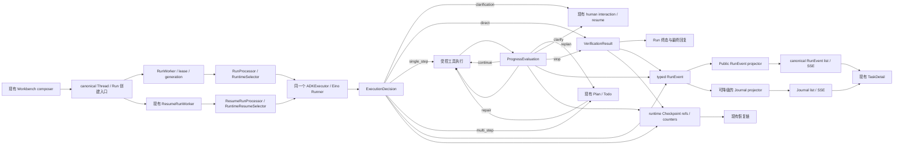

# Workbench 自适应执行 MVP 设计

> 文档性质：现有 Workbench composer、TaskDetail 与现有 Agent 执行链的内部 MVP 设计基线。
>
> 评审状态：交互式设计已逐节获得用户确认；本文仍需用户完成书面终审后，才允许进入实施计划。
>
> 范围关系：本文在 MVP 周期内优先于
> `2026-08-08-workbench-adaptive-closed-loop-execution-design.md` 的任务拆分和落地范围。
> 旧文档保留为长期研究材料，不再授权当前 58 表替换方案、独立控制面或全量切换工作。
>
> 事实基线：以 2026-08-10 的当前源码、IDL、迁移、测试、
> `project-context.md`、`workbench-chat.md` 和 `workbench-execution-chain.md` 为准。
> 实施分支的具体基线 SHA 必须在实施前从最新 `origin/dev` 重新审计。

## 1. 结论

本期只建设一条可在 2～3 周内验证效果的最小闭环：

**现有 canonical Thread/Run 入口 + 现有 Eino ADK 执行内核 + 三个类型化决策合同 +
现有 Plan/Checkpoint/RunEvent/Journal 持久化 + 当前 TaskDetail 增量展示。**

前端和后端不是两套功能。后端产生同一组类型化执行事实，经过现有公共投影与 SSE
送达当前页面；前端不解析自然语言猜状态，也不制造只存在于页面中的流程。

MVP 优先验证三件事：

1. 多步任务是否比当前基线更容易完成；
2. 简单任务是否仍保持短路径；
3. 系统能否在声明成功前给出可审计的验证结果。

本期以零迁移作为候选方案，不新增 HTTP/SSE route、service 或公共资源，也不新增页面或
管理后台。现有 canonical RunEvent/Journal envelope 允许增加版本化、向后兼容且有界的公共
payload。若 Day 2 spike 不能证明现有 RunEvent、Checkpoint 和 Plan 可以满足受 fence 的原子
持久化、恢复和稳定读回，必须先返回设计评审；获得确认后最多增加一张紧凑的自适应决策表，
禁止顺势恢复 004/005 大表方案。

## 2. 背景与问题

当前项目已经具备 canonical Thread/Run、原子 Run bundle、MySQL queue、lease/generation、
取消与恢复、Eino ADK、Plan/Todo、Checkpoint、RunEvent、Artifact、SideEffect ledger、
Journal 安全投影、SSE 和 Workbench 页面。原闭环方案仍按平台级替换建设 58 张新表、完整
策略控制面、Subagent、预算、迁移桥和切换流程，预计需要约 100～185 人周，前几个阶段又
不能独立产生可见用户价值。

当前最重要的问题不是缺少另一套运行时，而是现有主链缺少三个最小闭环事实：

- 首次执行选择没有统一的类型化结果；
- 工具执行后没有受控的继续、修复或重规划判断；
- Run 成功前没有统一、可投影的验证门禁。

因此本期应在现有主链上补齐这三个缺口，并用固定任务集验证收益，而不是继续扩大状态表和
迁移矩阵。

## 3. 目标与成功标准

### 3.1 产品目标

- 支持受控的代码修改、测试分析、研究和资料整理等多步任务；
- 让简单问答和单步操作继续走直接路径；
- 让多步任务在工具执行前形成可见计划；
- 根据执行证据继续、局部修复、重规划、澄清或停止；
- 只有验证通过后才允许显示成功；
- 在现有 Workbench composer → TaskDetail 流程展示规划、执行、修复、重规划、验证和最终结果；
- 通过内部 feature gate 与当前路径做同版本对照。

### 3.2 量化成功标准

- gate-on 的 60 个复杂任务至少通过 42 个；
- gate-on 比同一候选 SHA 的 gate-off 至少多通过 6 个复杂任务；
- gate-on 的每个复杂类别至少通过 12/20，且不得比该类别 gate-off 少 2 个或更多；
- gate-on 的 20 个简单任务至少 19 个走严格 `decision=direct` 路径且不生成 Plan；
- gate-on 相对 gate-off 的简单任务 P95 延迟和平均 billable Token 增长均不超过 10%；
- gate-on 多步任务首次工具调用前已有计划的比例为 100%；
- gate-on 所有声明成功的任务都有服务端计算的 `VerificationResult.status=passed`；
- 两组的重复副作用、未授权外部写入、敏感信息公共投影均为 0；
- 取消、澄清、修复、重规划、验证失败和 SSE 重连验收全部通过。

以上是内部 MVP 的 operational gate，不宣称统计显著性；报告必须同时给出逐任务结果和
paired bootstrap 区间。gate-off 保持当前行为，不要求产生三个新合同。

## 4. 范围

### 4.1 必须实现

- 沿用当前 Workbench 输入入口和 canonical Run 创建链；
- 后端输出类型化 `clarification / direct / execute` 决策；
- `direct` 保持无计划的快速路径；
- `execute` 支持 `single_step / multi_step`；
- `multi_step` 复用现有 Plan/Todo；
- 每个受控执行边界产生进度评估；
- 支持继续、局部修复、重规划、澄清和停止；
- 成功前执行与任务相符的测试、工具结果或确定性事实验证；
- 只允许只读工具和 Sandbox 内写入；
- 复用现有权限、工具注册、SideEffect、lease、generation、取消和恢复边界；
- 当前页面显示类型化执行状态和验证摘要；
- 内部 feature gate、对照指标和固定评测集。

### 4.2 明确不实现

- 独立 UI、独立后端、独立执行器或第二套 Run 主链；
- 新页面、新路由、普通用户设置或管理员执行策略页面；
- 004/005 的 45 表追加模型或完整 V2 Run/Attempt 替换；
- Subagent、协作规划和跨 Agent 汇合；
- 真实外部写入、L3 审批、自动副作用重放和 unknown resolution；
- 完整 Policy/Emergency/预算/ModelTransition 平台；
- Bridge、历史数据迁移、旧链删除、生产切换或全量发布；
- Chain-of-Thought、原始工具参数/结果、Provider 载荷、Checkpoint bytes、凭据或隐藏配置展示；
- 以精确百分比进度或 ETA 作为产品承诺。

## 5. 方案取舍

| 方案 | 判断 | 预计工作量 | 原因 |
| --- | --- | --- | --- |
| 在现有主链增量补齐闭环 | 采用 | 约 8～12 人周 | 最快得到真实效果，复用现有可靠性和 UI 能力，回滚简单 |
| 新建 4～6 张紧凑权威表 | 备选 | 约 15～25 人周 | 物理合同更强，但增加迁移、双写、恢复与集成成本 |
| 继续原 58 表平台替换 | 不采用 | 约 100～185 人周 | 前期没有独立用户价值，验证周期过长，范围与当前目标不匹配 |

采用方案不否定长期架构研究，只冻结本期实施优先级。任何需要恢复第二或第三方案的发现，
都必须用现有主链无法满足的运行时证据重新发起设计评审。

## 6. 架构与数据流



### 6.1 唯一主链

- API、Thread、Message、Run 和 RunEvent 合同不分叉；
- `RunWorker` 继续负责 MySQL pending Run 的 claim、lease、续租和 generation fencing；
- `ADKExecutor` 与 Eino ADK 继续是唯一执行内核；
- 保留现有 normal 分支 `RunWorker -> RunProcessor -> RuntimeSelector` 和 resume 分支
  `ResumeRunWorker -> ResumeRunProcessor -> RuntimeResumeSelector`；
- 两个分支都必须在同一个 `ADKExecutor`/Eino lead-agent 层复用同一 adaptive coordinator，
  `Execute` 与 `Resume` 执行同样的合同恢复、进度评估和 verification gate；
- 自适应协调器不得 claim Run、持有独立 lease、新建 adaptive worker/route、独立结算 Run，
  或调用第二套 classifier、planner、verifier 模型循环；
- Plan、Checkpoint、SideEffect 和 Journal 继续各自承担现有职责，不能反向驱动 Run；
- internal RunEvent 经 `ProjectPublicRunEvent` 进入 canonical RunEvent list/SSE；Journal projector
  另行写入安全 JournalEvent，再进入 Journal list/SSE；
- Journal 是可降级的用户体验投影，不是执行、恢复、终态或成功判定的事实源，也不假设可从
  任意历史 RunEvent 通用重建；
- 页面只消费 canonical client 与上述现有 SSE，不引入浏览器直连或备用 client。

### 6.2 执行顺序

1. canonical API 按当前方式创建 Thread/Message/Run：首次无附件使用 `CreateThreadBundle`，
   带附件、追问和 resume 使用 `CreateRunBundle`，随后都进入同一 canonical 执行链；
2. Worker 领取 Run，现有运行时解析本 Run 启动时冻结的 feature gate；
3. 首次 Agent 决策生成 `ExecutionDecision`；
4. 澄清任务进入现有 human interaction；直接任务不创建 Plan；
5. 单步任务执行一个受控动作，多步任务先持久化 Plan 再执行工具；
6. 每个计划里程碑或受控工具批次后生成 `ProgressEvaluation`；
7. 控制面校验建议、证据引用、Plan revision、额度和权限后决定下一步；
8. 结束前生成 `VerificationResult`；
9. 只有验证通过时 Run 才能进入 succeeded，否则进入部分完成、等待输入、失败、取消或额度耗尽；
10. 类型化事实分别经公共 RunEvent projector 和可选 Journal projector 形成审核后的页面状态。

## 7. 类型化合同

三个合同是后端内部权威事实。模型可以提出结构化建议，但服务端负责 schema 校验、资源绑定、
状态转换和最终持久化。公开投影只选择安全字段。

三个合同共用现有身份模型：

- `execution_run_id`：当前物理执行 Run；
- `journal_run_id`：当前逻辑任务的既有 Journal Run；
- `attempt_id`：现有 Journal attempt 身份，其 `ExecutionRunID` 必须指向当前物理 Run；
- `execution_generation`：当前物理执行代次；真正写 fence 仍由 Run 的 generation、lease owner
  和 lease token 共同组成；
- `plan_scope_run_id`：可空，继续沿用现有 Plan 的归属 Run。

不得新造第五种 Run/Attempt 身份。human resume 通过 source Run、source Journal attempt 与
interrupt/checkpoint identity 形成 lineage；lease recovery 通过 source Run、
`source_execution_generation` 与 checkpoint identity 形成 lineage。所有新写入仍由目标 Run
当前 generation/lease fence。

### 7.1 `ExecutionDecision`

逻辑 schema 为 `workbench-adaptive-decision.v1`：

```text
decision_id
decision_revision
execution_run_id / journal_run_id / attempt_id / execution_generation
plan_scope_run_id
goal_summary
deliverables[]
acceptance_checks[] = {
  check_id, kind, target_ref, safe_description
}
decision = clarification | direct | execute
execution_shape = null | single_step | multi_step
clarification_question = null | bounded string
safe_summary
created_at
```

约束：

- `clarification` 必须有问题，不能有执行形态；
- `direct` 不能有执行形态或 Plan；
- `execute` 必须精确选择一个执行形态；
- `multi_step` 的首个工具调用必须晚于 Plan 持久化；
- `single_step` 最多产生一个非验证 `ToolStarted`；第二个出现前必须追加新的 decision revision、
  持久化 Plan 并切换为 `multi_step`；verification purpose 只能由服务端只读验证工具 allowlist
  赋值，模型不能自行标注，任何写工具都属于非验证动作；所有验证调用仍计入工具预算；
- 模型提出的 acceptance checks 默认全部 required；服务端 canonical registry 最终分配
  `required`，并按交付物和任务类型补充模型不可删除、不可降级的最低 checks；
- 摘要、交付物和验收项必须经过限长与敏感信息检查；
- generation 不匹配或 schema 不完整时 fail closed。

### 7.2 `ProgressEvaluation`

逻辑 schema 为 `workbench-adaptive-progress.v1`：

```text
evaluation_id
execution_run_id / journal_run_id / attempt_id / execution_generation
expected_decision_id / expected_decision_revision
expected_plan_revision = null | current Plan revision
recommendation = continue | repair | replan | clarify | stop
evidence_refs[]
affected_plan_task_ids[]
clarification_question = null | bounded string
stop_reason = null | goal_satisfied | blocked | no_progress |
              budget_exhausted | cancelled
safe_summary
created_at
```

`ProgressEvaluation` 只是候选转换。服务端必须验证 evidence 引用属于同一 journal lineage 或
合法 source Run、Plan revision 仍是预期值、当前 lease/generation 有效，并由控制面计算连续
无进展次数。没有 Plan 时 `expected_plan_revision` 必须为空。模型不能自行完成 PlanTask、增加
额度、绕过工具权限或把 Run 标为成功。

`clarify` 必须且只能携带 `clarification_question`；`stop` 必须且只能携带 `stop_reason`；其他
recommendation 的这两个字段必须为空。受控评估边界精确定义为：每个 terminal tool result、
每个里程碑完成、任一执行状态转换前，以及 verification 前。

### 7.3 `VerificationResult`

逻辑 schema 为 `workbench-adaptive-verification.v1`：

```text
verification_id
execution_run_id / journal_run_id / attempt_id / execution_generation
decision_id / decision_revision
expected_plan_revision = null | current Plan revision
verified_checkpoint_id / evidence_head_event_id
status = passed | failed | blocked
block_reason = null | needs_input | blocked_policy | missing_evidence
checks[] = {
  acceptance_check_id, kind, evidence_ref, outcome, safe_summary
}
verified_artifact_refs[]
failure_summary
created_at
```

允许的 `kind` 至少包括测试、工具结果、Artifact、确定性事实和受限一致性检查。引用必须能由
当前物理 Run 或其合法 canonical source lineage 的持久化事实解析。`failed` 可以触发受限修复；
`blocked` 必须用 `block_reason` 区分需要输入、安全阻断和缺少证据，其他状态的该字段必须为空；
只有 `passed` 可以提交 succeeded。

`status` 由服务端计算，模型不能直接声明通过。Verification check 只能引用 canonical registry
中已有 check，不能重定义 kind、target 或 required。所有 `required=true` 的 `check_id` 必须各有
唯一且 outcome 为 passed 的结果，且结果绑定当前 active decision、当前 Plan revision、目标
revision/digest 或产生序列。模型自评或最终回复本身不能作为独立证据。纯直答允许执行不新增
模型调用的确定性
`response_contract` 检查；需要外部事实的任务必须转为 `single_step` 获取证据。terminal success
必须在同一受 fence 的事务边界内重新核对 current generation、active decision、current Plan
revision、`verified_checkpoint_id`、`evidence_head_event_id` 和 passed verification。任何相关工具
结果、repair、Plan mutation、目标写入或 recovery checkpoint 都会使旧 verification 失效；
服务端无法证明 mutation 与检查目标无关时必须重新验证，且通过证据必须晚于最后一次相关 mutation。

### 7.4 有界字段

| 字段 | 上限 |
| --- | --- |
| 单个 opaque ID/ref | 191 bytes |
| `goal_summary`、`safe_summary`、问题和失败摘要 | 1024 bytes |
| `deliverables` | 最多 16 项，每项 512 bytes |
| `acceptance_checks` / verification `checks` | 最多 32 项，每项摘要 512 bytes |
| `evidence_refs` / `affected_plan_task_ids` | 最多 64 项 |
| `verified_artifact_refs` | 最多 32 项 |
| 任一合同序列化 payload | 64 KiB |

`evidence_ref` 和 `target_ref` 是封闭 union：`run_event`、`checkpoint`、`artifact`、`plan_task`、
`tool_call` 或 `test_result` 加 canonical ID；禁止自由字符串路径、URL、credential 或 provider
payload。

## 8. 持久化、恢复与幂等

### 8.1 零迁移候选与 Day 2 spike

- 三个合同以版本化 typed RunEvent 持久化；
- Checkpoint 的 adaptive extension 只保存恢复所需的当前 decision/evaluation/verification 标识、
  Plan revision、计数器和引用，不复制 Plan 或工具结果，也不替换现有 Eino checkpoint
  envelope/runtime bytes；Checkpoint 只进入恢复链，不进入 adaptive UI 投影；
- 多步任务继续以现有 Plan/Todo 为唯一计划权威；
- JournalEvent 继续作为可降级的安全展示投影，不成为执行前置依赖或恢复事实；
- 公共 checkpoint 不得包含内部合同原文，只允许现有审核后的投影。

现有通用 `AppendRunEvent`、`CreateCheckpoint` 和 Plan mutation 不能自动视为原子边界。
实施计划的第一个 spike 必须证明或实现一个 repository transaction，它能够：

1. 锁定当前物理 Run，校验 `execution_run_id + expected_execution_generation +
   expected_lease_owner + expected_lease_token`；
2. 同时锁定 `(journal_run_id, attempt_id)`，校验其仍是 active attempt，且
   `RunAttempt.ExecutionRunID` 指向当前物理 Run；
3. 对多步路径 CAS 校验 active Plan revision；
4. 幂等写入带 schema discriminator 的 typed event 与关联 runtime checkpoint；
5. 在需要时同事务提交 Plan mutation 或 terminal verification gate；
6. 对 crash-before-commit、crash-after-commit、lost-response retry、concurrent replan、
   lease takeover、cancel race、重复 decision 和重复 verification 保持单一结果。

禁止先后独立调用现有 event/checkpoint API 后宣称原子性。Day 2 无法证明该边界时立即停止实施，
返回一张紧凑表的修订设计；不得以 ad-hoc JSON metadata 双写规避评审。

### 8.2 恢复语义

- feature gate、decision schema version 和安全限制必须在首次 adaptive 模型或工具调用前写入
  现有持久化 typed Run config/admission fact，不能只保存在进程内存；
- lease 丢失、generation 变化或取消后，旧执行者不得继续写入；
- 恢复时从最新合法 Checkpoint 和其引用的 typed events 重建当前状态；
- 已完成的 SideEffect 不自动重放；未知或缺少安全事实时 fail closed；
- 同一物理 attempt 内引用必须精确匹配 execution Run、attempt 与 generation；
- human resume 只允许沿 source Run、source Journal attempt 与 interrupt/checkpoint lineage 读取
  来源事实；lease recovery 另校验 `source_execution_generation` 与 source checkpoint；
- 两类目标 Run 都继承来源 gate/schema/limits 快照，并在 typed admission fact 原子持久化上述
  source identity；
- Plan 继续归属既有 `plan_scope_run_id`，typed fact 同时绑定既有 `journal_run_id/attempt_id`；
- 工具、repair、replan、no-progress 与 active-runtime 计数按逻辑 `journal_run_id` lineage 累积，
  resume 或 recovery 不得将额度清零；
- 超出合法 lineage、来源三元组不匹配或引用无法解析时恢复失败，不静默退回旧路径；
- feature gate 关闭只影响没有 source lineage 的新逻辑任务/root Run；resume/recovery target
  始终继承来源快照，已经启动的逻辑任务按冻结值完成或失败。

## 9. 安全与错误处理

### 9.1 工具范围

- MVP 只允许只读工具和 Sandbox 内写入；
- 服务端必须维护覆盖 MVP 全部可用工具的显式 allowlist，并结合现有注册、权限和 capability
  元数据做确定性分类；
- 元数据缺失、分类不明、需要真实外部写入或 L3 权限时拒绝执行；
- Sandbox 写入每次都校验解析后的 canonical target 位于授权 workspace，不能只按工具名放行；
- 现有 SideEffect ledger 继续负责幂等和真实副作用事实，本期不增加自动 replay；
- 禁止 Subagent、宿主机任意写入、生产资源写入和凭据回显。

### 9.2 运行限制

MVP 默认使用以下可观测的固定上限，不建设新预算平台：

- 最多 24 次工具调用；
- 最多 2 次重规划；
- 最多 2 次验证后修复；
- 连续 3 次无进展后停止；
- 最长运行 20 分钟。

达到上限时返回 `budget_exhausted`，保留已验证产物，不能继续调用工具或伪装成功。
工具调用上限包含成功、失败、重试和 verification 工具调用；repair、replan、no-progress 与工具
计数沿 canonical resume/recovery lineage 累积。20 分钟只统计 active execution，包括模型、
工具与验证耗时，不包含队列等待和等待人工输入的时间。

### 9.3 公共错误

页面只接收稳定分类：

- `needs_input`：缺少关键输入；
- `blocked_policy`：工具或权限不在 MVP 范围；
- `tool_error`：受控工具失败；
- `verification_failed`：目标或验收条件未通过；
- `budget_exhausted`：达到本期执行上限；
- `cancelled`：用户或系统取消。

内部错误、模型原文、工具原始载荷和敏感路径不得透传。运行中不能静默切换到旧执行逻辑。

### 9.4 Run 状态映射

| MVP 结果 | 现有 Run 状态 |
| --- | --- |
| verification passed | `succeeded` |
| `blocked + needs_input` | `interrupted` + 现有 `awaiting_input` |
| cancelled | `canceled` |
| `blocked + blocked_policy/missing_evidence` | `failed` + 对应稳定 error code |
| tool/verification/budget failure | `failed` + 稳定 error code |

“部分完成”不是新的 Run status，只是 failed/interrupted 的安全摘要与已验证 Artifact 投影。

## 10. 当前页面改造

页面所有改动都位于现有 Workbench 体验内，不增加路由或独立功能入口。Workbench composer
继续负责输入；提交后沿当前导航进入现有 TaskDetail。执行展示直接改造 TaskDetail 的
transcript、Todo dock 与 Journal panel，禁止在 composer 内再造第二套执行 UI。

### 10.1 展示规则

- 保留当前输入框、消息流和最终答复；
- 简单 `direct` 任务沿用当前展示，不出现空计划或执行外壳；
- `multi_step` 复用现有 Plan/Todo、工具动作、澄清和里程碑组件；
- 新增统一状态：正在规划、正在执行、正在修复、正在重规划、正在验证；
- 计划变化在原 Plan 区域更新并标记 revision，不创建第二条时间线；
- 最终答复增加紧凑验证摘要，区分通过、失败和阻断；
- 澄清问题出现在当前消息流，回复后继续同一业务任务的现有 resume 语义；
- 刷新或 SSE 重连后分别从 canonical RunEvent list/SSE 和 Journal list/SSE 恢复显示。

### 10.2 前端边界

- 只使用 canonical client 和生成合同；
- 不解析 assistant 文本推断 decision、repair、replan 或 verification；
- 不展示模型思维链、原始工具参数/结果、Provider body、隐藏配置、内部路径或 credential；
- 保留 loading、empty、error、disabled、readonly、取消、重连、键盘和 ARIA 状态；
- feature gate 不提供用户开关，页面只按服务端公共投影渲染。

### 10.3 加法式公共投影合同

不新增 endpoint；只扩展现有 envelope。精确公共合同如下：

| 内部事实 | canonical public `event_type` | `payload_version` | 公共 allowlist | Journal 映射 |
| --- | --- | --- | --- | --- |
| `ExecutionDecision` | `adaptive.decision` | `1` | decision、execution_shape、decision_revision、safe_summary | direct 不建节点；clarification 复用 human interaction；multi-step 复用 Plan/milestone |
| `ProgressEvaluation` | `adaptive.progress` | `1` | recommendation、affected PlanTask IDs、safe_summary | 更新原 milestone/Plan 展示，不投影原始 evaluation |
| `VerificationResult` | `adaptive.verification` | `1` | verification ID、status、block_reason、通过/失败的安全检查摘要、Artifact refs | 现有 `verification.terminal` |

字段必须进入 IDL/生成 schema 或同等的服务端与前端共享生成 schema，并经过服务端 allowlist、
限长与敏感信息拒绝测试。前端不得依赖后端私有 Go struct 手写类型。未知 payload version 不推进
页面执行状态，显示“执行状态暂不可用”并继续以 canonical Run status/final Message 为兜底，
不能猜测字段或让页面崩溃。

零迁移候选必须把 `workbench-adaptive-*.v1` discriminator 持久化在 internal RunEvent payload，
public projector 只能从该持久化 discriminator 映射现有 envelope 的 `payload_version`，不得按当前
代码版本推断。`PublicRunEvent`、canonical list/SSE wire、`WorkbenchRunEvent` 和前端 adapter
必须完整保留该字段，并用同一事实验证 list 与 SSE 等价。不能复用当前已有其他语义的
`verification.completed/coze.journal_verification.v1` 来承载新状态。

## 11. Feature gate 与指标

逻辑 feature 名为 `workbench_adaptive_execution_mvp`。实施时应映射到现有内部配置和灰度
能力，不新建管理页面。关闭时保持当前行为；开启时同一逻辑任务沿 resume/recovery lineage
使用首次 admission 时持久化的 gate/schema/limits 快照，不重新读取实时配置。

MVP 只对当前符合 Journal enrollment 条件的顶层 Task Run 生效；Subagent 和其他入口不进入
本路径。admission 时若公共投影合同或 Journal enrollment 条件不满足，则在首次 adaptive
模型/工具调用前选择 gate-off 路径并记录稳定原因；一旦 adaptive 执行开始，投影降级不能改变
执行或触发中途 fallback。A/B 两组必须使用完全相同的 Journal gate 状态。

每个 Run 至少记录以下非敏感指标：

- decision 与 execution shape；
- Plan 是否在首次工具前建立；
- 工具调用数和重复调用数；
- continue/repair/replan/clarify/stop 次数；
- verification 状态和检查类型；
- 终态、总耗时、模型调用量和 TokenUsage；
- 取消、恢复和安全阻断结果。

指标不得包含用户正文、工具原始参数/结果、系统 Prompt、凭据或内部 checkpoint。
SSE 重连单独记录为 UI/session telemetry，不进入 Run 领域指标。

## 12. 评测与验收

### 12.1 两级任务集

快速迭代集固定为 30 个任务：代码修改、测试分析、研究/资料整理各 10 个。它用于每日发现
回归和 Week 2 早停，不作为最终合并评分集。

最终验收集固定为 80 个任务：

- 20 个简单任务；
- 20 个代码修改任务；
- 20 个测试与故障分析任务；
- 20 个研究及资料整理任务。

30 开发集与 80 holdout 必须完全不重叠。Week 1 由独立评测负责人封存完整 holdout 与 evaluator
并记录 hash；实现侧只能看到 manifest schema 和 30 开发集，不能读取 80 个 prompt、fixture、
rubric 或预期结果。Week 3 只校验封存 hash 与 Week 1 完全一致，不得重新生成、修改或“再次冻结”。
每个任务属于版本化 `EvalManifest`，至少包含：

```text
task_id / cohort / category / expected_shape
fixture_or_source_snapshot_sha
model_revision / sampling / prompt_revision
tool_allowlist / tool_catalog_revision / sandbox_image
deliverables / binary_pass_rubric / check_command
timeout / forbidden_effects / invalid_run_rule
```

简单 cohort 只包含无需工具或外部事实、预期为严格 `decision=direct` 的任务。需要一个工具动作的
简单操作属于复杂 cohort 的 `single_step`，不纳入 19/20 direct 指标。

权威比较是同一候选 SHA 的 gate-off 与 gate-on；第一周对 `origin/dev` 的测量只用于诊断，并
额外执行 gate-off 与 `origin/dev` 的行为等价 smoke。每个 arm 从相同的干净 repo、fixture 和
Sandbox snapshot 启动，不能共享 memory、cache 或 Artifact；两组禁用 Subagent，固定上述全部
指纹，并按 task 成对、交错、随机顺序运行。

主观任务使用盲评；争议由第二评审者复核，仍不一致时交给预先指定的裁决者。无效运行、基础
设施故障和排除规则必须在揭盲前冻结。行为失败不得选择性重跑；基础设施或 evaluator 故障只能
按预注册规则对受影响任务的两个 arm 成对全量重跑。若根据 holdout 行为调优实现，当前 holdout
永久失效，必须换用从未运行过的新版本化 holdout。

### 12.2 完成判定

复杂任务完成必须同时满足：

- 用户目标和明确交付物已完成；
- 必须的测试、事实或 Artifact 检查通过；
- 没有未声明的安全阻断或外部副作用；
- 最终回复准确说明完成项、未完成项和验证证据。

60 个复杂任务以整数门槛判断：gate-on 至少 42/60，且比 gate-off 至少多 6 个；代码修改、
测试分析、研究/资料整理各自至少 12/20，且不得比其 gate-off 少 2 个或更多。这只是内部运营
门槛，报告同时给出 paired bootstrap 区间，不表述为统计显著性结论。

20 个简单任务的 direct rate 按 unique task 计算，至少 19/20。每个简单任务每个 arm 预注册
运行 3 次并交错执行，得到每组 60 个 observation；一个 task 只有三次 gate-on 都是
`decision=direct`，且三次都没有 Plan 或 `ToolStarted`，才计为 direct。延迟从 Run 原子提交完成
计至公共终态首次可见，使用 nearest-rank P95，要求 `P95(on) / P95(off) <= 1.10`。Token 使用
每个 attempted run 的 billable total 后取平均值，要求 `mean(on) / mean(off) <= 1.10`。

计划前置按事件序列判定：`Plan revision persisted sequence < first ToolStarted sequence`。重复
副作用定义为同一 canonical side-effect identity/idempotency key 出现一次以上实际执行或多个
terminal execution 事实，而不是仅出现重试请求。

所有 `expected_shape=multi_step` 的有效 gate-on run 都必须实际决策为 `multi_step`，并满足上述
Plan 前置顺序，要求 100% 通过；错误分类仍保留在分母中，不能作为无效运行排除。

### 12.3 测试层次

- Go 单元测试：合同解析、状态转换、上限、generation fencing、验证门禁；
- Go 集成测试：RunWorker/ADK、Plan、Checkpoint、Journal、取消、恢复和假工具；
- 前端 Vitest：公共事件映射、直接路径、Plan 状态、修复、验证、错误和重连；
- 类型检查、相关 lint 和前端构建；
- Codex in-app browser：当前页面的真实提交、执行、澄清、取消、重连和最终验证；
- Workbench 执行图验证：同步权威执行链文档并运行 graph verify/build/verify-derived。

所有量化门槛和相关回归测试必须通过，才能形成候选 SHA。

### 12.4 版本化场景矩阵与报告

除 80 任务外，版本化 acceptance matrix 至少包含 12 个场景并要求 100% 通过：取消 2 个、
澄清与恢复 2 个、crash/lease recovery 2 个、SSE reconnect 2 个、verification failure/repair
2 个、安全阻断与敏感投影 2 个。矩阵同时冻结预期 Run status、error code、事件顺序、页面状态、
副作用次数和 Artifact 结果。SSE reconnect 记录为 UI/session 指标，不伪装成 Run 领域指标。

最终报告必须附：

- `AUDITED_ORIGIN_DEV_SHA` 与 `CANDIDATE_SHA`；
- EvalManifest、evaluator、Prompt、模型、工具目录、资料快照和 Sandbox image 的 hash/版本；
- 每个 task/arm/run 的原始结果、耗时、Token、最终状态和评分；
- paired bootstrap 区间、分类统计和全部排除/无效运行记录；
- 测试、构建、执行图和 in-app browser 验收证据。

## 13. 三周交付

### 第一周：最小纵向链路

- 评测负责人封存 80 holdout/evaluator 并记录 hash，实施侧只获得 schema 与 30 开发集；
- Day 2 前完成零迁移原子持久化/恢复 spike，失败即返回设计评审；
- 测量 `origin/dev` 诊断基线和 gate-off 行为等价 smoke；
- 接入 feature gate 和三个类型化合同；
- 打通 decision、直接执行、多步 Plan、RunEvent/Checkpoint 和公共投影；
- 当前页面显示规划、执行和最终状态；
- 完成首轮 30 开发任务对照；本周不要求完成率收益，但必须证明三个 typed facts 可持久化并
  恢复、multi-step Plan 顺序正确、现有 TaskDetail 可消费公共投影，且安全硬门全部为零。

### 第二周：闭环与安全

- 实现 progress evaluation、有限 repair/replan 和 clarification；
- 实现 verification 门禁；
- 完成取消、恢复、SSE 重连和错误投影；
- 完成页面修复、重规划和验证状态；
- 补齐后端集成测试与前端 Vitest；
- 30 开发集 gate-on 相对 gate-off 至少净增 3/30；否则最多允许一个修复 cycle、合计 2 个
  engineer-days 且不得扩大 scope，超时或仍未达到即停止。

### 第三周：冻结候选并做一次性验收

- 只依据 30 开发集完成最后修复，不查看 80 holdout 行为；
- fetch 并对齐最新 `origin/dev`，完成代码审查，冻结候选 SHA、模型、工具、资料和 Sandbox
  指纹；核对封存的 EvalManifest/evaluator hash 与 Week 1 相同，不重新冻结或修改；
- 对最终候选 SHA 再次执行 gate-off 与最新 `origin/dev` 的行为等价 smoke；
- 在独立干净 worktree 对该 exact SHA 一次性运行 80 holdout A/B、全部安全/恢复矩阵、相关测试、
  类型检查、构建、执行图验证和当前页面浏览器验收；
- 汇总审计证据，不对 holdout 失败做选择性修复或重跑；
- 形成唯一候选 SHA 和完整验证报告。

任何代码、生成物、依赖、EvalManifest、evaluator 或 `origin/dev` 基准变化都会使上述证据失效；
必须形成新候选 SHA 并完整重验。

预计工作量为 8～12 人周，已经包含评测 harness、模型运行和约 20%～30% 集成缓冲。三周基准
需要 4 名专职 FTE（运行时 2、页面 1、评测/QA 1）；两周只是 5～6 FTE 且 Day 2 已证明零迁移、
无新公共 endpoint 时的 stretch。只有 3 名 FTE 时应预计 3～4 周。若 spike 触发单表复审，
原 2～3 周承诺失效，必须重新确认范围和排期。

## 14. 分支、迁移与合并

- 当前 `codex/workbench-adaptive-execution-implementation` 分支保持为实验和设计参考；
- 不回滚、清理或把其未完成 004/005 测试伪装成 MVP 完成项；
- 在当前脏实验 worktree 中只提交已批准的设计文档和后续实施计划，形成可审计 docs-only commit；
- 书面设计和实施计划批准后，从最新已审计 `origin/dev` 创建干净的
  `codex/workbench-adaptive-mvp`；
- 新分支只 cherry-pick 已批准的 docs-only commit，不携带实验分支的 Task 1/2 产品代码、
  004/005 测试或迁移；
- 不整体 cherry-pick 旧 Task 1/2 或大迁移提交；小型可复用修复必须逐项复审和验证；
- 默认没有新 migration；如触发单表设计门禁，必须重新列出 Atlas 范围并获得确认；
- 本 MVP 必须同分支更新 `workbench-execution-chain.md` 和
  `workbench-execution-graph.json`，图中加入 adaptive decision/progress/verification、
  public RunEvent projection、TaskDetail consumer，以及现有 normal/resume worker/selector 两条分支；
- 图中必须明确两条现有分支复用同一个 ADKExecutor/Eino/adaptive coordinator，且没有新增第二套
  adaptive worker、executor、route 或模型循环；
- 公共 Workbench 边界发生变化时同步 `workbench-chat.md`；
- 必须运行 `verify --changed-from origin/dev`、`build` 和 `verify-derived` 三个执行图命令；
- 验收前不合并 `dev`、不推送、不发布；
- 全部门槛通过后，报告最新远程基准、文件范围、测试、migration 清单和候选 exact SHA；
- 用户确认同一范围和 exact SHA 后再次 fetch，核对 `AUDITED_ORIGIN_DEV_SHA` 与候选 SHA 均未
  变化，才按 dev 集成 runbook 仅以本地 `ff-only` 合并 `dev`；该确认不授权 push、migration
  apply 或发布。

## 15. 回滚与失败边界

零迁移候选成立时，运行回滚只需要关闭新 Run 的 feature gate；已经启动的 Run 按冻结值完成、取消或
失败，不能中途换实现。页面收到未知 schema version 时显示稳定错误，不猜测字段。若 30 任务
开发集在完整闭环后未达到净增 3/30，只允许一个不扩 scope、最多 2 engineer-days 的修复 cycle；
仍失败则停止。任一未授权写入、
敏感投影、重复副作用或无验证成功都立即停止并作废当轮结果。最终 80 holdout 未达门槛时不合并
`dev`，也不通过扩大数据库模型掩盖效果不足；若依据 holdout 结果调优，必须更换未使用的
versioned holdout，并对新候选 SHA 完整重验。

## 16. 实施计划入口条件

进入详细实施计划前必须满足：

1. 用户批准本文书面版本；
2. 当前大型实验分支保持可追溯且未被清理；
3. 最新 `origin/dev` 基线、工作区和远程跟踪关系重新审计；
4. 实施计划先安排零迁移持久化可行性 spike；
5. spike 失败时回到设计评审，不自行增加表；
6. 计划明确每个批次的测试、浏览器验收和暂停点；
7. 合并、migration apply、推送和发布继续分别受 exact SHA 授权约束。
