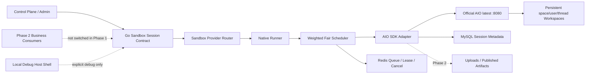

# DeerFlow/AIO 共享 Sandbox 接入设计

日期：2026-08-13
状态：设计已确认，Phase 1 实施中

## 结论

NewX 接入 DeerFlow 已使用的完整 Sandbox 能力，并把 `agent-infra/sandbox`
All-in-One Sandbox（下文简称 AIO）作为可插拔执行后端。NewX 不嵌入 DeerFlow
Python Provider，也不替换现有 Sandbox Control Plane、Native Runner、Eino ADK、
业务线程或审计事实源。

每个 Runner 部署默认维护一个常驻 AIO 容器，所有用户共享该容器。用户和线程不再
各自创建容器；Runner 把服务端确认的空间、用户和 Thread 事实映射到分层工作目录，并
为每个 Thread 使用独立 Shell Session。后续 Interactive Profile 再为 Thread 分配 Browser
Context、Jupyter Kernel 和端口租约。Runner 对执行并发做硬限制：
最低 `2C4G` 配置下，全局权重预算为 `2`，普通任务权重为 `1`，重型任务权重为 `2`，
因此最多同时执行两个普通任务或一个重型任务。

共享容器只提供服务端身份绑定、逻辑目录路由和会话状态分离，不提供 Unix 用户、独立
文件系统或每用户内核边界。获得 Shell 的代码仍可能使用绝对路径访问共享容器中当前
AIO 运行用户可读写的其他目录；该风险不能用目录层级掩盖。AIO 原始 API、CDP、VNC、
Jupyter、VSCode 和预览端口不得直接暴露给用户，必须经过 NewX 的身份、授权、并发和
审计边界。

本机开发另外支持显式 `HostShellBackend`。它只允许在本机 debug 模式启用，不具备
容器隔离能力，也不得作为 AIO 或远程 Provider 失败后的自动回退路径。

## 背景与当前事实

当前 NewX 已经具备以下基础：

- Sandbox Provider、默认 Provider、健康检查、凭据加密、配置审计和执行审计；
- `agent`、`plugin`、`mcp_stdio` 和 `appdev` scope；
- 签名执行身份、Redis 公平队列、容量租约、幂等、取消、恢复和 fail-closed；
- Native Runner 的 rootless 容器驱动、固定镜像 digest、资源上限和清理隔离；
- 最低 `2C4G` 下一个重任务或两个轻任务的权重调度；
- Agent 的 Eino ADK、Subagent、上传文件和 Artifact 业务合同。

当前缺口是持久的线程级 Sandbox Session 和 DeerFlow 风格的完整文件、Shell 及交互
能力。现有 Agent 文件工具主要面向上传文件和输出 Artifact，不能提供完整的 `ls`、
`glob`、`grep`、任意文件修改和容器内 Shell。Native Runner 当前执行一次受审核
Adapter 请求，也不是一个长期会话服务。

锁定的 DeerFlow 参考版本为本地基线
`5851f8250eb150ca23134c79b11ebc5073ac2789`。该版本向 Agent 暴露的 Sandbox 能力是：

- `execute_command`；
- `read_file`、`download_file`、`list_dir`、`write_file`；
- `glob`、`grep`、`update_file`/字符串替换；
- `/mnt/user-data/workspace`、`uploads`、`outputs` 和只读 `skills`；
- 延迟获取、线程复用、释放、回收和工作区恢复；
- 主 Agent 与 Subagent 共享同一线程工作区；
- 只从 `outputs` 显式发布 Artifact。

DeerFlow 的 AIO 封装默认使用单个 Shell Session，并通过进程内锁规避并发损坏。AIO
本身提供显式 Shell Session，因此 NewX Go Adapter 必须按 Thread 创建 Session，不能
照搬 DeerFlow 的全局串行封装。

AIO 上游还提供 Browser、Jupyter、VSCode、Terminal、MCP、VNC 和预览端口。这些是
AIO 的扩展能力，不属于 DeerFlow 当前 Agent 合同，但纳入本设计的最终接入范围。

参考上游：

- `https://github.com/agent-infra/sandbox`
- `https://github.com/agent-infra/sandbox-sdk-go`

实施直接使用 `ghcr.io/agent-infra/sandbox:latest`，不固定 AIO tag、OCI digest 或平台
manifest；Go SDK 仍固定为 `v0.0.5` 以稳定客户端字段和路由合同。每次部署必须重新拉取
并运行真实兼容探针，以镜像自报版本记录观测值，而不是把本轮的 `1.11.0` 转化为锁。

## 目标

1. 分阶段接入 DeerFlow 当前 Agent-facing Sandbox 合同；Phase 1 只落地默认关闭的 Core
   Session backend，不切业务流量。
2. 在一个常驻 AIO 容器内支持多个用户、多个 Thread 的受限并发。
3. 保持 NewX 的身份、权限、Provider 路由、调度、审计和业务事实所有权。
4. 支持 Shell、文件、Browser、Jupyter、VSCode、MCP、Terminal 和预览端口。
5. 保持主 Agent 与 Subagent 共享当前 Thread 工作区，并保证受控 File API 和 Session
   路由不会把请求映射到其他 Thread；不把该保证描述为恶意 Shell 的跨目录硬隔离。
6. 容器重启后保留工作区，并能重建短生命周期 Session。
7. 在 `2C4G` 最低配置下不依赖 OOM 控制容量，不产生无界进程和 Session。
8. 为本机开发提供显式 Host Shell，提高调试效率。
9. 保持当前插件创建、草稿保存、试运行和发布链兼容。
10. 允许 Sandbox remote Provider 使用 HTTP 或 HTTPS，不按环境强制 HTTPS。

## 非目标

1. 不把 DeerFlow Python Runtime、LangGraph 或 Provider 进程嵌入 Go 后端。
2. 不用 AIO 替换 Eino ADK、Workbench Run、Thread、事件、Checkpoint 或 Artifact。
3. 不删除现有 Native Runner 和一次性 Plugin 隔离链。
4. 不承诺共享 AIO 等价于每用户独立容器、VM、gVisor 或 Firecracker 的内核隔离。
5. 不允许前端直接访问 AIO API Key、内部 endpoint 或未经授权的服务端口。
6. 不把 Host Shell 开放到共享 dev、测试或生产。
7. 不在本阶段引入 Kubernetes、多节点自动扩缩容或 AIO 容器池。
8. 不自动迁移、删除或重建现有业务数据和 Sandbox Provider。
9. 不在共享 AIO 内实现 UID/GID 降权、`sessiond`、自定义文件代理或派生 AIO 镜像。
10. 第一阶段只建立默认关闭的 Core Session 基础能力，不切换 Agent、Subagent、Plugin、
    MCP 或 AppDev 业务流量。

## 已选方案与备选方案

### 已选：NewX 控制面 + Native Runner + AIO Backend

保留现有控制面和 Runner，在 Runner 内增加统一 Session 合同和共享 AIO Adapter。该方案
可以复用 NewX 的身份、审计、容量和恢复能力，同时通过标准 Go SDK 直连上游能力。

### 未选：独立 DeerFlow Python Sandbox Service

该方案可以较快复用 DeerFlow Provider，但会形成 Go/Python 两套身份、生命周期、
调度、重试和审计，故障恢复也会出现双事实源，因此不采用。

### 未选：用 AIO/DeerFlow Provisioner 替换 Native Runner

该方案会丢失现有签名身份、公平队列元数据、硬容量限制、配置审计和 fail-closed 边界，
并且 DeerFlow 的 soft replica 限制不能保证 `2C4G` 安全，因此不采用。

## 总体架构



### NewX 控制面

控制面继续负责：

- 从认证上下文确定用户、空间、Thread 和 Run；
- 选择健康且支持目标 Profile 的 Provider；
- 生成签名身份、幂等键和策略快照；
- 保存业务状态、审计和安全错误投影；
- 生成交互服务的短期访问授权；
- 管理 Provider endpoint、凭据、并发上限和能力开关。

### Native Runner

Runner 继续负责执行面的身份、调度与逻辑路由，并新增：

- AIO raw health、reserved Shell sentinel 和 MySQL CAS `runtime_generation` 监督；
- Thread Session 创建、恢复、清理和取消；
- 服务端用户/空间/Thread 到持久目录的确定性映射；
- 普通、重型任务的加权公平调度；
- 通过 Go SDK 对私有 AIO `8080` 的调用、超时、取消和输出裁剪；
- Phase 3 才实现 Browser、Jupyter、VSCode、Terminal、MCP 和预览的授权代理。

AIO 容器、网络、镜像和持久卷的生命周期唯一归部署/Compose 层；Runner 不接 Docker
Socket 创建、删除或重启 AIO，只监督健康、sentinel 和 generation。Runner 不读取
container ID、镜像 digest 或 Docker 启动时间来判断代际。

### AIO 容器

每个 Runner 部署默认只运行一个常驻 AIO 容器。容器提供统一文件系统和能力服务，
但不拥有业务身份、权限、队列、最终任务状态或长期审计。容器内存中的 Shell、Browser
和 Kernel 状态均可重建，不能成为唯一事实源。

### HostShellBackend

Host Shell 实现同一 Go Session 合同，但直接在本机线程目录执行。它必须同时满足：

- `APP_ENV=debug`；
- 显式开启本地 Host Shell 配置；
- 只绑定 loopback；
- 页面和审计明确标记“宿主机执行”；
- 不作为任何远程或 AIO 失败的回退路径。

Host Shell 可以访问开发机上的其他路径和凭据，因此只适用于可信本机开发，不得描述
为 Sandbox 安全隔离。

## 能力分层

### Core Profile

Core Profile 在 Phase 1 对齐已由固定 SDK 和真实探针证明可用的 DeerFlow 核心合同：

- 创建、取得、释放、取消和清理 Shell Session；
- 执行前台、后台和流式命令；
- 读取、下载、列目录、写入、追加和替换文件；
- `glob`、`grep` 和文件元数据；
- Thread 工作区、上传区、输出区和只读 Skill。

主 Agent/Subagent 工作区共享及从 `outputs` 发布 Artifact 属于 Phase 2 业务接入，不在
Phase 1 切流量或增加 `Publish` 方法。

### Interactive Profile

Interactive Profile 增加：

- 独立 Browser Context、截图和 CDP 代理；
- 独立 Jupyter Kernel；
- VSCode 工作区入口；
- Web Terminal；
- AIO MCP 服务；
- 线程级预览端口租约和代理。

选择 Interactive Profile 不代表全部重型服务同时启动。Gateway 只按实际请求创建
Context、Kernel 或代理租约，空闲资源必须按策略回收。

## 统一 Go 合同

业务层依赖 NewX 自有接口，不直接依赖上游 SDK 类型：

```go
type SandboxSessionManager interface {
	Acquire(ctx context.Context, req AcquireSessionRequest) (SandboxSession, error)
	Get(ctx context.Context, ref SessionRef) (SandboxSession, error)
	Release(ctx context.Context, ref SessionRef) error
	Destroy(ctx context.Context, ref SessionRef) error
	Recover(ctx context.Context, ref SessionRef) (SandboxSession, error)
}

type SandboxSession interface {
	Ref() SessionRef
	Exec(ctx context.Context, req ExecRequest) (ExecutionStream, error)
	Read(ctx context.Context, req ReadRequest) (FileContent, error)
	Write(ctx context.Context, req WriteRequest) error
	List(ctx context.Context, req ListRequest) ([]FileEntry, error)
	Glob(ctx context.Context, req GlobRequest) ([]FileEntry, error)
	Grep(ctx context.Context, req GrepRequest) ([]GrepMatch, error)
	Replace(ctx context.Context, req ReplaceRequest) error
	Download(ctx context.Context, req DownloadRequest) (io.ReadCloser, error)
}
```

`Publish`/Artifact 属于 Phase 2，不在 Phase 1 Core 接口加入空实现或伪能力。

Interactive 能力使用独立可选接口，避免 Core Consumer 被迫依赖浏览器或 IDE：

```go
type InteractiveSandboxSession interface {
	SandboxSession
	Browser(ctx context.Context, req BrowserRequest) (BrowserLease, error)
	Jupyter(ctx context.Context, req JupyterRequest) (KernelLease, error)
	Service(ctx context.Context, req ServiceRequest) (ServiceLease, error)
}
```

Adapter 至少包括：

- `AIOBackend`：生产、共享 dev 和本地容器模式；
- `HostShellBackend`：仅本机 debug；
- 现有 Native one-shot Adapter：继续服务未迁移的 Plugin 调用。

## 协议演进与兼容

现有 `coze.sandbox.execute.v1` 保持不变，用于一次性、幂等执行。共享 AIO 新增
`sandbox_session_v1` Provider capability 和会话端点，不把长期 Session 强塞进一次性
执行协议。

签名执行身份新增 v2 合同，至少包含：

- `scope`；
- `space_id`；
- `user_id`；
- `thread_id`；
- `run_id`/`execution_id`；
- `profile`；
- `request_digest`；
- `issued_at`、`expires_at`、`nonce` 和 `key_id`。

Agent 的 Thread ID 必须来自服务端业务记录。当前 Agent scope 不接受 Session ID 的
v1 校验保持兼容；只有声明并通过 `sandbox_session_v1` 握手的 Provider 使用 v2。

当前 Plugin 试运行默认继续走一次性 Native Adapter。第二阶段通过合同测试后才允许
切换到 AIO Core Profile；切换前后草稿 revision、输入输出和错误合同必须一致。

## 共享容器、用户与线程模型

### 逻辑路由层级

```text
Runner Deployment
└── One Shared AIO Container
    └── /mnt/user-data
        ├── <space A>/<user A>/<thread 1>/{workspace,uploads,outputs}
        ├── <space A>/<user A>/<thread 2>/{workspace,uploads,outputs}
        └── <space B>/<user B>/<thread 3>/{workspace,uploads,outputs}
```

所有用户共用 AIO 容器及其 Unix 运行身份，但不能共用默认 Shell Session 或由 Adapter
选择的工作目录。后续 Browser Context、Jupyter Kernel 和端口租约仍按 Thread 分配。
这里的目录层级是逻辑路由和持久化归属，不是 chroot、mount namespace 或权限隔离。

### 业务身份与目录身份

NewX 中的用户、空间和 Thread 身份仍由认证上下文与服务端业务记录确定。`space_id` 和
`user_id` 必须是服务端确认的正整数；`thread_id` 必须来自服务端 Thread 事实并通过现有
安全标识校验。不得接受前端提交的替代身份，也不得把未校验值拼入路径。

Runner 不再分配 UID/GID，也不引入 `sessiond`、grant、`file-helper` 或派生 AIO 镜像。
官方 `ghcr.io/agent-infra/sandbox:latest` 直接运行，Runner 通过 Go SDK 调用其 `8080`。
Subagent 在后续业务接入时继承父 Thread 的 `SessionRef` 和同一目录身份。

### 线程身份

Session 的稳定业务键为：

```text
provider_id + space_id + user_id + thread_id + profile
```

上游 Shell Session ID、Browser Context ID 和 Kernel ID 只属于当前
`runtime_generation`，不作为业务主键，也不能由前端提交。

### 工作目录

逻辑虚拟目录保持 DeerFlow 兼容：

```text
/mnt/user-data/workspace
/mnt/user-data/uploads
/mnt/user-data/outputs
/mnt/skills
```

Adapter 将逻辑目录映射到线程专属物理目录。空间、用户和 Thread 段使用服务端生成的
安全事实，不把未经校验的名称拼入路径。固定映射为：

```text
/mnt/user-data/<space_id>/<user_id>/<thread_id>/workspace
/mnt/user-data/<space_id>/<user_id>/<thread_id>/uploads
/mnt/user-data/<space_id>/<user_id>/<thread_id>/outputs
/mnt/skills
```

目录路径不包含 Profile 或 `runtime_generation`，因此同一 Thread 的 Session 重建或 Profile
变化不会改变持久目录。`/mnt/skills` 保持全局只读，不进入 Thread 根。

Adapter 将受控 File API 的逻辑路径规范化后映射到上述物理路径，调用方不能提交物理
根；Read、Write 和 Replace 显式设置 `sudo=false`，List、Glob 和 Grep 同样只能使用映射后
路径。Shell Session 创建时把 `exec_dir` 设置为物理 `workspace` 根；每次 Exec 只接受
`/mnt/user-data/workspace` 及其子目录作为逻辑 `cwd`，再映射为当前 Thread 的物理目录。
请求启用严格目录校验、不保留符号链接路径，并要求业务命令使用相对路径。

上述约束保证 NewX 不会把正常受控请求路由到错误 Thread，但不能阻止恶意 Shell 命令
主动使用绝对路径、`..` 或容器内其他工具访问共享 AIO 文件系统。需要对抗性多租户文件
隔离时，必须切换为每租户/每 Thread 容器或其他真正的文件系统边界。

普通中间文件保存在持久工作区，`uploads` 和 `outputs` 与对象存储合同集成。
`node_modules`、缓存和构建中间文件不做每次对象存储同步。只有 `outputs` 中被显式
发布的文件生成 Artifact，不能自动暴露整个工作区。

### Subagent

Subagent 继承父 Agent 的 `SessionRef` 和 Thread 工作区，不创建另一个用户或 Thread
Session。递归 Subagent 是否允许由 Agent Runtime 策略决定，与 Sandbox 隔离合同无关。

## 并发和资源模型

### 默认容量

最低 `2C4G` 配置沿用 Native Runner 的权重预算：

| 任务类型 | 示例 | 权重 | 默认并发上限 |
| --- | --- | ---: | ---: |
| Core | Shell、文件、普通插件试运行 | 1 | 2 |
| Heavy | Browser、Jupyter、VSCode、重型构建 | 2 | 1 |

全局权重预算为 `2`。因此两个 Core 可以并发，一个 Heavy 独占预算；Heavy 与 Core 默认
不同时执行。单用户默认最多一个正在执行的任务，防止一个用户占满低配节点。可以保留
最多 20 条空闲 Thread Session 元数据，但默认最多只保留 4 个空闲上游 Shell 进程；
其余 Session 在下次调用时重建。保留 Session 元数据不等于保留正在运行的命令、Kernel
或浏览器页面。

所有数值由系统配置管理并做上下界校验。单个业务请求不能提高容量，Runner 也不能
因为 AIO 仍能接收请求就绕过调度器。

### 公平与排队

复用现有 Redis 公平队列元数据、权重槽位、Lease 和取消机制。请求正文只保留在当前
live HTTP waiter 内存中；operation 只有在该 waiter 存活时等待容量并执行，断连必须原子
cancel。Runner 启动时把遗留 accepted、queued 和 running operation 全部标为 unknown，
不恢复执行或自动重放。调度至少保证：

- 按空间和用户轮转；
- 同一用户默认一个 active task；
- Heavy 不被持续 Core 流量永久饿死；
- 超出并发进入队列，不返回通用 500；
- 排队支持取消和截止时间；
- Redis 不保存 command/argv、File body 或其他请求正文，也不保存长期业务事实或明文凭据；
- 成功的 bounded result 与有界 operation metadata 加密并按 TTL 持久，GET 和同 digest
  replay 只读取该安全投影/结果，不重新执行。

### 进程和资源清理

每个 Thread 使用独立上游 Shell Session。同一 Shell Session 的操作必须串行，取消、
超时和清理通过上游 View/Wait/Kill/Cleanup 合同只作用于该 Session，不能误杀另一个
Thread 的 Session。后台进程、Jupyter Kernel、Browser Context 和端口租约均有独立 TTL，
不能随 Thread Session 永久累积。

AIO 容器持续运行并接受健康检查。它不是每次命令冷启动，也不是每个用户或 Thread
创建一个容器。

### `2C4G` 宿主预算

共机最低配置仍是 `2C4G`，Runner 常驻预算保持约 `128 MiB`；调度器在宿主机可用内存
低于安全水位时停止出队。按用户确认的官网启动合同，AIO 容器启动不要求设置 memory、
CPU、PID 或 shm cgroup 参数；兼容探针和 Compose 不虚构这些限制。容量安全由全局权重、
单用户上限、上游 Shell Session Kill/Cleanup、TTL、输出/磁盘限制和实测水位共同约束，
并在系统管理页明确标记为共享容器配额，不能宣称是独立 cgroup。

若 Core Profile 在 `2C4G` 宿主实测出现 OOM 或无界增长，第一阶段不得上线。若
Interactive Profile 无法通过真实浏览器和 Jupyter 压测，则只关闭 Interactive Profile。

### 动态配置

并发和资源策略由 Sandbox 系统配置管理，不硬编码在业务调用方。第一阶段至少提供：

- 全局权重预算，默认 `2`；
- Core 和 Heavy 权重，默认分别为 `1`、`2`；
- 单用户 active task 上限，默认 `1`；
- 空闲 Session 元数据上限，默认 `20`；
- 空闲上游 Shell 进程上限，默认 `4`；
- 命令、后台进程、Kernel、Context 和服务租约 TTL；
- AIO 容器观测水位以及磁盘、输出、进程和运行时间上限；
- Host Shell、Core Profile 和 Interactive Profile 独立开关。

安全范围内的并发、TTL 和容量水位可以动态更新；已执行任务继续使用入队时的配置快照。
降低上限后不强杀已运行任务，但停止新的出队，直到用量回到新上限。AIO endpoint、
传输模式、持久卷和 Host Shell 环境门禁属于启动或 Provider 安全配置，修改后必须重新
健康检查，不能当作普通热更新参数。

## 持久化与运行状态

### MySQL

MySQL 保存：

- `provider + space + user + thread` 的稳定工作区归属；
- Thread Session 的业务键、Profile、状态和最后活动时间；
- `runtime_generation` 和上游短期资源映射；
- 配置版本、审计和安全恢复原因。

现有 `sandbox_scheduler_settings` singleton 以 additive 列保存当前
`aio_runtime_generation`、唯一 session-enabled deployment owner 和 reserved upstream
Shell sentinel ID。一个数据库 schema 同时只允许一个 Session-enabled deployment 拥有该
singleton；owner 不匹配时 fail closed。sentinel ID 只是内部 fencing 状态，不进入业务
主键、公共响应、普通日志或指标。

上游 Session、Context 和 Kernel 标识只用于恢复判断，容器重启后必须失效并重建。

Phase 1 只新增一张表：

| 表 | 用途 |
| --- | --- |
| `sandbox_runtime_sessions` | 稳定业务键、Profile、generation、上游资源映射和最后活动时间 |

物理工作区由 Session 行已有的服务端 `space_id + user_id + thread_id` 直接派生，不创建
workspace/identity 表，也不生成 `thread_key`。Session 唯一键覆盖 deployment、Provider、
空间、用户、Thread 和 Profile。并发创建通过数据库唯一约束和事务处理，不能依赖进程内
锁。数据库不保存 UID/GID 或客户端提供的物理路径。

`sandbox_runtime_service_leases` 仅属于未来 Interactive Profile，不在 Phase 1 迁移创建。
所有 schema 变化只通过新的 Atlas 增量迁移完成；不得 drop、rename、truncate 或重建现有
Sandbox 表，也不得在应用启动时用自动建表代替迁移。

### Redis

Redis 保存短期队列元数据、并发令牌、Lease、分布式锁、取消信号和有 TTL 的运行投影，
但不持久化 command/argv、File body 或其他请求正文。成功的 bounded result 加密、限长并
按 TTL 保存，供 GET 和同 digest replay 返回；accepted/queued/running 没有可安全恢复的
请求正文。Redis 丢失或 Runner 重启时，通过 MySQL、Runner generation 和原幂等键
reconcile，遗留 accepted/queued/running 一律变为 unknown，不能创建第二个逻辑 Run 或
盲目重放命令。

### 持久卷和对象存储

持久卷保存线程工作区。对象存储保存用户上传和已发布 Artifact。AIO 容器可销毁的
内存状态不得作为文件唯一副本。

## 执行数据流

下列是统一合同的目标数据流；Phase 1 只实现控制面到 Runner/AIO 的 Core 基础能力，步骤
1 的 Agent/Plugin/MCP/AppDev consumer 与步骤 10 的 Artifact 发布要到 Phase 2 才接入。

1. Agent、Plugin、MCP 或 AppDev 发起 Sandbox 能力调用。
2. NewX 从认证和业务记录生成用户、空间、Thread、Run 和 Profile 身份。
3. Provider Router 选择健康且声明对应 capability 的 Provider。
4. Runner 验证签名、摘要、时间窗、nonce、权限和策略版本。
5. 调度器按任务权重和公平策略取得执行额度。
6. Adapter 根据服务端空间、用户和 Thread 事实取得稳定目录归属和 Session。
7. Adapter 使用显式 Session ID、映射后的 `exec_dir`/File path、`sudo=false` 和有界超时
   经 SDK 直连 AIO `8080`。
8. 输出以流式、限长的 stdout/stderr、退出码和状态返回。
9. 取消或超时只 Kill/Cleanup 当前上游 Shell Session，并释放对应资源租约。
10. 显式发布的 `outputs` 文件进入 Artifact 安全链；其他文件不投影到前端。
11. Run 完成后释放调度权重，Thread Session 可以保留，AIO 容器继续常驻。

## Interactive 服务访问

Browser、Jupyter、VSCode、VNC、Terminal、MCP 和预览端口不得把 AIO 内部 URL 直接
返回浏览器。访问流程为：

1. NewX 校验当前用户对空间和 Thread 的访问权。
2. NewX 签发短有效期、单服务、单 Thread 的 capability token。
3. Gateway 校验 token、用户会话、Provider、服务类型和 runtime generation。
4. Runner 代理到对应 Browser Context、Kernel、VSCode workspace 或端口租约。
5. token 到期、Thread 关闭、generation 变化或权限撤销后立即失效。

Browser 必须使用独立 Context；Jupyter Kernel 和 VSCode/Terminal 必须绑定当前 Thread
的 Session 和工作目录。预览端口由 Runner 分配并绑定 Thread，用户不能声明任意宿主机
端口。NewX 只代理 Context 或服务租约，不把 Browser 级 CDP endpoint 直接交给用户。

## 网络与传输

### AIO 内部网络

AIO `8080` 只绑定 Runner 私有 loopback 或私有容器网络。官方 raw AIO 默认模式不要求
JWT/API Key，因此私网与 loopback 是必要边界；SDK Adapter 支持可选 Bearer，但不能把
它描述成默认认证。上游文档明确说明容器内监听 `0.0.0.0`，本设计不得把该端口直接发布
给用户，也不得允许其他业务容器绕过 Runner 调用 raw AIO。

官网启动要求显式 `seccomp=unconfined`；本地 ARM64 的 `cryptography 49.0.0`
`_rust.abi3.so` 默认会 SIGILL/132，实测 `OPENSSL_armcap=0` 后 health、`/v1/ping` 和
`/v1/sandbox` 正常。部署保留这两个启动项，并把 seccomp 放宽记录为已接受风险；不得
再叠加 privileged 或宿主 Docker socket。

### Remote Provider

NewX 到 Runner 的 remote Provider 支持 HTTP 和 HTTPS，协议由每条 Provider endpoint
选择，不按本地、dev 或生产环境强制 HTTPS。两种协议都必须保留：

- Provider credential；
- 签名执行身份和请求摘要；
- 时间戳、nonce 和防重放；
- 精确 scheme/host/port 锁定；
- 禁止跨 origin 重定向；
- SSRF、DNS rebinding、metadata 和特殊地址防护；
- 请求、响应、超时和输出大小限制。

HTTP 不提供链路保密性。使用内网或公网 HTTP 时，系统管理页必须显示未加密传输风险，
服务器安全组或防火墙必须限制 Runner 端口来源。签名和 API Key 不能被描述为 TLS 的
替代品。

### Sandbox 出站

第一阶段直接运行官方 AIO `latest`，不宣称具备每 Thread 出站隔离，也不切入任何业务
流量。AIO 私网不得连通宿主 Docker Socket、Secret 目录或 NewX 管理面。后续业务流量
切换前，若需要域名/端口白名单、metadata 拒绝或每租户出站策略，必须在 AIO 用户进程
之外增加可验证的网络边界，不能依赖 Agent 自律或把目录分层描述成网络隔离。

## 本机 Host Shell

本机 dev 允许显式选择 Host Shell：

- 使用线程专属工作目录作为默认 `cwd`；
- 清理继承环境，只注入审核后的变量；
- 设置命令超时、输出上限、并发限制、低优先级和进程树回收；
- 只接受服务端生成的 Thread 身份；
- 记录用户、空间、Thread、Run、耗时、退出码和脱敏审计；
- 页面持续显示宿主机风险标识。

Host Shell 无法阻止命令读取开发用户可访问的其他文件，也无法提供硬 CPU/内存和网络
隔离。该限制属于产品可见事实，不能用目录校验掩盖。

## 故障恢复

### AIO 重启

Runner 在 raw health 成功后用持久 sentinel ID 查询上游 Shell Session。sentinel 仍存在时，
Runner 自身重启不改变 `runtime_generation`；只有成功列表或稳定 not-found 明确证明旧
sentinel 缺失，Runner 才先创建并确认随机 candidate，然后在 MySQL singleton 上以
expected sentinel 做 CAS。CAS winner 原子替换 sentinel、generation 严格 `+1` 并把旧代
Session 标为 recovering；loser 清理自己的 candidate 并采用 winner。timeout、5xx、解码或
transport error 都是 unknown，不等价于 missing，也不能 bump generation。

reserved sentinel 不是业务 Session，不进入 acquire、idle cleanup、用户配额、队列、公共
API 或统计。旧 Shell Session、Browser Context、Jupyter Kernel 和端口租约在 generation
变化后全部失效；线程工作区继续保留。下一次显式 Recover 创建新资源并更新映射。

Runner 进程启动时把遗留 accepted、queued 和 running operation 全部标记为 unknown，
默认不自动重放。排队只由原 live HTTP waiter 持有请求正文并等待容量；连接断开会原子
cancel，因此重启后没有可安全继续执行的 command/File body。命令可能已经产生文件、
数据库或外部 API 副作用，只有新的显式业务请求按合同重新提交时才允许再次执行。已成功
完成的 bounded result 独立加密持久，可由 GET 或同 digest replay 返回而不重新执行。

### Session 异常

- 上游返回 Session 404：只重建当前 Thread Session；
- Shell Session 损坏：Kill/Cleanup 当前上游 Session 并重建，不盲目重复原命令；
- Browser Context 或 Kernel 丢失：按当前 Thread 重建；
- 工作目录映射或持久卷异常：fail closed，不改用 AIO 默认目录；
- Redis、MySQL、签名 keyring、API Key 或持久卷不可用：停止接收新任务。

### 共享故障域

单个 AIO 崩溃会中断所有正在执行的 Thread，这是共享容器方案的已知故障域。健康检查、
自动重启、generation fencing 和持久目录恢复用于缩短故障时间，但不能把共享容器描述
为无单点故障。未来可以在不改变业务合同的前提下扩展 AIO 容器池。

## 错误合同

后端和前端必须区分以下稳定状态：

| 原因码 | 用户可见含义 |
| --- | --- |
| `SANDBOX_QUEUED` | 正在等待 Sandbox 资源 |
| `SANDBOX_QUEUE_TIMEOUT` | 等待资源超时 |
| `SANDBOX_CAPACITY_EXCEEDED` | 当前资源不足或达到并发上限 |
| `SANDBOX_SESSION_NOT_FOUND` | Session 已失效，允许按合同恢复 |
| `SANDBOX_RUNTIME_RESTARTED` | Sandbox 服务重启导致本次执行中断 |
| `SANDBOX_PATH_DENIED` | 逻辑文件路径不在当前 Thread 映射内 |
| `SANDBOX_EXECUTION_FAILED` | 命令完成但退出失败，保留安全退出码 |
| `SANDBOX_UNAVAILABLE` | Provider、AIO 或必要依赖不可用 |
| `SANDBOX_CANCELLED` | 用户或系统取消任务 |

普通用户不接收 Provider endpoint、API Key、物理工作区路径、内部栈或上游响应体。
系统管理员可以在审计和健康页查看经过脱敏的 provider、generation、延迟、并发和原因码。

## 安全边界与已接受风险

共享 AIO 的安全边界是 NewX 身份授权、Runner 调度、私有网络、Session 绑定和受控 File
API 的逻辑路径映射，不是 Unix 用户、文件权限、独立文件系统或独立内核。获得任意 Shell
的恶意用户不需要利用漏洞，也可能通过绝对路径访问同一 AIO 运行用户可访问的其他目录；
容器漏洞还可能影响所有用户。该风险已作为“可信流量共享一个 AIO 容器”的明确约束接受，
系统管理页和运维文档必须持续展示 `logical_workspace_scoped/shared_aio` 风险，不能标记为
对抗性多租户隔离。

因此生产启用必须满足：

- AIO `latest` 每次部署重新拉取、扫描并通过真实兼容探针；Go SDK 固定为 `v0.0.5`；
- AIO 使用官网要求的 `seccomp=unconfined`，这是明确接受的上游风险；不得使用 privileged；
- 不挂载宿主机 Docker Socket、Secret 目录或任意未经审计的宿主机路径；
- 只挂载受管理的线程工作区持久卷和明确只读的 Skill 来源；
- AIO API 和交互服务保持私有；
- 每条命令和文件请求都重新绑定服务端身份；
- Adapter 固定执行目录映射、严格 Session 路由和 `sudo=false`；
- 全局 admission、输出和运行时间有界；AIO 的内存、PID、文件描述符和磁盘按聚合水位
  观测并在超阈值时停止新出队，不宣称是每 Thread 的硬配额。

如果未来用户可信度或合规要求提高，应切换为 AIO 容器池或每租户容器；本设计的 Session
合同和 Gateway token 不依赖单容器实现，可以平滑演进。

## 分阶段实施

### 第一阶段：Session 基础和 Core Backend

- 完成 AIO `latest` 及 Go SDK 的真实兼容性探针；
- 增加统一 Go Session 合同和 `sandbox_session_v1` capability；
- 增加签名身份 v2、空间/用户/Thread 分层工作区；
- 增加共享 AIO 容器、显式 Shell Session、文件能力和 generation 恢复；
- 接入现有权重调度，默认 Core 并发 2、Heavy 并发 1；
- 增加本机 debug Host Shell；
- 保持现有 Plugin one-shot 链不变，并且不切 Agent、Subagent、MCP 或 AppDev 流量。

第一阶段的 AIO 兼容性探针必须实际验证多 Session 并发、`exec_dir` 严格映射、File API
`sudo=false`、取消和 Session 清理。真实上游顺序为 Exec → View → Wait → Kill；被 Kill
的 Session 后续 Cleanup 允许成功或 404，另一个活 Session 必须 Cleanup 成功。目录验证
只证明 Adapter 路由没有串 Thread，不得用它证明恶意 Shell 的跨目录隔离。

### 第二阶段：Agent、Subagent、Plugin 和 Artifact

- Eino Agent 接入完整 DeerFlow Core 工具；
- 主 Agent 与 Subagent 共享 Thread Session；
- `uploads`、`outputs`、Skill 和 Artifact 合同接入；
- Plugin 经兼容测试后切换到 Core Profile；
- 保留 Provider 开关，可回滚到现有一次性 Adapter。

### 第三阶段：Interactive 能力

- Browser Context 和 CDP/VNC 代理；
- Jupyter Kernel；
- VSCode、Terminal、MCP 和预览端口；
- 短期 capability token 和 Gateway；
- Heavy 权重、空闲回收和 `2C4G` 压测。

## 测试与验收

### 合同与单元测试

- AIO SDK Adapter 的请求映射、超时、取消、错误裁剪和可选 Bearer 注入；
- v1 one-shot 与 v2 Session 身份兼容；
- 空间/用户/Thread 工作区映射、并发创建和唯一约束；
- Session、Context、Kernel、端口和 generation 状态机；
- 逻辑路径规范化、物理目录映射、`sudo=false` 和 Artifact 输出边界；
- Host Shell debug 门禁和非 debug fail-closed；
- HTTP/HTTPS Provider、签名、防重放、SSRF 和重定向策略。

### AIO 真实合同测试

- 两个显式 Shell Session 并发执行，不出现 DeerFlow 默认 Session 的并发损坏；
- 同一用户两个 Thread 的 `cwd`、环境和输出互不串扰；
- Adapter 对不同 Thread 生成不同的分层物理目录和上游 Session ID；
- 受控 File API 拒绝逻辑 `..`、物理绝对路径和未映射前缀，且始终使用 `sudo=false`；
- Shell `exec_dir` 始终是当前 Thread 的物理 `workspace`，业务命令使用相对路径；
- 取消只 Kill/Cleanup 当前 Thread 的上游 Shell Session；
- AIO 重启后 generation 更新，工作区保留且 Session 可重建；
- reserved sentinel 仍存在时 Runner 重启不 bump；明确 missing 时 CAS 恰好 bump 一代；
- Browser、Jupyter、VSCode、MCP 和预览属于 Phase 3，本阶段只保留未来合同，不验收实现。

### 调度与资源测试

- 两个 Core 并发执行，第三个进入公平队列；
- 一个 Heavy 独占权重预算，Core 不越过容量硬限制；
- 单用户并发上限、跨空间轮转、取消和排队截止时间有效；
- Session 和后台进程在 TTL 后释放，无进程、Kernel、Context 或端口泄漏；
- `2C4G` 共机压测期间 NewX 主服务不 OOM，Runner 不依赖宿主机 OOM Killer；
- AIO 异常时不回退 Host Shell，也不重复执行有副作用命令。

### 业务回归

- Agent、Subagent、上传和 Artifact 现有 one-shot/既有路径无回归；Phase 1 不新增业务入口；
- 代码插件创建、草稿加载、保存、试运行、失败提示和发布；
- MCP stdio 和 AppDev 现有路径在未切换前无行为变化；
- 前端正确展示排队、容量不足、执行失败、服务重启、不可用和取消；
- 系统管理页显示 Provider capability、generation、并发、HTTP 风险和共享 AIO 逻辑目录
  风险状态；
- 页面与日志不泄露内部路径、凭据或上游错误正文。

## 发布与回滚

每个阶段使用独立 capability 和 Provider 开关灰度。启用顺序为：

1. 部署 AIO 与 Runner Adapter，但保持 Session 路由关闭；
2. 完成健康、SDK 映射、Session 并发和持久卷检查；
3. Phase 1 只在隔离的测试 deployment/fixture 验收 Core，不切任何业务 consumer；
4. Phase 2 经用户再次确认后才验收并切 Agent/Plugin 等业务流量；
5. Phase 3 再独立启用 Interactive Profile。

回滚时关闭 `sandbox_session_v1` 路由，保留 Session 元数据和持久工作区，不删除业务
文件或 Provider。Plugin 回到现有 one-shot Adapter；Agent 不允许回退宿主机。数据库
迁移只能增量执行，回滚应用版本不得 drop 表或清空数据。

## 与现有设计的关系

- `2026-08-11-sandbox-runner-2c4g-design.md` 继续定义 Native Runner、权重调度、队列、
  rootless 容器和一次性/混合隔离基线。
- 本设计新增“共享 AIO Session Profile”，仅在该 Profile 内采用一个常驻共享容器，
  不把现有 Native one-shot Plugin 容器改成共享容器。
- `2026-08-13-code-plugin-trial-run-recovery-design.md` 的草稿修复和 HTTP/HTTPS remote
  Provider 调整继续独立实施；其中 AIO 非目标只表示不属于该缺陷修复，不表示永久不接入。
- 实施完成并准备启用生产流量前，必须同步更新项目长期上下文、Sandbox 运维手册和
  HTTPS-only 的旧描述；设计文档本身不提前改变尚未上线的运行事实。

## 最终验收标准

本设计完成的判定不是“AIO 健康检查成功”，而是同时满足：

1. 本设计列出的 Phase 1 DeerFlow Core 能力全部通过真实 AIO 合同测试；
2. 一个常驻 AIO 容器能够在 `2C4G` 宿主准入边界下可靠执行两个并发 Core Session；
3. 不同用户和 Thread 的受控请求按服务端身份映射到各自目录和上游 Session，且产品明确
   展示该边界不抵御恶意 Shell 跨目录访问；
4. AIO 重启不丢工作区，且不会盲目重放命令；
5. 现有 Agent、Subagent、Plugin、MCP 和 AppDev 业务回归通过，Phase 1 未切换其流量；
6. Interactive 保持关闭，后续启用时全部经过 NewX Gateway 授权；
7. `2C4G` 压测无 OOM、无无界队列、无资源泄漏；
8. 本机 Host Shell 仅 debug 显式启用，所有远程环境 fail closed；
9. HTTP/HTTPS Provider 均按配置工作，HTTP 风险明确可见；
10. 关闭 Session Profile 后可以恢复现有执行链，且不删除任何用户数据。
